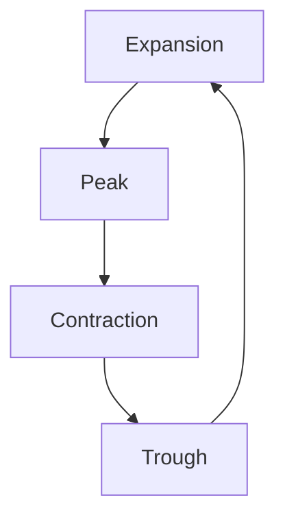
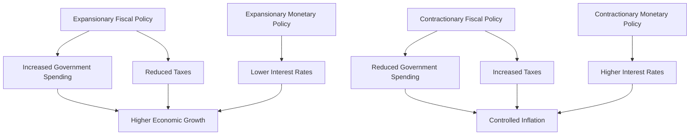

## 2.3 Economic Factors and Business Information

Understanding economic factors and business information is crucial for anyone preparing for the Series 7 Exam. This section will guide you through the key economic indicators, the phases of the business cycle, the impact of international economic events, and the effects of fiscal and monetary policies on investment strategies. Mastery of these topics will not only help you excel in the exam but also enhance your ability to make informed decisions in the securities industry.

### Economic Indicators and Their Influence on Securities Markets

Economic indicators are statistics that provide insights into the economic performance of a country. They are essential tools for investors, policymakers, and analysts as they help predict future economic activity and influence securities markets.

#### Types of Economic Indicators

Economic indicators are categorized into three types: leading, coincident, and lagging indicators. Each type serves a different purpose and provides unique insights into the economic landscape.

- **Leading Indicators**: These indicators predict future economic activity and are used to anticipate changes in the economy. Examples include stock market returns, building permits, and consumer confidence indexes. A rise in leading indicators suggests economic expansion, while a decline indicates potential contraction.

- **Coincident Indicators**: These indicators move in line with the overall economy and provide information about the current state of economic activity. Examples include GDP, employment levels, and retail sales. They help confirm the trends suggested by leading indicators.

- **Lagging Indicators**: These indicators follow economic trends and provide confirmation of patterns. Examples include unemployment rates, corporate profits, and interest rates. They are useful for identifying long-term trends and confirming economic shifts.

#### Impact on Securities Markets

Economic indicators significantly influence securities markets. For instance, positive economic data, such as a rise in GDP or employment, can lead to increased investor confidence, driving up stock prices. Conversely, negative data can lead to market downturns as investors anticipate slower economic growth.

**Example**: A report indicating a rise in consumer confidence might lead to an increase in retail stocks as investors expect higher consumer spending. Conversely, a spike in unemployment rates could lead to a decline in consumer goods stocks due to anticipated lower demand.

### The Business Cycle and Its Phases

The business cycle refers to the fluctuations in economic activity over time, characterized by periods of expansion and contraction. Understanding the business cycle is crucial for making informed investment decisions.

#### Phases of the Business Cycle

1. **Expansion**: This phase is marked by increasing economic activity, rising GDP, employment, and consumer spending. Businesses invest in new projects, and confidence in the economy grows. During expansion, stock markets often perform well as corporate earnings increase.

2. **Peak**: The peak represents the height of economic activity before a downturn. Economic indicators such as GDP and employment reach their maximum levels. However, inflationary pressures may build up, leading to potential corrective measures by policymakers.

3. **Contraction (Recession)**: In this phase, economic activity declines, GDP falls, unemployment rises, and consumer spending decreases. Stock markets may experience volatility and declines as corporate earnings shrink. This phase can present buying opportunities for investors looking for undervalued assets.

4. **Trough**: The trough is the lowest point of the business cycle, marking the end of a recession. Economic indicators begin to stabilize, and the economy starts to recover, leading to the next expansion phase.

**Visual Aid**: Below is a diagram illustrating the phases of the business cycle:

### International Economic Events and Their Domestic Impact

Globalization has interconnected economies worldwide, making international economic events significant for domestic markets. Understanding these impacts is vital for securities professionals.

#### Key International Economic Events

- **Exchange Rate Fluctuations**: Changes in currency values can affect international trade and investment. A strong domestic currency can make exports more expensive and imports cheaper, impacting companies' profitability.

- **Trade Agreements and Tariffs**: International trade policies, such as tariffs and trade agreements, can influence domestic industries. For example, tariffs on imported goods can benefit domestic producers by reducing competition.

- **Global Economic Crises**: Events like the 2008 financial crisis can have ripple effects across global markets, leading to increased volatility and uncertainty.

#### Domestic Market Impact

International economic events can influence domestic markets in various ways. For example, a depreciation of the domestic currency can boost exports by making them cheaper for foreign buyers, benefiting export-oriented companies. Conversely, a global economic slowdown can reduce demand for domestic exports, negatively impacting related industries.

**Case Study**: The COVID-19 pandemic led to global supply chain disruptions, affecting industries worldwide. Companies reliant on international suppliers faced production delays, impacting their stock prices and market performance.

### Fiscal and Monetary Policies

Fiscal and monetary policies are tools used by governments and central banks to influence economic activity. Understanding these policies is crucial for developing effective investment strategies.

#### Fiscal Policy

Fiscal policy involves government spending and taxation decisions to influence the economy. It can be expansionary or contractionary:

- **Expansionary Fiscal Policy**: Involves increasing government spending or reducing taxes to stimulate economic growth. This policy is often used during recessions to boost demand and create jobs.

- **Contractionary Fiscal Policy**: Involves reducing government spending or increasing taxes to slow down economic growth. This policy is used to control inflation and stabilize the economy.

**Example**: During the 2008 financial crisis, many governments implemented expansionary fiscal policies, such as stimulus packages, to revive economic growth.

#### Monetary Policy

Monetary policy is managed by central banks, such as the Federal Reserve in the U.S., to control money supply and interest rates. It can also be expansionary or contractionary:

- **Expansionary Monetary Policy**: Involves lowering interest rates and increasing money supply to encourage borrowing and investment. This policy is used to combat recession and stimulate economic activity.

- **Contractionary Monetary Policy**: Involves raising interest rates and reducing money supply to curb inflation. This policy is used to prevent an overheating economy.

**Impact on Investment Strategies**

Fiscal and monetary policies significantly impact investment strategies. For instance, lower interest rates can lead to higher stock prices as borrowing costs decrease, encouraging business expansion and consumer spending. Conversely, higher interest rates can lead to lower stock prices as borrowing becomes more expensive, reducing corporate profits and consumer spending.

**Visual Aid**: Below is a diagram illustrating the effects of fiscal and monetary policies on the economy:

### Conclusion

Understanding economic factors and business information is essential for securities professionals. By mastering economic indicators, the business cycle, international economic events, and fiscal and monetary policies, you will be better equipped to make informed investment decisions and succeed in the Series 7 Exam.

### Glossary

- **Business Cycle**: The fluctuation of economic activity over time, characterized by phases of expansion, peak, contraction, and trough.

### Series 7 Exam Practice Questions: Economic Factors and Business Information



### Which of the following is a leading economic indicator?

- [x] Stock market returns
- [ ] Unemployment rate
- [ ] Gross Domestic Product (GDP)
- [ ] Corporate profits

> **Explanation:** Stock market returns are considered a leading economic indicator as they can predict future economic activity. Unemployment rate and GDP are coincident indicators, while corporate profits are lagging indicators.

### During which phase of the business cycle is economic activity at its highest?

- [ ] Expansion
- [x] Peak
- [ ] Contraction
- [ ] Trough

> **Explanation:** The peak phase is when economic activity is at its highest before a downturn begins. It is characterized by maximum GDP and employment levels.

### How can a strong domestic currency affect exports?

- [ ] Makes exports cheaper for foreign buyers
- [x] Makes exports more expensive for foreign buyers
- [ ] Has no effect on exports
- [ ] Increases demand for exports

> **Explanation:** A strong domestic currency makes exports more expensive for foreign buyers, potentially reducing demand for those exports.

### What is the primary goal of expansionary fiscal policy?

- [ ] Reduce inflation
- [ ] Increase taxes
- [x] Stimulate economic growth
- [ ] Decrease government spending

> **Explanation:** Expansionary fiscal policy aims to stimulate economic growth by increasing government spending or reducing taxes, boosting demand and job creation.

### Which organization is responsible for managing monetary policy in the United States?

- [ ] U.S. Department of Treasury
- [x] Federal Reserve
- [ ] Securities and Exchange Commission (SEC)
- [ ] Financial Industry Regulatory Authority (FINRA)

> **Explanation:** The Federal Reserve is responsible for managing monetary policy in the United States, including controlling interest rates and money supply.

### What effect do lower interest rates have on stock prices?

- [x] Tend to increase stock prices
- [ ] Tend to decrease stock prices
- [ ] Have no effect on stock prices
- [ ] Only affect bond prices

> **Explanation:** Lower interest rates tend to increase stock prices as they reduce borrowing costs, encouraging business expansion and consumer spending.

### Which of the following is a characteristic of contractionary monetary policy?

- [ ] Lowering interest rates
- [ ] Increasing money supply
- [x] Raising interest rates
- [ ] Reducing taxes

> **Explanation:** Contractionary monetary policy involves raising interest rates to curb inflation and prevent an overheating economy.

### What is the impact of a global economic slowdown on domestic exports?

- [x] Reduces demand for exports
- [ ] Increases demand for exports
- [ ] Has no impact on exports
- [ ] Makes exports cheaper

> **Explanation:** A global economic slowdown reduces demand for domestic exports as foreign buyers cut back on spending.

### Which phase of the business cycle presents buying opportunities for undervalued assets?

- [x] Contraction
- [ ] Expansion
- [ ] Peak
- [ ] Trough

> **Explanation:** The contraction phase presents buying opportunities for undervalued assets as stock prices may decline due to reduced corporate earnings.

### How do trade agreements typically affect domestic industries?

- [ ] Increase competition for domestic producers
- [x] Reduce competition for domestic producers
- [ ] Have no impact on domestic industries
- [ ] Only affect international markets

> **Explanation:** Trade agreements can reduce competition for domestic producers by imposing tariffs on imported goods, benefiting domestic industries.



By mastering these concepts, you will be well-prepared for the Series 7 Exam and equipped to navigate the complexities of the securities industry.
