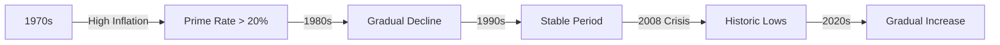

## 2.4.1.3 Prime Rate

The prime rate is a fundamental concept in the world of finance and banking, serving as a key benchmark for various types of loans and credit products. Understanding the prime rate is crucial for anyone preparing for the Series 7 Exam, as it plays a significant role in the securities industry and broader economic landscape.

### Definition and Overview

The **prime rate** is the interest rate that commercial banks charge their most creditworthy customers, typically large corporations with a high credit rating. These customers are considered to have the lowest risk of default, which is why they receive the most favorable loan terms. The prime rate is not only a reflection of a bank's cost of funds but also an indicator of the overall economic climate.

### Role as a Benchmark Rate

A **benchmark rate** is a standard against which other interest rates are measured. The prime rate serves as a benchmark for many types of consumer and business loans, including:

- **Credit Cards:** Many credit card interest rates are tied to the prime rate, with the card's APR (Annual Percentage Rate) being a certain percentage above the prime rate.
- **Home Equity Lines of Credit (HELOCs):** These loans often have variable interest rates that are directly linked to the prime rate.
- **Small Business Loans:** The interest rates on these loans are frequently based on the prime rate, affecting the cost of borrowing for businesses.

By acting as a benchmark, the prime rate influences the cost of borrowing across the economy. When the prime rate rises, borrowing costs increase, which can slow down economic activity. Conversely, when the prime rate falls, borrowing becomes cheaper, potentially stimulating economic growth.

### Determination of the Prime Rate

The prime rate is typically set by individual banks, but it is heavily influenced by the federal funds rate, which is the rate at which banks lend to each other overnight. The Federal Reserve's monetary policy decisions, particularly those affecting the federal funds rate, have a direct impact on the prime rate. As the federal funds rate changes, banks adjust their prime rates accordingly to maintain their profit margins and manage risk.

### Historical Trends and Comparisons

The prime rate has fluctuated significantly over time, reflecting changes in the economic environment and monetary policy. For instance, during periods of high inflation, such as the late 1970s and early 1980s, the prime rate reached unprecedented levels, exceeding 20%. This was a response to the Federal Reserve's efforts to combat inflation by raising interest rates.

In contrast, during economic downturns or periods of low inflation, the prime rate tends to decrease. For example, in the aftermath of the 2008 financial crisis, the prime rate fell to historic lows as the Federal Reserve implemented policies to stimulate economic recovery.

Below is a simplified historical chart of the prime rate over the past few decades:

### Impact on Consumers and Businesses

The prime rate's influence extends beyond banks and affects consumers and businesses in several ways:

- **Consumers:** Changes in the prime rate can impact personal finances, especially for those with variable-rate loans. For instance, if the prime rate increases, the interest rates on credit cards and HELOCs may rise, leading to higher monthly payments.
- **Businesses:** Companies that rely on loans for capital expenditures or operational funding are also affected. An increase in the prime rate can raise the cost of borrowing, potentially impacting profitability and investment decisions.

### Real-World Examples and Scenarios

Consider a scenario where the Federal Reserve decides to raise the federal funds rate due to concerns about rising inflation. As a result, banks increase their prime rates. A small business owner with a variable-rate loan tied to the prime rate may see their interest payments increase, affecting cash flow and possibly leading to adjustments in business operations.

Another example involves a consumer with a credit card that has an APR linked to the prime rate. If the prime rate rises, the consumer's interest charges may increase, making it more expensive to carry a balance.

### Strategies for Exam Preparation

To effectively prepare for questions related to the prime rate on the Series 7 Exam, consider the following strategies:

1. **Understand the Relationship:** Grasp the connection between the prime rate, the federal funds rate, and the broader economic context.
2. **Historical Context:** Familiarize yourself with historical trends and the factors that have influenced changes in the prime rate over time.
3. **Real-World Applications:** Practice applying your knowledge to real-world scenarios, considering how changes in the prime rate affect consumers and businesses.
4. **Regulatory Insights:** Be aware of how monetary policy decisions by the Federal Reserve impact the prime rate and, consequently, the securities market.

### Conclusion

The prime rate is a pivotal element in the financial system, serving as a benchmark for various lending products and reflecting the economic climate. Understanding its nuances is essential for anyone pursuing a career in the securities industry, as it influences both market dynamics and individual financial decisions.

By mastering the concepts related to the prime rate, you will be better equipped to tackle questions on the Series 7 Exam and apply this knowledge in your professional endeavors.

## Series 7 Exam Practice Questions: Prime Rate



### What is the primary purpose of the prime rate?

- [x] To serve as a benchmark for consumer and business loans
- [ ] To determine the federal funds rate
- [ ] To set mortgage rates directly
- [ ] To regulate the stock market

> **Explanation:** The prime rate is primarily used as a benchmark for various consumer and business loans, influencing the interest rates on products such as credit cards and small business loans.

### Which customers typically receive loans at the prime rate?

- [ ] High-risk borrowers
- [ ] New startups
- [x] Most creditworthy customers
- [ ] All bank customers

> **Explanation:** The prime rate is typically offered to the most creditworthy customers, such as large corporations with a strong credit history, due to their low risk of default.

### How does the prime rate relate to the federal funds rate?

- [x] The prime rate is influenced by changes in the federal funds rate.
- [ ] The federal funds rate is set based on the prime rate.
- [ ] They are unrelated interest rates.
- [ ] The prime rate is always higher than the federal funds rate.

> **Explanation:** The prime rate is influenced by the federal funds rate, as changes in the latter often lead banks to adjust their prime rates to maintain profitability and manage risk.

### During periods of high inflation, what typically happens to the prime rate?

- [x] It increases.
- [ ] It decreases.
- [ ] It remains unchanged.
- [ ] It becomes irrelevant.

> **Explanation:** During high inflation, the prime rate typically increases as a response to the Federal Reserve's efforts to control inflation by raising interest rates.

### What impact does a decrease in the prime rate have on borrowing costs?

- [x] It lowers borrowing costs.
- [ ] It raises borrowing costs.
- [ ] It has no impact on borrowing costs.
- [ ] It only affects mortgage rates.

> **Explanation:** A decrease in the prime rate generally lowers borrowing costs for consumers and businesses, making loans and credit more affordable.

### Which type of loan is most likely to have an interest rate tied to the prime rate?

- [ ] Fixed-rate mortgage
- [x] Home Equity Line of Credit (HELOC)
- [ ] Auto loan
- [ ] Student loan

> **Explanation:** Home Equity Lines of Credit (HELOCs) often have variable interest rates that are tied to the prime rate, causing them to fluctuate with changes in the prime rate.

### What was a significant factor in the prime rate reaching historic lows after 2008?

- [ ] High inflation
- [ ] Economic boom
- [x] Financial crisis and recession
- [ ] Increased consumer spending

> **Explanation:** The financial crisis and subsequent recession led to the Federal Reserve lowering interest rates to stimulate the economy, resulting in historic lows for the prime rate.

### How does an increase in the prime rate affect a small business with a variable-rate loan?

- [x] It increases interest payments.
- [ ] It decreases interest payments.
- [ ] It has no effect on interest payments.
- [ ] It converts the loan to a fixed rate.

> **Explanation:** An increase in the prime rate results in higher interest payments for small businesses with variable-rate loans tied to the prime rate, affecting their cash flow.

### What is the relationship between the prime rate and credit card APRs?

- [x] Credit card APRs are often a certain percentage above the prime rate.
- [ ] Credit card APRs are always equal to the prime rate.
- [ ] The prime rate has no effect on credit card APRs.
- [ ] Credit card APRs are lower than the prime rate.

> **Explanation:** Many credit card APRs are set as a certain percentage above the prime rate, meaning changes in the prime rate directly impact the interest rates on credit card balances.

### Which of the following best describes the prime rate's role in the economy?

- [ ] It is the sole determinant of mortgage rates.
- [ ] It directly controls stock market movements.
- [x] It serves as a benchmark for various lending products.
- [ ] It is set by the Federal Reserve.

> **Explanation:** The prime rate serves as a benchmark for various lending products, influencing the interest rates on loans and credit products across the economy.


