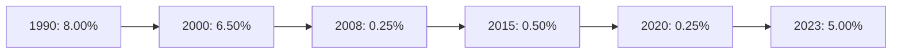
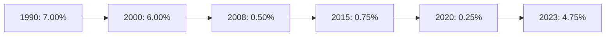
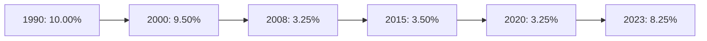
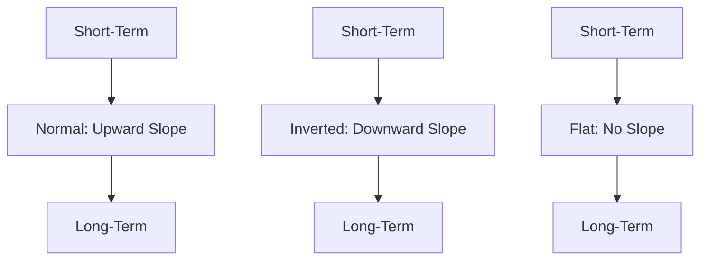

## 2.4.1 Types of Interest Rates

Interest rates are a critical component of the financial markets, influencing everything from consumer loans to corporate financing. Understanding the different types of interest rates and their implications is essential for anyone preparing for the Series 7 Exam. This section will delve into three major types of interest rates: the federal funds rate, the discount rate, and the prime rate. Additionally, we will explore the yield curve's role in economic forecasting and provide insights into how these rates affect borrowing costs and economic activity.

### Federal Funds Rate

The **Federal Funds Rate** is the interest rate at which depository institutions, such as banks and credit unions, lend reserve balances to other depository institutions overnight. This rate is a crucial tool used by the Federal Reserve (the Fed) to influence monetary policy and manage economic growth.

#### Who Sets the Federal Funds Rate?

The Federal Open Market Committee (FOMC), a branch of the Federal Reserve System, sets the target for the federal funds rate. The FOMC meets regularly to assess economic conditions and determine the appropriate stance of monetary policy. By setting a target for the federal funds rate, the FOMC aims to promote maximum employment, stable prices, and moderate long-term interest rates.

#### Impact on Borrowing Costs

The federal funds rate serves as a benchmark for many other interest rates, including those for consumer loans, mortgages, and savings accounts. When the Fed raises the federal funds rate, borrowing costs typically increase, which can slow economic activity. Conversely, lowering the rate tends to reduce borrowing costs, encouraging spending and investment.

#### Historical Trends and Graphical Representation

Below is a graphical representation of the historical movements of the federal funds rate over the past few decades. 

### Discount Rate

The **Discount Rate** is the interest rate charged by the Federal Reserve Banks to commercial banks and other depository institutions on loans they receive from the Federal Reserve's discount window.

#### Who Sets the Discount Rate?

The Board of Governors of the Federal Reserve System sets the discount rate. This rate is used as a tool for monetary policy and serves as a signal of the Fed's policy intentions.

#### Impact on Borrowing Costs

The discount rate directly influences the cost of borrowing for banks. A higher discount rate makes it more expensive for banks to borrow funds, which can lead to higher interest rates for consumers and businesses. Conversely, a lower discount rate reduces borrowing costs, potentially stimulating economic activity.

#### Historical Trends and Graphical Representation

The following graph illustrates the historical trends in the discount rate:

### Prime Rate

The **Prime Rate** is the interest rate that commercial banks charge their most creditworthy corporate customers. While the prime rate is not set by the Federal Reserve, it is influenced by the federal funds rate.

#### Who Sets the Prime Rate?

Individual banks set the prime rate, but it is often aligned with the federal funds rate. The Wall Street Journal publishes a consensus prime rate based on the rates offered by the largest banks in the United States.

#### Impact on Borrowing Costs

The prime rate serves as a benchmark for many types of loans, including credit cards, home equity lines of credit, and auto loans. When the prime rate rises, borrowing costs for consumers and businesses generally increase, potentially slowing economic growth.

#### Historical Trends and Graphical Representation

Here is a graphical representation of the prime rate over recent decades:

### The Yield Curve and Economic Forecasting

The **Yield Curve** is a graphical representation of interest rates across different maturities, typically for government bonds. It is a valuable tool for economic forecasting and understanding market expectations about future interest rates and economic activity.

#### Types of Yield Curves

1. **Normal Yield Curve**: Typically upward-sloping, indicating that longer-term interest rates are higher than short-term rates. This suggests that the economy is expected to grow.
   
2. **Inverted Yield Curve**: Occurs when short-term rates are higher than long-term rates, often seen as a predictor of economic recession.
   
3. **Flat Yield Curve**: Indicates that short-term and long-term rates are similar, suggesting uncertainty about future economic conditions.

#### Importance in Economic Forecasting

The shape of the yield curve provides insights into market sentiment and expectations about future interest rates and economic activity. An inverted yield curve, for example, has historically been a reliable indicator of upcoming recessions.

#### Graphical Representation of Yield Curves

Below is a graphical representation of different types of yield curves:

### Real-World Applications and Regulatory Scenarios

Understanding interest rates is crucial for financial professionals. For example, changes in the federal funds rate can influence stock market performance, as higher rates may lead to lower corporate profits and stock prices. Similarly, the prime rate affects consumer borrowing costs, impacting spending and saving behaviors.

Regulatory bodies like the Federal Reserve use interest rates as a tool to manage economic stability. Financial professionals must stay informed about rate changes to advise clients effectively and manage investment portfolios.

### Conclusion

Interest rates are a fundamental aspect of the financial markets, influencing borrowing costs, investment decisions, and economic activity. By understanding the federal funds rate, discount rate, and prime rate, as well as the yield curve's role in economic forecasting, you will be better equipped to navigate the complexities of the securities industry and succeed on the Series 7 Exam.

## Series 7 Exam Practice Questions: Types of Interest Rates



### What is the federal funds rate?

- [x] The rate at which depository institutions lend balances to each other overnight.
- [ ] The rate charged by the Federal Reserve to banks for borrowing funds.
- [ ] The interest rate banks charge their most creditworthy customers.
- [ ] The rate at which the government borrows funds from the public.

> **Explanation:** The federal funds rate is the interest rate at which depository institutions lend balances to each other overnight. It is a key tool used by the Federal Reserve to influence monetary policy.

### Who sets the discount rate?

- [ ] The Federal Open Market Committee (FOMC)
- [x] The Board of Governors of the Federal Reserve System
- [ ] Individual commercial banks
- [ ] The U.S. Department of the Treasury

> **Explanation:** The Board of Governors of the Federal Reserve System sets the discount rate, which is the rate charged to commercial banks for borrowing funds from the Federal Reserve.

### What impact does a higher federal funds rate have on borrowing costs?

- [x] It increases borrowing costs, potentially slowing economic activity.
- [ ] It decreases borrowing costs, stimulating economic activity.
- [ ] It has no impact on borrowing costs.
- [ ] It only affects international borrowing costs.

> **Explanation:** A higher federal funds rate typically increases borrowing costs, which can slow economic activity as it becomes more expensive for consumers and businesses to borrow money.

### What does an inverted yield curve typically indicate?

- [x] A potential economic recession
- [ ] Strong economic growth
- [ ] Stable economic conditions
- [ ] High inflation

> **Explanation:** An inverted yield curve, where short-term rates are higher than long-term rates, is often seen as a predictor of economic recession.

### Which rate serves as a benchmark for many consumer loans?

- [ ] Federal funds rate
- [ ] Discount rate
- [x] Prime rate
- [ ] Treasury rate

> **Explanation:** The prime rate serves as a benchmark for many consumer loans, including credit cards and home equity lines of credit.

### How does the Federal Reserve use the federal funds rate?

- [x] To influence monetary policy and manage economic growth
- [ ] To set the interest rate for consumer loans
- [ ] To determine the rate for government bonds
- [ ] To control inflation directly

> **Explanation:** The Federal Reserve uses the federal funds rate to influence monetary policy and manage economic growth by affecting borrowing costs and economic activity.

### What is the primary purpose of the discount rate?

- [ ] To set consumer credit card rates
- [x] To provide a cost for banks borrowing from the Federal Reserve
- [ ] To determine mortgage rates
- [ ] To establish the rate for corporate bonds

> **Explanation:** The discount rate is the interest rate charged by the Federal Reserve to commercial banks for borrowing funds, serving as a tool for monetary policy.

### What does a normal yield curve suggest about the economy?

- [x] Expected economic growth
- [ ] Imminent recession
- [ ] High inflation
- [ ] Economic stagnation

> **Explanation:** A normal yield curve, which is upward-sloping, suggests that longer-term interest rates are higher than short-term rates, indicating expected economic growth.

### Which entity publishes a consensus prime rate?

- [ ] The Federal Reserve
- [ ] The U.S. Department of the Treasury
- [x] The Wall Street Journal
- [ ] The Securities and Exchange Commission

> **Explanation:** The Wall Street Journal publishes a consensus prime rate based on the rates offered by the largest banks in the United States.

### What is the relationship between the prime rate and the federal funds rate?

- [x] The prime rate is influenced by the federal funds rate.
- [ ] The prime rate is set independently of the federal funds rate.
- [ ] The prime rate determines the federal funds rate.
- [ ] There is no relationship between the two rates.

> **Explanation:** The prime rate is influenced by the federal funds rate, as changes in the federal funds rate can lead to adjustments in the prime rate by banks.



By understanding these key concepts and practicing with these questions, you'll be better prepared to tackle the Series 7 Exam and apply this knowledge in your career as a General Securities Representative.
