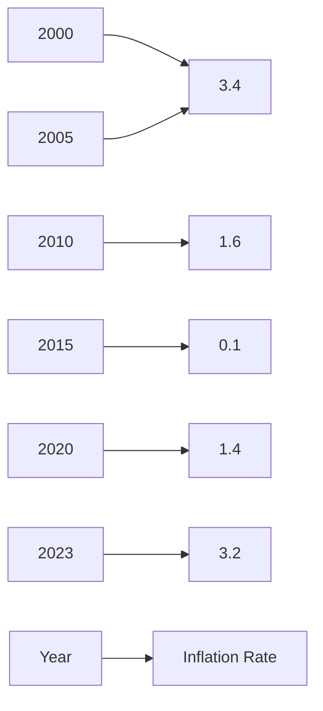

## 2.4.2 Inflation and Deflation Effects

Inflation and deflation are critical economic phenomena that significantly impact the securities markets. As a candidate preparing for the Series 7 Exam, understanding these effects is crucial for making informed investment decisions and advising clients effectively. This section delves into how inflation erodes purchasing power, the implications of deflation, and strategies for investing in different inflationary environments.

### Understanding Inflation

Inflation is the rate at which the general level of prices for goods and services rises, leading to a decrease in purchasing power. When inflation occurs, each unit of currency buys fewer goods and services. Central banks attempt to limit inflation—and avoid deflation—in order to keep the economy running smoothly.

#### Erosion of Purchasing Power

The primary effect of inflation is the erosion of purchasing power. As prices increase, the value of money decreases, meaning that consumers and investors can buy less with the same amount of money. This erosion can have several implications:

- **Consumer Spending:** As purchasing power declines, consumers may cut back on spending, which can slow economic growth.
- **Fixed-Income Investments:** Inflation can be particularly detrimental to fixed-income investments, such as bonds, because the fixed interest payments lose value over time.
- **Cost of Living Adjustments:** Many wages and salaries are adjusted for inflation to maintain purchasing power, but these adjustments often lag behind actual inflation rates.

### Effects of Inflation on the Economy

Inflation affects various aspects of the economy, including interest rates, investment returns, and economic growth. Here are some key effects:

- **Interest Rates:** Central banks may raise interest rates to combat high inflation, which can increase borrowing costs and slow down economic activity.
- **Investment Returns:** Inflation can erode real returns on investments. For example, if an investment yields a 5% return but inflation is at 3%, the real return is only 2%.
- **Economic Growth:** Moderate inflation is generally associated with economic growth, as it encourages spending and investment. However, hyperinflation can lead to economic instability.

### Understanding Deflation

Deflation is the opposite of inflation; it is a decrease in the general price level of goods and services. While it might seem beneficial as prices fall, deflation can have severe negative effects on the economy.

#### Effects of Deflation on the Economy

- **Reduced Consumer Spending:** As prices fall, consumers may delay purchases in anticipation of even lower prices, leading to decreased demand and economic contraction.
- **Increased Debt Burden:** The real value of debt increases during deflation, making it more expensive for borrowers to service their debts.
- **Lower Wages and Unemployment:** Companies may cut wages or lay off workers to maintain profitability during periods of deflation.

### Investing Strategies in Inflationary Environments

Investors need to adapt their strategies based on the inflationary environment to protect and grow their wealth.

#### Strategies for High Inflation

- **Real Assets:** Investing in real assets such as real estate or commodities can provide a hedge against inflation as their values often rise with inflation.
- **Inflation-Indexed Bonds:** These bonds, such as Treasury Inflation-Protected Securities (TIPS), adjust their principal and interest payments based on inflation rates.
- **Equities:** Stocks can be a good hedge against inflation as companies may pass on higher costs to consumers, maintaining their profit margins.

#### Strategies for Low or Deflationary Environments

- **Fixed-Income Securities:** In a deflationary environment, fixed-income securities may perform well as interest rates are likely to fall, increasing bond prices.
- **Cash Reserves:** Holding cash can be advantageous in deflationary periods as its purchasing power increases.
- **Defensive Stocks:** Companies in sectors such as utilities or consumer staples may be less affected by deflation and provide stable returns.

### Historical Inflation and Deflation Trends

Understanding historical trends can provide insights into future economic conditions and investment strategies. Below is a chart depicting inflation rates over the years in the United States:

### Glossary

- **Deflation:** A decrease in the general price level of goods and services, often leading to increased real debt burdens and reduced consumer spending.

### Conclusion

Understanding the effects of inflation and deflation is crucial for making informed investment decisions. By recognizing how these economic factors impact purchasing power and the broader economy, you can develop strategies to protect and grow your investments. As you prepare for the Series 7 Exam, consider how these concepts apply to the securities markets and the advice you provide to clients.

## Series 7 Exam Practice Questions: Inflation and Deflation Effects



### How does inflation primarily affect purchasing power?

- [x] It decreases purchasing power by increasing prices.
- [ ] It increases purchasing power by decreasing prices.
- [ ] It has no effect on purchasing power.
- [ ] It stabilizes purchasing power by maintaining prices.

> **Explanation:** Inflation decreases purchasing power because it leads to higher prices, meaning consumers can buy less with the same amount of money.

### What is a common effect of deflation on the economy?

- [ ] Increased consumer spending
- [ ] Decreased debt burden
- [x] Reduced consumer spending
- [ ] Increased wages

> **Explanation:** Deflation often leads to reduced consumer spending as people delay purchases in anticipation of lower prices.

### Which investment is typically considered a hedge against inflation?

- [ ] Fixed-income securities
- [ ] Cash reserves
- [x] Real estate
- [ ] Defensive stocks

> **Explanation:** Real estate is often considered a hedge against inflation because its value tends to rise with inflation.

### How do inflation-indexed bonds protect investors?

- [ ] By offering fixed interest rates
- [x] By adjusting principal and interest payments based on inflation
- [ ] By providing tax benefits
- [ ] By increasing in value during deflation

> **Explanation:** Inflation-indexed bonds, like TIPS, adjust their principal and interest payments based on inflation rates, protecting investors from inflation's eroding effects.

### What typically happens to interest rates during high inflation?

- [ ] They decrease to stimulate borrowing.
- [x] They increase to combat inflation.
- [ ] They remain unchanged.
- [ ] They fluctuate unpredictably.

> **Explanation:** Central banks often increase interest rates during high inflation to curb spending and slow down the economy.

### Why might consumers delay purchases during deflation?

- [ ] They expect prices to rise.
- [x] They expect prices to fall further.
- [ ] They have increased purchasing power.
- [ ] They receive higher wages.

> **Explanation:** Consumers might delay purchases during deflation because they anticipate that prices will continue to fall.

### Which asset class is likely to perform well in a deflationary environment?

- [ ] Commodities
- [x] Fixed-income securities
- [ ] Real estate
- [ ] Equities

> **Explanation:** Fixed-income securities often perform well in deflationary environments as interest rates are likely to fall, increasing bond prices.

### What is the impact of deflation on debt?

- [ ] It decreases the real value of debt.
- [ ] It has no impact on debt.
- [x] It increases the real value of debt.
- [ ] It makes debt easier to service.

> **Explanation:** Deflation increases the real value of debt, making it more expensive for borrowers to service their debts.

### Which of the following is a defensive stock?

- [ ] Technology companies
- [ ] Real estate firms
- [ ] Financial institutions
- [x] Utility companies

> **Explanation:** Utility companies are considered defensive stocks because they provide essential services and are less affected by economic downturns.

### What is a key characteristic of Treasury Inflation-Protected Securities (TIPS)?

- [ ] They have a fixed interest rate.
- [x] They adjust for inflation.
- [ ] They are tax-exempt.
- [ ] They are risk-free.

> **Explanation:** TIPS adjust their principal and interest payments based on inflation, providing protection against inflation's eroding effects.



---

By understanding the dynamics of inflation and deflation, you can better prepare for the Series 7 Exam and develop strategies to navigate these economic conditions effectively.
