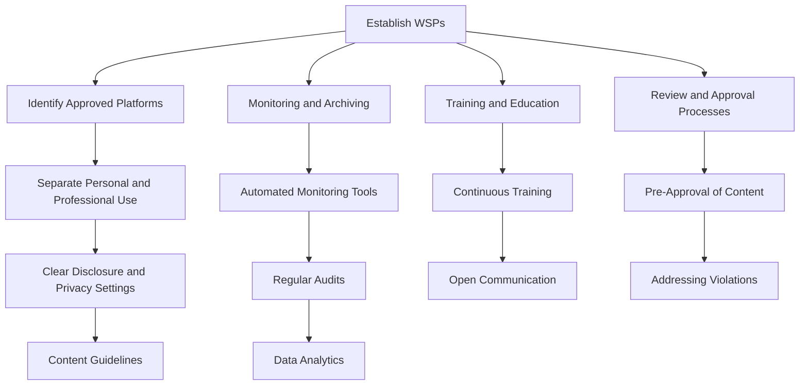

## 20.3.1 Compliance Policies for Social Media and Digital Communications

In today's digital age, social media and digital communications are integral to the operations of financial services firms and their representatives. However, these platforms also present unique compliance challenges. As a General Securities Representative, understanding and adhering to compliance policies is crucial to maintaining the integrity and trustworthiness of your communications. This section will delve into the requirements and best practices for ensuring compliance in digital communications, focusing on the separation of personal and professional use, and the necessity of written supervisory procedures.

### The Need for Written Supervisory Procedures

#### Regulatory Framework

The Financial Industry Regulatory Authority (FINRA) and the Securities and Exchange Commission (SEC) have established guidelines requiring firms to implement written supervisory procedures (WSPs) to oversee the use of social media and digital communications. These procedures are essential for ensuring that all communications comply with applicable securities laws and regulations.

**Key Regulations:**

- **FINRA Rule 3110**: Requires firms to establish and maintain a system to supervise the activities of each associated person that is reasonably designed to achieve compliance with applicable securities laws and regulations.
- **SEC Rule 17a-4**: Pertains to the preservation of records, requiring firms to retain electronic communications for a specified period.

#### Importance of WSPs

WSPs serve as a blueprint for compliance, detailing how a firm will monitor and control the use of digital platforms. They help mitigate risks associated with unauthorized or inappropriate communications that could lead to regulatory violations or reputational damage.

**Components of Effective WSPs:**

1. **Identification of Platforms**: Clearly define which social media and digital communication platforms are approved for use.
2. **Monitoring and Archiving**: Establish protocols for monitoring and archiving communications to ensure they are compliant and retrievable.
3. **Training and Education**: Implement regular training programs to educate employees about compliance requirements and the proper use of digital platforms.
4. **Review and Approval Processes**: Set up procedures for pre-approval and review of content before it is published, especially for communications that discuss investment products or services.

### Separation of Personal and Professional Use

#### Challenges and Considerations

The line between personal and professional use of social media can often blur, leading to potential compliance issues. It is crucial for representatives to clearly distinguish between their personal and professional personas online.

**Potential Risks:**

- **Confidentiality Breaches**: Sharing sensitive information inadvertently through personal accounts.
- **Misrepresentation**: Personal opinions being misconstrued as professional advice.
- **Regulatory Violations**: Engaging in activities or discussions that violate securities laws or firm policies.

#### Strategies for Separation

1. **Separate Accounts**: Maintain distinct accounts for personal and professional use, ensuring that professional accounts are subject to firm oversight and compliance checks.
2. **Clear Disclosure**: Use disclaimers to clarify when opinions expressed are personal and not reflective of the firm or its views.
3. **Privacy Settings**: Regularly review and update privacy settings to control who can view and interact with personal content.
4. **Content Guidelines**: Adhere to firm-approved content guidelines for professional accounts to ensure all communications are compliant and aligned with firm policies.

### Best Practices for Compliance

#### Developing a Compliance Culture

A strong compliance culture is essential for effective management of digital communications. This involves fostering an environment where compliance is prioritized and integrated into daily operations.

**Key Elements:**

- **Leadership Commitment**: Senior management should demonstrate a commitment to compliance by actively participating in the development and enforcement of policies.
- **Continuous Training**: Regular training sessions should be conducted to keep employees updated on the latest compliance requirements and best practices.
- **Open Communication**: Encourage open dialogue about compliance concerns and challenges, providing channels for employees to report issues without fear of retaliation.

#### Monitoring and Surveillance

Effective monitoring and surveillance are critical to ensuring compliance with digital communication policies. Firms must implement systems to track and review communications, identifying potential violations before they escalate.

**Technological Solutions:**

- **Automated Monitoring Tools**: Utilize software solutions that can scan and flag non-compliant content in real-time.
- **Data Analytics**: Leverage data analytics to identify patterns and trends that may indicate compliance risks.
- **Regular Audits**: Conduct regular audits of digital communications to assess compliance and identify areas for improvement.

#### Addressing Compliance Violations

When violations occur, it is essential to address them promptly and effectively to prevent recurrence and minimize impact.

**Steps to Address Violations:**

1. **Investigation**: Conduct a thorough investigation to understand the nature and extent of the violation.
2. **Corrective Action**: Implement corrective actions, which may include additional training, policy revisions, or disciplinary measures.
3. **Documentation**: Maintain detailed records of the violation and the steps taken to address it, ensuring transparency and accountability.
4. **Review and Update Policies**: Regularly review and update compliance policies to incorporate lessons learned from violations and reflect changes in regulations.

### Practical Examples and Scenarios

#### Case Study: Social Media Misstep

A financial advisor inadvertently shared confidential client information on their personal social media account. The firm swiftly responded by conducting an investigation, implementing additional training on privacy and confidentiality, and revising its WSPs to include stricter guidelines for personal social media use.

**Lessons Learned:**

- Importance of clear separation between personal and professional accounts.
- Need for ongoing training on confidentiality and privacy.

#### Scenario: Unauthorized Investment Advice

A representative posted investment advice on a public forum without firm approval, leading to a regulatory inquiry. The firm addressed the issue by reinforcing its pre-approval processes and enhancing its monitoring tools to detect unauthorized communications.

**Key Takeaways:**

- Necessity of pre-approval processes for public communications.
- Value of robust monitoring systems to catch non-compliant content early.

### Diagrams and Visual Aids

Below is a diagram illustrating the compliance process for digital communications within a firm:

### Conclusion

Navigating the complexities of social media and digital communications requires a robust compliance framework. By implementing comprehensive written supervisory procedures, clearly separating personal and professional use, and adhering to best practices, firms can effectively manage the risks associated with digital communications. As a General Securities Representative, understanding these compliance policies is essential for safeguarding your professional reputation and ensuring adherence to regulatory requirements.

### Suggested Further Reading and Resources

- **FINRA Regulatory Notices**: Stay updated with the latest notices and guidelines from FINRA regarding digital communications.
- **SEC Guidelines on Electronic Communications**: Review the SEC's guidelines to understand the regulatory expectations for electronic communications.
- **Industry Webinars and Training Sessions**: Participate in industry webinars and training sessions to gain insights into best practices and emerging trends in compliance.

---

## Series 7 Exam Practice Questions: Compliance Policies



### What is the primary purpose of written supervisory procedures (WSPs) for digital communications?

- [x] To ensure compliance with securities laws and regulations
- [ ] To promote the use of social media for marketing
- [ ] To increase the number of digital platforms used by the firm
- [ ] To eliminate the need for training employees

> **Explanation:** WSPs are designed to ensure that all digital communications comply with applicable securities laws and regulations, helping to mitigate risks and maintain the integrity of communications.

### Which of the following is a key component of effective WSPs?

- [ ] Encouraging employees to use personal accounts for business communication
- [x] Establishing protocols for monitoring and archiving communications
- [ ] Allowing unrestricted access to all digital platforms
- [ ] Eliminating the need for content review and approval

> **Explanation:** Effective WSPs include protocols for monitoring and archiving communications to ensure compliance and retrievability.

### Why is it important to separate personal and professional use of social media?

- [ ] To increase personal followers
- [ ] To allow personal opinions to influence professional advice
- [x] To prevent confidentiality breaches and regulatory violations
- [ ] To reduce the need for compliance monitoring

> **Explanation:** Separating personal and professional use helps prevent confidentiality breaches and ensures that communications comply with regulatory requirements.

### What is a best practice for maintaining separate personal and professional social media accounts?

- [x] Using disclaimers to clarify personal opinions
- [ ] Sharing confidential information on personal accounts
- [ ] Merging personal and professional accounts
- [ ] Ignoring privacy settings

> **Explanation:** Using disclaimers helps clarify when opinions expressed are personal and not reflective of the firm or its views.

### What role does leadership play in developing a compliance culture?

- [ ] Leadership should delegate all compliance responsibilities to junior staff
- [ ] Leadership should focus solely on business growth
- [x] Leadership should demonstrate commitment to compliance
- [ ] Leadership should avoid involvement in compliance matters

> **Explanation:** Leadership should actively participate in the development and enforcement of compliance policies, demonstrating a commitment to maintaining a strong compliance culture.

### How can firms effectively monitor digital communications for compliance?

- [ ] By relying solely on manual reviews
- [x] By utilizing automated monitoring tools
- [ ] By ignoring non-compliant content
- [ ] By allowing unrestricted communication

> **Explanation:** Automated monitoring tools can scan and flag non-compliant content in real-time, enhancing the firm's ability to maintain compliance.

### What should a firm do if a compliance violation occurs?

- [ ] Ignore the violation to avoid negative publicity
- [ ] Only document the violation without taking action
- [x] Conduct an investigation and implement corrective actions
- [ ] Blame the employee without reviewing policies

> **Explanation:** When a violation occurs, the firm should conduct a thorough investigation, implement corrective actions, and document the process to ensure transparency and accountability.

### Which of the following is a potential risk of not separating personal and professional social media use?

- [ ] Increased personal engagement
- [ ] Enhanced professional reputation
- [x] Misrepresentation of professional advice
- [ ] Improved compliance monitoring

> **Explanation:** Not separating personal and professional use can lead to misrepresentation of professional advice, as personal opinions may be misconstrued as official statements.

### What is the purpose of regular audits of digital communications?

- [ ] To reduce the number of platforms used
- [ ] To eliminate the need for WSPs
- [x] To assess compliance and identify areas for improvement
- [ ] To increase personal social media activity

> **Explanation:** Regular audits help assess compliance with digital communication policies and identify areas for improvement, ensuring that the firm remains aligned with regulatory requirements.

### How can data analytics be used in compliance monitoring?

- [ ] By ignoring patterns and trends
- [ ] By reducing the need for monitoring tools
- [x] By identifying patterns and trends that indicate compliance risks
- [ ] By eliminating the need for employee training

> **Explanation:** Data analytics can identify patterns and trends that may indicate compliance risks, allowing firms to proactively address potential issues.



---

This comprehensive guide on compliance policies for social media and digital communications is designed to equip you with the knowledge and tools necessary to navigate the complexities of digital communication in the securities industry. By adhering to these guidelines and best practices, you can ensure that your communications are compliant, ethical, and effective.
