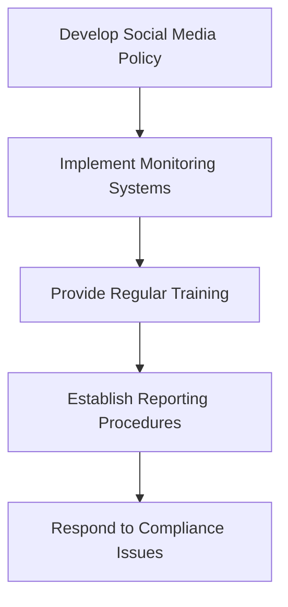

## 20.3 Social Media and Digital Communications

In today's digital age, social media and electronic communications have become integral tools for businesses, including those in the securities industry. However, with the benefits of these platforms come unique challenges and regulatory expectations. This section will delve into the complexities of social media and digital communications, focusing on regulatory compliance, best practices, and the implications for securities professionals.

### Understanding Electronic Communications

**Electronic Communications** refer to any form of message or content distributed electronically. This includes emails, social media posts, instant messages, and any other digital communication methods. In the securities industry, these tools are used for marketing, customer engagement, and information dissemination. However, they must be managed carefully to comply with regulatory standards.

### Unique Challenges of Electronic Communications

#### Information Overload and Management

One of the primary challenges of electronic communications is the sheer volume of information. Securities professionals must manage vast amounts of data while ensuring that all communications are accurate, clear, and compliant with regulatory requirements. This requires robust systems for monitoring and archiving communications.

#### Security and Privacy Concerns

With electronic communications, there is always a risk of data breaches and unauthorized access. Securities firms must implement strong cybersecurity measures to protect sensitive information and maintain customer trust. This includes encryption, secure access protocols, and regular security audits.

#### Compliance with Regulatory Standards

Regulatory bodies such as the Financial Industry Regulatory Authority (FINRA) and the Securities and Exchange Commission (SEC) have stringent rules regarding electronic communications. These regulations are designed to protect investors and ensure transparency in the securities markets. Compliance requires a thorough understanding of these rules and the implementation of effective monitoring and reporting systems.

### Regulatory Expectations for Social Media Use

#### FINRA Guidelines

FINRA has issued specific guidelines for the use of social media by securities professionals. These guidelines emphasize the importance of maintaining a professional tone, ensuring the accuracy of information, and avoiding misleading or exaggerated claims. Key points include:

- **Content Approval:** All social media content must be pre-approved by a designated supervisor to ensure compliance with regulatory standards.
- **Recordkeeping:** Firms must retain records of all social media communications for a specified period, typically three years, in a format that is easily accessible for audits.
- **Monitoring:** Continuous monitoring of social media activity is required to ensure compliance and to identify any potential issues promptly.

#### SEC Regulations

The SEC also has regulations that impact the use of social media in the securities industry. These include:

- **Disclosure Requirements:** Any material information that could influence an investor's decision must be disclosed in a manner that is fair and not misleading.
- **Anti-Fraud Provisions:** Social media communications must comply with anti-fraud rules, meaning they cannot contain false or misleading statements or omit material facts.

### Best Practices for Social Media Engagement

#### Developing a Social Media Policy

A comprehensive social media policy is essential for ensuring compliance and guiding employee behavior. This policy should cover:

- **Permitted Platforms:** Specify which social media platforms are approved for business use.
- **Content Guidelines:** Outline the types of content that are acceptable and any restrictions on what can be shared.
- **Approval Processes:** Detail the process for content approval and the roles responsible for monitoring and compliance.
- **Training and Education:** Provide regular training sessions to keep employees informed about regulatory changes and best practices.

#### Engaging with Customers

When engaging with customers on social media, it's important to maintain professionalism and adhere to regulatory standards. Best practices include:

- **Transparency:** Be open and honest in all communications, providing clear and accurate information.
- **Responsiveness:** Respond to customer inquiries promptly and professionally, while ensuring that all responses comply with regulatory guidelines.
- **Risk Management:** Be aware of the risks associated with social media interactions, such as the potential for miscommunication or the spread of misinformation.

#### Case Study: Successful Social Media Strategy

Consider a securities firm that effectively uses social media to engage with its audience. This firm has implemented a robust social media policy, regularly trains its employees, and uses sophisticated monitoring tools to ensure compliance. As a result, it has built a strong online presence, increased customer engagement, and maintained regulatory compliance.

### Real-World Applications and Regulatory Scenarios

#### Scenario 1: Misleading Social Media Post

A securities professional posts an exaggerated claim about the performance of a particular investment product on social media. This post is flagged by the firm's compliance team, and an investigation is launched. The firm takes corrective action by removing the post, issuing a correction, and providing additional training to the employee involved.

#### Scenario 2: Data Breach and Response

A data breach occurs at a securities firm, compromising sensitive customer information. The firm promptly notifies affected customers, implements additional security measures, and works with regulatory authorities to address the breach. This scenario highlights the importance of having a robust cybersecurity strategy and a clear plan for responding to data breaches.

### Step-by-Step Guidance for Compliance

1. **Develop a Comprehensive Social Media Policy:** This policy should outline the rules and guidelines for social media use, including content approval processes and monitoring requirements.

2. **Implement Robust Monitoring Systems:** Use advanced tools to monitor social media activity and ensure compliance with regulatory standards.

3. **Provide Regular Training:** Keep employees informed about regulatory changes and best practices through regular training sessions.

4. **Establish Clear Reporting Procedures:** Ensure that all social media communications are documented and easily accessible for audits.

5. **Respond Promptly to Compliance Issues:** Address any potential compliance issues quickly and effectively to minimize risk and maintain customer trust.

### Diagrams and Visuals

To enhance understanding, consider the following diagram illustrating the process of social media compliance in the securities industry:

### Common Pitfalls and Strategies to Overcome Them

#### Pitfall 1: Inadequate Monitoring

Failing to monitor social media activity can lead to compliance breaches. To overcome this, invest in advanced monitoring tools and establish a dedicated team to oversee social media compliance.

#### Pitfall 2: Lack of Employee Training

Without proper training, employees may inadvertently violate regulatory standards. Regular training sessions and updates on regulatory changes can help mitigate this risk.

#### Pitfall 3: Inconsistent Policy Enforcement

Inconsistent enforcement of social media policies can lead to confusion and non-compliance. Ensure that policies are applied uniformly across the organization and that any violations are addressed promptly.

### Conclusion

Social media and digital communications present both opportunities and challenges for the securities industry. By understanding the regulatory landscape, implementing robust compliance measures, and following best practices, securities professionals can effectively leverage these tools while minimizing risk. As you prepare for the Series 7 Exam, remember the importance of compliance in social media use and the role it plays in maintaining the integrity of the securities markets.

### Additional Resources

- **FINRA Regulatory Notice 10-06:** Provides guidance on social media use and electronic communications.
- **SEC's Office of Investor Education and Advocacy:** Offers resources and information on investor protection and compliance.
- **National Institute of Standards and Technology (NIST):** Provides guidelines on cybersecurity and data protection.

## Series 7 Exam Practice Questions: Social Media and Digital Communications



### What is a key regulatory requirement for social media use by securities professionals?

- [x] Pre-approval of content by a designated supervisor
- [ ] Unlimited freedom to post as long as it's accurate
- [ ] No recordkeeping is required
- [ ] Only internal communications need monitoring

> **Explanation:** FINRA requires that all social media content be pre-approved by a designated supervisor to ensure compliance with regulatory standards.

### Which regulatory body provides guidelines for social media use in the securities industry?

- [ ] Federal Reserve Board
- [x] FINRA
- [ ] Department of Labor
- [ ] Office of the Comptroller of the Currency

> **Explanation:** FINRA provides specific guidelines for the use of social media by securities professionals, emphasizing compliance and transparency.

### What is the primary challenge associated with electronic communications in the securities industry?

- [ ] Lack of platforms
- [ ] Ease of use
- [x] Information overload and management
- [ ] High costs

> **Explanation:** The primary challenge is managing the vast amounts of information while ensuring compliance with regulatory requirements.

### What is a best practice for engaging with customers on social media?

- [ ] Ignoring negative comments
- [x] Maintaining professionalism and transparency
- [ ] Posting only promotional content
- [ ] Avoiding direct interaction

> **Explanation:** Engaging with customers professionally and transparently is crucial for maintaining trust and compliance.

### How long must firms retain records of social media communications?

- [ ] One year
- [ ] Two years
- [x] Three years
- [ ] Five years

> **Explanation:** Firms are required to retain records of all social media communications for at least three years.

### What is a potential consequence of not complying with social media regulations?

- [ ] Increased customer engagement
- [ ] Enhanced reputation
- [x] Regulatory fines and penalties
- [ ] More followers

> **Explanation:** Non-compliance with social media regulations can result in fines and penalties from regulatory bodies.

### Which of the following is a component of a comprehensive social media policy?

- [ ] Allowing all employees to post freely
- [x] Specifying approved platforms and content guidelines
- [ ] Eliminating content approval processes
- [ ] Encouraging personal opinions

> **Explanation:** A comprehensive social media policy should specify approved platforms and content guidelines to ensure compliance.

### What is a common pitfall in social media compliance?

- [ ] Over-monitoring
- [ ] Too much employee training
- [ ] Consistent policy enforcement
- [x] Inadequate monitoring

> **Explanation:** Inadequate monitoring can lead to compliance breaches, highlighting the importance of robust monitoring systems.

### What is the role of training in social media compliance?

- [ ] It is optional
- [ ] It should be done once a year
- [x] It keeps employees informed about regulatory changes and best practices
- [ ] It is only for new employees

> **Explanation:** Regular training is essential to keep employees informed about regulatory changes and best practices.

### What should a firm do if a compliance issue is identified on social media?

- [ ] Ignore it
- [ ] Wait for regulatory action
- [x] Address it promptly and effectively
- [ ] Delete the account

> **Explanation:** Prompt and effective action is necessary to address compliance issues and maintain trust with customers and regulators.



---
