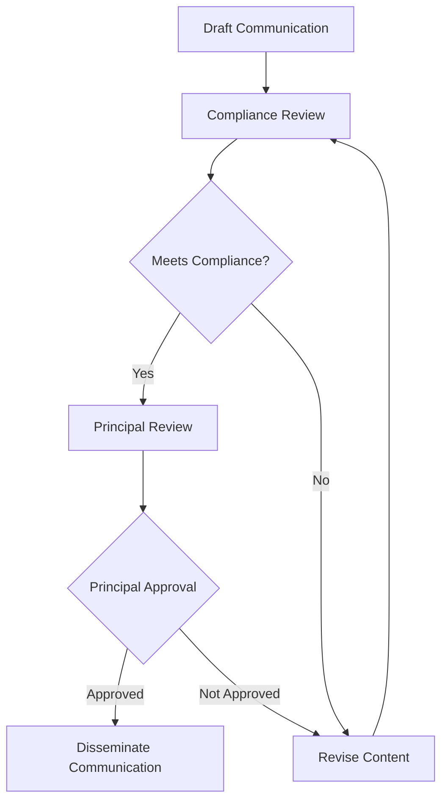

## 20.4 Approval and Review Procedures

In the securities industry, effective communication with customers is paramount. Ensuring that all communications are compliant with regulatory standards is critical for maintaining trust and transparency. This section delves into the approval and review procedures required for customer communications, focusing on principal approval and the process for filing communications with the Financial Industry Regulatory Authority (FINRA).

### Understanding Principal Approval

**Principal Approval** is a crucial step in the communication process within securities firms. It involves the review and sign-off by a qualified supervisor, often a registered principal, before any communication is disseminated to the public. This procedure ensures that all materials adhere to regulatory standards and do not mislead or misinform investors.

#### Key Responsibilities of a Principal

1. **Reviewing Content:** Principals must thoroughly review all communications to ensure accuracy, completeness, and compliance with regulatory requirements.
2. **Ensuring Compliance:** They must confirm that the communication complies with FINRA rules, SEC regulations, and any other applicable laws.
3. **Approving Dissemination:** Once satisfied with the content, the principal provides written approval, allowing the communication to be distributed.

#### Types of Communications Requiring Principal Approval

- **Retail Communications:** Any written or electronic communication distributed to more than 25 retail investors within any 30-day period.
- **Institutional Communications:** Although generally exempt from prior approval, these should still be reviewed to ensure they meet the firm's policies.
- **Correspondence:** Written or electronic communication sent to 25 or fewer retail investors within any 30-day period, which may require review based on firm policy.

### The Principal Approval Process

The process for obtaining principal approval involves several steps, each designed to ensure that communications are clear, fair, and not misleading. Here's a detailed look at the typical approval workflow:

#### Step-by-Step Approval Process

1. **Drafting the Communication:** The initial step involves creating the communication content, ensuring it aligns with the firm's objectives and regulatory guidelines.
2. **Compliance Review:** The draft is reviewed by the compliance team to identify any potential regulatory issues.
3. **Principal Review:** If the compliance team approves, the communication is then reviewed by a registered principal.
4. **Approval or Revision:** The principal either approves the communication for dissemination or sends it back for revisions if it does not meet compliance standards.

### Filing Communications with FINRA

Certain types of communications require filing with FINRA, particularly those that are deemed to carry higher risks of misleading investors. Understanding when and how to file these communications is essential for compliance.

#### Types of Communications That Require FINRA Filing

- **Retail Communications:** Particularly those involving investment companies, derivatives, or new products.
- **Advertisements:** Any promotional material intended for a wide audience.
- **Sales Literature:** Materials distributed to a targeted audience that discuss specific investment products.

#### The FINRA Filing Process

1. **Preparation:** Ensure the communication is complete and adheres to all regulatory requirements.
2. **Filing Submission:** Use FINRA's electronic filing system to submit the communication.
3. **Review and Feedback:** FINRA reviews the submission and provides feedback or requests for modifications.
4. **Final Approval:** Once FINRA is satisfied, the communication can be distributed.

### Best Practices for Approval and Review

To streamline the approval and review process, securities firms should adopt the following best practices:

- **Maintain Clear Policies:** Establish clear, written policies for communication approval and review.
- **Regular Training:** Conduct regular training sessions for staff to keep them updated on regulatory changes and compliance requirements.
- **Use Checklists:** Implement checklists to ensure all communications meet the necessary standards before submission for approval.
- **Document Everything:** Keep detailed records of all communications, approvals, and any revisions made.

### Common Pitfalls and How to Avoid Them

Despite best efforts, firms can encounter challenges in the approval and review process. Here are some common pitfalls and strategies to overcome them:

- **Incomplete Reviews:** Ensure that all communications undergo a thorough review by both compliance and principal staff to avoid incomplete assessments.
- **Miscommunication:** Foster open communication between compliance, principals, and marketing teams to ensure everyone is aligned on expectations.
- **Inadequate Documentation:** Maintain comprehensive records of all communications and approvals to provide a clear audit trail.

### Case Studies and Real-World Applications

**Case Study 1: Misleading Advertisement**

A firm released an advertisement without proper principal approval, leading to regulatory action due to misleading claims about investment returns. This highlights the importance of thorough review processes and the consequences of non-compliance.

**Case Study 2: Streamlined Approval Process**

A large brokerage firm implemented an automated workflow for communication approval, reducing turnaround time and ensuring compliance. This case demonstrates the benefits of leveraging technology to enhance efficiency and accuracy.

### Regulatory Framework and Compliance Considerations

Understanding the regulatory framework governing customer communications is crucial for compliance. Key regulations include:

- **FINRA Rule 2210:** Governs the content, approval, and filing of communications with the public.
- **SEC Regulations:** Provide additional guidelines on fair and balanced presentation of information.

### Conclusion

The approval and review procedures for customer communications are vital for ensuring compliance with regulatory standards. By understanding the requirements for principal approval, the process for filing communications with FINRA, and adopting best practices, firms can effectively manage their communication strategies and maintain investor trust.

## Series 7 Exam Practice Questions: Approval and Review Procedures



### What is the primary role of a principal in the approval process of customer communications?

- [x] To review and approve communications for compliance with regulatory standards.
- [ ] To draft communications for the marketing team.
- [ ] To distribute communications to potential investors.
- [ ] To file communications directly with the SEC.

> **Explanation:** The primary role of a principal is to review and approve communications to ensure they comply with regulatory standards before dissemination.

### Which type of communication generally requires principal approval before dissemination?

- [ ] Institutional communications
- [x] Retail communications
- [ ] Internal memos
- [ ] Press releases

> **Explanation:** Retail communications require principal approval because they are distributed to a broad audience and must comply with specific regulatory standards.

### What is the first step in the principal approval process for customer communications?

- [ ] Principal review
- [ ] Dissemination
- [x] Drafting the communication
- [ ] Filing with FINRA

> **Explanation:** The first step is drafting the communication, ensuring it aligns with the firm's objectives and regulatory guidelines.

### When must a communication be filed with FINRA?

- [x] When it involves investment companies or new products.
- [ ] When it is sent to internal staff.
- [ ] When it is a press release.
- [ ] When it is a private email to a client.

> **Explanation:** Communications involving investment companies or new products must be filed with FINRA due to their potential impact on investors.

### What is a common pitfall in the approval and review process?

- [ ] Over-documentation
- [ ] Too many approvals
- [x] Incomplete reviews
- [ ] Excessive training

> **Explanation:** Incomplete reviews can lead to non-compliance issues, as communications may not be thoroughly assessed for regulatory adherence.

### What is a benefit of using an automated workflow for communication approval?

- [ ] It eliminates the need for principal approval.
- [x] It reduces turnaround time and ensures compliance.
- [ ] It allows for more creative freedom in communications.
- [ ] It bypasses the need for regulatory filing.

> **Explanation:** Automated workflows streamline the approval process, reducing turnaround time and enhancing compliance accuracy.

### Which FINRA rule governs the content and approval of communications with the public?

- [ ] FINRA Rule 3110
- [x] FINRA Rule 2210
- [ ] FINRA Rule 4512
- [ ] FINRA Rule 3310

> **Explanation:** FINRA Rule 2210 governs the content, approval, and filing of communications with the public, ensuring they are fair and not misleading.

### What should firms do to avoid miscommunication during the approval process?

- [ ] Limit communication between teams
- [ ] Skip compliance review
- [x] Foster open communication between compliance, principals, and marketing teams
- [ ] Only involve the marketing team

> **Explanation:** Open communication between compliance, principals, and marketing teams ensures alignment and clarity on expectations.

### What is the purpose of maintaining detailed records of communications and approvals?

- [ ] To reduce the need for principal review
- [x] To provide a clear audit trail
- [ ] To simplify the marketing process
- [ ] To avoid regulatory filing

> **Explanation:** Maintaining detailed records provides a clear audit trail, ensuring accountability and compliance with regulatory requirements.

### How can regular training benefit the communication approval process?

- [ ] By reducing the need for compliance review
- [ ] By eliminating the need for principal approval
- [x] By keeping staff updated on regulatory changes and compliance requirements
- [ ] By allowing more creative freedom in communications

> **Explanation:** Regular training keeps staff informed about regulatory changes and compliance requirements, enhancing the effectiveness of the approval process.



By mastering the approval and review procedures, you will be well-prepared to handle customer communications in compliance with regulatory standards, ensuring your success in the Series 7 Exam and your future career in the securities industry.
