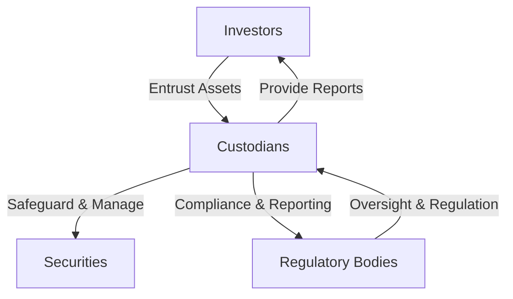

## 21.2.2 Custodial Arrangements

Custodial arrangements play a crucial role in the financial markets by ensuring the safekeeping and administration of securities on behalf of investors. Understanding the intricacies of custodial services is essential for anyone pursuing a career in the securities industry, especially for those preparing for the Series 7 Exam. This section delves into the functions, responsibilities, and best practices associated with custodial arrangements, providing you with the knowledge needed to excel in your exam and professional practice.

### Understanding Custodial Arrangements

A **custodian** is an entity, often a bank or financial institution, that holds and safeguards financial assets on behalf of investors. The primary role of a custodian is to ensure the safety and integrity of the assets entrusted to them, providing a layer of security and trust for investors. Custodians are responsible for maintaining accurate records, executing transactions, and providing reporting services to their clients.

#### Key Functions of Custodians

1. **Safekeeping of Assets:** Custodians hold securities in electronic or physical form, ensuring they are protected against theft, loss, or damage. This involves maintaining secure systems and facilities to prevent unauthorized access.

2. **Transaction Processing:** Custodians facilitate the settlement of trades by ensuring that securities are transferred accurately and efficiently between parties. They handle the delivery and receipt of securities, ensuring compliance with market regulations.

3. **Record Keeping:** Accurate record-keeping is vital for custodians, who must maintain detailed records of all transactions, holdings, and changes in ownership. This includes tracking dividends, interest payments, and corporate actions such as stock splits or mergers.

4. **Reporting and Compliance:** Custodians provide regular reports to clients, detailing their holdings, transactions, and any changes in asset value. They also ensure compliance with regulatory requirements, such as anti-money laundering (AML) and know-your-customer (KYC) regulations.

5. **Corporate Actions Management:** Custodians manage corporate actions on behalf of investors, ensuring that they receive the benefits they are entitled to, such as dividend payments or voting rights.

6. **Tax Support:** Custodians may provide tax-related services, such as withholding tax on dividends or interest, and supplying necessary documentation for tax reporting.

### Responsibilities and Protections Offered by Custodians

Custodians have a fiduciary duty to act in the best interests of their clients, providing a range of protections and responsibilities to ensure the safekeeping of assets.

#### Fiduciary Responsibility

Custodians are bound by fiduciary duties to prioritize the interests of their clients. This includes acting with integrity, transparency, and diligence in all aspects of their service. Fiduciary responsibilities encompass:

- **Duty of Care:** Custodians must exercise a high level of care in managing and safeguarding assets, ensuring that all actions are in the client's best interest.
- **Duty of Loyalty:** Custodians must avoid conflicts of interest and ensure that their actions do not benefit themselves at the expense of their clients.
- **Duty of Prudence:** Custodians must make informed and prudent decisions regarding the management and safekeeping of assets.

#### Investor Protections

Custodians offer several layers of protection to investors, ensuring the security and integrity of their assets:

- **Segregation of Assets:** Custodians are required to keep client assets separate from their own, preventing any commingling of funds that could jeopardize client holdings.
- **Insurance Coverage:** Many custodians provide insurance coverage to protect against potential losses due to theft, fraud, or other unforeseen events.
- **Regulatory Oversight:** Custodians are subject to rigorous regulatory oversight, ensuring compliance with industry standards and legal requirements. This oversight provides an additional layer of security for investors.

### Best Practices for Selecting Custodial Services

Choosing the right custodian is a critical decision for investors and financial professionals. Here are some best practices to consider when selecting custodial services:

1. **Assess Financial Stability:** Evaluate the financial health and stability of the custodian to ensure they have the resources and resilience to safeguard your assets.

2. **Examine Reputation and Track Record:** Research the custodian's reputation in the industry, including their track record for reliability, security, and customer service.

3. **Review Service Offerings:** Consider the range of services offered by the custodian, including transaction processing, record-keeping, reporting, and tax support. Ensure they meet your specific needs and requirements.

4. **Evaluate Technology and Security Measures:** Assess the custodian's technology infrastructure and security measures to ensure they provide robust protection against cyber threats and unauthorized access.

5. **Understand Fee Structures:** Review the custodian's fee structures to ensure they are transparent and competitive. Consider any additional costs associated with specific services or transactions.

6. **Check Regulatory Compliance:** Verify that the custodian is compliant with relevant regulatory requirements and industry standards. This includes ensuring they have appropriate licenses and certifications.

7. **Consider Client Support and Communication:** Evaluate the custodian's client support services, including their responsiveness, communication channels, and availability of account representatives.

### Practical Examples and Case Studies

To illustrate the importance of custodial arrangements, consider the following scenarios:

#### Case Study 1: Protecting Assets During Market Volatility

During times of market volatility, investors rely on custodians to ensure the safekeeping of their assets. A custodian with robust security measures and a strong financial foundation can provide peace of mind to investors, knowing their assets are protected against potential market disruptions.

#### Case Study 2: Managing Complex Corporate Actions

When a company undergoes a complex corporate action, such as a merger or acquisition, custodians play a vital role in managing the process on behalf of investors. They ensure that all necessary actions are taken, such as exchanging shares or processing cash payments, to protect the interests of their clients.

### Real-World Applications and Regulatory Scenarios

In the securities industry, custodial arrangements are subject to a range of regulatory requirements and standards. Understanding these regulations is essential for compliance and effective asset management.

#### Regulatory Framework

Custodians operate within a complex regulatory framework designed to protect investors and ensure the integrity of financial markets. Key regulations include:

- **Securities Exchange Act of 1934:** This act regulates the secondary trading of securities and imposes reporting requirements on custodians to ensure transparency and accountability.
- **Investment Company Act of 1940:** This act governs the operations of investment companies, including custodians, and establishes standards for the safekeeping and management of assets.
- **Dodd-Frank Wall Street Reform and Consumer Protection Act:** This act introduced new regulations to enhance the oversight and accountability of financial institutions, including custodians, to protect investors and promote market stability.

#### Compliance Considerations

Custodians must adhere to strict compliance requirements to ensure the safekeeping of assets and protect investor interests. Key compliance considerations include:

- **Anti-Money Laundering (AML) and Know Your Customer (KYC):** Custodians must implement robust AML and KYC procedures to prevent financial crimes and ensure the legitimacy of clients and transactions.
- **Data Protection and Privacy:** Custodians must comply with data protection and privacy regulations to safeguard client information and prevent unauthorized access or disclosure.
- **Risk Management and Controls:** Custodians must implement effective risk management and control measures to identify and mitigate potential risks to client assets.

### Step-by-Step Guidance for Custodial Compliance

To ensure compliance with custodial regulations, follow these step-by-step guidelines:

1. **Conduct a Risk Assessment:** Identify and assess potential risks to client assets, including operational, financial, and compliance risks.

2. **Implement Robust Controls:** Establish and maintain effective controls to mitigate identified risks, including segregation of duties, access controls, and transaction monitoring.

3. **Develop Comprehensive Policies and Procedures:** Create detailed policies and procedures to guide custodial operations and ensure compliance with regulatory requirements.

4. **Provide Training and Awareness:** Conduct regular training and awareness programs for custodial staff to ensure they understand their responsibilities and compliance obligations.

5. **Monitor and Review Compliance:** Implement ongoing monitoring and review processes to assess compliance with regulatory requirements and identify areas for improvement.

### Diagrams and Visuals

To enhance understanding of custodial arrangements, consider the following diagram illustrating the relationship between custodians, investors, and regulatory bodies:

This diagram highlights the flow of assets and information between investors, custodians, and regulatory bodies, emphasizing the custodian's role in safeguarding assets and ensuring compliance.

### Best Practices, Common Pitfalls, and Strategies

When selecting and working with custodial services, consider the following best practices and strategies to avoid common pitfalls:

- **Best Practices:**
  - Conduct thorough due diligence when selecting a custodian.
  - Regularly review and update custodial agreements to ensure they meet evolving needs and regulatory requirements.
  - Maintain open communication with custodians to address any issues or concerns promptly.

- **Common Pitfalls:**
  - Failing to assess the financial stability and reputation of a custodian.
  - Overlooking the importance of technology and security measures in safeguarding assets.
  - Neglecting to review and understand fee structures and potential hidden costs.

- **Strategies:**
  - Develop a comprehensive checklist for evaluating custodial services.
  - Establish clear criteria for selecting and monitoring custodians, including financial health, service offerings, and compliance history.
  - Engage in regular performance reviews and audits to ensure custodial services meet expectations and regulatory standards.

### References and Additional Resources

For further exploration of custodial arrangements and related topics, consider the following resources:

- **Securities Exchange Act of 1934:** [SEC.gov](https://www.sec.gov)
- **Investment Company Act of 1940:** [SEC.gov](https://www.sec.gov)
- **Dodd-Frank Wall Street Reform and Consumer Protection Act:** [Federal Reserve](https://www.federalreserve.gov)

### Conclusion

Custodial arrangements are a fundamental component of the securities industry, providing essential safekeeping and management services for investors. Understanding the roles, responsibilities, and best practices associated with custodial services is crucial for anyone pursuing a career in the financial markets. By mastering these concepts, you will be well-prepared to excel in the Series 7 Exam and advance your career in the securities industry.

---

## Series 7 Exam Practice Questions: Custodial Arrangements



### What is the primary role of a custodian in the financial markets?

- [x] To safeguard and manage financial assets on behalf of investors
- [ ] To provide investment advice to clients
- [ ] To execute trades on behalf of investors
- [ ] To issue securities to the public

> **Explanation:** The primary role of a custodian is to safeguard and manage financial assets on behalf of investors, ensuring their security and integrity.

### Which of the following is a key responsibility of custodians?

- [ ] Providing tax advice to investors
- [x] Maintaining accurate records of transactions and holdings
- [ ] Setting interest rates for loans
- [ ] Underwriting new securities issues

> **Explanation:** Custodians are responsible for maintaining accurate records of transactions and holdings, ensuring transparency and accountability.

### What is a fiduciary duty of a custodian?

- [ ] To maximize profits for themselves
- [x] To act in the best interests of their clients
- [ ] To compete with other custodians
- [ ] To provide loans to investors

> **Explanation:** A fiduciary duty requires custodians to act in the best interests of their clients, prioritizing their needs and ensuring the safekeeping of their assets.

### How do custodians protect investor assets?

- [ ] By investing them in high-risk securities
- [x] By segregating client assets from their own
- [ ] By offering high-interest loans
- [ ] By charging high fees

> **Explanation:** Custodians protect investor assets by segregating client assets from their own, preventing commingling and ensuring security.

### What should investors consider when selecting a custodian?

- [ ] The custodian's advertising budget
- [ ] The custodian's social media presence
- [x] The custodian's financial stability and reputation
- [ ] The custodian's office location

> **Explanation:** Investors should consider the custodian's financial stability and reputation to ensure the safekeeping of their assets.

### What is a common pitfall when selecting custodial services?

- [x] Failing to assess the custodian's financial stability
- [ ] Overanalyzing the custodian's social media presence
- [ ] Ignoring the custodian's marketing materials
- [ ] Focusing too much on the custodian's office decor

> **Explanation:** A common pitfall is failing to assess the custodian's financial stability, which is crucial for ensuring the security of investor assets.

### What regulatory act governs the operations of custodians?

- [ ] Securities Act of 1933
- [x] Investment Company Act of 1940
- [ ] Sarbanes-Oxley Act
- [ ] Gramm-Leach-Bliley Act

> **Explanation:** The Investment Company Act of 1940 governs the operations of custodians, establishing standards for asset safekeeping and management.

### What is a best practice for selecting custodial services?

- [ ] Choosing the custodian with the most advertisements
- [x] Conducting thorough due diligence on the custodian
- [ ] Selecting the custodian with the lowest fees
- [ ] Picking the custodian with the most offices

> **Explanation:** Conducting thorough due diligence on the custodian is a best practice for ensuring the selection of reliable and secure custodial services.

### How can custodians ensure compliance with regulatory requirements?

- [ ] By ignoring regulatory changes
- [x] By implementing robust controls and monitoring processes
- [ ] By reducing client communication
- [ ] By focusing solely on profit maximization

> **Explanation:** Custodians can ensure compliance by implementing robust controls and monitoring processes to adhere to regulatory requirements.

### What is a key benefit of custodial arrangements for investors?

- [ ] Increased investment risk
- [x] Enhanced security and protection of assets
- [ ] Reduced access to financial markets
- [ ] Higher transaction fees

> **Explanation:** A key benefit of custodial arrangements is the enhanced security and protection of assets, providing peace of mind to investors.



---
