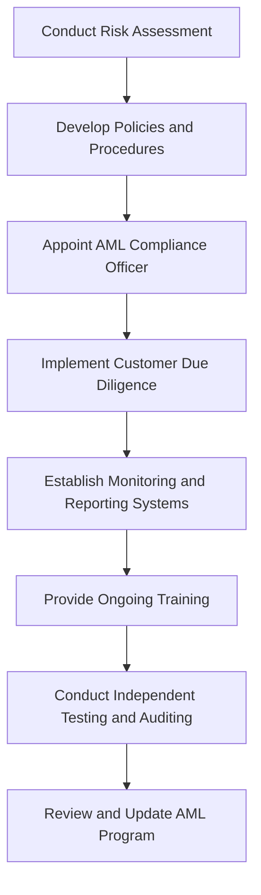

## 22.2 AML Program Requirements

In today's complex financial landscape, Anti-Money Laundering (AML) compliance is a critical component for financial institutions and securities firms. The Financial Industry Regulatory Authority (FINRA) mandates that firms develop and implement a comprehensive AML program to prevent, detect, and report money laundering activities. This section provides an in-depth exploration of the essential components of an effective AML program, emphasizing the importance of a risk-based approach.

### Understanding AML Program Requirements

An AML program is a structured framework designed to combat money laundering and terrorist financing. It is mandated by the Bank Secrecy Act (BSA) and enforced by regulatory bodies such as FINRA and the Securities and Exchange Commission (SEC). The primary goal is to prevent the misuse of financial systems for illicit purposes.

### Essential Components of an AML Program

An effective AML program must include the following key components:

1. **Risk-Based Approach**: A cornerstone of AML compliance, the risk-based approach involves assessing the firm's exposure to money laundering risks and tailoring controls accordingly. This approach ensures that resources are allocated efficiently to areas of highest risk.

2. **Internal Policies, Procedures, and Controls**: Firms must establish comprehensive policies and procedures to prevent money laundering. These should cover all aspects of the firm's operations and be regularly updated to reflect changes in regulations and business practices.

3. **Designation of an AML Compliance Officer**: An AML Compliance Officer is responsible for overseeing the AML program, ensuring compliance with regulations, and serving as a point of contact for regulatory bodies.

4. **Ongoing Employee Training**: Regular training programs are essential to educate employees about AML regulations, red flags, and reporting procedures. Training should be tailored to the specific roles and responsibilities of employees.

5. **Independent Testing and Auditing**: Regular independent testing of the AML program is crucial to assess its effectiveness and compliance with regulatory requirements. This can be conducted by internal audit staff or external parties.

6. **Customer Due Diligence (CDD)**: CDD involves verifying the identity of customers and understanding their financial activities. Enhanced due diligence (EDD) may be required for high-risk customers.

7. **Suspicious Activity Monitoring and Reporting**: Firms must implement systems to detect and report suspicious activities. This includes filing Suspicious Activity Reports (SARs) with the Financial Crimes Enforcement Network (FinCEN).

8. **Recordkeeping and Reporting Requirements**: Firms are required to maintain detailed records of transactions and customer information. These records must be readily available for regulatory review.

### The Importance of a Risk-Based Approach

A risk-based approach is fundamental to an effective AML program. It involves:

- **Risk Assessment**: Identifying and assessing the firm's exposure to money laundering risks based on factors such as customer type, geographic location, and products offered.

- **Risk Mitigation**: Implementing controls and measures to mitigate identified risks. This includes enhanced monitoring for high-risk customers and transactions.

- **Continuous Review and Adjustment**: Regularly reviewing and adjusting the AML program to address emerging risks and regulatory changes.

By focusing on areas of highest risk, firms can allocate resources more effectively and enhance their ability to detect and prevent money laundering.

### Practical Examples and Case Studies

To illustrate the application of AML program requirements, consider the following scenarios:

- **Case Study 1: High-Risk Customer Identification**: A brokerage firm identifies a new customer from a high-risk jurisdiction. The firm conducts enhanced due diligence, including verifying the customer's source of funds and monitoring their transactions for unusual activity.

- **Case Study 2: Suspicious Activity Reporting**: An employee notices a pattern of transactions that appear to be structured to avoid reporting thresholds. The firm investigates and files a SAR with FinCEN, detailing the suspicious activity.

- **Case Study 3: Independent Testing and Audit**: A firm engages an external auditor to review its AML program. The audit identifies gaps in transaction monitoring, prompting the firm to enhance its systems and controls.

### Regulatory Framework and Compliance Considerations

The regulatory framework for AML compliance is governed by several key laws and regulations, including:

- **Bank Secrecy Act (BSA)**: The BSA requires financial institutions to maintain records and file reports that are useful in criminal, tax, and regulatory investigations.

- **USA PATRIOT Act**: This act enhances the BSA by imposing additional requirements on financial institutions, including customer identification programs and enhanced due diligence for foreign correspondent accounts.

- **FINRA Rule 3310**: This rule requires member firms to develop and implement a written AML program that is reasonably designed to achieve compliance with the BSA and its implementing regulations.

### Step-by-Step Guidance for AML Compliance

1. **Conduct a Risk Assessment**: Evaluate the firm's exposure to money laundering risks based on customer profiles, geographic locations, and products offered.

2. **Develop Policies and Procedures**: Establish comprehensive policies and procedures to address identified risks and ensure compliance with regulatory requirements.

3. **Appoint an AML Compliance Officer**: Designate a qualified individual to oversee the AML program and serve as a liaison with regulatory bodies.

4. **Implement Customer Due Diligence**: Verify the identity of customers and conduct enhanced due diligence for high-risk accounts.

5. **Establish Monitoring and Reporting Systems**: Implement systems to detect and report suspicious activities, including filing SARs with FinCEN.

6. **Provide Ongoing Training**: Conduct regular training programs to educate employees about AML regulations and their role in compliance.

7. **Conduct Independent Testing and Auditing**: Regularly test the AML program to assess its effectiveness and compliance with regulatory requirements.

8. **Review and Update the AML Program**: Continuously review and update the AML program to address emerging risks and regulatory changes.

### Diagrams and Visual Aids

To enhance understanding, consider the following diagram illustrating the AML compliance process:

### Best Practices and Common Pitfalls

**Best Practices:**

- **Adopt a Risk-Based Approach**: Focus resources on areas of highest risk to enhance detection and prevention of money laundering.

- **Foster a Compliance Culture**: Encourage a culture of compliance throughout the organization, emphasizing the importance of AML efforts.

- **Leverage Technology**: Utilize advanced technology and data analytics to enhance monitoring and detection of suspicious activities.

**Common Pitfalls:**

- **Inadequate Risk Assessment**: Failing to conduct a thorough risk assessment can lead to gaps in the AML program.

- **Insufficient Employee Training**: Without regular training, employees may not recognize red flags or understand reporting procedures.

- **Lack of Independent Testing**: Failing to conduct independent testing can result in undetected weaknesses in the AML program.

### Exam Strategies and Tips

To succeed on the Series 7 Exam, focus on the following strategies:

- **Understand Key Concepts**: Familiarize yourself with the essential components of an AML program and the importance of a risk-based approach.

- **Practice Application**: Work through practical examples and case studies to apply theoretical concepts to real-world scenarios.

- **Review Regulatory Requirements**: Study the key laws and regulations governing AML compliance, including the BSA, USA PATRIOT Act, and FINRA Rule 3310.

- **Utilize Practice Exams**: Test your knowledge with practice exams and question banks to reinforce learning and identify areas for improvement.

### Summary

An effective AML program is essential for compliance with regulatory requirements and the prevention of money laundering. By adopting a risk-based approach and implementing comprehensive policies and procedures, firms can enhance their ability to detect and prevent illicit activities. Ongoing training, independent testing, and continuous review are critical to maintaining an effective AML program.

## Series 7 Exam Practice Questions: AML Program Requirements



### What is the primary goal of an AML program?

- [x] To prevent, detect, and report money laundering activities
- [ ] To enhance customer service
- [ ] To increase sales of financial products
- [ ] To reduce transaction processing times

> **Explanation:** The primary goal of an AML program is to prevent, detect, and report money laundering activities, ensuring compliance with regulatory requirements.

### Which regulatory body enforces AML compliance in the securities industry?

- [ ] Federal Reserve Board
- [x] Financial Industry Regulatory Authority (FINRA)
- [ ] Federal Deposit Insurance Corporation (FDIC)
- [ ] Office of the Comptroller of the Currency (OCC)

> **Explanation:** FINRA is the regulatory body responsible for enforcing AML compliance in the securities industry.

### What is a key component of a risk-based approach to AML compliance?

- [x] Assessing the firm's exposure to money laundering risks
- [ ] Increasing marketing efforts
- [ ] Reducing employee training
- [ ] Simplifying customer onboarding processes

> **Explanation:** A risk-based approach involves assessing the firm's exposure to money laundering risks and tailoring controls accordingly.

### What is the role of an AML Compliance Officer?

- [ ] To manage customer accounts
- [x] To oversee the AML program and ensure compliance
- [ ] To develop marketing strategies
- [ ] To conduct financial audits

> **Explanation:** The AML Compliance Officer oversees the AML program, ensuring compliance with regulations and serving as a point of contact for regulatory bodies.

### Why is ongoing employee training important in an AML program?

- [ ] To increase product sales
- [ ] To streamline operations
- [x] To educate employees about AML regulations and reporting procedures
- [ ] To reduce customer complaints

> **Explanation:** Ongoing employee training is essential to educate employees about AML regulations, red flags, and reporting procedures.

### What is the purpose of independent testing in an AML program?

- [ ] To increase sales
- [ ] To simplify account opening
- [x] To assess the effectiveness and compliance of the AML program
- [ ] To enhance customer satisfaction

> **Explanation:** Independent testing assesses the effectiveness and compliance of the AML program, identifying gaps and areas for improvement.

### What is Customer Due Diligence (CDD) in the context of AML compliance?

- [x] Verifying the identity of customers and understanding their financial activities
- [ ] Offering discounts to loyal customers
- [ ] Simplifying transaction processes
- [ ] Increasing marketing efforts

> **Explanation:** CDD involves verifying the identity of customers and understanding their financial activities to prevent money laundering.

### What is a Suspicious Activity Report (SAR)?

- [ ] A report detailing customer satisfaction
- [ ] A financial performance report
- [x] A report filed with FinCEN detailing suspicious activities
- [ ] A marketing analysis report

> **Explanation:** A SAR is a report filed with FinCEN detailing suspicious activities that may indicate money laundering.

### Which law requires financial institutions to maintain records and file reports useful in investigations?

- [ ] Securities Act of 1933
- [ ] Investment Company Act of 1940
- [x] Bank Secrecy Act (BSA)
- [ ] Sarbanes-Oxley Act

> **Explanation:** The Bank Secrecy Act (BSA) requires financial institutions to maintain records and file reports useful in criminal, tax, and regulatory investigations.

### What is the purpose of a risk assessment in an AML program?

- [ ] To increase sales
- [ ] To reduce marketing costs
- [x] To evaluate the firm's exposure to money laundering risks
- [ ] To enhance customer service

> **Explanation:** A risk assessment evaluates the firm's exposure to money laundering risks, allowing for tailored controls and resource allocation.



---
