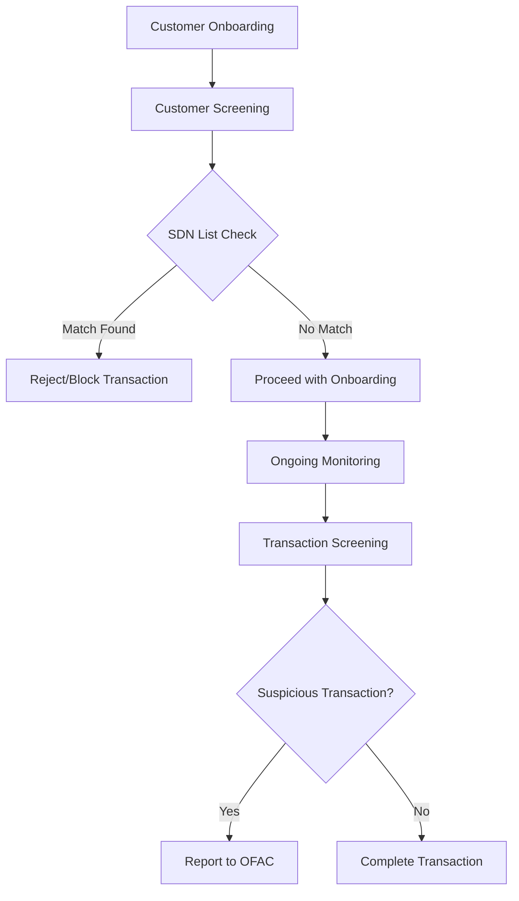

## 22.4 Office of Foreign Assets Control (OFAC)

The Office of Foreign Assets Control (OFAC) is a pivotal entity within the U.S. Department of the Treasury, responsible for enforcing economic and trade sanctions based on U.S. foreign policy and national security goals. These sanctions are directed against targeted foreign countries and regimes, terrorists, international narcotics traffickers, those engaged in activities related to the proliferation of weapons of mass destruction, and other threats to the national security, foreign policy, or economy of the United States.

### Understanding OFAC's Role

#### 1. **Enforcement of Economic and Trade Sanctions**

OFAC administers and enforces economic and trade sanctions against specific countries and individuals. These sanctions can include comprehensive embargoes, such as those against North Korea and Iran, as well as more targeted measures against individuals and entities, such as those involved in terrorism or narcotics trafficking.

- **Sanctions Programs**: OFAC's sanctions programs are designed to achieve foreign policy and national security goals. These programs can prohibit a wide range of financial transactions and trade activities with sanctioned entities.
  
- **Specially Designated Nationals (SDN) List**: OFAC maintains a list of individuals and companies owned or controlled by, or acting for or on behalf of, targeted countries. It also lists individuals, groups, and entities, such as terrorists and narcotics traffickers designated under programs that are not country-specific. Collectively, such individuals and companies are called "Specially Designated Nationals" or "SDNs." Their assets are blocked, and U.S. persons are generally prohibited from dealing with them.

#### 2. **Legal Framework and Authority**

OFAC derives its authority from several U.S. laws, including the Trading with the Enemy Act, the International Emergency Economic Powers Act, and the Patriot Act. These laws empower OFAC to impose controls on transactions and freeze assets under U.S. jurisdiction.

- **International Emergency Economic Powers Act (IEEPA)**: This act grants the President the authority to regulate commerce after declaring a national emergency in response to any unusual and extraordinary threat to the U.S. that originates in whole or substantial part outside the United States.

- **Trading with the Enemy Act (TWEA)**: TWEA is a federal law that gives the President the power to oversee or restrict any and all trade between the United States and its enemies in times of war.

### Impact on Customer Onboarding and Transactions

#### 1. **Customer Due Diligence (CDD) and Screening**

Financial institutions, including securities firms, must incorporate OFAC compliance into their customer due diligence processes. This involves screening potential clients against the SDN list and other OFAC lists to ensure they are not engaging with sanctioned individuals or entities.

- **Customer Identification Program (CIP)**: As part of the CDD, firms must verify the identity of their customers. This includes collecting identifying information and verifying it through documentation or other means.

- **Ongoing Monitoring**: After onboarding, firms must continuously monitor transactions and customer relationships to detect any changes that might affect their OFAC compliance status.

#### 2. **Transaction Monitoring and Reporting**

Transaction monitoring is a critical component of OFAC compliance. Firms must have systems in place to detect and report transactions that may involve sanctioned parties or countries.

- **Automated Screening Systems**: Many firms use automated systems to screen transactions against OFAC lists. These systems can flag suspicious transactions for further review.

- **Reporting Requirements**: If a firm identifies a transaction that involves a sanctioned party, it must report this to OFAC. This is typically done through a "blocking report" or a "reject report," depending on the nature of the transaction.

#### 3. **Compliance Challenges and Best Practices**

Compliance with OFAC regulations presents several challenges, including the need to stay updated with frequently changing sanctions lists and the complexity of global transactions.

- **Regular Updates**: Firms must regularly update their systems and processes to reflect changes in OFAC's sanctions lists and policies.

- **Training and Awareness**: Regular training for employees is essential to ensure they understand OFAC requirements and can recognize potential red flags in transactions.

- **Documentation and Recordkeeping**: Maintaining detailed records of compliance efforts, including customer screenings and transaction reviews, is crucial for demonstrating compliance in the event of an audit.

### Real-World Applications and Case Studies

#### 1. **Case Study: Financial Institution Penalties**

In recent years, several financial institutions have faced significant penalties for OFAC violations. For instance, a major international bank was fined over $1 billion for processing transactions for sanctioned entities. This case underscores the importance of robust compliance programs and the risks of non-compliance.

- **Lessons Learned**: The case highlights the need for comprehensive screening processes, effective internal controls, and a culture of compliance within financial institutions.

#### 2. **Scenario: Securities Firm Compliance**

Consider a securities firm that is onboarding a new client. The firm must screen the client against the SDN list and other OFAC lists as part of its due diligence. If the client is flagged, the firm must take appropriate action, which could include rejecting the client or seeking further clarification.

- **Practical Steps**: The firm should have clear procedures for handling potential matches, including escalation protocols and communication with OFAC if necessary.

### Diagrams and Visual Aids

Below is a diagram illustrating the process of OFAC compliance for financial institutions:

### Summary and Key Takeaways

- **OFAC's Role**: OFAC plays a critical role in enforcing U.S. economic and trade sanctions, impacting how financial institutions conduct business globally.
  
- **Compliance Importance**: Adhering to OFAC regulations is essential for securities firms to avoid legal penalties and maintain their reputation.

- **Best Practices**: Regular updates, employee training, and robust screening processes are vital components of an effective OFAC compliance program.

- **Real-World Relevance**: Understanding OFAC compliance is not only crucial for passing the Series 7 exam but also for succeeding in the securities industry.

### References and Additional Resources

- **OFAC Official Website**: [U.S. Department of the Treasury - OFAC](https://home.treasury.gov/policy-issues/office-of-foreign-assets-control-sanctions-programs-and-information)
- **U.S. Code Title 50 - War and National Defense**: Legal framework for OFAC's authority.
- **Financial Crimes Enforcement Network (FinCEN)**: [FinCEN Website](https://www.fincen.gov/) for additional AML resources.
- **Securities Industry and Financial Markets Association (SIFMA)**: Offers resources and guidance on compliance best practices.

## Series 7 Exam Practice Questions: Office of Foreign Assets Control (OFAC)



### What is the primary role of the Office of Foreign Assets Control (OFAC)?

- [x] To enforce economic and trade sanctions based on U.S. foreign policy and national security goals
- [ ] To regulate the issuance of new securities
- [ ] To oversee the Federal Reserve's monetary policy
- [ ] To manage the U.S. national debt

> **Explanation:** OFAC is responsible for enforcing economic and trade sanctions to support U.S. foreign policy and national security objectives.

### Which list maintained by OFAC identifies individuals and entities with whom U.S. persons are generally prohibited from dealing?

- [ ] The Federal Reserve List
- [ ] The Securities Watchlist
- [x] The Specially Designated Nationals (SDN) List
- [ ] The National Security List

> **Explanation:** The SDN List includes individuals and entities with whom U.S. persons are generally prohibited from conducting business.

### What is a key component of a financial institution's compliance program related to OFAC regulations?

- [ ] Issuing new securities
- [x] Screening customers against the SDN List
- [ ] Managing interest rates
- [ ] Setting fiscal policy

> **Explanation:** Screening customers against the SDN List is a critical component of compliance with OFAC regulations.

### What action must a financial institution take if it identifies a transaction involving a sanctioned party?

- [ ] Approve the transaction
- [ ] Ignore the transaction
- [x] Report the transaction to OFAC
- [ ] Reverse the transaction

> **Explanation:** Transactions involving sanctioned parties must be reported to OFAC, typically through a blocking or reject report.

### Which act grants the President the authority to regulate commerce in response to national emergencies?

- [ ] The Securities Act of 1933
- [x] The International Emergency Economic Powers Act (IEEPA)
- [ ] The Investment Company Act of 1940
- [ ] The Federal Reserve Act

> **Explanation:** The IEEPA grants the President the authority to regulate commerce in response to national emergencies.

### What is a common challenge for firms in maintaining OFAC compliance?

- [ ] Increasing interest rates
- [ ] Developing new financial products
- [x] Staying updated with frequently changing sanctions lists
- [ ] Managing employee benefits

> **Explanation:** Firms must stay updated with frequently changing sanctions lists to maintain OFAC compliance.

### What is the purpose of the Customer Identification Program (CIP) in OFAC compliance?

- [ ] To increase sales revenue
- [x] To verify the identity of customers
- [ ] To manage stock portfolios
- [ ] To calculate tax liabilities

> **Explanation:** The CIP is used to verify the identity of customers as part of OFAC compliance efforts.

### Which entity within the U.S. Department of the Treasury is responsible for administering and enforcing economic and trade sanctions?

- [ ] The Federal Reserve
- [x] The Office of Foreign Assets Control (OFAC)
- [ ] The Securities and Exchange Commission (SEC)
- [ ] The Internal Revenue Service (IRS)

> **Explanation:** OFAC is the entity responsible for administering and enforcing economic and trade sanctions.

### What is a blocking report in the context of OFAC compliance?

- [ ] A report detailing stock market performance
- [x] A report submitted to OFAC when a transaction involves a sanctioned party
- [ ] A report summarizing fiscal policy changes
- [ ] A report on interest rate adjustments

> **Explanation:** A blocking report is submitted to OFAC when a transaction involves a sanctioned party.

### How can firms ensure effective OFAC compliance?

- [ ] By focusing solely on domestic transactions
- [x] By implementing robust screening processes and employee training
- [ ] By reducing customer due diligence
- [ ] By ignoring international regulations

> **Explanation:** Effective OFAC compliance requires robust screening processes and regular employee training.



---
