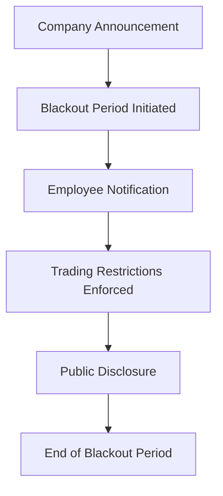

## 23.2.2 Trading Restrictions

In the fast-paced world of securities trading, maintaining the integrity of the markets and ensuring compliance with regulatory standards is crucial. Trading restrictions are a key component of this framework, designed to prevent conflicts of interest, insider trading, and other unethical practices. This section delves into the various aspects of trading restrictions, including blackout periods, the necessity of pre-clearing trades, and the consequences of violating these restrictions. Additionally, we will explore best practices for employees to follow when trading personal accounts, ensuring they remain compliant with industry regulations.

### Understanding Blackout Periods

Blackout periods are specific times during which employees of a company are prohibited from trading the company's securities or related financial instruments. These periods are typically instituted around significant corporate events that could impact the company's stock price, such as earnings announcements, mergers, acquisitions, or other major disclosures.

#### What are Blackout Periods?

Blackout periods are designed to prevent insider trading by ensuring that employees do not take advantage of nonpublic information. During these times, employees are restricted from buying or selling the company's stock to avoid any appearance of impropriety or unfair advantage. 

**Example Scenario:**
Consider a publicly traded company preparing to announce its quarterly earnings. In the weeks leading up to the announcement, the company imposes a blackout period. This restriction applies to all employees who might have access to the financial results before they are made public. By doing so, the company mitigates the risk of insider trading and ensures that all investors have equal access to the information once it is publicly disclosed.

#### Regulatory Framework

The Securities and Exchange Commission (SEC) and the Financial Industry Regulatory Authority (FINRA) provide guidelines for implementing blackout periods. Companies are encouraged to establish clear policies and communicate these to all employees to ensure compliance.

**Mermaid Diagram: Blackout Period Process**

### Pre-Clearing Trades with Compliance

Pre-clearing trades is a critical compliance procedure that helps mitigate the risk of insider trading and conflicts of interest. This process involves obtaining approval from the compliance department before executing a trade in personal accounts.

#### Why Pre-Clear Trades?

Pre-clearing trades ensures that employees do not inadvertently engage in transactions that could be perceived as unethical or illegal. It provides an additional layer of oversight and helps maintain the integrity of the securities markets.

**Steps to Pre-Clear a Trade:**

1. **Submit a Trade Request:** Employees must submit a request to the compliance department detailing the security they wish to trade, the quantity, and the intended transaction date.
2. **Compliance Review:** The compliance team reviews the request to ensure it does not conflict with any blackout periods, insider information, or other restrictions.
3. **Approval or Denial:** The trade is either approved or denied based on the compliance review. Employees must wait for approval before proceeding with the trade.
4. **Record Keeping:** All pre-clearance requests and decisions are documented for future reference and regulatory audits.

**Example Scenario:**
An employee of a financial services firm wants to sell shares of a company they cover in their research. Before executing the trade, they submit a pre-clearance request to the compliance department. The compliance team checks for any conflicts, such as recent research reports or upcoming earnings announcements, before granting approval.

### Consequences of Violating Trading Restrictions

Violating trading restrictions can have severe consequences for both the individual and the organization. These violations can undermine the integrity of the markets and lead to significant legal and financial repercussions.

#### Potential Consequences

1. **Termination of Employment:** Employees found violating trading restrictions may face immediate termination, as such actions breach company policies and ethical standards.
2. **Regulatory Penalties:** Regulatory bodies like the SEC and FINRA can impose fines, sanctions, and other penalties on individuals and firms that violate trading laws.
3. **Legal Action:** Violators may face legal action, including civil lawsuits and criminal charges, depending on the severity of the infraction.
4. **Reputational Damage:** Organizations involved in trading violations can suffer significant reputational damage, affecting client trust and business relationships.

**Case Study:**
In a high-profile case, a senior executive at a major corporation was found guilty of insider trading after violating blackout period restrictions. The executive was terminated, faced substantial fines, and was banned from serving as an officer or director of any public company.

### Best Practices for Employees Trading Personal Accounts

To ensure compliance with trading restrictions and maintain ethical standards, employees should adhere to best practices when managing their personal trading accounts.

#### Key Best Practices

1. **Stay Informed:** Regularly review company policies on trading restrictions and blackout periods. Ensure you are aware of any updates or changes.
2. **Maintain Transparency:** Communicate openly with the compliance department regarding your trading activities. Transparency is key to avoiding potential conflicts of interest.
3. **Document Everything:** Keep detailed records of all trades, including pre-clearance requests and approvals. This documentation can be invaluable in case of audits or inquiries.
4. **Avoid Speculative Trading:** Refrain from engaging in speculative trading or high-risk transactions that could raise compliance concerns.
5. **Use Discretion:** Exercise discretion and judgment in trading decisions, especially during sensitive periods or when in possession of nonpublic information.

**Practical Example:**
An employee who regularly trades stocks maintains a detailed trading journal, documenting each transaction, the rationale behind it, and the pre-clearance approval. This practice not only helps in compliance but also aids in personal investment analysis.

### Conclusion

Trading restrictions are an essential component of maintaining ethical standards and regulatory compliance in the securities industry. By understanding the importance of blackout periods, the necessity of pre-clearing trades, and the consequences of violations, employees can navigate their personal trading activities with confidence and integrity. Adhering to best practices and maintaining open communication with compliance departments ensures that employees contribute to a fair and transparent market environment.

---

## Series 7 Exam Practice Questions: Trading Restrictions



### What is the primary purpose of blackout periods in trading?

- [x] To prevent insider trading by restricting trades during sensitive times
- [ ] To allow employees to trade freely without restrictions
- [ ] To increase market volatility
- [ ] To encourage speculative trading

> **Explanation:** Blackout periods are designed to prevent insider trading by restricting employees from trading based on nonpublic information during sensitive times, such as before earnings announcements.

### Which department should employees contact to pre-clear trades?

- [ ] Human Resources
- [ ] Marketing
- [x] Compliance
- [ ] Sales

> **Explanation:** Employees must contact the compliance department to pre-clear trades to ensure they do not violate trading restrictions or blackout periods.

### What could be a consequence of violating trading restrictions?

- [ ] A promotion
- [ ] Increased trading limits
- [x] Termination of employment
- [ ] Access to insider information

> **Explanation:** Violating trading restrictions can lead to termination of employment, as it breaches company policies and ethical standards.

### What is a key step in the pre-clearance process?

- [ ] Ignoring compliance department requests
- [ ] Trading without approval
- [x] Submitting a trade request for review
- [ ] Trading during blackout periods

> **Explanation:** A key step in the pre-clearance process is submitting a trade request to the compliance department for review before executing the trade.

### Which of the following is a best practice for employees trading personal accounts?

- [x] Maintaining transparency with the compliance department
- [ ] Engaging in speculative trading
- [ ] Ignoring company policies
- [ ] Trading based on rumors

> **Explanation:** Maintaining transparency with the compliance department is a best practice to ensure compliance and avoid conflicts of interest.

### What should employees do during blackout periods?

- [ ] Trade based on insider information
- [x] Refrain from trading the company's securities
- [ ] Increase their trading activities
- [ ] Ignore compliance guidelines

> **Explanation:** During blackout periods, employees should refrain from trading the company's securities to prevent insider trading violations.

### What is a potential regulatory consequence of violating trading restrictions?

- [ ] Receiving a bonus
- [ ] Gaining insider status
- [x] Facing fines and sanctions
- [ ] Being promoted

> **Explanation:** Violating trading restrictions can result in regulatory fines and sanctions imposed by bodies like the SEC and FINRA.

### How can employees ensure they follow trading restrictions?

- [ ] By ignoring compliance department communications
- [x] By staying informed about company policies
- [ ] By trading during blackout periods
- [ ] By avoiding pre-clearance requests

> **Explanation:** Employees can ensure they follow trading restrictions by staying informed about company policies and adhering to compliance guidelines.

### What is the role of the compliance department in trading restrictions?

- [ ] To promote speculative trading
- [ ] To ignore blackout periods
- [x] To review and approve trade requests
- [ ] To encourage insider trading

> **Explanation:** The compliance department reviews and approves trade requests to ensure they comply with trading restrictions and blackout periods.

### Why is it important to document trades and pre-clearance approvals?

- [ ] To ignore compliance audits
- [x] To provide evidence of compliance during audits
- [ ] To increase trading frequency
- [ ] To avoid transparency

> **Explanation:** Documenting trades and pre-clearance approvals provides evidence of compliance during audits and helps maintain transparency with regulatory bodies.


