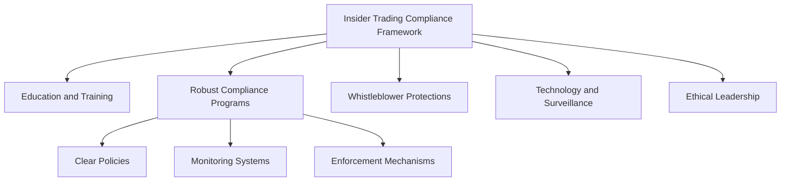

## 23.2 Personal Trading and Insider Information

In the world of securities trading, maintaining ethical standards and compliance with regulations is paramount. Personal trading and insider information are two critical areas where securities professionals must exercise caution to avoid conflicts of interest and legal violations. This section will delve into the intricacies of personal trading restrictions, the significance of avoiding trading on material nonpublic information, and strategies for maintaining ethical trading practices.

### Understanding Personal Trading Restrictions

Personal trading refers to the buying and selling of securities by individuals for their own accounts. While personal trading is a legitimate activity, it becomes problematic when it conflicts with professional responsibilities or involves insider information. Regulatory bodies like the Financial Industry Regulatory Authority (FINRA) and the Securities and Exchange Commission (SEC) impose strict rules to prevent such conflicts and ensure market integrity.

#### Key Restrictions on Personal Trading

1. **Pre-Clearance Procedures**: Many firms require employees to obtain approval before executing personal trades. This pre-clearance process helps ensure that trades do not conflict with the firm's interests or involve insider information.

2. **Restricted Lists**: Firms often maintain lists of securities that employees are prohibited from trading. These lists are typically based on the firm's involvement in transactions or possession of material nonpublic information.

3. **Holding Period Requirements**: To discourage speculative trading, some firms impose minimum holding periods for securities purchased by employees. This requirement helps align employees' interests with long-term investment strategies.

4. **Reporting Obligations**: Employees are generally required to report their personal trading activities to their employers. This reporting ensures transparency and allows firms to monitor compliance with trading policies.

5. **Blackout Periods**: During certain times, such as before earnings announcements or significant corporate events, firms may impose blackout periods during which employees cannot trade specific securities.

#### Case Study: A Cautionary Tale

Consider the case of a financial analyst at a major investment bank who traded shares of a company shortly before a merger announcement. The analyst had access to insider information about the merger, and their trades were flagged during a routine compliance review. The result was a significant legal battle, fines, and damage to the analyst's career. This case underscores the importance of adhering to personal trading restrictions and avoiding even the appearance of impropriety.

### Insider Information: Definition and Implications

**Insider Information** is defined as confidential information about a company that is not available to the public and could influence an investor's decision to buy or sell securities. Trading on insider information is illegal and undermines market fairness and investor confidence.

#### The Importance of Avoiding Insider Trading

1. **Legal Consequences**: Insider trading is a serious offense with severe penalties, including fines and imprisonment. The SEC actively monitors trading activities and prosecutes individuals and firms involved in insider trading.

2. **Ethical Considerations**: Trading on insider information is unethical and violates the trust placed in securities professionals. It can damage reputations and erode public confidence in the financial markets.

3. **Market Integrity**: Insider trading disrupts the level playing field that is essential for fair and efficient markets. It gives an unfair advantage to those with access to nonpublic information, disadvantaging ordinary investors.

#### Real-World Application: The Martha Stewart Case

A well-known example of insider trading involves Martha Stewart, who sold shares of ImClone Systems based on nonpublic information about an impending FDA decision. Although Stewart's case was complex, it highlighted the legal and reputational risks associated with insider trading. The case served as a reminder of the importance of adhering to ethical standards and regulatory requirements.

### Compliance Strategies for Ethical Trading Practices

Maintaining ethical trading practices requires a proactive approach to compliance and a commitment to upholding the highest standards of integrity. Here are some strategies to help securities professionals navigate personal trading and insider information issues:

1. **Education and Training**: Regular training sessions on compliance and ethics can reinforce the importance of adhering to trading restrictions and avoiding insider information. Employees should be well-versed in the firm's policies and relevant regulations.

2. **Robust Compliance Programs**: Firms should implement comprehensive compliance programs that include clear policies, monitoring systems, and enforcement mechanisms. These programs should be regularly reviewed and updated to address emerging risks.

3. **Whistleblower Protections**: Encouraging employees to report suspicious activities without fear of retaliation is crucial for identifying and addressing potential violations. Whistleblower protections can help foster a culture of transparency and accountability.

4. **Technology and Surveillance**: Leveraging technology to monitor trading activities and detect unusual patterns can enhance compliance efforts. Advanced analytics and surveillance tools can identify potential insider trading and conflicts of interest.

5. **Ethical Leadership**: Leadership plays a vital role in setting the tone for ethical behavior. Executives and managers should model ethical conduct and emphasize the importance of compliance in all aspects of the business.

### Diagram: Insider Trading Compliance Framework

Below is a visual representation of a typical insider trading compliance framework, illustrating the key components and processes involved in maintaining ethical trading practices.

### Best Practices and Common Pitfalls

#### Best Practices

- **Regularly Update Policies**: Ensure that trading policies are current and reflect the latest regulatory requirements and market conditions.
- **Encourage Open Communication**: Foster an environment where employees feel comfortable discussing compliance concerns and seeking guidance.
- **Conduct Regular Audits**: Periodic audits of trading activities can help identify potential issues and reinforce compliance.

#### Common Pitfalls

- **Ignoring Red Flags**: Failing to investigate suspicious trading activities can lead to significant legal and reputational consequences.
- **Inadequate Training**: Insufficient training on compliance and ethics can result in unintentional violations and a lack of awareness among employees.
- **Over-Reliance on Technology**: While technology is a valuable tool, it should complement, not replace, human oversight and judgment.

### Exam Strategies and Tips

When preparing for the Series 7 Exam, focus on understanding the regulatory framework governing personal trading and insider information. Here are some tips to help you succeed:

- **Familiarize Yourself with Key Regulations**: Study the Securities Exchange Act of 1934, particularly sections related to insider trading and market manipulation.
- **Practice Compliance Scenarios**: Work through hypothetical scenarios to apply your knowledge of trading restrictions and ethical considerations.
- **Review Case Studies**: Analyze real-world cases of insider trading to understand the legal and ethical implications.

### Summary

Personal trading and insider information are critical areas of focus for securities professionals. By adhering to regulatory requirements, maintaining ethical standards, and implementing robust compliance strategies, you can navigate these challenges effectively. Remember, the key to success lies in understanding the rules, staying informed, and acting with integrity.

## Series 7 Exam Practice Questions: Personal Trading and Insider Information



### What is the primary purpose of pre-clearance procedures for personal trading?

- [x] To prevent conflicts of interest and ensure compliance with trading policies
- [ ] To increase trading volume and liquidity
- [ ] To encourage speculative trading among employees
- [ ] To promote insider trading for profit

> **Explanation:** Pre-clearance procedures are designed to prevent conflicts of interest and ensure compliance with trading policies by requiring employees to obtain approval before executing personal trades.

### Which of the following is considered insider information?

- [x] Nonpublic information about a company's upcoming merger
- [ ] Publicly available stock price data
- [ ] Analyst predictions based on public information
- [ ] Historical financial statements

> **Explanation:** Insider information refers to nonpublic information that could influence an investor's decision, such as details about an upcoming merger.

### What is a common consequence of engaging in insider trading?

- [x] Legal penalties, including fines and imprisonment
- [ ] Increased market share
- [ ] Enhanced reputation in the industry
- [ ] Guaranteed profits from trades

> **Explanation:** Engaging in insider trading can lead to severe legal penalties, including fines and imprisonment, as it violates securities laws.

### Why are blackout periods implemented by firms?

- [x] To prevent trading during sensitive times, such as before earnings announcements
- [ ] To encourage employees to trade more frequently
- [ ] To reduce market volatility
- [ ] To increase firm profits

> **Explanation:** Blackout periods are implemented to prevent trading during sensitive times, such as before earnings announcements, to avoid conflicts of interest and insider trading.

### How can firms encourage ethical trading practices among employees?

- [x] By providing regular training and clear compliance guidelines
- [ ] By allowing unrestricted access to insider information
- [ ] By promoting speculative trading strategies
- [ ] By ignoring suspicious trading activities

> **Explanation:** Firms can encourage ethical trading practices by providing regular training and clear compliance guidelines to ensure employees understand and adhere to trading restrictions.

### What role does technology play in compliance efforts?

- [x] It helps monitor trading activities and detect unusual patterns
- [ ] It replaces the need for human oversight
- [ ] It encourages insider trading by providing access to nonpublic information
- [ ] It reduces the need for compliance training

> **Explanation:** Technology plays a crucial role in compliance efforts by helping monitor trading activities and detect unusual patterns, complementing human oversight.

### Which of the following is a best practice for maintaining ethical trading practices?

- [x] Regularly updating trading policies to reflect current regulations
- [ ] Encouraging employees to ignore compliance concerns
- [ ] Conducting audits only when issues arise
- [ ] Relying solely on technology for compliance

> **Explanation:** Regularly updating trading policies to reflect current regulations is a best practice for maintaining ethical trading practices and ensuring compliance.

### What is a potential pitfall in compliance efforts?

- [x] Ignoring red flags and failing to investigate suspicious activities
- [ ] Conducting regular audits of trading activities
- [ ] Providing comprehensive compliance training
- [ ] Encouraging open communication about compliance concerns

> **Explanation:** Ignoring red flags and failing to investigate suspicious activities can lead to significant legal and reputational consequences, making it a potential pitfall in compliance efforts.

### How can whistleblower protections benefit a firm?

- [x] By encouraging employees to report suspicious activities without fear of retaliation
- [ ] By promoting insider trading for profit
- [ ] By reducing the need for compliance programs
- [ ] By discouraging transparency and accountability

> **Explanation:** Whistleblower protections benefit a firm by encouraging employees to report suspicious activities without fear of retaliation, fostering a culture of transparency and accountability.

### What is the significance of ethical leadership in compliance efforts?

- [x] It sets the tone for ethical behavior and emphasizes the importance of compliance
- [ ] It allows for relaxed enforcement of trading policies
- [ ] It promotes speculative trading strategies
- [ ] It reduces the need for compliance training

> **Explanation:** Ethical leadership is significant in compliance efforts as it sets the tone for ethical behavior and emphasizes the importance of compliance in all aspects of the business.



By understanding and adhering to the principles outlined in this section, you will be better prepared to navigate the complexities of personal trading and insider information, ensuring compliance and ethical conduct in your securities career.
