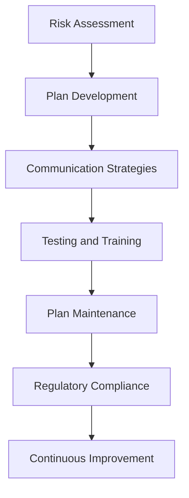

## 24.1.2 SEC Guidelines for Business Continuity Planning

Business Continuity Planning (BCP) is a critical component of risk management for financial institutions, including those in the securities industry. The Securities and Exchange Commission (SEC) has set forth guidelines to ensure that firms maintain robust BCPs to protect investors and maintain market integrity. This section will provide an in-depth exploration of the SEC's expectations, the importance of aligning BCPs with regulatory guidelines, and practical examples of SEC recommendations for BCP content.

### Understanding the SEC's Expectations

The SEC expects firms to develop and maintain comprehensive BCPs that address the continuity of critical business operations in the face of disruptions. These disruptions can range from natural disasters to cyber-attacks, and the BCP should be designed to minimize the impact on the firm’s operations and its clients. The SEC's guidelines emphasize the following key areas:

1. **Risk Assessment and Business Impact Analysis**: Firms must conduct thorough risk assessments to identify potential threats and vulnerabilities. A business impact analysis should determine the criticality of various business functions and the potential impact of disruptions.

2. **Plan Development and Documentation**: BCPs should be well-documented, outlining procedures for maintaining operations during a disruption. This includes identifying essential personnel, resources, and processes.

3. **Communication Strategies**: Effective communication is crucial during a disruption. The BCP should include strategies for communicating with employees, clients, regulators, and other stakeholders.

4. **Testing and Training**: Regular testing of the BCP is necessary to ensure its effectiveness. Employees should be trained on their roles and responsibilities within the plan.

5. **Plan Maintenance and Updates**: BCPs should be dynamic documents that are regularly reviewed and updated to reflect changes in the business environment, technology, and regulatory requirements.

### Aligning BCP with Broader Regulatory Guidelines

Aligning the BCP with broader regulatory guidelines ensures that the plan is comprehensive and compliant. The SEC's guidelines are often aligned with those of other regulatory bodies, such as the Financial Industry Regulatory Authority (FINRA) and the Federal Financial Institutions Examination Council (FFIEC). Key considerations include:

- **Regulatory Compliance**: Ensuring that the BCP meets the requirements set by the SEC and other relevant regulators. This includes adhering to specific rules and regulations related to business continuity and disaster recovery.

- **Interagency Coordination**: Collaborating with other regulatory bodies and industry groups to ensure a coordinated response to disruptions. This can involve sharing best practices and participating in industry-wide exercises.

- **Global Considerations**: For firms operating internationally, the BCP should consider global regulatory requirements and the potential impact of disruptions in different regions.

### Examples of SEC Recommendations for BCP Content

The SEC provides specific recommendations for what should be included in a BCP. These recommendations serve as a framework for firms to develop their plans:

- **Critical Business Functions**: Identify and prioritize critical business functions that must be maintained during a disruption. This includes trading, clearing, and settlement processes.

- **Data Backup and Recovery**: Implement robust data backup and recovery procedures to protect critical information. This includes ensuring data integrity and availability.

- **Alternative Communication Channels**: Establish alternative communication channels to ensure that stakeholders can be reached during a disruption. This may involve using different technologies or platforms.

- **Third-Party Dependencies**: Assess and manage dependencies on third-party service providers. This includes ensuring that these providers have their own BCPs in place.

- **Physical and Cybersecurity Measures**: Implement physical and cybersecurity measures to protect assets and information. This includes securing facilities and networks against unauthorized access.

### Practical Examples and Case Studies

To illustrate the application of SEC guidelines, consider the following practical examples and case studies:

#### Example 1: Cybersecurity Incident

A mid-sized brokerage firm experiences a cybersecurity breach that disrupts its trading platform. The firm's BCP includes a detailed cybersecurity response plan, which is immediately activated. Key actions include:

- **Isolating Affected Systems**: The firm isolates affected systems to prevent further damage and begins an investigation to determine the breach's scope.

- **Communicating with Stakeholders**: The firm uses pre-established communication channels to inform employees, clients, and regulators about the breach and the steps being taken to resolve it.

- **Activating Backup Systems**: The firm activates backup systems to restore trading operations and minimize downtime.

- **Reviewing and Updating the BCP**: After resolving the incident, the firm reviews and updates its BCP to address any identified weaknesses and improve future response efforts.

#### Example 2: Natural Disaster

A large investment bank is located in an area prone to hurricanes. The firm's BCP includes specific procedures for dealing with natural disasters, such as:

- **Relocating Critical Operations**: The firm relocates critical operations to an alternate site outside the affected area, ensuring continuity of essential functions.

- **Providing Remote Work Capabilities**: Employees are equipped with remote work capabilities, allowing them to continue their duties from safe locations.

- **Coordinating with Local Authorities**: The firm coordinates with local authorities to ensure the safety of its employees and facilities.

- **Conducting Post-Event Analysis**: After the disaster, the firm conducts a post-event analysis to evaluate the effectiveness of its BCP and make necessary improvements.

### Real-World Applications and Compliance Considerations

Implementing a robust BCP in line with SEC guidelines offers several benefits, including enhanced resilience, improved stakeholder confidence, and reduced regulatory risk. Key compliance considerations include:

- **Documentation and Recordkeeping**: Maintain comprehensive documentation of the BCP, including all updates and testing results. This documentation should be readily available for regulatory review.

- **Regular Audits and Assessments**: Conduct regular audits and assessments of the BCP to ensure its effectiveness and compliance with regulatory requirements.

- **Stakeholder Engagement**: Engage with stakeholders, including employees, clients, and regulators, to ensure that the BCP meets their needs and expectations.

- **Continuous Improvement**: Foster a culture of continuous improvement, where lessons learned from disruptions are used to enhance the BCP.

### Diagrams and Visuals

To enhance understanding, consider the following diagram illustrating the key components of a BCP as recommended by the SEC:

### Best Practices, Common Pitfalls, and Strategies

- **Best Practices**: Regularly test and update the BCP, engage stakeholders in the planning process, and ensure alignment with regulatory requirements.

- **Common Pitfalls**: Failing to update the BCP regularly, neglecting to test the plan, and overlooking third-party dependencies.

- **Strategies to Overcome Challenges**: Establish a dedicated BCP team, leverage technology for testing and communication, and conduct regular training sessions for employees.

### Summary and Key Points

- The SEC's guidelines for BCP emphasize the importance of comprehensive planning, regular testing, and alignment with regulatory requirements.
- A robust BCP should address critical business functions, data backup, communication strategies, third-party dependencies, and security measures.
- Practical examples and case studies illustrate the application of SEC guidelines in real-world scenarios.
- Compliance with SEC guidelines enhances resilience, stakeholder confidence, and regulatory compliance.

---

## Series 7 Exam Practice Questions: SEC Guidelines



### What is the primary purpose of the SEC's guidelines for Business Continuity Planning?

- [x] To ensure firms can maintain critical operations during disruptions
- [ ] To increase the profitability of financial firms
- [ ] To provide a competitive advantage to larger firms
- [ ] To reduce the need for regulatory oversight

> **Explanation:** The SEC's guidelines aim to ensure that firms can maintain critical operations during disruptions, protecting investors and maintaining market integrity.

### Which of the following is NOT a key component of a Business Continuity Plan according to the SEC?

- [ ] Risk Assessment
- [ ] Communication Strategies
- [x] Marketing Strategies
- [ ] Plan Maintenance

> **Explanation:** Marketing strategies are not a component of a Business Continuity Plan. Key components include risk assessment, communication strategies, and plan maintenance.

### How often should a Business Continuity Plan be tested according to best practices?

- [ ] Once every five years
- [ ] Only after a disruption occurs
- [x] Regularly, at least annually
- [ ] Testing is not required

> **Explanation:** Best practices recommend that a Business Continuity Plan be tested regularly, at least annually, to ensure its effectiveness.

### What role do third-party dependencies play in a Business Continuity Plan?

- [x] They should be assessed and managed to ensure continuity
- [ ] They are not relevant to Business Continuity Planning
- [ ] They should be ignored to focus on internal processes
- [ ] They are automatically covered by the firm's BCP

> **Explanation:** Third-party dependencies should be assessed and managed to ensure that they do not disrupt the firm's operations during a crisis.

### Which of the following is a recommended strategy for maintaining communication during a disruption?

- [ ] Rely solely on email communications
- [ ] Use a single communication platform
- [x] Establish alternative communication channels
- [ ] Wait until normal operations resume to communicate

> **Explanation:** Establishing alternative communication channels ensures that stakeholders can be reached during a disruption, even if primary channels are unavailable.

### What is the importance of aligning a BCP with broader regulatory guidelines?

- [x] To ensure comprehensive coverage and compliance
- [ ] To reduce the cost of developing the BCP
- [ ] To simplify the BCP documentation
- [ ] To focus solely on internal processes

> **Explanation:** Aligning a BCP with broader regulatory guidelines ensures comprehensive coverage and compliance with all relevant regulations.

### In the event of a natural disaster, what is a key action a firm should take according to the SEC guidelines?

- [ ] Suspend all operations indefinitely
- [ ] Focus on marketing new products
- [x] Relocate critical operations to an alternate site
- [ ] Wait for government assistance

> **Explanation:** Relocating critical operations to an alternate site ensures continuity of essential functions during a natural disaster.

### Why is regular training of employees on their roles in the BCP important?

- [ ] It is not necessary if the BCP is well-documented
- [ ] To increase employee satisfaction
- [x] To ensure effective execution of the BCP during a disruption
- [ ] To reduce training costs

> **Explanation:** Regular training ensures that employees understand their roles and can effectively execute the BCP during a disruption.

### What is a common pitfall in Business Continuity Planning?

- [ ] Overestimating the impact of disruptions
- [x] Failing to update the BCP regularly
- [ ] Conducting too many tests
- [ ] Having too many communication channels

> **Explanation:** A common pitfall is failing to update the BCP regularly, which can lead to outdated procedures and ineffective responses.

### How does the SEC recommend handling data backup and recovery in a BCP?

- [ ] Backup data only once a year
- [ ] Use outdated technology to save costs
- [x] Implement robust data backup and recovery procedures
- [ ] Rely on third-party providers without oversight

> **Explanation:** The SEC recommends implementing robust data backup and recovery procedures to protect critical information and ensure data integrity.



---

This comprehensive guide on SEC Guidelines for Business Continuity Planning provides the necessary insights and tools to ensure your firm is prepared for any disruptions, aligning with regulatory expectations and industry best practices.
