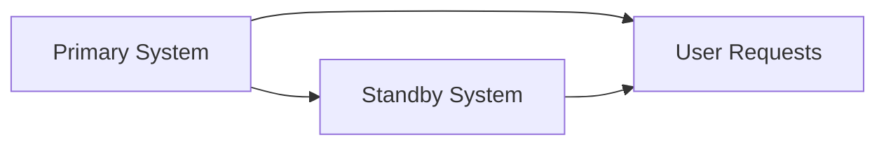
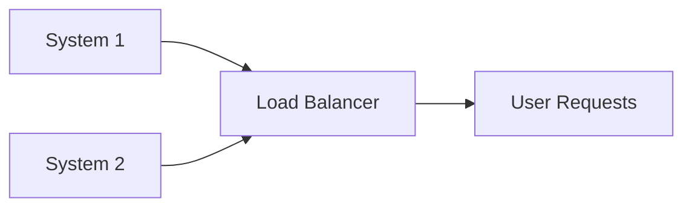
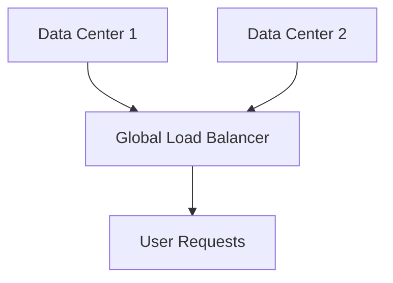

## 24.3.1 Systems Redundancy

In the fast-paced world of securities trading and financial services, system availability is paramount. Unexpected downtime can lead to significant financial losses, reputational damage, and regulatory penalties. Thus, **systems redundancy** is a critical component of business continuity planning, ensuring that operations can continue seamlessly even in the event of a system failure. This section delves into the importance of systems redundancy, the implementation of failover mechanisms, and provides illustrative diagrams of redundant system architectures.

### Understanding Systems Redundancy

Systems redundancy involves the duplication of critical components or functions of a system to increase reliability and availability. The primary goal of redundancy is to ensure that if one component fails, another can take over without disrupting the service. This concept is vital in the securities industry, where continuous access to data and trading platforms is essential.

#### Key Benefits of Systems Redundancy

1. **Minimized Downtime:** By having backup systems in place, organizations can significantly reduce the time it takes to recover from a failure.
2. **Increased Reliability:** Redundancy enhances the reliability of systems by providing alternative pathways for data and operations.
3. **Regulatory Compliance:** Many financial regulations require firms to have robust business continuity plans, including systems redundancy, to protect client data and ensure service continuity.
4. **Enhanced Customer Trust:** Clients are more likely to trust firms that can demonstrate resilience and reliability in their operations.

### Implementing Failover Mechanisms

Failover is a critical process in systems redundancy, where the functions of a failed system are automatically transferred to a standby system. This ensures that services remain uninterrupted. There are several strategies for implementing failover mechanisms:

#### Active-Passive Failover

In an active-passive failover setup, one system is actively handling the operations while another system is on standby, ready to take over in case of a failure. This setup is often used in database systems and web servers.

- **Advantages:** Simple to implement and cost-effective for many applications.
- **Disadvantages:** The standby system is idle most of the time, which can be seen as a waste of resources.

#### Active-Active Failover

Active-active failover involves multiple systems running simultaneously, sharing the load. If one system fails, the others continue to handle the operations without interruption.

- **Advantages:** Provides load balancing and maximizes resource utilization.
- **Disadvantages:** More complex to implement and requires more resources.

#### Geographic Redundancy

Geographic redundancy involves having systems located in different physical locations. This setup protects against regional disasters and ensures that services can continue even if one location is compromised.

- **Advantages:** Provides disaster recovery and enhances resilience.
- **Disadvantages:** Higher costs due to the need for multiple physical locations and more complex network management.

### Redundant System Architectures

To visualize how systems redundancy is implemented, let's explore some common architectures. These diagrams illustrate how different components work together to ensure continuous operation.

#### Diagram: Active-Passive Redundancy

In this architecture, the primary system handles all user requests. If it fails, the standby system takes over, ensuring that user requests are still processed.

#### Diagram: Active-Active Redundancy

Here, both systems handle user requests simultaneously through a load balancer. If one system fails, the other continues to process requests without interruption.

#### Diagram: Geographic Redundancy

In this setup, two data centers are located in different geographic regions. A global load balancer directs user requests to the available data center, ensuring service continuity even if one center is down.

### Best Practices for Systems Redundancy

Implementing systems redundancy requires careful planning and consideration of various factors. Here are some best practices to follow:

1. **Assess Critical Components:** Identify which systems and components are critical to your operations and prioritize them for redundancy.
2. **Regular Testing:** Conduct regular failover tests to ensure that redundancy mechanisms work as expected.
3. **Monitor Performance:** Use monitoring tools to track the performance of redundant systems and identify potential issues before they lead to failures.
4. **Update and Patch Systems:** Keep all systems updated with the latest patches to prevent vulnerabilities that could lead to failures.
5. **Document Procedures:** Maintain clear documentation of redundancy procedures and ensure that all relevant personnel are trained on them.

### Challenges and Considerations

While systems redundancy offers many benefits, it also presents challenges that need to be addressed:

- **Cost:** Implementing and maintaining redundant systems can be expensive, requiring investment in additional hardware, software, and infrastructure.
- **Complexity:** Managing redundant systems, especially in active-active and geographically redundant setups, can be complex and require specialized skills.
- **Latency:** In geographically redundant systems, latency can be an issue if data centers are located far apart, potentially affecting performance.

### Regulatory and Compliance Considerations

In the securities industry, regulatory bodies such as the SEC and FINRA mandate that firms have robust business continuity plans, including systems redundancy. Compliance with these regulations is crucial to avoid penalties and ensure the protection of client data.

- **FINRA Rule 4370:** This rule requires firms to establish and maintain a business continuity plan, which should include systems redundancy to minimize downtime and protect client interests.
- **SEC Guidelines:** The SEC provides guidelines on business continuity planning, emphasizing the importance of systems redundancy in maintaining operational resilience.

### Conclusion

Systems redundancy is a vital component of business continuity planning in the securities industry. By minimizing downtime and ensuring continuous operation, redundant systems help firms protect their interests and those of their clients. Implementing effective failover mechanisms and following best practices can enhance system reliability and compliance with regulatory requirements. As you prepare for the Series 7 Exam, understanding systems redundancy and its role in business continuity planning will be crucial to your success and future career in the securities industry.

## Series 7 Exam Practice Questions: Systems Redundancy



### What is the primary goal of systems redundancy?

- [x] To ensure continuous operation in case of a system failure
- [ ] To reduce the cost of system maintenance
- [ ] To increase the complexity of system architecture
- [ ] To eliminate the need for data backups

> **Explanation:** The primary goal of systems redundancy is to ensure continuous operation in case of a system failure by having backup systems in place.

### Which failover mechanism involves one system actively handling operations while another is on standby?

- [x] Active-Passive Failover
- [ ] Active-Active Failover
- [ ] Geographic Redundancy
- [ ] Load Balancing

> **Explanation:** In an active-passive failover setup, one system is actively handling operations while another is on standby, ready to take over if needed.

### What is a key advantage of active-active failover?

- [ ] Simplicity of implementation
- [x] Load balancing and resource utilization
- [ ] Lower cost compared to active-passive
- [ ] Reduced system complexity

> **Explanation:** Active-active failover provides load balancing and maximizes resource utilization by having multiple systems handle operations simultaneously.

### Which type of redundancy involves having systems located in different geographic locations?

- [ ] Active-Passive Redundancy
- [ ] Active-Active Redundancy
- [x] Geographic Redundancy
- [ ] Local Redundancy

> **Explanation:** Geographic redundancy involves having systems located in different physical locations to protect against regional disasters.

### What is a potential challenge of implementing geographic redundancy?

- [ ] Lower reliability
- [ ] Increased downtime
- [x] Higher costs and complexity
- [ ] Reduced regulatory compliance

> **Explanation:** Geographic redundancy can be costly and complex due to the need for multiple physical locations and more intricate network management.

### How does systems redundancy contribute to regulatory compliance?

- [ ] By reducing system costs
- [x] By ensuring continuous operation and protecting client data
- [ ] By simplifying system architecture
- [ ] By eliminating the need for failover mechanisms

> **Explanation:** Systems redundancy contributes to regulatory compliance by ensuring continuous operation and protecting client data, which are often required by regulations.

### What is the role of a load balancer in an active-active redundancy setup?

- [ ] To serve as a standby system
- [x] To distribute user requests across multiple systems
- [ ] To increase system downtime
- [ ] To eliminate the need for failover

> **Explanation:** In an active-active setup, a load balancer distributes user requests across multiple systems to ensure even load distribution and continuous operation.

### Which regulatory body requires firms to have a business continuity plan that includes systems redundancy?

- [x] FINRA
- [ ] IRS
- [ ] FTC
- [ ] OSHA

> **Explanation:** FINRA requires firms to establish and maintain a business continuity plan, which should include systems redundancy.

### What is a disadvantage of active-passive failover?

- [ ] Complexity of implementation
- [x] Idle standby system resources
- [ ] Increased system downtime
- [ ] Reduced reliability

> **Explanation:** A disadvantage of active-passive failover is that the standby system remains idle most of the time, which can be seen as a waste of resources.

### Why is regular testing important for systems redundancy?

- [ ] To increase system complexity
- [ ] To reduce regulatory compliance
- [x] To ensure redundancy mechanisms work as expected
- [ ] To eliminate the need for monitoring tools

> **Explanation:** Regular testing is important to ensure that redundancy mechanisms work as expected and can effectively handle failover when needed.



---
