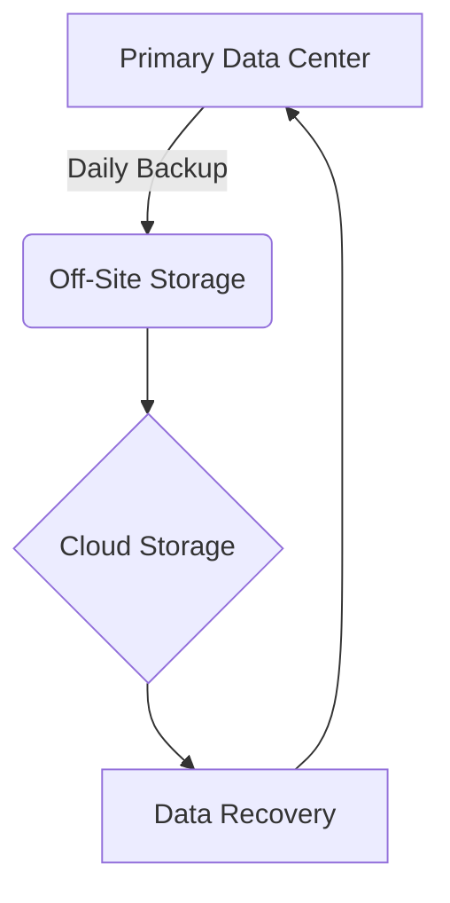

## 24.3 Data Backup and Recovery

In today's fast-paced financial world, data is a critical asset for any securities firm. Protecting this data from loss due to unforeseen events such as cyberattacks, hardware failures, or natural disasters is paramount. As a future General Securities Representative, understanding the importance of data backup and recovery will not only help you pass your Series 7 Exam but also prepare you for real-world challenges in the securities industry.

### The Importance of Protecting Critical Data

Data backup and recovery are vital components of a firm's business continuity plan. The loss of critical data can lead to significant financial losses, reputational damage, and regulatory penalties. Therefore, implementing robust data protection strategies is essential for maintaining operational integrity and client trust.

#### Key Reasons for Data Protection

1. **Regulatory Compliance:** Financial firms must adhere to regulations such as the Securities Exchange Act of 1934 and FINRA rules, which mandate the safeguarding of client information and transaction records.
2. **Operational Continuity:** Access to accurate and up-to-date data is crucial for daily operations, decision-making, and customer service.
3. **Client Trust:** Clients expect their sensitive information to be protected. A data breach can severely damage a firm's reputation and client relationships.
4. **Financial Stability:** Data loss can result in direct financial losses from downtime and recovery efforts, as well as indirect costs such as lost business opportunities.

### Methods for Secure Data Backup

To ensure data is protected, firms should implement a comprehensive backup strategy that includes redundancy, off-site storage, and cloud solutions.

#### Redundancy

**Redundancy** refers to the duplication of critical components to increase reliability. In the context of data backup, this means having multiple copies of data stored in different locations to prevent loss due to a single point of failure.

- **On-Site Redundancy:** This involves maintaining multiple copies of data within the firm's premises. While it provides quick access for recovery, it is vulnerable to local disasters such as fires or floods.
- **Off-Site Redundancy:** Storing data copies in a different geographic location ensures that data is protected from local incidents. This can be achieved through physical media transport or electronic transfer.

#### Off-Site Storage

Off-site storage is a key component of a robust backup strategy. It involves storing data backups at a location separate from the primary data center. This can be done through:

- **Physical Media:** Backups are stored on tapes or external drives and transported to a secure off-site facility. This method is reliable but can be labor-intensive and slow to restore.
- **Remote Data Centers:** Data is transferred electronically to a remote data center. This provides faster recovery times compared to physical media.

#### Cloud Solutions

Cloud-based backup solutions offer scalable, cost-effective, and secure options for data protection. They provide several advantages:

- **Scalability:** Cloud storage can easily accommodate growing data volumes without the need for additional hardware.
- **Accessibility:** Data can be accessed from anywhere, facilitating quick recovery in case of a disaster.
- **Security:** Leading cloud providers offer advanced security features such as encryption, access controls, and regular security audits.

### Best Practices for Data Backup Schedules and Recovery Testing

Implementing a data backup strategy is not enough; it must be regularly tested and updated to ensure its effectiveness. Here are some best practices:

#### Backup Schedules

1. **Regular Backups:** Establish a schedule that aligns with the firm's operational needs. Critical data should be backed up daily, while less critical data can be backed up weekly or monthly.
2. **Incremental Backups:** Perform incremental backups to capture only the data that has changed since the last backup. This saves time and storage space.
3. **Automated Backups:** Use automated backup solutions to reduce the risk of human error and ensure consistency.

#### Recovery Testing

1. **Regular Testing:** Conduct regular recovery tests to ensure that backup data can be successfully restored. This helps identify any issues with the backup process or media.
2. **Comprehensive Testing:** Test the recovery of both individual files and entire systems to ensure all aspects of the backup strategy are effective.
3. **Documentation:** Maintain detailed documentation of backup and recovery procedures, including schedules, responsibilities, and test results.

### Real-World Applications and Regulatory Scenarios

Understanding data backup and recovery is not just about passing the Series 7 Exam; it's about being prepared for real-world scenarios. Here are some examples:

#### Case Study: Cyberattack on a Brokerage Firm

A brokerage firm experienced a ransomware attack that encrypted all its client data. Fortunately, the firm had a robust backup strategy in place, with daily off-site backups stored in the cloud. The firm was able to restore its data within hours, minimizing downtime and financial loss.

#### Regulatory Compliance Scenario

FINRA conducts an audit of a securities firm and requests evidence of data protection measures. The firm provides documentation of its backup schedules, recovery tests, and off-site storage arrangements, demonstrating compliance with regulatory requirements.

### Diagrams and Visuals

To enhance your understanding of data backup and recovery processes, consider the following diagram:

This diagram illustrates the flow of data from the primary data center to off-site storage and cloud storage, with the ability to recover data back to the primary data center.

### Conclusion

Data backup and recovery are critical components of a securities firm's business continuity plan. By understanding the importance of protecting critical data, implementing secure backup methods, and adhering to best practices, you will be well-prepared for both the Series 7 Exam and your future career in the securities industry. Remember, regular testing and documentation are key to ensuring the effectiveness of your data protection strategy.

---

## Series 7 Exam Practice Questions: Data Backup and Recovery



### What is the primary purpose of data backup in the securities industry?

- [x] To ensure operational continuity and protect against data loss
- [ ] To increase the speed of data processing
- [ ] To reduce the cost of data storage
- [ ] To comply with marketing regulations

> **Explanation:** Data backup ensures operational continuity by protecting against data loss, which is critical for maintaining client trust and regulatory compliance.

### Which of the following is a key benefit of using cloud-based backup solutions?

- [ ] Limited accessibility
- [ ] Increased hardware requirements
- [x] Scalability and accessibility
- [ ] Slow recovery times

> **Explanation:** Cloud-based solutions offer scalability and accessibility, allowing firms to easily manage growing data volumes and recover data from anywhere.

### What does redundancy in data backup refer to?

- [ ] Storing data in a single location
- [x] Duplication of critical components to increase reliability
- [ ] Reducing the number of backups
- [ ] Using outdated technology for backups

> **Explanation:** Redundancy involves duplicating critical components, such as data, to increase reliability and ensure data is not lost due to a single point of failure.

### How often should critical data be backed up according to best practices?

- [ ] Monthly
- [ ] Annually
- [x] Daily
- [ ] Every two weeks

> **Explanation:** Best practices recommend daily backups for critical data to ensure minimal data loss in case of an incident.

### What is the role of recovery testing in data backup strategies?

- [ ] To create more backup copies
- [x] To ensure that data can be successfully restored
- [ ] To reduce backup costs
- [ ] To increase data storage capacity

> **Explanation:** Recovery testing ensures that data can be successfully restored from backups, verifying the effectiveness of the backup strategy.

### Which type of backup captures only the data that has changed since the last backup?

- [ ] Full backup
- [x] Incremental backup
- [ ] Differential backup
- [ ] Redundant backup

> **Explanation:** Incremental backups capture only the data that has changed since the last backup, saving time and storage space.

### What is a potential risk of not conducting regular recovery tests?

- [ ] Increased storage costs
- [x] Inability to restore data when needed
- [ ] Faster data processing
- [ ] Improved data security

> **Explanation:** Without regular recovery tests, there is a risk that data cannot be restored when needed, potentially leading to operational disruptions.

### In a regulatory audit, what documentation might a firm need to provide regarding data backup?

- [ ] Marketing materials
- [ ] Client testimonials
- [x] Backup schedules and recovery test results
- [ ] Employee performance reviews

> **Explanation:** During a regulatory audit, a firm may need to provide documentation of backup schedules and recovery test results to demonstrate compliance with data protection regulations.

### Which method of off-site storage involves electronic transfer of data to a remote data center?

- [ ] Physical media transport
- [x] Remote data center transfer
- [ ] Local storage replication
- [ ] Manual data entry

> **Explanation:** Remote data center transfer involves electronically transferring data to a remote location, providing faster recovery times compared to physical media.

### What is a key advantage of automated backup solutions?

- [ ] Increased risk of human error
- [ ] Inconsistent backup schedules
- [x] Reduced risk of human error and consistent backups
- [ ] Higher operational costs

> **Explanation:** Automated backup solutions reduce the risk of human error and ensure consistent backup schedules, enhancing data protection.



---

By mastering the concepts of data backup and recovery, you will be better equipped to handle the challenges of the securities industry and excel in your Series 7 Exam. Remember to stay updated on the latest technologies and regulatory requirements to ensure the highest level of data protection.
