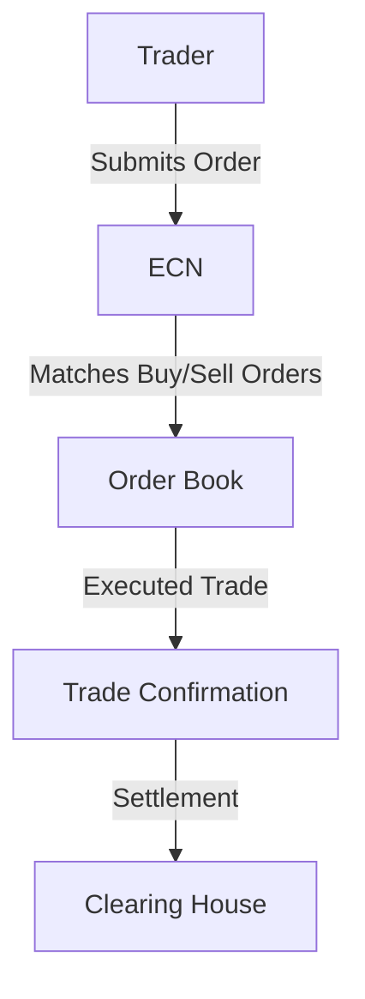

## 27.2.1 Electronic Communication Networks (ECNs)

Electronic Communication Networks (ECNs) are a pivotal component of the modern securities trading landscape. As a subset of Alternative Trading Systems (ATS), ECNs provide a platform that automatically matches buy and sell orders for securities at specified prices. This section will delve into the intricacies of ECNs, their role in facilitating after-hours trading, their benefits of anonymity, and the impact they have on market dynamics. Additionally, we will explore some of the most popular ECNs in the marketplace today.

### Understanding ECNs

#### Definition and Functionality

**Electronic Communication Network (ECN):** An ECN is an automated system that connects buyers and sellers of securities, allowing them to trade directly without the need for a middleman. ECNs are designed to facilitate the electronic matching of buy and sell orders, which can be executed quickly and efficiently. This is particularly useful for traders looking to execute large volumes of trades or those seeking to trade outside of regular market hours.

ECNs operate by aggregating orders from multiple market participants, including retail investors, institutional investors, and market makers. When a buy order matches a sell order at a specified price, the ECN executes the trade. This process is entirely electronic, reducing the time and cost associated with traditional trading methods.

#### Key Features of ECNs

1. **Anonymity:** ECNs offer anonymity to traders, which can be particularly advantageous for institutional investors who wish to execute large trades without revealing their identity or intentions to the market. This anonymity helps prevent market impact and potential price manipulation.

2. **After-Hours Trading:** One of the most significant advantages of ECNs is their ability to facilitate trading outside of standard market hours. This feature allows traders to react to news and events that occur after the traditional market closes, providing greater flexibility and opportunities to capitalize on market movements.

3. **Direct Market Access (DMA):** ECNs provide direct market access to traders, enabling them to interact directly with the order book. This access allows for faster execution of trades and greater control over trading strategies.

4. **Lower Costs:** By eliminating the need for intermediaries, ECNs can reduce transaction costs for traders. The automated nature of ECNs also contributes to lower fees compared to traditional brokerage services.

5. **Transparency:** ECNs often provide a transparent view of the order book, allowing traders to see the available buy and sell orders. This transparency can lead to more informed trading decisions and improved market efficiency.

### Popular ECNs in the Marketplace

Several ECNs have established themselves as prominent players in the securities trading industry. Some of the most well-known ECNs include:

- **Instinet:** As one of the oldest ECNs, Instinet has a long-standing reputation for providing reliable and efficient trading services. It offers a wide range of trading solutions and is used by institutional investors worldwide.

- **Island (INET):** Originally known as Island, INET is now part of the NASDAQ OMX Group. It is renowned for its high-speed trading capabilities and is a popular choice for traders seeking rapid execution.

- **Archipelago (Arca):** Acquired by the New York Stock Exchange (NYSE), Arca is a leading ECN that offers a diverse range of trading services. It is known for its robust technology and ability to handle large trading volumes.

- **BATS Global Markets:** BATS is a major ECN that has grown rapidly in popularity due to its competitive pricing and efficient trading platform. It offers a wide array of trading options and is a key player in the U.S. equities market.

### How ECNs Work: Order Flow and Execution

To understand the mechanics of ECNs, it's essential to examine the flow of orders and the execution process. The following diagram illustrates the typical order flow through an ECN:

1. **Order Submission:** Traders submit buy or sell orders to the ECN, specifying the security, quantity, and price at which they wish to trade.

2. **Order Matching:** The ECN aggregates orders from multiple participants and matches buy and sell orders at the specified prices. This matching process is automated and occurs in real-time.

3. **Order Execution:** Once a match is found, the ECN executes the trade, and a trade confirmation is sent to the trader.

4. **Settlement:** The executed trade is sent to a clearing house for settlement, ensuring that the transaction is completed and the securities are transferred between parties.

### The Role of ECNs in After-Hours Trading

ECNs have revolutionized after-hours trading by providing a platform for traders to execute transactions outside of regular market hours. This capability is particularly valuable for reacting to breaking news, earnings reports, or global events that may impact market conditions.

#### Benefits of After-Hours Trading

- **Increased Flexibility:** Traders can respond to market developments as they happen, rather than waiting for the next trading day. This flexibility can lead to more timely investment decisions and potential profit opportunities.

- **Access to Global Markets:** With the rise of globalization, financial markets are interconnected, and events in one part of the world can affect markets elsewhere. After-hours trading allows investors to react to international news and economic data in real-time.

- **Risk Management:** By trading after hours, investors can hedge their positions or adjust their portfolios in response to market changes, reducing potential risks associated with overnight market exposure.

### Anonymity and Its Impact on Trading

The anonymity provided by ECNs is a double-edged sword. While it offers significant advantages, such as preventing market impact and protecting trading strategies, it also poses challenges related to market transparency and regulation.

#### Advantages of Anonymity

- **Reduced Market Impact:** Large institutional trades can significantly move market prices. Anonymity helps mitigate this impact by concealing the identity and intentions of the trader.

- **Strategic Flexibility:** Traders can execute complex strategies without revealing their positions to competitors, allowing for more sophisticated and competitive trading approaches.

#### Challenges and Regulatory Considerations

- **Market Manipulation:** Anonymity can sometimes lead to concerns about market manipulation, as traders may engage in practices like spoofing or layering without detection.

- **Regulatory Oversight:** Regulators must balance the benefits of anonymity with the need for market transparency and integrity. This requires robust monitoring and compliance measures to prevent abuse.

### The Impact of ECNs on Market Dynamics

ECNs have transformed market dynamics by increasing competition, improving liquidity, and enhancing price discovery. Their influence extends beyond traditional trading hours, shaping the way securities are traded globally.

#### Increased Competition

ECNs have introduced competition to traditional exchanges by offering alternative venues for trading. This competition has led to lower transaction costs, improved services, and innovation in trading technologies.

#### Improved Liquidity

By aggregating orders from a diverse pool of participants, ECNs contribute to market liquidity. This increased liquidity can lead to tighter bid-ask spreads and more efficient price discovery.

#### Enhanced Price Discovery

The transparency and efficiency of ECNs facilitate better price discovery, as traders have access to a broader range of buy and sell orders. This can result in more accurate pricing of securities and improved market efficiency.

### Case Study: The Rise of ECNs in the 21st Century

The rise of ECNs in the 21st century is a testament to the evolving nature of financial markets. As technology advanced, so did the demand for faster, more efficient trading platforms. ECNs emerged as a solution to meet this demand, offering traders a new way to access markets and execute trades.

#### Technological Advancements

The development of high-speed internet and advanced computing systems paved the way for ECNs to flourish. These technological advancements enabled ECNs to process large volumes of trades quickly and accurately, meeting the needs of modern traders.

#### Regulatory Changes

Regulatory changes, such as the implementation of Regulation ATS by the U.S. Securities and Exchange Commission (SEC), provided a framework for the operation of ECNs. This regulation aimed to promote competition and innovation in the securities markets while ensuring investor protection.

#### Market Evolution

As markets evolved, so did the role of ECNs. They became integral to the trading ecosystem, offering an alternative to traditional exchanges and enabling traders to execute strategies that were previously impossible.

### Best Practices for Trading on ECNs

To maximize the benefits of trading on ECNs, traders should adhere to best practices that enhance their trading experience and mitigate potential risks.

#### Develop a Trading Plan

A well-defined trading plan is essential for success on ECNs. Traders should outline their objectives, risk tolerance, and strategies before entering the market. This plan should be flexible enough to adapt to changing market conditions.

#### Monitor Market Conditions

Staying informed about market conditions is crucial for making informed trading decisions. Traders should regularly monitor news, economic data, and market trends to anticipate potential opportunities and risks.

#### Utilize Risk Management Tools

Risk management is a critical component of successful trading. Traders should employ tools such as stop-loss orders and position sizing to manage their exposure and protect their capital.

#### Leverage Technology

ECNs are technology-driven platforms, and traders should leverage the available tools and resources to enhance their trading experience. This includes using trading algorithms, charting software, and data analytics to gain a competitive edge.

### Common Pitfalls and Challenges

While ECNs offer numerous advantages, traders should be aware of common pitfalls and challenges that can impact their trading success.

#### Overtrading

The ease and speed of trading on ECNs can lead to overtrading, where traders execute too many trades without a clear strategy. This can result in increased transaction costs and reduced profitability.

#### Lack of Discipline

Discipline is essential for successful trading. Traders who deviate from their trading plan or make impulsive decisions may experience losses and reduced performance.

#### Ignoring Market Signals

Ignoring market signals and failing to adapt to changing conditions can lead to missed opportunities and increased risk. Traders should remain vigilant and responsive to market developments.

### Conclusion

Electronic Communication Networks (ECNs) have revolutionized the securities trading industry by providing a fast, efficient, and transparent platform for executing trades. Their ability to facilitate after-hours trading, offer anonymity, and enhance market dynamics has made them an indispensable tool for modern traders. By understanding the intricacies of ECNs and adhering to best practices, traders can maximize their success and navigate the complexities of today's financial markets.

---

## Series 7 Exam Practice Questions: Electronic Communication Networks (ECNs)



### What is the primary function of an Electronic Communication Network (ECN)?

- [x] To automatically match buy and sell orders for securities
- [ ] To provide financial advice to investors
- [ ] To manage investment portfolios
- [ ] To issue new securities

> **Explanation:** An ECN is designed to automatically match buy and sell orders for securities, facilitating efficient and direct trading.

### How do ECNs benefit traders in terms of anonymity?

- [x] They conceal the identity of traders
- [ ] They provide detailed trader profiles
- [ ] They publish trader identities in real-time
- [ ] They require traders to disclose their strategies

> **Explanation:** ECNs offer anonymity by concealing the identity of traders, which helps prevent market impact and protects trading strategies.

### Which of the following is a popular ECN in the marketplace?

- [x] Instinet
- [ ] New York Stock Exchange
- [ ] NASDAQ
- [ ] Chicago Mercantile Exchange

> **Explanation:** Instinet is a well-known ECN that provides electronic trading services to institutional investors.

### What advantage do ECNs offer for after-hours trading?

- [x] They allow trading outside of regular market hours
- [ ] They increase the number of trading days
- [ ] They provide higher interest rates on trades
- [ ] They eliminate all trading fees

> **Explanation:** ECNs facilitate after-hours trading by allowing traders to execute transactions outside of standard market hours.

### What is a potential challenge associated with the anonymity of ECNs?

- [x] Market manipulation
- [ ] Increased transaction costs
- [ ] Limited trading hours
- [ ] Reduced liquidity

> **Explanation:** Anonymity can lead to concerns about market manipulation, as traders may engage in practices like spoofing without detection.

### How do ECNs contribute to improved market liquidity?

- [x] By aggregating orders from multiple participants
- [ ] By reducing the number of available securities
- [ ] By increasing transaction fees
- [ ] By limiting trading to institutional investors

> **Explanation:** ECNs improve market liquidity by aggregating orders from a diverse pool of participants, leading to tighter bid-ask spreads.

### What is a common pitfall for traders using ECNs?

- [x] Overtrading
- [ ] Lack of access to market data
- [ ] High regulatory fees
- [ ] Limited trading hours

> **Explanation:** The ease and speed of trading on ECNs can lead to overtrading, where traders execute too many trades without a clear strategy.

### Which regulatory change facilitated the rise of ECNs?

- [x] Regulation ATS
- [ ] The Dodd-Frank Act
- [ ] The Sarbanes-Oxley Act
- [ ] Regulation FD

> **Explanation:** Regulation ATS by the SEC provided a framework for the operation of ECNs, promoting competition and innovation in securities markets.

### What is the role of ECNs in price discovery?

- [x] They facilitate better price discovery through transparency
- [ ] They set fixed prices for securities
- [ ] They limit access to price information
- [ ] They eliminate price fluctuations

> **Explanation:** ECNs enhance price discovery by providing a transparent view of the order book, allowing traders to see available buy and sell orders.

### How can traders maximize their success on ECNs?

- [x] By developing a well-defined trading plan
- [ ] By ignoring market signals
- [ ] By executing as many trades as possible
- [ ] By avoiding the use of technology

> **Explanation:** Traders can maximize success on ECNs by developing a well-defined trading plan, staying informed, and leveraging available technology.



---

