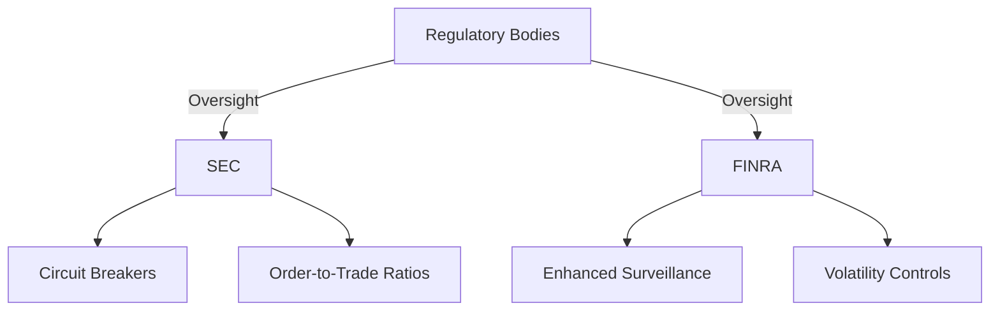

## 27.3.2 High-Frequency Trading Concerns

High-Frequency Trading (HFT) represents a significant evolution in the securities markets, leveraging advanced technology to execute trades at unprecedented speeds. As an aspiring General Securities Representative, understanding the intricacies of HFT is crucial, not only for passing the Series 7 Exam but also for navigating the modern financial landscape. This section delves into the definition, benefits, and concerns associated with HFT, along with regulatory responses aimed at addressing its challenges.

### Understanding High-Frequency Trading

**High-Frequency Trading (HFT)** is a form of algorithmic trading characterized by the use of powerful computers to execute a large number of orders at extremely high speeds. Typically, these trades occur in fractions of a second, often measured in microseconds or nanoseconds. HFT firms utilize complex algorithms to analyze multiple markets and execute orders based on market conditions.

#### Key Characteristics of HFT

1. **Speed and Volume**: HFT relies on executing a high volume of trades at lightning-fast speeds, often capitalizing on minute price discrepancies.
2. **Algorithmic Strategies**: HFT employs sophisticated algorithms to make rapid trading decisions without human intervention.
3. **Co-location**: Many HFT firms place their servers in close proximity to exchange servers to minimize latency, gaining a competitive edge in execution speed.

### The Role of HFT in Modern Markets

HFT plays a pivotal role in contemporary financial markets, influencing liquidity, price discovery, and market efficiency. Here are some of the primary benefits associated with HFT:

#### Benefits of High-Frequency Trading

1. **Increased Liquidity**: HFT contributes to market liquidity by providing a continuous flow of buy and sell orders, making it easier for other market participants to execute trades.
   
2. **Tighter Bid-Ask Spreads**: By constantly placing and updating orders, HFT helps narrow the bid-ask spread, reducing transaction costs for all traders.

3. **Enhanced Market Efficiency**: HFT can improve market efficiency by quickly incorporating new information into prices, facilitating more accurate price discovery.

#### Example: Liquidity Provision

Consider a scenario where an HFT firm continuously places limit orders on both sides of the market. This activity provides liquidity, allowing a retail investor to buy or sell shares more easily and at a better price than would be possible without the HFT firm's presence.

### Concerns and Challenges of High-Frequency Trading

Despite its benefits, HFT has sparked significant debate and concern among regulators, market participants, and the public. The primary concerns include:

#### 1. Market Instability

HFT can contribute to market volatility and instability, particularly during periods of market stress. The "Flash Crash" of May 6, 2010, is a notable example where HFT was implicated in exacerbating a rapid market decline, leading to a temporary loss of nearly $1 trillion in market value.

#### 2. Unfair Advantages

HFT firms often have access to superior technology and information, providing them with an unfair advantage over traditional investors. The use of co-location and proprietary data feeds allows HFT firms to execute trades faster than others, potentially leading to market manipulation.

#### 3. Predatory Trading Practices

Some HFT strategies, such as "quote stuffing" and "spoofing," are considered predatory. These practices involve placing and quickly canceling large numbers of orders to create false market signals, misleading other traders.

#### Case Study: Spoofing

In 2015, a trader was convicted of spoofing, a practice where they placed large orders they intended to cancel before execution, creating a false impression of demand or supply. This manipulation allowed them to profit from the resulting price movements, highlighting the potential for abuse in HFT.

### Regulatory Responses to HFT Challenges

Regulators have recognized the need to address the challenges posed by HFT, implementing various measures to enhance market integrity and protect investors.

#### 1. Enhanced Surveillance and Monitoring

Regulatory bodies like the Securities and Exchange Commission (SEC) and the Financial Industry Regulatory Authority (FINRA) have increased their surveillance capabilities to detect and prevent abusive HFT practices. Advanced monitoring systems analyze trading patterns to identify suspicious activities.

#### 2. Circuit Breakers and Volatility Controls

To mitigate market instability, exchanges have implemented circuit breakers and volatility controls. These mechanisms temporarily halt trading when significant price movements occur, allowing time for market participants to assess the situation and restore order.

#### 3. Order-to-Trade Ratios and Messaging Limits

Regulations have been introduced to limit the number of orders an HFT firm can place relative to executed trades. This aims to reduce excessive order placement and cancellation, curbing manipulative practices like quote stuffing.

#### Diagram: Regulatory Framework for HFT

### Best Practices and Compliance Considerations

As a future securities professional, it's essential to understand best practices and compliance considerations related to HFT:

1. **Stay Informed**: Keep abreast of regulatory developments and industry best practices related to HFT. Continuous learning is vital in this rapidly evolving field.

2. **Promote Transparency**: Encourage transparency in trading practices and support efforts to disclose HFT activities to regulators and the public.

3. **Advocate for Fairness**: Strive to ensure that all market participants have a fair opportunity to compete, advocating for policies that level the playing field.

### Conclusion

High-Frequency Trading is a complex and multifaceted aspect of modern securities markets, offering both significant benefits and notable challenges. By understanding the intricacies of HFT, its impact on market dynamics, and the regulatory landscape, you will be better equipped to navigate these issues in your career as a General Securities Representative.

## Series 7 Exam Practice Questions: High-Frequency Trading Concerns



### What is one primary benefit of High-Frequency Trading in securities markets?

- [x] Increased liquidity
- [ ] Higher transaction costs
- [ ] Reduced market efficiency
- [ ] Increased market volatility

> **Explanation:** High-Frequency Trading contributes to increased liquidity by providing a continuous flow of buy and sell orders, making it easier for other market participants to execute trades.

### Which of the following is a concern associated with High-Frequency Trading?

- [ ] Tighter bid-ask spreads
- [x] Market instability
- [ ] Enhanced price discovery
- [ ] Decreased transaction volume

> **Explanation:** Market instability is a concern associated with High-Frequency Trading, as it can exacerbate volatility, particularly during times of market stress.

### What is "spoofing" in the context of High-Frequency Trading?

- [ ] A strategy to increase liquidity
- [ ] A method to enhance market efficiency
- [x] Placing and canceling large orders to create false market signals
- [ ] A technique to reduce transaction costs

> **Explanation:** Spoofing involves placing and quickly canceling large orders to create false market signals, misleading other traders and potentially manipulating prices.

### How do circuit breakers help manage High-Frequency Trading concerns?

- [x] By temporarily halting trading during significant price movements
- [ ] By increasing the speed of trade execution
- [ ] By reducing the number of trades executed
- [ ] By enhancing the accuracy of price quotes

> **Explanation:** Circuit breakers temporarily halt trading during significant price movements, allowing time for market participants to assess the situation and restore order.

### What is the role of co-location in High-Frequency Trading?

- [x] To minimize latency by placing servers near exchange servers
- [ ] To increase transaction costs for HFT firms
- [ ] To slow down trade execution speeds
- [ ] To enhance regulatory oversight

> **Explanation:** Co-location involves placing HFT firm servers near exchange servers to minimize latency, providing a competitive advantage in execution speed.

### Which regulatory body is primarily responsible for overseeing High-Frequency Trading practices in the U.S.?

- [ ] Federal Reserve Board (FRB)
- [x] Securities and Exchange Commission (SEC)
- [ ] Department of Justice (DOJ)
- [ ] Internal Revenue Service (IRS)

> **Explanation:** The Securities and Exchange Commission (SEC) is primarily responsible for overseeing High-Frequency Trading practices in the U.S., ensuring market integrity and investor protection.

### What is a potential disadvantage of High-Frequency Trading for retail investors?

- [ ] Increased market transparency
- [x] Unfair advantages for HFT firms
- [ ] Lower transaction costs
- [ ] Greater investment opportunities

> **Explanation:** High-Frequency Trading can provide unfair advantages to HFT firms due to their access to superior technology and information, potentially disadvantaging retail investors.

### What is the purpose of order-to-trade ratios in regulating High-Frequency Trading?

- [x] To limit excessive order placement and cancellation
- [ ] To increase the speed of trade execution
- [ ] To enhance market volatility
- [ ] To reduce transaction costs

> **Explanation:** Order-to-trade ratios limit the number of orders an HFT firm can place relative to executed trades, curbing manipulative practices like quote stuffing.

### How does High-Frequency Trading affect bid-ask spreads?

- [ ] It widens bid-ask spreads
- [x] It narrows bid-ask spreads
- [ ] It has no impact on bid-ask spreads
- [ ] It eliminates bid-ask spreads

> **Explanation:** High-Frequency Trading helps narrow bid-ask spreads by constantly placing and updating orders, reducing transaction costs for all traders.

### Which event highlighted the potential risks of High-Frequency Trading on market stability?

- [ ] The Great Depression
- [ ] The Dot-com Bubble
- [x] The Flash Crash of 2010
- [ ] The Global Financial Crisis of 2008

> **Explanation:** The Flash Crash of 2010 highlighted the potential risks of High-Frequency Trading on market stability, where HFT was implicated in exacerbating a rapid market decline.



By mastering the concepts and concerns related to High-Frequency Trading, you will be well-prepared to address questions on this topic in the Series 7 Exam and apply this knowledge in your future career in securities.
