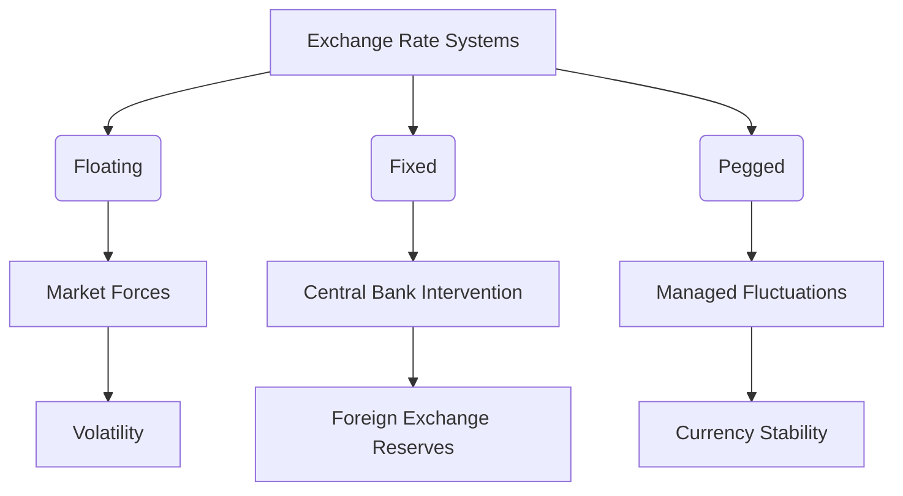

## 28.2.1 Exchange Rate Mechanisms

Understanding exchange rate mechanisms is crucial for anyone involved in international finance, trade, or investment. Exchange rates influence the cost of goods and services across borders, affect investment returns, and play a pivotal role in economic stability. This section will delve into how exchange rates are determined in the forex market, the different systems used to manage them, and the impact of central banks and monetary policy on these rates.

### Overview of the Forex Market

The forex market, or foreign exchange market, is the largest and most liquid financial market in the world. It operates 24 hours a day, five days a week, and involves the trading of currencies. Unlike stock markets, which have a centralized location, the forex market is decentralized and operates through a global network of banks, financial institutions, corporations, and individual traders.

#### Key Features of the Forex Market

- **Liquidity:** The forex market is highly liquid, with trillions of dollars traded daily. This liquidity allows for quick execution of trades and narrow bid-ask spreads.
- **Decentralization:** Unlike centralized exchanges, forex trading occurs over-the-counter (OTC), meaning trades are conducted directly between parties.
- **Volatility:** Currency values can fluctuate significantly due to economic news, geopolitical events, and market sentiment.

### Determining Exchange Rates

Exchange rates are determined by various factors, including supply and demand dynamics, economic indicators, and geopolitical events. The forex market uses different systems to manage currency values, each with its own set of rules and implications.

#### Floating Exchange Rate System

In a floating exchange rate system, the value of a currency is determined by market forces without direct government or central bank intervention. The supply and demand for a currency are influenced by factors such as interest rates, inflation, political stability, and economic performance.

- **Advantages:** Flexibility in responding to economic changes, automatic adjustment of trade imbalances, and insulation from external economic shocks.
- **Disadvantages:** Potential for high volatility, which can lead to economic uncertainty and affect international trade and investment.

#### Fixed Exchange Rate System

A fixed exchange rate system, also known as a pegged system, involves a country's government or central bank setting and maintaining a specific exchange rate against another currency or a basket of currencies. This system requires the central bank to intervene in the forex market to maintain the fixed rate.

- **Advantages:** Stability and predictability in international transactions, reduced exchange rate risk, and control over inflation.
- **Disadvantages:** Limited flexibility to respond to economic changes, potential for currency overvaluation or undervaluation, and the need for large foreign exchange reserves.

#### Pegged Exchange Rate System

A pegged exchange rate system is a hybrid approach where a currency's value is pegged to another major currency, such as the US dollar, but allowed to fluctuate within a specified range. This system combines elements of both fixed and floating exchange rates.

- **Advantages:** Provides stability while allowing some flexibility, reduces the risk of currency crises, and supports economic growth.
- **Disadvantages:** Requires active management by central banks, potential for speculative attacks, and challenges in maintaining the peg during economic shocks.

### Role of Central Banks and Monetary Policy

Central banks play a crucial role in influencing exchange rates through monetary policy. By adjusting interest rates, controlling money supply, and intervening in the forex market, central banks can impact currency values and stabilize their economies.

#### Tools of Monetary Policy

- **Interest Rates:** Central banks can raise or lower interest rates to influence currency demand. Higher interest rates attract foreign investment, increasing demand for the currency and potentially raising its value.
- **Open Market Operations:** Buying or selling government securities to influence the money supply and interest rates, indirectly affecting exchange rates.
- **Foreign Exchange Interventions:** Directly buying or selling currencies in the forex market to stabilize or influence exchange rates.

### Impact on International Trade and Investment

Exchange rate mechanisms have significant implications for international trade and investment. Fluctuations in exchange rates can affect the competitiveness of exports and imports, influence investment returns, and impact economic growth.

#### Effects on Trade

- **Export Competitiveness:** A weaker domestic currency makes exports cheaper and more competitive in international markets, potentially boosting export volumes.
- **Import Costs:** A stronger domestic currency makes imports cheaper, benefiting consumers but potentially harming domestic industries.

#### Effects on Investment

- **Foreign Direct Investment (FDI):** Exchange rate stability is crucial for attracting FDI, as it reduces the risk of currency fluctuations affecting investment returns.
- **Portfolio Investment:** Investors may seek higher returns in countries with appreciating currencies, influencing capital flows and exchange rates.

### Practical Examples and Case Studies

#### Case Study: The Eurozone Crisis

During the Eurozone crisis, several countries faced significant economic challenges, leading to fluctuations in the euro's value. The European Central Bank (ECB) intervened by implementing monetary policy measures, such as lowering interest rates and purchasing government bonds, to stabilize the currency and support economic recovery.

#### Example: The Swiss Franc Peg

In 2011, the Swiss National Bank (SNB) pegged the Swiss franc to the euro to prevent excessive appreciation and protect the Swiss economy. However, in 2015, the SNB abandoned the peg, leading to a sharp appreciation of the franc and significant market volatility.

### Diagrams and Visuals

To enhance understanding, let's visualize the relationship between exchange rate systems and central bank interventions using a flowchart:

### Best Practices and Common Pitfalls

- **Best Practices:** Stay informed about economic indicators, monitor central bank announcements, and understand geopolitical developments that can affect exchange rates.
- **Common Pitfalls:** Ignoring currency risk in international transactions, failing to hedge against exchange rate fluctuations, and underestimating the impact of central bank interventions.

### Conclusion

Exchange rate mechanisms are a fundamental aspect of the global financial system, influencing trade, investment, and economic stability. Understanding how these mechanisms work, the role of central banks, and the impact on international markets is essential for anyone involved in the securities industry. By mastering these concepts, you'll be better equipped to navigate the complexities of the forex market and succeed in your career as a General Securities Representative.

---

## Series 7 Exam Practice Questions: Exchange Rate Mechanisms



### What is the primary characteristic of a floating exchange rate system?

- [x] It is determined by market forces without direct government intervention.
- [ ] It is fixed against another currency by the central bank.
- [ ] It is pegged to a basket of currencies.
- [ ] It is adjusted periodically by government decree.

> **Explanation:** A floating exchange rate system relies on market forces of supply and demand to determine currency value, without direct intervention from the government or central bank.

### Which of the following best describes a fixed exchange rate system?

- [ ] Currency value is determined solely by market forces.
- [x] The government or central bank maintains a specific exchange rate against another currency.
- [ ] Currency value is allowed to fluctuate within a set range.
- [ ] Currency value is pegged to a basket of commodities.

> **Explanation:** In a fixed exchange rate system, the government or central bank sets and maintains a specific exchange rate against another currency, often requiring intervention in the forex market.

### What role do central banks play in influencing exchange rates?

- [ ] They set global currency values.
- [x] They adjust interest rates and intervene in the forex market.
- [ ] They determine the supply of foreign currencies.
- [ ] They regulate international trade agreements.

> **Explanation:** Central banks influence exchange rates by adjusting interest rates, controlling money supply, and intervening in the forex market to stabilize or influence currency values.

### How does a pegged exchange rate system differ from a fixed exchange rate system?

- [ ] It is entirely determined by market forces.
- [ ] It involves no central bank intervention.
- [x] It allows the currency to fluctuate within a specified range.
- [ ] It is pegged to multiple currencies simultaneously.

> **Explanation:** A pegged exchange rate system allows a currency to fluctuate within a specified range around a central value, combining elements of both fixed and floating systems.

### What is a potential disadvantage of a floating exchange rate system?

- [ ] It requires large foreign exchange reserves.
- [ ] It lacks flexibility in responding to economic changes.
- [x] It can lead to high volatility and economic uncertainty.
- [ ] It necessitates frequent central bank intervention.

> **Explanation:** A floating exchange rate system can experience high volatility due to market forces, leading to economic uncertainty and potential challenges for international trade and investment.

### Why might a country choose to implement a fixed exchange rate system?

- [ ] To increase currency volatility.
- [x] To provide stability and predictability in international transactions.
- [ ] To allow the currency to fluctuate freely.
- [ ] To eliminate the need for foreign exchange reserves.

> **Explanation:** A fixed exchange rate system provides stability and predictability in international transactions, reducing exchange rate risk and helping control inflation.

### Which of the following tools is used by central banks to influence exchange rates?

- [ ] Trade tariffs
- [x] Interest rate adjustments
- [ ] Taxation policies
- [ ] Government spending

> **Explanation:** Central banks use interest rate adjustments as a tool to influence exchange rates, affecting currency demand and value.

### What impact does a stronger domestic currency have on exports?

- [ ] It makes exports cheaper and more competitive.
- [ ] It has no effect on export prices.
- [x] It makes exports more expensive and less competitive.
- [ ] It reduces the need for foreign exchange reserves.

> **Explanation:** A stronger domestic currency makes exports more expensive for foreign buyers, potentially reducing competitiveness in international markets.

### How does exchange rate stability affect foreign direct investment (FDI)?

- [ ] It increases currency risk for investors.
- [x] It reduces currency risk and attracts more investment.
- [ ] It discourages investment due to high volatility.
- [ ] It has no impact on investment decisions.

> **Explanation:** Exchange rate stability reduces currency risk, making a country more attractive for foreign direct investment by providing predictable returns.

### What is a common challenge associated with maintaining a pegged exchange rate?

- [ ] Lack of central bank involvement
- [ ] Excessive currency volatility
- [ ] Inability to respond to economic changes
- [x] Speculative attacks and maintaining the peg during shocks

> **Explanation:** Maintaining a pegged exchange rate can be challenging due to the risk of speculative attacks and the difficulty of maintaining the peg during economic shocks.



---

By understanding exchange rate mechanisms, you will be better prepared to tackle questions related to international markets and currency risk on the Series 7 Exam. This knowledge is not only crucial for the exam but also for your future career in the securities industry.
