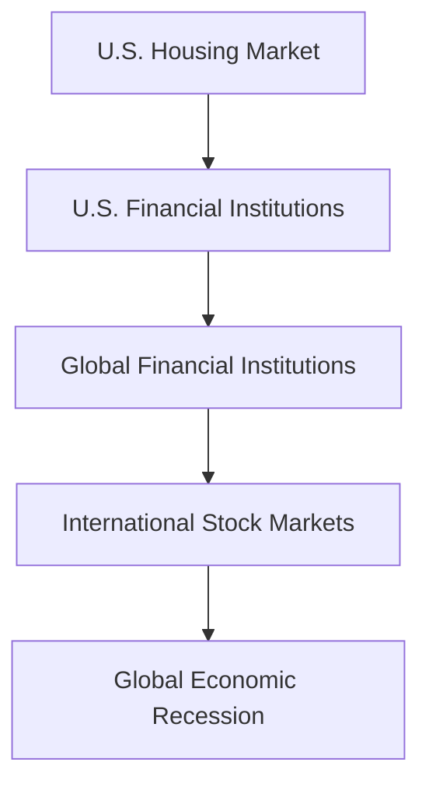

## 28.3.2 Global Economic Factors

Global economic factors wield significant influence over international markets, shaping investment opportunities and risks. As a prospective General Securities Representative, understanding these factors is crucial for advising clients and making informed investment decisions. In this section, we will explore how global economic events such as trade agreements, geopolitical tensions, and pandemics impact markets. We will also delve into the interconnectivity of global economies, the concept of contagion, and the importance of monitoring global economic indicators like GDP growth rates, inflation, and employment data.

### Impact of Global Economic Events on International Markets

#### Trade Agreements

Trade agreements are pivotal in shaping the flow of goods and services between countries. They can lower tariffs, reduce barriers, and create a more favorable trading environment, which can stimulate economic growth. For example, the North American Free Trade Agreement (NAFTA), now replaced by the United States-Mexico-Canada Agreement (USMCA), facilitated trade between the U.S., Canada, and Mexico, boosting economic activity and impacting stock markets in these countries.

**Case Study: The USMCA**

The transition from NAFTA to USMCA brought changes in labor laws, automotive manufacturing, and digital trade. These adjustments affected industries differently, with some benefiting from reduced tariffs and others facing stricter regulations. The automotive sector, in particular, saw shifts in production and supply chains, influencing stock prices of car manufacturers and related industries.

#### Geopolitical Tensions

Geopolitical tensions, such as conflicts, sanctions, and political instability, can create uncertainty in global markets. These events can disrupt supply chains, affect commodity prices, and lead to volatility in stock markets. For instance, tensions in the Middle East often lead to fluctuations in oil prices, impacting energy stocks and broader market indices.

**Case Study: U.S.-China Trade War**

The trade tensions between the U.S. and China, marked by tariffs and retaliatory measures, created significant market volatility. Companies with supply chains reliant on Chinese manufacturing faced increased costs, leading to shifts in stock prices. The uncertainty affected investor sentiment, causing fluctuations in global markets and impacting sectors like technology and agriculture.

#### Pandemics

Pandemics, such as COVID-19, have profound effects on global economies. They disrupt supply chains, alter consumer behavior, and lead to government interventions in the form of fiscal stimulus and monetary policy adjustments. The COVID-19 pandemic led to unprecedented market volatility, with sharp declines followed by rapid recoveries as governments and central banks intervened.

**Case Study: COVID-19 Pandemic**

The pandemic's impact on global markets was swift and severe. Lockdowns led to reduced consumer spending, supply chain disruptions, and a shift towards digital services. Governments implemented stimulus packages to support economies, while central banks lowered interest rates. These measures helped stabilize markets, but the long-term effects on sectors like travel and hospitality remain significant.

### Interconnectivity of Global Economies and the Concept of Contagion

The global economy is highly interconnected, with financial markets, trade, and investment flows linking countries. This interconnectivity means that economic events in one region can have ripple effects worldwide, a phenomenon known as contagion.

#### Financial Contagion

Financial contagion occurs when economic shocks in one country or region spread to others. This can happen through trade links, investment flows, or investor sentiment. For example, the 2008 financial crisis, which began in the U.S. housing market, quickly spread to global financial markets, leading to a worldwide recession.

**Mermaid Diagram: Financial Contagion Pathways**

#### Trade and Investment Links

Countries are connected through trade and investment, meaning that economic policies or disruptions in one country can affect others. For instance, a slowdown in China's economy can impact countries that rely on exporting raw materials to China, affecting their GDP growth and stock markets.

**Case Study: Eurozone Debt Crisis**

The Eurozone debt crisis highlighted the interconnectivity of global economies. Financial instability in Greece, Spain, and Italy led to concerns about the stability of the euro, affecting global markets. Investors worried about exposure to European debt, leading to volatility in international stock and bond markets.

### Monitoring Global Economic Indicators

Monitoring global economic indicators is essential for understanding market trends and making informed investment decisions. Key indicators include GDP growth rates, inflation, and employment data.

#### GDP Growth Rates

Gross Domestic Product (GDP) growth rates indicate the economic health of a country. Positive growth suggests a robust economy, while negative growth can signal a recession. Investors monitor GDP data to assess economic trends and potential investment opportunities.

#### Inflation

Inflation measures the rate at which prices for goods and services rise. Moderate inflation is normal in a growing economy, but high inflation can erode purchasing power and lead to tighter monetary policies. Central banks may raise interest rates to combat inflation, affecting bond prices and stock valuations.

#### Employment Data

Employment data, such as unemployment rates and job creation figures, provide insights into economic conditions. High employment levels typically indicate economic strength, while rising unemployment can signal economic challenges. Investors use employment data to gauge consumer spending potential and economic stability.

**Case Study: U.S. Economic Indicators and Market Reactions**

In the U.S., economic indicators like GDP growth, inflation, and employment data are closely watched by investors. For example, strong GDP growth and low unemployment can lead to stock market rallies, while rising inflation may prompt concerns about interest rate hikes, affecting bond markets.

### Practical Examples and Scenarios

To illustrate the impact of global economic factors, consider the following scenarios:

1. **Scenario: Rising Oil Prices**

   - **Cause:** Geopolitical tensions in the Middle East.
   - **Effect:** Increased oil prices lead to higher transportation and production costs, impacting sectors like airlines and manufacturing. Energy stocks may rise, while consumer goods companies face margin pressures.

2. **Scenario: Trade Agreement Implementation**

   - **Cause:** A new trade agreement between the U.S. and a major trading partner.
   - **Effect:** Reduced tariffs boost exports, benefiting industries like agriculture and manufacturing. Stock prices in these sectors may rise as companies expand their market reach.

3. **Scenario: Global Pandemic Outbreak**

   - **Cause:** A new pandemic leads to global lockdowns.
   - **Effect:** Consumer spending shifts towards essential goods and digital services. Travel and hospitality sectors face declines, while technology and healthcare stocks may see gains.

### Strategies for Monitoring and Responding to Global Economic Factors

1. **Stay Informed:** Regularly monitor news and updates on global economic events. Use reliable sources like financial news outlets, government reports, and international organizations.

2. **Diversify Investments:** Diversify portfolios across sectors and regions to mitigate risks associated with specific economic events or regions.

3. **Analyze Economic Indicators:** Pay attention to key economic indicators like GDP growth, inflation, and employment data to assess market conditions and potential investment opportunities.

4. **Consider Contingency Plans:** Develop contingency plans for potential economic disruptions, such as geopolitical tensions or pandemics, to protect investments and maintain financial stability.

### Conclusion

Understanding global economic factors is essential for navigating international markets and making informed investment decisions. By staying informed about trade agreements, geopolitical tensions, and pandemics, and monitoring key economic indicators, you can better anticipate market trends and advise clients effectively. As you prepare for the Series 7 Exam, focus on the interconnectivity of global economies and the concept of contagion, as these are critical components of the exam and your future career in the securities industry.

---

## Series 7 Exam Practice Questions: Global Economic Factors



### How do trade agreements typically affect international markets?

- [x] By reducing tariffs and creating favorable trading environments
- [ ] By increasing tariffs and restricting trade
- [ ] By stabilizing currency exchange rates
- [ ] By eliminating all trade barriers immediately

> **Explanation:** Trade agreements usually aim to reduce tariffs and create more favorable trading environments, which can stimulate economic growth and impact international markets.

### What was a significant impact of the U.S.-China trade war on global markets?

- [ ] Stabilization of technology stocks
- [x] Increased market volatility
- [ ] Decreased agricultural exports from the U.S.
- [ ] Strengthening of the Chinese yuan

> **Explanation:** The U.S.-China trade war led to increased market volatility as tariffs and retaliatory measures created uncertainty for companies with supply chains reliant on Chinese manufacturing.

### What is financial contagion?

- [ ] The spread of economic policies from one country to another
- [x] The spread of economic shocks from one region to others
- [ ] The stabilization of financial markets through global cooperation
- [ ] The isolation of financial crises within a single country

> **Explanation:** Financial contagion refers to the spread of economic shocks from one region to others, often through trade links, investment flows, or investor sentiment.

### Which of the following is a key indicator of economic health?

- [ ] Trade deficits
- [ ] Currency exchange rates
- [x] GDP growth rates
- [ ] Stock market indices

> **Explanation:** GDP growth rates are a key indicator of economic health, reflecting the overall economic activity and growth of a country.

### How can geopolitical tensions affect commodity prices?

- [ ] By stabilizing supply chains
- [ ] By reducing demand for commodities
- [x] By creating uncertainty and volatility
- [ ] By eliminating tariffs on commodities

> **Explanation:** Geopolitical tensions can create uncertainty and volatility, often leading to fluctuations in commodity prices, such as oil.

### What was a major economic impact of the COVID-19 pandemic?

- [x] Disruption of supply chains and shifts in consumer behavior
- [ ] Stabilization of global markets without government intervention
- [ ] Decrease in digital service demand
- [ ] Increase in travel and hospitality sectors

> **Explanation:** The COVID-19 pandemic disrupted supply chains, altered consumer behavior, and led to government interventions to stabilize markets.

### Why is monitoring employment data important for investors?

- [ ] It predicts future stock market indices
- [x] It provides insights into economic conditions
- [ ] It directly influences currency exchange rates
- [ ] It determines global trade agreements

> **Explanation:** Monitoring employment data provides insights into economic conditions, helping investors gauge consumer spending potential and economic stability.

### What is the effect of high inflation on an economy?

- [ ] It increases purchasing power
- [x] It erodes purchasing power and may lead to tighter monetary policies
- [ ] It stabilizes currency exchange rates
- [ ] It decreases interest rates

> **Explanation:** High inflation erodes purchasing power and may lead to tighter monetary policies as central banks raise interest rates to combat inflation.

### How can investors mitigate risks associated with global economic events?

- [ ] By focusing investments solely in one sector
- [ ] By ignoring economic indicators
- [x] By diversifying portfolios across sectors and regions
- [ ] By relying solely on domestic market trends

> **Explanation:** Diversifying portfolios across sectors and regions can help mitigate risks associated with specific economic events or regions.

### What is a common strategy for responding to potential economic disruptions?

- [ ] Ignoring geopolitical news
- [ ] Investing solely in emerging markets
- [x] Developing contingency plans
- [ ] Eliminating all international investments

> **Explanation:** Developing contingency plans for potential economic disruptions, such as geopolitical tensions or pandemics, helps protect investments and maintain financial stability.



---
