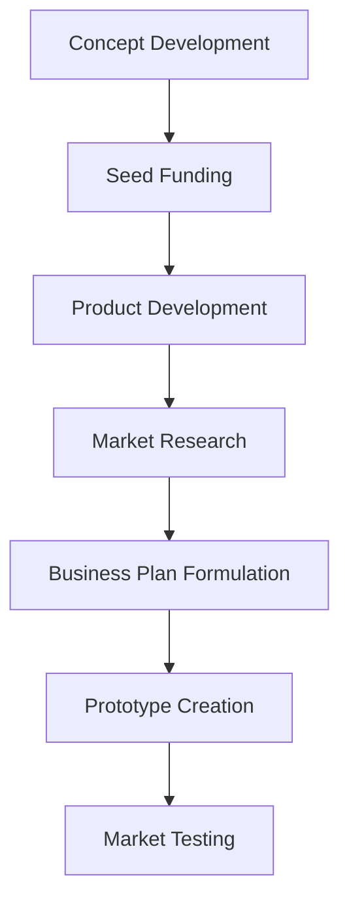
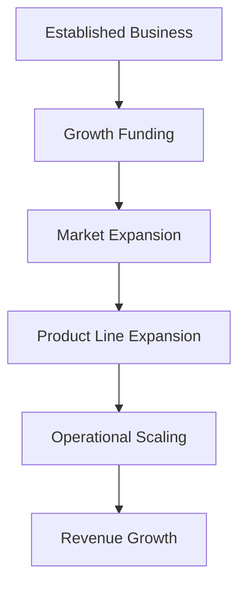
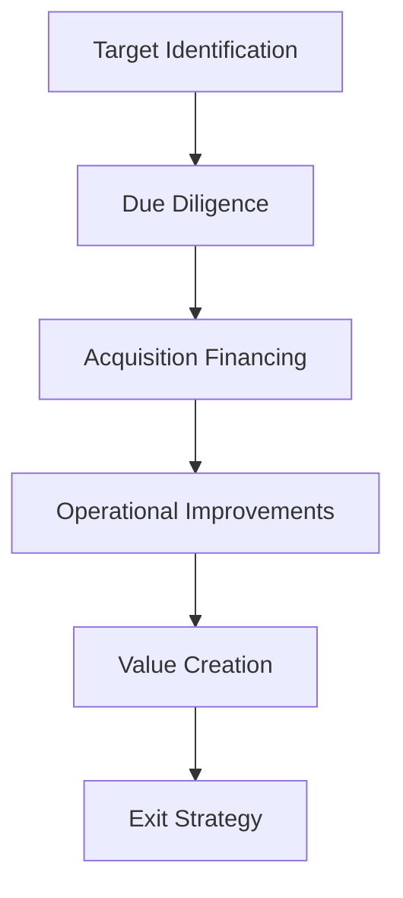

## 29.2.1 Investment Phases

Private equity (PE) and venture capital (VC) investments are structured through a series of distinct phases, each with its own objectives, risks, and potential returns. Understanding these phases is crucial for anyone preparing for the Series 7 Exam, as it provides insights into how capital is allocated, managed, and eventually returned to investors. This section will delve into the key stages of private equity investment: Seed Capital, Growth Capital, and Buyouts, and will also cover exit strategies such as Initial Public Offerings (IPOs) and acquisitions.

### Overview of Private Equity Investment Phases

The private equity investment process is designed to support companies at various stages of their lifecycle, from inception to maturity. Each phase requires a different approach to funding, management, and risk assessment. The main investment phases include:

1. **Seed Capital**
2. **Growth Capital**
3. **Buyouts**

Understanding these stages will help you grasp the broader landscape of private equity investments and their role in the financial markets.

### Seed Capital

Seed capital is the initial funding used to develop a business concept. This phase is characterized by high risk and potentially high reward, as it involves investing in startups that are often in the earliest stages of development.

#### Characteristics of Seed Capital

- **Purpose:** To finance the initial stages of a business, including product development, market research, and business plan formulation.
- **Investors:** Typically provided by angel investors, venture capitalists, or through crowdfunding platforms.
- **Investment Size:** Generally smaller amounts compared to later stages, as the focus is on proving the concept rather than scaling the business.
- **Risk Level:** High, due to the uncertainty surrounding the business model and market acceptance.

#### Practical Example

Imagine a tech startup developing a new mobile app. The founders seek seed capital to hire developers, create a prototype, and conduct market tests. An angel investor provides $200,000 in exchange for a 10% equity stake, betting on the app's potential success.

#### Seed Capital Flowchart

### Growth Capital

Growth capital, also known as expansion capital, is used to scale operations, enter new markets, or finance significant business transformations. This phase is less risky than seed capital as the company has typically demonstrated a viable business model.

#### Characteristics of Growth Capital

- **Purpose:** To accelerate growth, expand product lines, or enter new geographic markets.
- **Investors:** Often provided by venture capital firms, private equity funds, or strategic corporate partners.
- **Investment Size:** Larger than seed capital, reflecting the need for substantial resources to support expansion.
- **Risk Level:** Moderate, as the company has a proven track record but faces execution risks in scaling operations.

#### Practical Example

Consider a successful e-commerce platform looking to expand internationally. The company secures $10 million in growth capital from a venture capital firm to establish logistics centers in Europe and Asia, aiming to increase its customer base and revenue streams.

#### Growth Capital Flowchart

### Buyouts

Buyouts involve acquiring a controlling interest in a mature company, often with the intent to improve its financial performance and eventually sell it for a profit. This phase is typically associated with leveraged buyouts (LBOs), where debt is used to finance a significant portion of the acquisition.

#### Characteristics of Buyouts

- **Purpose:** To gain control of a company, improve its operations, and increase its value for a future sale.
- **Investors:** Primarily private equity firms that specialize in buyouts and have the expertise to restructure and optimize companies.
- **Investment Size:** Substantial, as it involves acquiring a majority stake in established businesses.
- **Risk Level:** Variable, depending on the company's financial health and the effectiveness of the restructuring plan.

#### Practical Example

A private equity firm identifies a manufacturing company with strong fundamentals but underperforming management. The firm executes a buyout, installs a new management team, and implements operational efficiencies. After five years, the company is sold at a significant profit through an IPO.

#### Buyouts Flowchart

### Exit Strategies

Exit strategies are critical components of the private equity investment lifecycle, as they determine how investors realize returns on their investments. Common exit strategies include:

#### Initial Public Offerings (IPOs)

An IPO involves offering shares of a private company to the public for the first time. This exit strategy can provide substantial returns if the company has achieved significant growth and market presence.

- **Advantages:** Provides liquidity to investors and access to public capital markets.
- **Challenges:** Requires extensive regulatory compliance and market readiness.

#### Acquisitions

Acquisitions involve selling the company to another business or investor. This strategy can be attractive if the company aligns with the buyer's strategic objectives.

- **Advantages:** Can provide a quick and profitable exit.
- **Challenges:** May involve complex negotiations and integration processes.

### Conclusion

Understanding the investment phases in private equity, from seed capital to buyouts, is essential for anyone preparing for the Series 7 Exam. Each phase presents unique opportunities and challenges, requiring a strategic approach to funding, management, and risk assessment. By mastering these concepts, you'll be better equipped to navigate the complexities of private equity investments and excel in your securities career.

## Series 7 Exam Practice Questions: Investment Phases



### What is the primary purpose of seed capital?

- [x] To finance the initial stages of a business, including product development and market research.
- [ ] To acquire a controlling interest in a mature company.
- [ ] To expand operations and enter new markets.
- [ ] To prepare a company for an IPO.

> **Explanation:** Seed capital is used to support the early development of a business, focusing on product development and market research.

### Which type of investor is most likely to provide seed capital?

- [x] Angel investors
- [ ] Private equity firms
- [ ] Corporate partners
- [ ] Institutional investors

> **Explanation:** Angel investors typically provide seed capital to startups in their early stages.

### What distinguishes growth capital from seed capital?

- [ ] Growth capital is used for initial product development.
- [x] Growth capital is used to scale operations and enter new markets.
- [ ] Growth capital is typically smaller in size than seed capital.
- [ ] Growth capital is only provided by angel investors.

> **Explanation:** Growth capital is aimed at scaling operations and entering new markets, whereas seed capital focuses on initial development.

### What is a common characteristic of buyouts?

- [ ] They involve small investments in early-stage companies.
- [x] They involve acquiring a controlling interest in a mature company.
- [ ] They are primarily funded by angel investors.
- [ ] They focus on product development and market research.

> **Explanation:** Buyouts involve acquiring a controlling interest in a mature company to improve its performance.

### Which exit strategy involves offering shares of a private company to the public for the first time?

- [x] Initial Public Offering (IPO)
- [ ] Acquisition
- [ ] Seed capital funding
- [ ] Growth capital investment

> **Explanation:** An IPO is the process of offering shares of a private company to the public for the first time.

### What is a key advantage of an acquisition as an exit strategy?

- [ ] It requires minimal regulatory compliance.
- [x] It can provide a quick and profitable exit.
- [ ] It always results in higher returns than an IPO.
- [ ] It involves minimal negotiation processes.

> **Explanation:** Acquisitions can offer a quick and profitable exit, although they may involve complex negotiations.

### Which phase of private equity investment typically involves the largest investment size?

- [ ] Seed capital
- [ ] Growth capital
- [x] Buyouts
- [ ] IPOs

> **Explanation:** Buyouts generally involve the largest investment size, as they require acquiring a controlling interest in established companies.

### What is the risk level associated with seed capital investments?

- [x] High
- [ ] Moderate
- [ ] Low
- [ ] Negligible

> **Explanation:** Seed capital investments are high-risk due to the uncertainty surrounding the business model and market acceptance.

### What is a typical source of growth capital?

- [ ] Angel investors
- [x] Venture capital firms
- [ ] Crowdfunding platforms
- [ ] Retail investors

> **Explanation:** Venture capital firms are common providers of growth capital for expanding businesses.

### Which of the following is NOT a characteristic of buyouts?

- [ ] Acquisition of a controlling interest
- [ ] Operational improvements
- [ ] Value creation
- [x] Initial product development

> **Explanation:** Buyouts focus on acquiring control and improving operations, not initial product development.


