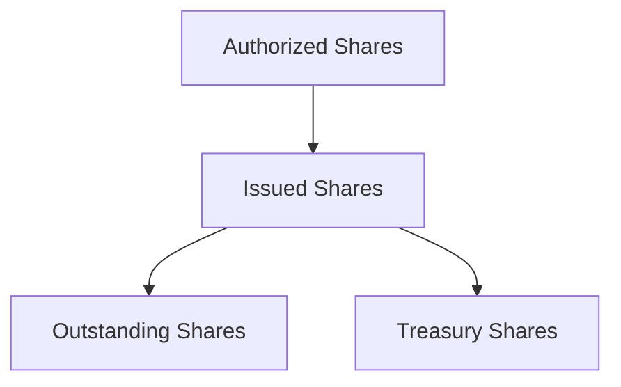
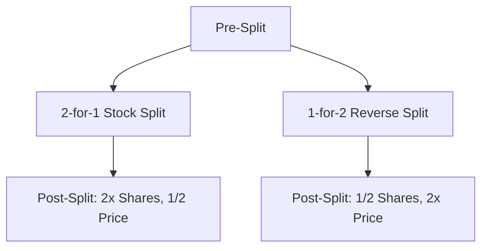

## 3.1.1 Characteristics and Features

Understanding the characteristics and features of common stock is crucial for anyone preparing for the Series 7 Exam, as it forms the foundation of equity securities knowledge. This section delves into the intricacies of share structures, market and book values, and the implications of stock splits, providing essential insights for aspiring General Securities Representatives.

### Authorized, Issued, and Outstanding Shares

One of the fundamental aspects of common stock is the classification of shares, which includes authorized, issued, and outstanding shares. Understanding these terms is essential for analyzing a company's capital structure and evaluating its financial health.

#### Authorized Shares

Authorized shares refer to the maximum number of shares a corporation is legally permitted to issue as specified in its articles of incorporation. This number can be altered through shareholder approval, usually during a corporate meeting. Authorized shares provide a company the flexibility to raise capital, issue stock options, or undertake mergers and acquisitions without needing immediate shareholder approval for each transaction.

#### Issued Shares

Issued shares are the total number of shares that have been sold to and held by shareholders, including both public investors and insiders. Issued shares include all stock that has been sold and remains in the hands of investors, as well as treasury shares that the company has repurchased but not retired.

#### Outstanding Shares

Outstanding shares are those currently held by all shareholders, including institutional investors and company insiders, but excluding treasury shares. The number of outstanding shares is critical for calculating key financial metrics, such as earnings per share (EPS) and market capitalization. 

**Illustrative Figure: Share Structures**

### Market Value vs. Book Value

Understanding the distinction between market value and book value is essential for evaluating a company's stock and making informed investment decisions.

#### Market Value

Market value, also known as market capitalization, is the total value of a company's outstanding shares at the current market price. It is calculated by multiplying the current share price by the number of outstanding shares. Market value reflects the collective assessment of a company's worth by investors and can fluctuate based on market conditions, investor perceptions, and company performance.

#### Book Value

Book value represents the net asset value of a company as recorded on its balance sheet. It is calculated by subtracting total liabilities from total assets. Book value per share is derived by dividing the book value by the number of outstanding shares. While market value reflects investor sentiment, book value provides a more stable, accounting-based measure of a company's intrinsic worth.

### Impact of Stock Splits and Reverse Splits

Stock splits and reverse splits are corporate actions that alter the number of a company's outstanding shares and its stock price, without changing the company's market capitalization.

#### Stock Splits

A stock split increases the number of shares outstanding by issuing more shares to current shareholders. For example, in a 2-for-1 stock split, each shareholder receives an additional share for every share they own, effectively doubling the number of shares while halving the share price. Stock splits are often executed to make shares more affordable and increase liquidity.

**Example:**

- A company with 1 million shares outstanding at $100 per share undergoes a 2-for-1 stock split.
- Post-split, the company will have 2 million shares outstanding at $50 per share.

#### Reverse Stock Splits

A reverse stock split reduces the number of shares outstanding by consolidating shares. For example, in a 1-for-2 reverse split, shareholders receive one share for every two shares they own, effectively halving the number of shares and doubling the share price. Reverse splits are often used to increase the stock price and meet listing requirements or improve the perception of the stock.

**Example:**

- A company with 1 million shares outstanding at $2 per share undergoes a 1-for-2 reverse split.
- Post-split, the company will have 500,000 shares outstanding at $4 per share.

**Illustrative Figure: Stock Split vs. Reverse Split**

### Conclusion

Understanding the characteristics and features of common stock, including the distinctions between authorized, issued, and outstanding shares, as well as the differences between market and book values, is vital for making informed investment decisions. Additionally, recognizing the impact of stock splits and reverse splits helps in comprehending how these corporate actions affect share price and investor perception. This knowledge is not only essential for the Series 7 Exam but also for a successful career in the securities industry.

---

## Series 7 Exam Practice Questions: Characteristics and Features



### What is the definition of outstanding shares?

- [x] Shares currently held by all shareholders, excluding treasury shares.
- [ ] The maximum number of shares a corporation is authorized to issue.
- [ ] Shares that have been issued and are held by the company as treasury stock.
- [ ] Shares that have been authorized but not yet issued.

> **Explanation:** Outstanding shares are those currently held by all shareholders, excluding treasury shares. They are used to calculate market capitalization and earnings per share.

### What is the primary purpose of a stock split?

- [ ] To reduce the company's market capitalization.
- [x] To increase the number of shares outstanding and decrease the share price.
- [ ] To consolidate shares and increase the share price.
- [ ] To reduce the number of authorized shares.

> **Explanation:** A stock split increases the number of shares outstanding and decreases the share price, making the stock more affordable and increasing liquidity.

### How is market value of a company's stock determined?

- [ ] By dividing the company's total assets by its total liabilities.
- [x] By multiplying the current share price by the number of outstanding shares.
- [ ] By subtracting the company's liabilities from its assets.
- [ ] By calculating the book value per share.

> **Explanation:** Market value is determined by multiplying the current share price by the number of outstanding shares, reflecting the company's total market capitalization.

### What happens to the number of outstanding shares in a reverse stock split?

- [x] The number of outstanding shares decreases.
- [ ] The number of outstanding shares increases.
- [ ] The number of outstanding shares remains the same.
- [ ] The number of outstanding shares is doubled.

> **Explanation:** In a reverse stock split, the number of outstanding shares decreases as shares are consolidated.

### What is the book value of a company?

- [ ] The market price of its stock.
- [x] The net asset value of a company as recorded on its balance sheet.
- [ ] The total value of its outstanding shares at the current market price.
- [ ] The difference between the company's revenue and expenses.

> **Explanation:** Book value is the net asset value of a company as recorded on its balance sheet, calculated by subtracting total liabilities from total assets.

### Which of the following is an effect of a 2-for-1 stock split?

- [ ] The market capitalization of the company is halved.
- [ ] The book value per share is doubled.
- [x] The number of shares outstanding is doubled, and the share price is halved.
- [ ] The number of authorized shares is reduced.

> **Explanation:** In a 2-for-1 stock split, the number of shares outstanding is doubled, and the share price is halved, maintaining the same market capitalization.

### In which scenario would a company likely consider a reverse stock split?

- [ ] When the stock price is too high for retail investors.
- [ ] When the company wants to issue more shares.
- [x] When the stock price is too low to meet listing requirements.
- [ ] When the company wants to increase its authorized shares.

> **Explanation:** A reverse stock split is often used when a company's stock price is too low to meet exchange listing requirements or to improve the perception of the stock.

### What is the relationship between market value and book value?

- [ ] Market value is always higher than book value.
- [ ] Book value is always higher than market value.
- [x] Market value reflects investor sentiment, while book value is based on accounting records.
- [ ] Market value and book value are always equal.

> **Explanation:** Market value reflects investor sentiment and can fluctuate, while book value is a stable accounting measure of a company's intrinsic worth.

### What is a treasury share?

- [ ] A share that has been issued and is held by the company itself.
- [x] A share that has been repurchased by the company and is not considered outstanding.
- [ ] A share that has been authorized but not yet issued.
- [ ] A share that is held by institutional investors.

> **Explanation:** Treasury shares are those that have been repurchased by the company and are not considered outstanding, thus not included in earnings per share calculations.

### How does a stock split affect a company's market capitalization?

- [ ] It increases the market capitalization.
- [ ] It decreases the market capitalization.
- [x] It does not change the market capitalization.
- [ ] It doubles the market capitalization.

> **Explanation:** A stock split does not change the market capitalization; it only increases the number of shares and decreases the share price proportionally.



---
