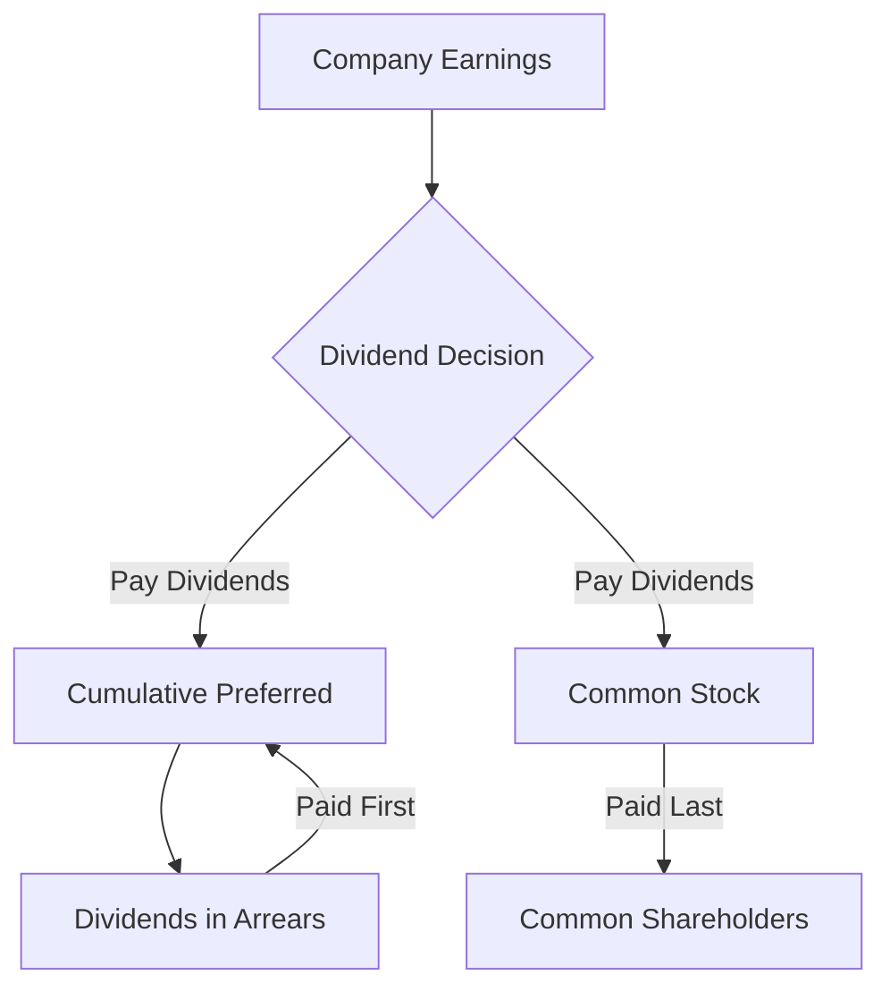

## 3.2.1.1 Cumulative Preferred

Cumulative preferred stock is a unique type of equity security that provides investors with a distinct advantage when it comes to receiving dividends. Unlike common stock, which offers dividends at the discretion of the company's board of directors, cumulative preferred stockholders are entitled to receive dividends that accumulate over time if they are not paid in a given period. This feature makes cumulative preferred stock an attractive option for investors seeking more predictable income streams.

### Understanding Cumulative Dividends

Cumulative preferred stock is characterized by its dividend accumulation feature. If a company is unable to pay dividends in a particular period due to financial constraints, these unpaid dividends, known as "dividends in arrears," accumulate and must be paid out to cumulative preferred shareholders before any dividends can be distributed to common shareholders. This priority in dividend payments provides cumulative preferred shareholders with a level of income security not available to common shareholders.

#### Key Characteristics of Cumulative Preferred Stock

- **Dividend Accumulation**: Unpaid dividends accumulate over time and must be paid before common dividends.
- **Priority in Payments**: Cumulative preferred shareholders receive dividends before common shareholders.
- **Fixed Dividend Rate**: Typically, cumulative preferred stock pays a fixed dividend rate, providing predictable income.
- **Non-Voting Rights**: Generally, cumulative preferred stockholders do not have voting rights in the company.

### Scenarios Illustrating Dividend Arrears

To better understand how cumulative preferred stock works, let's explore a few scenarios that demonstrate the concept of dividend arrears:

#### Scenario 1: Dividend Suspension and Accumulation

Imagine a company, XYZ Corp, that issues cumulative preferred stock with an annual dividend rate of $5 per share. Due to an economic downturn, XYZ Corp suspends dividend payments for two consecutive years. During this period, the dividends in arrears accumulate as follows:

- **Year 1**: $5 per share unpaid
- **Year 2**: Additional $5 per share unpaid

By the end of Year 2, cumulative preferred shareholders are owed $10 per share in dividends. Before XYZ Corp can resume paying dividends to common shareholders, it must first pay the $10 per share owed to cumulative preferred shareholders.

#### Scenario 2: Partial Dividend Payment

Continuing with XYZ Corp, assume that in Year 3, the company recovers financially and decides to pay a partial dividend of $3 per share to cumulative preferred shareholders. The remaining $2 per share from Year 1 and the full $5 per share from Year 2 remain in arrears, totaling $7 per share. XYZ Corp must address these arrears before any common dividends can be paid.

### Real-World Applications and Regulatory Considerations

Cumulative preferred stock is often used by companies as a means of raising capital while providing investors with a degree of income security. This security is particularly appealing during periods of economic uncertainty or when a company is undergoing restructuring. 

#### Regulatory Framework

The issuance and management of cumulative preferred stock are subject to various regulatory requirements, including those set forth by the Securities and Exchange Commission (SEC) and the Financial Industry Regulatory Authority (FINRA). Companies must adhere to disclosure requirements, ensuring that investors are fully informed about the terms and conditions of cumulative preferred stock, including dividend rates and any arrears.

### Practical Examples and Case Studies

Consider the case of a utility company that issues cumulative preferred stock to finance infrastructure projects. Due to regulatory delays, the company experiences a temporary cash flow shortfall, leading to the suspension of dividend payments. However, because the stock is cumulative, investors are assured that they will receive their accumulated dividends once the company resolves its financial issues. This assurance can stabilize the company's stock price and investor confidence during challenging times.

### Calculating Dividends in Arrears

To calculate dividends in arrears, you need to know the dividend rate, the number of shares outstanding, and the number of periods for which dividends were not paid. Here's a step-by-step guide:

1. **Determine the Annual Dividend Rate**: For example, $5 per share.
2. **Identify the Number of Shares**: Suppose there are 1,000 shares outstanding.
3. **Calculate the Total Annual Dividend Obligation**: Multiply the dividend rate by the number of shares (e.g., $5 x 1,000 = $5,000).
4. **Multiply by the Number of Unpaid Periods**: If dividends were unpaid for two years, multiply the annual obligation by two (e.g., $5,000 x 2 = $10,000).

The company must pay this $10,000 in arrears before distributing dividends to common shareholders.

### Diagrams and Visual Aids

To enhance understanding, consider the following diagram illustrating the flow of dividend payments for cumulative preferred stock:

### Best Practices and Common Pitfalls

**Best Practices:**

- **Thorough Analysis**: Before investing in cumulative preferred stock, analyze the issuing company's financial health and ability to pay dividends.
- **Diversification**: Include cumulative preferred stock as part of a diversified portfolio to mitigate risk.

**Common Pitfalls:**

- **Ignoring Financial Health**: Investing without assessing the company's ability to meet dividend obligations can lead to financial losses.
- **Overlooking Arrears**: Failing to account for dividends in arrears can result in unexpected delays in receiving income.

### Exam Strategies and Key Points

When preparing for the Series 7 Exam, focus on understanding the priority of dividend payments and the calculation of dividends in arrears. Remember that cumulative preferred stockholders have a higher claim on dividends than common shareholders, which is a frequently tested concept.

### Summary

Cumulative preferred stock offers investors a unique blend of income security and priority in dividend payments. By understanding the mechanics of dividend accumulation and arrears, you can better assess the risks and benefits of investing in this type of equity security. For companies, issuing cumulative preferred stock can be an effective way to raise capital while managing investor expectations during periods of financial uncertainty.

### Series 7 Exam Practice Questions: Cumulative Preferred



### What is a defining feature of cumulative preferred stock?

- [x] Accumulation of unpaid dividends
- [ ] Higher voting rights than common stock
- [ ] Guaranteed dividend payments every year
- [ ] Convertible into common stock at any time

> **Explanation:** Cumulative preferred stock accumulates unpaid dividends, which must be paid before any dividends are distributed to common shareholders.

### How are dividends in arrears treated for cumulative preferred stockholders?

- [x] They must be paid before common dividends
- [ ] They are forfeited if not paid within a year
- [ ] They are converted into additional shares
- [ ] They are paid only if the company is profitable

> **Explanation:** Dividends in arrears for cumulative preferred stockholders must be paid before any dividends can be distributed to common shareholders.

### In a financial downturn, what happens to cumulative preferred dividends?

- [ ] They are automatically reduced
- [ ] They are paid from common stock dividends
- [x] They accumulate as dividends in arrears
- [ ] They are suspended permanently

> **Explanation:** During a financial downturn, unpaid cumulative preferred dividends accumulate as dividends in arrears, which must be paid before common stock dividends.

### What must a company do before paying dividends to common shareholders if it has cumulative preferred stock?

- [ ] Issue new preferred shares
- [ ] Increase its earnings
- [x] Pay all cumulative preferred dividends in arrears
- [ ] Obtain shareholder approval

> **Explanation:** A company must pay all cumulative preferred dividends in arrears before it can distribute dividends to common shareholders.

### Which scenario best illustrates dividends in arrears?

- [ ] A company pays dividends to common shareholders first
- [x] A company suspends dividends, accumulating unpaid amounts for preferred shareholders
- [ ] A company issues new stock to pay dividends
- [ ] A company converts preferred stock to common stock

> **Explanation:** Dividends in arrears occur when a company suspends dividends, leading to the accumulation of unpaid amounts for cumulative preferred shareholders.

### How can cumulative preferred stock benefit investors during economic uncertainty?

- [x] Provides income security through accumulated dividends
- [ ] Guarantees higher returns than common stock
- [ ] Offers voting rights in company decisions
- [ ] Ensures dividends are paid from retained earnings

> **Explanation:** Cumulative preferred stock provides income security by ensuring that accumulated dividends are paid before any dividends to common shareholders, which is beneficial during economic uncertainty.

### What is a potential risk of investing in cumulative preferred stock?

- [ ] Guaranteed dividend payments
- [ ] High volatility in stock price
- [x] Accumulated dividends may delay income
- [ ] Lack of dividend accumulation

> **Explanation:** A potential risk is that accumulated dividends may delay income if the company cannot pay them promptly.

### Which of the following is NOT a feature of cumulative preferred stock?

- [ ] Fixed dividend rate
- [x] Voting rights in company decisions
- [ ] Dividend accumulation
- [ ] Priority over common dividends

> **Explanation:** Cumulative preferred stock typically does not provide voting rights in company decisions.

### What should investors consider when analyzing cumulative preferred stock?

- [ ] The company's stock price history
- [x] The company's ability to meet dividend obligations
- [ ] The company's marketing strategy
- [ ] The company's board of directors

> **Explanation:** Investors should consider the company's ability to meet dividend obligations when analyzing cumulative preferred stock.

### How does cumulative preferred stock affect a company's financial strategy?

- [ ] Increases common shareholder dividends
- [ ] Reduces the need for debt financing
- [x] Provides a means of raising capital with dividend priority
- [ ] Eliminates the need for financial disclosures

> **Explanation:** Cumulative preferred stock provides a means of raising capital while ensuring dividend priority, affecting the company's financial strategy.



By understanding cumulative preferred stock, you are better equipped to evaluate investment opportunities and navigate the complexities of dividend payments and corporate financial strategies. This knowledge is crucial for both the Series 7 Exam and a successful career in the securities industry.

---
