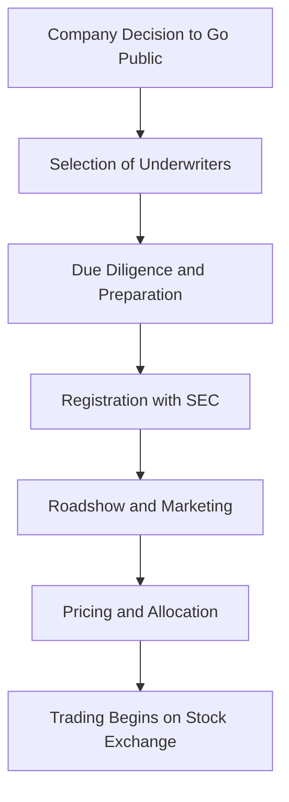
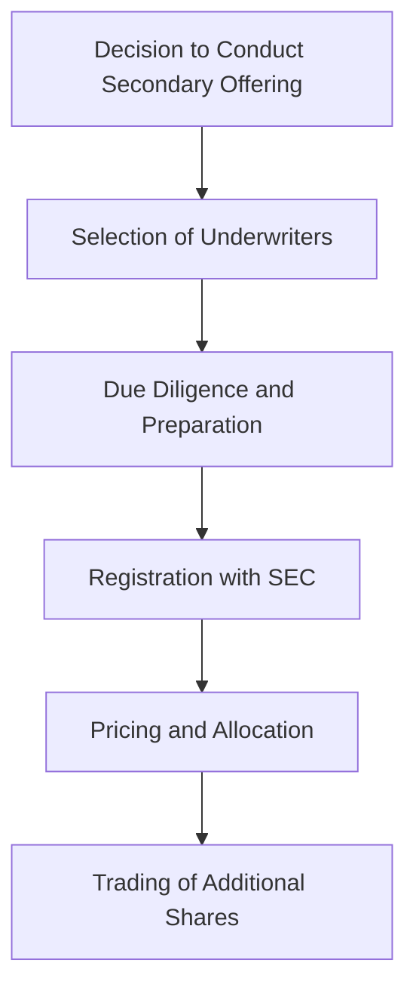

## 3.5 Initial and Secondary Offerings

In the world of finance, understanding the intricacies of Initial Public Offerings (IPOs) and Secondary Offerings is crucial for anyone pursuing a career as a General Securities Representative. These offerings are pivotal events in the life cycle of a company, providing opportunities for capital raising and investment. This section will delve into the processes, roles, regulatory requirements, and investor considerations associated with these offerings, equipping you with the knowledge necessary for the Series 7 Exam and your future career.

### Understanding Initial Public Offerings (IPOs)

#### What is an IPO?

An Initial Public Offering (IPO) is the process through which a private company offers its shares to the public for the first time. This transformation from a private to a public entity allows the company to raise capital from a broader investor base.

**Key Objectives of an IPO:**
- **Capital Raising:** Companies go public primarily to raise capital for expansion, debt repayment, or other corporate purposes.
- **Liquidity for Shareholders:** It provides liquidity to existing shareholders, including founders and early investors, by allowing them to sell their shares in the open market.
- **Public Profile and Credibility:** Being publicly traded can enhance a company's visibility, credibility, and ability to attract talent.

#### The IPO Process

The IPO process involves several steps, each critical to the successful launch of the offering. Below is a detailed flowchart illustrating the typical IPO process:

**1. Company Decision to Go Public:**
   - The company's board and management decide to pursue an IPO, considering the financial and strategic benefits.

**2. Selection of Underwriters:**
   - The company selects investment banks to act as underwriters. These underwriters play a crucial role in the IPO process, including pricing and selling the shares.

**3. Due Diligence and Preparation:**
   - Underwriters and company management conduct due diligence to ensure all financial information is accurate and complete. This step involves preparing the registration statement and prospectus.

**4. Registration with SEC:**
   - The company files a registration statement (Form S-1) with the Securities and Exchange Commission (SEC), detailing financial information, business operations, and risk factors.

**5. Roadshow and Marketing:**
   - Company executives and underwriters present the investment opportunity to potential investors through a series of presentations known as a roadshow.

**6. Pricing and Allocation:**
   - Based on investor feedback and market conditions, the final price of the shares is set. Shares are then allocated to institutional and retail investors.

**7. Trading Begins on Stock Exchange:**
   - The company's shares begin trading on a stock exchange, marking the completion of the IPO process.

#### Roles of Issuing Companies and Underwriters

**Issuing Companies:**
- **Preparation and Disclosure:** Companies must prepare comprehensive financial and business disclosures to meet regulatory requirements.
- **Strategic Planning:** Management must strategically plan the timing and size of the offering to maximize capital raised and market interest.

**Underwriters:**
- **Advisory Role:** Underwriters advise the company on the IPO process, pricing, and market conditions.
- **Risk Management:** They assume the risk of buying the shares from the company and selling them to the public, often using a firm commitment underwriting agreement.
- **Marketing and Distribution:** Underwriters are responsible for marketing the shares to potential investors and ensuring wide distribution.

### Regulatory Requirements for IPOs

The IPO process is heavily regulated to protect investors and maintain market integrity. Key regulatory requirements include:

- **Securities Act of 1933:** This act requires companies to register their securities with the SEC and provide detailed disclosures to investors.
- **Prospectus Requirement:** A prospectus must be provided to potential investors, outlining the company's financial condition, operations, and risks.
- **Quiet Period:** Companies must adhere to a quiet period before the IPO, during which they cannot release any information that could influence the stock price.

### Investor Considerations for IPOs

Investing in IPOs can be lucrative but also carries significant risks. Key considerations include:

- **Volatility:** IPO stocks can be highly volatile, with prices fluctuating significantly in the initial trading period.
- **Limited Historical Data:** Investors have limited historical financial data to assess the company's performance.
- **Lock-Up Periods:** Insiders may be subject to lock-up periods, during which they cannot sell their shares, potentially impacting stock price.

### Understanding Secondary Offerings

#### What is a Secondary Offering?

A Secondary Offering involves the sale of shares by a company that has already gone public. These offerings can take two forms:

- **Primary Offering:** The company issues additional shares to raise new capital.
- **Secondary Offering:** Existing shareholders sell their shares, with no new capital raised for the company.

**Key Objectives of Secondary Offerings:**
- **Capital Raising:** In a primary offering, the company raises additional capital for growth or other purposes.
- **Liquidity for Shareholders:** Secondary offerings provide liquidity for existing shareholders, such as founders or early investors.

#### The Secondary Offering Process

The process for a secondary offering is similar to an IPO but typically involves less regulatory scrutiny and shorter timelines. Below is a flowchart illustrating the secondary offering process:

**1. Decision to Conduct Secondary Offering:**
   - The company or existing shareholders decide to sell additional shares.

**2. Selection of Underwriters:**
   - Similar to an IPO, underwriters are selected to manage the offering.

**3. Due Diligence and Preparation:**
   - Due diligence is conducted to ensure all disclosures are accurate and complete.

**4. Registration with SEC:**
   - The company files a registration statement with the SEC, though this process is often expedited compared to an IPO.

**5. Pricing and Allocation:**
   - The offering price is set, and shares are allocated to investors.

**6. Trading of Additional Shares:**
   - The additional shares begin trading on the stock exchange.

#### Roles of Issuing Companies and Underwriters in Secondary Offerings

The roles of issuing companies and underwriters in secondary offerings are similar to those in IPOs, with a focus on efficient execution and pricing.

### Regulatory Requirements for Secondary Offerings

Secondary offerings are subject to regulatory requirements, though they are generally less stringent than those for IPOs. Key requirements include:

- **Securities Exchange Act of 1934:** This act governs the secondary trading of securities and requires ongoing disclosure by public companies.
- **Shelf Registration:** Companies can use a shelf registration to streamline the process, allowing them to issue shares over time without filing a new registration statement for each offering.

### Investor Considerations for Secondary Offerings

Investors considering secondary offerings should be aware of the following:

- **Dilution Risk:** Primary offerings can dilute existing shareholders' equity, potentially impacting stock price.
- **Market Perception:** Secondary offerings can signal different things to the market, such as confidence in growth or a need for liquidity.
- **Pricing Dynamics:** The offering price may be set at a discount to the current market price to attract investors.

### Practical Examples and Case Studies

#### Case Study: Facebook's IPO

Facebook's IPO in 2012 is a notable example of a high-profile public offering. The company raised $16 billion, making it one of the largest IPOs in history. However, the offering faced challenges, including technical issues on the Nasdaq exchange and concerns about valuation, highlighting the complexities of executing a successful IPO.

#### Example: Secondary Offering by Tesla

In 2020, Tesla conducted a secondary offering, raising $5 billion to strengthen its balance sheet and support growth initiatives. The offering was well-received by the market, reflecting investor confidence in the company's prospects.

### Best Practices and Common Pitfalls

**Best Practices:**
- **Thorough Preparation:** Companies should ensure all financial and business information is accurate and complete.
- **Effective Communication:** Clear communication with investors is crucial to manage expectations and build confidence.
- **Strategic Timing:** Timing the offering to align with favorable market conditions can enhance success.

**Common Pitfalls:**
- **Overvaluation:** Setting an unrealistic offering price can lead to poor performance and investor dissatisfaction.
- **Inadequate Disclosure:** Failing to provide comprehensive disclosures can lead to regulatory issues and loss of investor trust.
- **Market Volatility:** External market conditions can impact the success of the offering, requiring careful planning and risk management.

### Summary and Key Takeaways

Understanding the processes and considerations involved in IPOs and secondary offerings is essential for anyone pursuing a career in securities. Key takeaways include:

- **IPOs and secondary offerings are critical events for companies seeking to raise capital and provide liquidity to shareholders.**
- **The roles of issuing companies and underwriters are central to the success of these offerings, requiring careful planning and execution.**
- **Regulatory requirements are designed to protect investors and ensure market integrity, necessitating thorough preparation and compliance.**
- **Investor considerations include assessing risks, market conditions, and company fundamentals to make informed investment decisions.**

By mastering these concepts, you will be well-prepared for the Series 7 Exam and equipped to navigate the complexities of public offerings in your professional career.

## Series 7 Exam Practice Questions: Initial and Secondary Offerings



### What is the primary purpose of an Initial Public Offering (IPO)?

- [x] To raise capital for the company
- [ ] To allow insiders to sell their shares
- [ ] To reduce the company's debt
- [ ] To increase the company's market share

> **Explanation:** The primary purpose of an IPO is to raise capital for the company by offering shares to the public for the first time.

### Which of the following is a key role of underwriters in an IPO?

- [ ] Setting the company's dividend policy
- [ ] Managing the company's day-to-day operations
- [x] Advising on pricing and selling the shares
- [ ] Auditing the company's financial statements

> **Explanation:** Underwriters advise the company on pricing and selling the shares, assuming the risk of buying the shares and selling them to the public.

### What is a secondary offering?

- [ ] The first sale of a company's shares to the public
- [x] The sale of additional shares by a company that has already gone public
- [ ] The sale of bonds to institutional investors
- [ ] The issuance of stock options to employees

> **Explanation:** A secondary offering involves the sale of additional shares by a company that has already gone public, either through a primary or secondary offering.

### Which regulatory body oversees the registration of securities for IPOs?

- [ ] Financial Industry Regulatory Authority (FINRA)
- [x] Securities and Exchange Commission (SEC)
- [ ] Federal Reserve Board (FRB)
- [ ] Municipal Securities Rulemaking Board (MSRB)

> **Explanation:** The Securities and Exchange Commission (SEC) oversees the registration of securities for IPOs, ensuring compliance with the Securities Act of 1933.

### What is the purpose of a prospectus in an IPO?

- [ ] To announce the company's quarterly earnings
- [ ] To provide a summary of the company's marketing strategy
- [x] To disclose financial and business information to potential investors
- [ ] To outline the company's employee benefits plan

> **Explanation:** A prospectus is a legal document that discloses financial and business information to potential investors, helping them make informed decisions.

### What is a lock-up period in the context of an IPO?

- [ ] A period when the company cannot issue new shares
- [x] A period when insiders are restricted from selling their shares
- [ ] A period when the stock price is fixed
- [ ] A period when trading is halted

> **Explanation:** A lock-up period is a designated time frame during which insiders are restricted from selling their shares following an IPO, helping to stabilize the stock price.

### How does a secondary offering differ from an IPO?

- [ ] A secondary offering involves only bonds
- [ ] An IPO is conducted by private companies only
- [x] A secondary offering involves the sale of shares by a company that is already public
- [ ] An IPO does not require SEC registration

> **Explanation:** A secondary offering involves the sale of shares by a company that is already public, whereas an IPO is the first sale of a company's shares to the public.

### What is a shelf registration?

- [ ] A form of IPO for small companies
- [x] A registration that allows a company to issue securities over time
- [ ] A registration that limits the number of shares sold
- [ ] A registration that exempts the company from SEC oversight

> **Explanation:** A shelf registration allows a company to register securities and issue them over time without filing a new registration statement for each offering.

### Which of the following is a risk associated with secondary offerings?

- [ ] Increased company debt
- [x] Dilution of existing shareholders' equity
- [ ] Reduced market liquidity
- [ ] Increased regulatory scrutiny

> **Explanation:** A primary secondary offering can dilute existing shareholders' equity, potentially impacting the stock price.

### What is the main advantage of a company conducting a secondary offering?

- [ ] To decrease the company's market capitalization
- [x] To raise additional capital or provide liquidity to shareholders
- [ ] To eliminate the need for SEC registration
- [ ] To reduce the company's tax liability

> **Explanation:** The main advantage of a secondary offering is to raise additional capital for the company or provide liquidity to existing shareholders.


