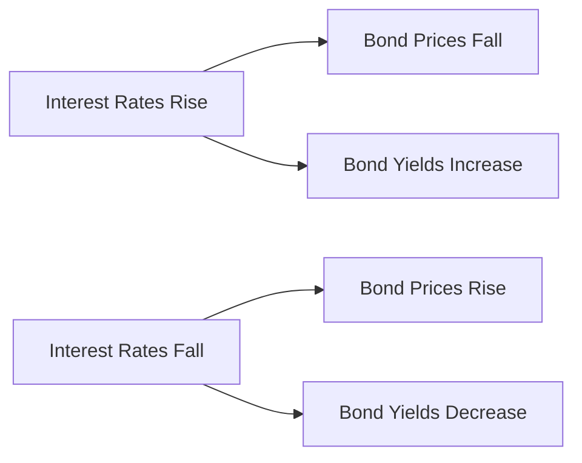

## 4.1.1 Definition and Key Terminology

Understanding the fundamental concepts and terminology related to bonds is crucial for anyone preparing for the Series 7 Exam. Bonds, as debt securities, represent a loan made by an investor to a borrower, typically corporate or governmental. This section will delve into the essential terms and concepts that form the foundation of bond investing, helping you build a solid understanding of how bonds function within the financial markets.

### Key Bond Terminology

#### Yield

**Yield** is a critical concept in bond investing, representing the return an investor receives on a bond. It is expressed as a percentage and can be calculated in several ways:

- **Current Yield:** This is calculated by dividing the bond's annual coupon payment by its current market price. It provides a snapshot of the income generated from the bond relative to its price.
  
- **Yield to Maturity (YTM):** This is the total return anticipated on a bond if it is held until it matures. YTM accounts for the bond's current market price, par value, coupon interest rate, and time to maturity. It assumes that all coupon payments are reinvested at the same rate.

- **Yield to Call (YTC):** Similar to YTM, YTC calculates the yield of a bond if it is called before maturity. This is relevant for callable bonds.

#### Coupon

The **coupon** of a bond refers to the annual interest payment made to bondholders, usually expressed as a percentage of the bond's face value (par value). For example, a bond with a $1,000 face value and a 5% coupon rate pays $50 annually. The coupon rate is fixed and does not change over the life of the bond.

#### Maturity

**Maturity** is the date on which the bond's principal, or face value, is repaid to bondholders. Bonds can have short-term (less than three years), medium-term (three to ten years), or long-term (more than ten years) maturities. The maturity date is crucial for determining the bond's duration and the timing of cash flows.

#### Discount and Premium

- **Discount:** A bond is said to be trading at a discount when its market price is below its par value. This often occurs when the bond's coupon rate is lower than current market interest rates.

- **Premium:** Conversely, a bond trades at a premium when its market price is above its par value. This typically happens when the bond's coupon rate is higher than prevailing market rates.

#### Indenture

An **indenture** is a formal legal agreement, or contract, between the bond issuer and the bondholders. It outlines the terms of the bond, including the interest rate, maturity date, and any covenants or conditions that the issuer must adhere to. The indenture serves as a protection for bondholders by detailing the responsibilities and obligations of the issuer.

#### Trustee

The **trustee** is an independent third party appointed to act on behalf of the bondholders to ensure that the terms of the indenture are adhered to. The trustee monitors the issuer's compliance with the indenture and can take action if the issuer defaults.

#### Call Provision

A **call provision** is a feature in some bonds that allows the issuer to redeem the bond before its maturity date, usually at a specified call price. This can be advantageous for issuers if interest rates decline, allowing them to refinance at a lower rate. However, it presents a reinvestment risk for bondholders, as they may have to reinvest the proceeds at lower rates.

### Relationship Between Coupon Rate and Market Price

The relationship between a bond's coupon rate and its market price is influenced by prevailing interest rates. Here’s how they interact:

- **When the coupon rate is higher than current market interest rates,** the bond is likely to trade at a premium. Investors are willing to pay more for the bond because it offers a higher return than newly issued bonds.

- **When the coupon rate is lower than current market interest rates,** the bond is likely to trade at a discount. Investors demand a lower price to compensate for the lower return compared to new issues.

This relationship is fundamental to understanding bond pricing and is influenced by the bond’s duration and the overall interest rate environment.

### Practical Example

Consider a bond with a face value of $1,000, a coupon rate of 6%, and a maturity of 10 years. If market interest rates rise to 7%, new bonds are issued with a 7% coupon rate. The original bond, with its 6% coupon, becomes less attractive, and its price will likely fall below $1,000 (a discount) to adjust for the lower yield.

Conversely, if interest rates fall to 5%, the original bond's 6% coupon becomes more attractive, and its price will rise above $1,000 (a premium).

### Glossary of Key Bond Terms

| Term            | Definition                                                                 |
|-----------------|-----------------------------------------------------------------------------|
| Yield           | The return an investor receives on a bond, expressed as a percentage.       |
| Coupon          | The annual interest payment made to bondholders, expressed as a percentage of the bond's face value. |
| Maturity        | The date on which the bond's principal is repaid to bondholders.            |
| Discount        | When a bond's market price is below its par value.                          |
| Premium         | When a bond's market price is above its par value.                          |
| Indenture       | A formal contract between the bond issuer and the bondholders.              |
| Trustee         | An independent third party that acts on behalf of bondholders to ensure compliance with the indenture. |
| Call Provision  | A feature that allows the issuer to redeem the bond before its maturity date. |

### Real-World Applications and Regulatory Scenarios

Understanding these key terms is not only crucial for the Series 7 Exam but also for practical applications in the securities industry. For instance, when advising clients on bond investments, you must consider how changes in interest rates might affect the value of their bond portfolios. Additionally, being aware of call provisions can help you assess the reinvestment risk associated with certain bonds.

Regulatory bodies like the Securities and Exchange Commission (SEC) and the Financial Industry Regulatory Authority (FINRA) oversee bond markets, ensuring transparency and fairness in the issuance and trading of bonds. Familiarity with these regulations is essential for compliance and effective client management.

### Diagrams and Visuals

To further illustrate these concepts, consider the following diagram that shows the relationship between interest rates and bond prices:

This diagram visually represents how interest rate movements affect bond prices and yields, a fundamental concept in bond investing.

### Best Practices and Common Pitfalls

**Best Practices:**

- **Stay Informed:** Keep up with current interest rate trends and economic indicators to anticipate changes in bond prices.
- **Diversify:** Consider a mix of bonds with varying maturities and credit qualities to manage risk.
- **Understand Terms:** Thoroughly review bond indentures and call provisions to understand potential risks and benefits.

**Common Pitfalls:**

- **Ignoring Interest Rate Risk:** Failing to consider how interest rate changes can impact bond prices and yields.
- **Overlooking Call Provisions:** Not accounting for the possibility of bonds being called, which can affect expected returns.
- **Misjudging Credit Risk:** Underestimating the risk of issuer default, which can lead to significant losses.

### Conclusion

Mastering the definition and key terminology of bonds is a foundational step in preparing for the Series 7 Exam. By understanding these concepts, you will be better equipped to analyze bond investments and advise clients effectively. Remember to apply these principles through practice questions and real-world scenarios to reinforce your learning and build confidence for the exam.

---

## Series 7 Exam Practice Questions: Definition and Key Terminology



### What is the yield of a bond?

- [x] The return an investor receives on a bond
- [ ] The interest rate set by the Federal Reserve
- [ ] The amount paid to purchase a bond
- [ ] The maturity date of a bond

> **Explanation:** Yield refers to the return an investor receives on a bond, expressed as a percentage. It is a key measure of a bond's profitability.

### What does the coupon rate of a bond represent?

- [ ] The bond's market price
- [x] The annual interest payment as a percentage of the bond's face value
- [ ] The bond's maturity date
- [ ] The bond's yield to maturity

> **Explanation:** The coupon rate is the annual interest payment made to bondholders, expressed as a percentage of the bond's face value. It is fixed and does not change over the life of the bond.

### What is a bond's maturity?

- [ ] The interest payment date
- [x] The date on which the bond's principal is repaid
- [ ] The bond's issue date
- [ ] The bond's yield to maturity

> **Explanation:** Maturity is the date on which the bond's principal is repaid to bondholders. It marks the end of the bond's term.

### When is a bond trading at a premium?

- [ ] When its market price is below its par value
- [x] When its market price is above its par value
- [ ] When its coupon rate is below market interest rates
- [ ] When its yield to maturity is lower than the coupon rate

> **Explanation:** A bond is trading at a premium when its market price is above its par value, often due to a higher coupon rate compared to current market rates.

### What is an indenture in the context of bonds?

- [ ] A type of bond with no coupon payments
- [ ] A bond that cannot be called before maturity
- [x] A formal contract between the bond issuer and bondholders
- [ ] The process of issuing a new bond

> **Explanation:** An indenture is a formal contract that outlines the terms of the bond, including interest rates, maturity date, and covenants.

### What role does a trustee play in bond issuance?

- [x] Acts on behalf of bondholders to ensure compliance with the indenture
- [ ] Sets the bond's interest rate
- [ ] Issues the bond to investors
- [ ] Determines the bond's maturity date

> **Explanation:** A trustee is an independent third party that acts on behalf of bondholders to ensure the issuer complies with the terms of the indenture.

### What is a call provision?

- [ ] A feature that allows bondholders to sell the bond back to the issuer
- [x] A clause that allows the issuer to redeem the bond before maturity
- [ ] A requirement for the issuer to pay additional interest
- [ ] A penalty for early bond redemption

> **Explanation:** A call provision allows the issuer to redeem the bond before its maturity date, usually at a specified call price.

### How does a rise in market interest rates affect bond prices?

- [x] Bond prices fall
- [ ] Bond prices rise
- [ ] Bond prices remain unchanged
- [ ] Bond yields decrease

> **Explanation:** When market interest rates rise, existing bond prices typically fall because new bonds are issued with higher yields, making older bonds less attractive.

### What is the current yield of a bond?

- [ ] The bond's yield to maturity
- [ ] The bond's coupon rate
- [x] The bond's annual coupon payment divided by its current market price
- [ ] The bond's yield to call

> **Explanation:** Current yield is calculated by dividing the bond's annual coupon payment by its current market price, providing a snapshot of its income relative to its price.

### What is the primary risk associated with a callable bond?

- [ ] Inflation risk
- [ ] Credit risk
- [x] Reinvestment risk
- [ ] Liquidity risk

> **Explanation:** Callable bonds present reinvestment risk because if they are called, investors may have to reinvest the proceeds at lower interest rates.



---
