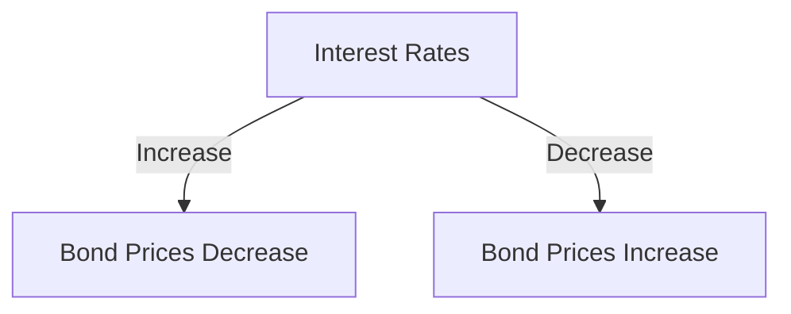
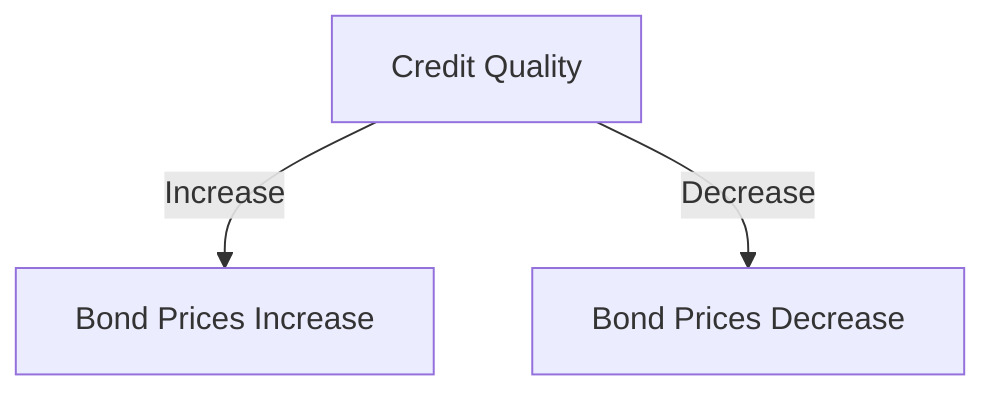
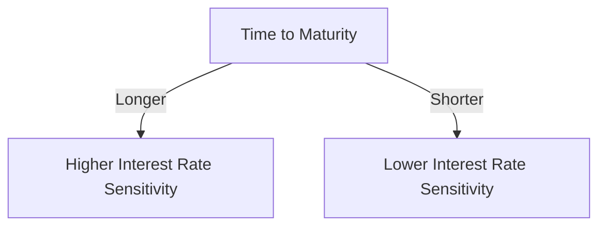
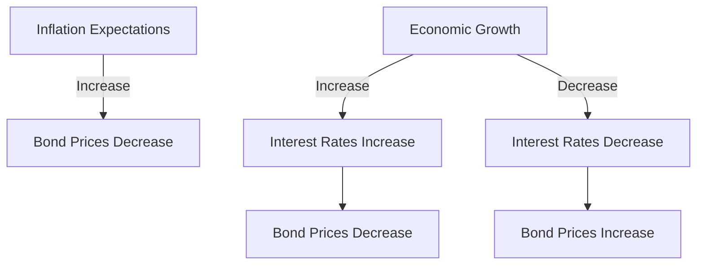

## 4.1.3 Factors Influencing Bond Prices

Understanding the factors that influence bond prices is crucial for anyone preparing for the Series 7 Exam. As a General Securities Representative, you will need to evaluate how various elements such as interest rates, credit quality, and time to maturity affect bond valuations. This section will provide you with detailed insights into these factors, helping you gain the knowledge necessary to excel on the exam and in your future career.

### Interest Rates and Bond Prices

One of the most critical factors affecting bond prices is the interest rate environment. There is an inverse relationship between interest rates and bond prices, meaning that as interest rates rise, bond prices typically fall, and vice versa. This relationship is rooted in the concept of opportunity cost and the fixed nature of bond coupon payments.

#### Inverse Relationship Explained

When interest rates rise, new bonds are issued with higher coupon rates, making existing bonds with lower rates less attractive. Consequently, the price of existing bonds must decrease to offer a yield comparable to new issues. Conversely, when interest rates decline, existing bonds with higher coupon rates become more valuable, leading to an increase in their prices.

**Example:** Consider a bond with a fixed coupon rate of 5%. If the prevailing interest rate in the market increases to 6%, new bonds would offer a 6% yield, making the 5% bond less attractive unless its price decreases. This price adjustment ensures that the yield on the older bond aligns with the new rate environment.

**Graphical Representation:**

### Credit Quality and Bond Prices

Credit quality, or the perceived ability of the bond issuer to meet its debt obligations, significantly impacts bond prices. Bonds issued by entities with high credit ratings are considered safer investments and typically trade at higher prices compared to those with lower ratings.

#### Credit Risk (Default Risk)

Credit risk, also known as default risk, is the possibility that a bond issuer will fail to make the required interest payments or repay the principal at maturity. Bonds with higher credit risk tend to offer higher yields to compensate investors for the increased risk. As credit quality deteriorates, bond prices generally fall to reflect the heightened risk.

**Example:** If a corporation faces financial difficulties and its credit rating is downgraded, the price of its bonds may decrease as investors demand a higher yield to compensate for the increased risk of default.

**Graphical Representation:**

### Time to Maturity and Bond Prices

The time remaining until a bond's maturity date also influences its price. Generally, longer-term bonds are more sensitive to interest rate changes than shorter-term bonds. This sensitivity is due to the longer duration over which interest rate changes can impact the bond's cash flows.

#### Interest Rate Risk

Interest rate risk is the risk that changes in interest rates will affect bond prices. Long-term bonds typically exhibit greater interest rate risk because they have a longer duration, meaning their cash flows are spread out over a longer period. As a result, small changes in interest rates can lead to significant price fluctuations.

**Example:** A 30-year bond will experience more price volatility in response to interest rate changes than a 5-year bond, due to its longer duration.

**Graphical Representation:**

### Market Demand and Economic Conditions

Market demand and broader economic conditions also play a role in determining bond prices. Factors such as inflation expectations, economic growth, and monetary policy can influence investor demand for bonds, thereby affecting their prices.

#### Inflation and Bond Prices

Inflation erodes the purchasing power of a bond's future cash flows, making bonds less attractive during periods of rising inflation. As inflation expectations increase, bond prices tend to decrease, as investors demand higher yields to compensate for the loss in purchasing power.

**Example:** If inflation is expected to rise, investors may sell bonds, driving prices down and yields up, to seek investments that offer better inflation protection.

#### Economic Growth and Monetary Policy

Economic growth and monetary policy decisions by central banks, such as the Federal Reserve, can impact interest rates and, consequently, bond prices. During periods of economic expansion, interest rates may rise to control inflation, leading to lower bond prices. Conversely, during economic downturns, central banks may lower interest rates to stimulate growth, resulting in higher bond prices.

**Graphical Representation:**

### Practical Examples and Case Studies

To further illustrate these concepts, let's explore some practical examples and case studies relevant to the US securities industry.

#### Case Study: The Impact of Federal Reserve Rate Hikes

In 2018, the Federal Reserve raised interest rates multiple times as part of its monetary policy strategy to curb inflation and stabilize the economy. As a result, bond prices across various sectors experienced declines. This case study highlights the direct impact of central bank policies on bond markets and underscores the importance of understanding interest rate dynamics.

#### Example: Credit Rating Downgrade

In 2011, Standard & Poor's downgraded the US credit rating from AAA to AA+. This downgrade led to increased volatility in the bond markets, with investors reassessing the risk associated with US Treasury securities. Although US Treasuries are typically considered safe investments, this event demonstrated how changes in credit ratings could influence bond prices and investor sentiment.

### Summary and Key Takeaways

Understanding the factors that influence bond prices is essential for anyone preparing for the Series 7 Exam. Key takeaways include:

- **Interest Rates:** There is an inverse relationship between interest rates and bond prices. Rising rates lead to falling bond prices and vice versa.
- **Credit Quality:** Higher credit quality generally results in higher bond prices, while lower credit quality leads to lower prices due to increased default risk.
- **Time to Maturity:** Longer-term bonds are more sensitive to interest rate changes, exhibiting greater price volatility.
- **Market Demand and Economic Conditions:** Inflation expectations, economic growth, and monetary policy decisions can significantly impact bond prices.

By mastering these concepts, you'll be well-equipped to analyze bond markets and make informed investment decisions.

## Series 7 Exam Practice Questions: Factors Influencing Bond Prices



### How do rising interest rates affect bond prices?

- [x] Bond prices decrease
- [ ] Bond prices increase
- [ ] Bond prices remain unchanged
- [ ] Bond prices fluctuate randomly

> **Explanation:** Rising interest rates lead to a decrease in bond prices because new bonds offer higher yields, making existing bonds with lower rates less attractive.

### What is the relationship between credit quality and bond prices?

- [ ] Higher credit quality leads to lower bond prices
- [x] Higher credit quality leads to higher bond prices
- [ ] Credit quality does not affect bond prices
- [ ] Lower credit quality leads to higher bond prices

> **Explanation:** Higher credit quality is associated with lower risk, resulting in higher bond prices as investors are willing to pay more for safer investments.

### Which type of bond is more sensitive to interest rate changes?

- [ ] Short-term bonds
- [x] Long-term bonds
- [ ] Zero-coupon bonds
- [ ] Convertible bonds

> **Explanation:** Long-term bonds are more sensitive to interest rate changes because their cash flows are spread over a longer period, leading to greater price volatility.

### What happens to bond prices during periods of rising inflation expectations?

- [x] Bond prices decrease
- [ ] Bond prices increase
- [ ] Bond prices remain stable
- [ ] Bond prices fluctuate unpredictably

> **Explanation:** Rising inflation expectations decrease bond prices as investors demand higher yields to compensate for the loss in purchasing power.

### How does a credit rating downgrade affect bond prices?

- [x] Bond prices decrease
- [ ] Bond prices increase
- [ ] Bond prices remain unaffected
- [ ] Bond prices rise temporarily

> **Explanation:** A credit rating downgrade increases perceived risk, leading to a decrease in bond prices as investors demand higher yields.

### What is interest rate risk?

- [ ] The risk of default by the bond issuer
- [x] The risk that bond prices will decline due to rising interest rates
- [ ] The risk of inflation eroding purchasing power
- [ ] The risk of economic downturns affecting bond markets

> **Explanation:** Interest rate risk refers to the potential decline in bond prices due to rising interest rates.

### How do economic downturns typically affect bond prices?

- [ ] Bond prices decrease
- [x] Bond prices increase
- [ ] Bond prices remain stable
- [ ] Bond prices fluctuate unpredictably

> **Explanation:** During economic downturns, central banks may lower interest rates to stimulate growth, leading to higher bond prices.

### What is the primary reason for the inverse relationship between interest rates and bond prices?

- [ ] Inflation expectations
- [x] Opportunity cost and fixed coupon payments
- [ ] Credit quality changes
- [ ] Economic growth fluctuations

> **Explanation:** The inverse relationship is due to the opportunity cost associated with fixed coupon payments, making existing bonds less attractive when new bonds offer higher yields.

### Which factor is least likely to influence bond prices?

- [ ] Interest rates
- [ ] Credit quality
- [ ] Time to maturity
- [x] Stock market performance

> **Explanation:** While stock market performance can indirectly affect bond prices through economic conditions, it is not a direct factor influencing bond valuations.

### What effect does monetary policy have on bond prices?

- [x] It can increase or decrease bond prices depending on interest rate changes
- [ ] It has no effect on bond prices
- [ ] It only affects short-term bond prices
- [ ] It only affects long-term bond prices

> **Explanation:** Monetary policy impacts bond prices by influencing interest rates, which can lead to increases or decreases in bond valuations.


