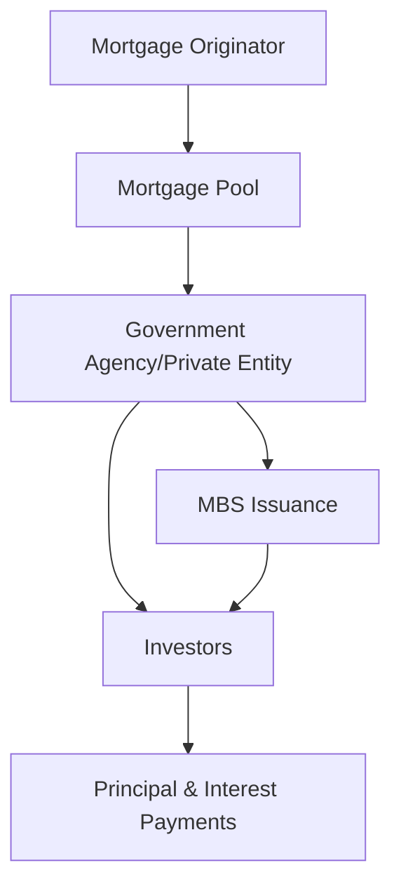

## 4.2.2.3 Mortgage-Backed Securities

Mortgage-Backed Securities (MBS) are a cornerstone of the fixed-income market, offering investors a unique opportunity to gain exposure to the real estate market through securitized debt. This section of the Series 7 Exam Study Guide will delve into the creation, structure, and risks associated with MBS, providing you with the knowledge needed to understand and evaluate these complex financial instruments.

### Understanding Mortgage-Backed Securities

**Mortgage-Backed Security (MBS):** A security backed by a pool of mortgages, typically residential, that pays periodic payments derived from the underlying mortgage loans.

#### Creation of Mortgage-Backed Securities

MBS are created through a process known as securitization. This involves pooling together a large number of individual mortgages and selling them as a single security to investors. The process typically involves the following steps:

1. **Origination of Mortgages:** Banks and other financial institutions issue mortgage loans to homebuyers.
2. **Pooling of Mortgages:** These individual mortgages are pooled together to create a large pool of mortgage loans.
3. **Securitization:** The pool of mortgages is then sold to a government agency or a private entity, which issues securities backed by the mortgage pool.
4. **Issuance of MBS:** The entity creates MBS, which are sold to investors. These securities represent claims on the cash flows generated by the underlying mortgage pool.

### Cash Flow Structure of MBS

The cash flow structure of MBS is designed to pass the mortgage payments from borrowers to investors. The key components of MBS cash flows include:

- **Principal Payments:** The repayment of the original loan amount by borrowers.
- **Interest Payments:** The interest paid by borrowers on their mortgage loans.
- **Prepayments:** Early repayment of the mortgage principal by borrowers, which can affect the timing and amount of cash flows to investors.

#### Prepayment Risk

**Prepayment Risk:** The risk that the underlying mortgages will be paid off earlier than expected, which can affect the yield and timing of cash flows for MBS investors.

Prepayment risk is a significant concern for MBS investors because it can lead to reinvestment risk. When interest rates fall, borrowers are more likely to refinance their mortgages, leading to higher prepayment rates. This results in investors receiving their principal back sooner than expected, often at a time when they cannot reinvest it at the same yield.

### Types of Mortgage-Backed Securities

There are several types of MBS, each with its own characteristics and risk profiles:

1. **Pass-Through Securities:** These are the simplest form of MBS, where investors receive a pro-rata share of all principal and interest payments made by the borrowers in the mortgage pool.
   
2. **Collateralized Mortgage Obligations (CMOs):** These are more complex MBS that divide the mortgage pool into different tranches, each with its own risk and return profile. CMOs are designed to offer varying levels of prepayment risk and interest rate sensitivity.

3. **Stripped Mortgage-Backed Securities:** These securities separate the principal and interest payments into two different securities, allowing investors to choose between interest-only (IO) and principal-only (PO) payments.

### Illustrations of MBS Structures

To better understand the structure of MBS, let's visualize the process using diagrams.

In this diagram, the mortgage originator pools together individual mortgages and sells them to a government agency or private entity, which then issues MBS to investors. The investors receive principal and interest payments based on the cash flows from the mortgage pool.

### Regulatory Framework and Market Dynamics

The MBS market is heavily influenced by regulatory frameworks and market dynamics. Key regulatory bodies overseeing the MBS market include:

- **Securities and Exchange Commission (SEC):** Regulates the issuance and trading of MBS to ensure transparency and protect investors.
- **Government-Sponsored Enterprises (GSEs):** Entities like Fannie Mae and Freddie Mac play a crucial role in the MBS market by providing liquidity and stability.

### Practical Examples and Case Studies

To illustrate the real-world application of MBS, consider the following example:

**Case Study: The Impact of Interest Rate Changes on MBS**

Suppose you are an investor holding a portfolio of pass-through MBS. When interest rates decline, homeowners are more likely to refinance their mortgages, leading to higher prepayment rates. As a result, you receive your principal back sooner than expected, reducing the yield on your investment. Understanding this dynamic is crucial for managing prepayment risk in an MBS portfolio.

### Best Practices and Exam Tips

- **Understand the Impact of Interest Rates:** Familiarize yourself with how changes in interest rates affect prepayment rates and the yield on MBS.
- **Evaluate Different MBS Structures:** Be aware of the differences between pass-through securities, CMOs, and stripped MBS, and how they impact risk and return.
- **Stay Informed on Regulatory Changes:** Keep up-to-date with regulatory developments that may affect the MBS market, as these can influence market dynamics and investor behavior.

### Summary

Mortgage-Backed Securities are a vital component of the bond market, offering investors exposure to the real estate sector through securitized debt. Understanding the creation, structure, and risks associated with MBS is essential for navigating this complex market. By mastering these concepts, you will be well-prepared to tackle questions on MBS in the Series 7 Exam and apply this knowledge in your future career as a securities representative.

## Series 7 Exam Practice Questions: Mortgage-Backed Securities



### What is the primary risk associated with Mortgage-Backed Securities?

- [ ] Credit Risk
- [x] Prepayment Risk
- [ ] Liquidity Risk
- [ ] Currency Risk

> **Explanation:** Prepayment risk is the primary concern for MBS investors, as it affects the timing and amount of cash flows due to early repayment of mortgages.

### Which type of MBS divides the mortgage pool into different tranches?

- [ ] Pass-Through Securities
- [x] Collateralized Mortgage Obligations (CMOs)
- [ ] Stripped MBS
- [ ] Convertible Bonds

> **Explanation:** CMOs divide the mortgage pool into tranches, each with different risk and return profiles, to manage prepayment risk and interest rate sensitivity.

### How does a decrease in interest rates typically affect prepayment rates in MBS?

- [x] Increases prepayment rates
- [ ] Decreases prepayment rates
- [ ] Has no effect on prepayment rates
- [ ] Causes prepayment rates to fluctuate unpredictably

> **Explanation:** A decrease in interest rates often leads to higher prepayment rates as borrowers refinance their mortgages to take advantage of lower rates.

### What is a characteristic of pass-through MBS?

- [x] Investors receive a pro-rata share of all payments
- [ ] Investors receive only interest payments
- [ ] Investors receive only principal payments
- [ ] Payments are made only at maturity

> **Explanation:** In pass-through MBS, investors receive a pro-rata share of all principal and interest payments made by the borrowers in the mortgage pool.

### Which regulatory body oversees the issuance and trading of MBS?

- [x] Securities and Exchange Commission (SEC)
- [ ] Federal Reserve Board (FRB)
- [ ] Financial Industry Regulatory Authority (FINRA)
- [ ] Office of the Comptroller of the Currency (OCC)

> **Explanation:** The SEC regulates the issuance and trading of MBS to ensure transparency and protect investors.

### What is the role of government-sponsored enterprises (GSEs) in the MBS market?

- [x] Provide liquidity and stability
- [ ] Set interest rates for MBS
- [ ] Manage prepayment risk
- [ ] Issue all MBS

> **Explanation:** GSEs like Fannie Mae and Freddie Mac provide liquidity and stability in the MBS market by purchasing mortgages and issuing MBS.

### What happens to the yield on MBS when prepayment rates increase?

- [x] Yield decreases
- [ ] Yield increases
- [ ] Yield remains the same
- [ ] Yield becomes unpredictable

> **Explanation:** When prepayment rates increase, investors receive their principal back sooner, often at lower yields, reducing the overall yield on MBS.

### Which type of MBS allows investors to choose between interest-only and principal-only payments?

- [ ] Pass-Through Securities
- [ ] CMOs
- [x] Stripped MBS
- [ ] Convertible Bonds

> **Explanation:** Stripped MBS separate principal and interest payments, allowing investors to choose between interest-only (IO) and principal-only (PO) payments.

### What is the primary purpose of securitizing mortgages into MBS?

- [ ] To increase mortgage interest rates
- [x] To provide liquidity to the mortgage market
- [ ] To decrease homeownership rates
- [ ] To eliminate prepayment risk

> **Explanation:** Securitizing mortgages into MBS provides liquidity to the mortgage market, allowing lenders to issue more loans and facilitate homeownership.

### How can investors manage prepayment risk in an MBS portfolio?

- [x] Diversify across different MBS structures
- [ ] Only invest in pass-through securities
- [ ] Avoid investing in MBS altogether
- [ ] Focus solely on interest rate predictions

> **Explanation:** Diversifying across different MBS structures, such as CMOs and stripped MBS, can help manage prepayment risk by offering varying levels of exposure.



By understanding the intricacies of Mortgage-Backed Securities, you will be better equipped to navigate the complexities of the bond market and excel in your Series 7 Exam preparation.
