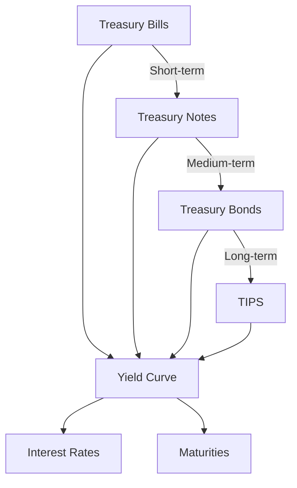

## 4.2.2 Government Bonds

Government bonds are a cornerstone of the fixed-income securities market, offering a unique combination of safety, liquidity, and predictable returns. As a candidate preparing for the Series 7 Exam, understanding government bonds is crucial, as they form a significant part of the exam content and are integral to the securities industry.

### Purpose and Characteristics of Government Bonds

Government bonds are debt securities issued by a government to support government spending and obligations. They are considered one of the safest investments because they are backed by the "full faith and credit" of the issuing government. In the United States, these bonds are issued by the U.S. Department of the Treasury and are commonly referred to as Treasury securities.

**Key Characteristics:**

- **Issuer:** The U.S. government, through the Department of the Treasury.
- **Safety:** Considered virtually risk-free with respect to credit risk, as they are backed by the U.S. government.
- **Liquidity:** Highly liquid, with active secondary markets.
- **Interest Payments:** Typically pay semi-annual interest.
- **Tax Treatment:** Interest income is exempt from state and local taxes but subject to federal income tax.

### Types of U.S. Treasury Securities

The U.S. Treasury issues several types of securities, each with different maturities and characteristics. Understanding these differences is essential for the Series 7 Exam.

#### Treasury Bills (T-Bills)

- **Maturity:** Short-term, ranging from a few days to one year.
- **Interest Payments:** Sold at a discount to face value; the difference between purchase price and face value is the interest.
- **Liquidity:** Highly liquid and actively traded in the secondary market.
- **Use Case:** Ideal for investors seeking a safe, short-term investment.

#### Treasury Notes (T-Notes)

- **Maturity:** Medium-term, ranging from two to ten years.
- **Interest Payments:** Pay semi-annual interest, known as coupon payments.
- **Liquidity:** Highly liquid with an active secondary market.
- **Use Case:** Suitable for investors looking for a balance between risk and return over a medium-term horizon.

#### Treasury Bonds (T-Bonds)

- **Maturity:** Long-term, typically 20 to 30 years.
- **Interest Payments:** Pay semi-annual interest.
- **Liquidity:** Liquid, though less so than T-Bills and T-Notes due to longer maturities.
- **Use Case:** Appropriate for long-term investors seeking stable income.

#### Treasury Inflation-Protected Securities (TIPS)

- **Maturity:** Available in 5, 10, and 30-year terms.
- **Interest Payments:** Pay semi-annual interest; principal adjusts with inflation.
- **Inflation Protection:** Principal is adjusted based on changes in the Consumer Price Index (CPI).
- **Use Case:** Ideal for investors seeking protection against inflation.

### Advantages of Government Bonds

Government bonds offer several advantages that make them attractive to a wide range of investors:

- **Safety:** As the safest form of debt investment, they carry minimal credit risk.
- **Liquidity:** Easily bought and sold in secondary markets, providing flexibility for investors.
- **Predictable Income:** Regular interest payments provide a steady income stream.
- **Diversification:** Adding government bonds to a portfolio can reduce overall risk.
- **Inflation Protection:** TIPS offer protection against inflation, preserving purchasing power.

### Yield Charts for Government Bonds

Understanding the yield curve is essential for analyzing government bonds. The yield curve represents the relationship between interest rates and the maturity of debt securities.

### Practical Examples and Scenarios

**Scenario 1: Portfolio Diversification**

An investor with a high-risk equity portfolio may add Treasury bonds to balance risk and ensure steady income. This diversification strategy helps mitigate potential losses from volatile equity markets.

**Scenario 2: Inflation Protection**

An investor concerned about inflation might invest in TIPS to ensure that their investment keeps pace with rising prices, thus preserving their purchasing power.

### Regulatory and Compliance Considerations

Government bonds are subject to specific regulations that ensure their safety and reliability. The U.S. Treasury, along with the Securities and Exchange Commission (SEC), oversees the issuance and trading of these securities to maintain market integrity.

### Common Pitfalls and Exam Tips

- **Misunderstanding Yield Curves:** Ensure you understand how yield curves indicate economic conditions and interest rate expectations.
- **Confusing Types of Securities:** Remember the differences between T-Bills, T-Notes, T-Bonds, and TIPS, especially regarding maturity and interest payments.
- **Overlooking Tax Implications:** Government bond interest is federally taxable but exempt from state and local taxes.

### Summary

Government bonds are a vital component of the securities market, offering safety, liquidity, and steady returns. Understanding their characteristics, types, and advantages is crucial for success on the Series 7 Exam and in a career as a securities representative.

## Series 7 Exam Practice Questions: Government Bonds



### What is the primary characteristic that makes U.S. Treasury securities considered risk-free?

- [x] They are backed by the "full faith and credit" of the U.S. government.
- [ ] They are exempt from federal taxes.
- [ ] They offer the highest interest rates.
- [ ] They are issued in large denominations.

> **Explanation:** U.S. Treasury securities are considered risk-free because they are backed by the "full faith and credit" of the U.S. government, ensuring repayment.

### Which type of Treasury security is sold at a discount and matures in less than one year?

- [x] Treasury Bills
- [ ] Treasury Notes
- [ ] Treasury Bonds
- [ ] Treasury Inflation-Protected Securities (TIPS)

> **Explanation:** Treasury Bills (T-Bills) are short-term securities sold at a discount and mature in less than one year.

### How do Treasury Inflation-Protected Securities (TIPS) protect investors?

- [ ] By offering higher interest rates
- [x] By adjusting the principal for inflation
- [ ] By exempting interest from federal taxes
- [ ] By providing a fixed return regardless of market conditions

> **Explanation:** TIPS protect investors by adjusting the principal amount based on changes in the Consumer Price Index (CPI), thus guarding against inflation.

### What is a key advantage of investing in government bonds?

- [ ] High risk and high return potential
- [x] Safety and liquidity
- [ ] Exemption from all taxes
- [ ] Guaranteed high yields

> **Explanation:** Government bonds are known for their safety and liquidity, making them a stable investment choice.

### What is the typical maturity range for Treasury Notes?

- [ ] Less than one year
- [x] Two to ten years
- [ ] Ten to twenty years
- [ ] Twenty to thirty years

> **Explanation:** Treasury Notes typically have maturities ranging from two to ten years.

### Which type of Treasury security is most suitable for a long-term investor seeking stable income?

- [ ] Treasury Bills
- [ ] Treasury Notes
- [x] Treasury Bonds
- [ ] Treasury Inflation-Protected Securities (TIPS)

> **Explanation:** Treasury Bonds, with their long-term maturities, are suitable for investors seeking stable income over a long period.

### How is the interest on Treasury securities taxed?

- [ ] Exempt from all taxes
- [x] Subject to federal taxes but exempt from state and local taxes
- [ ] Subject to state and local taxes only
- [ ] Exempt from federal taxes only

> **Explanation:** Interest on Treasury securities is subject to federal taxes but is exempt from state and local taxes.

### What does the yield curve represent?

- [ ] The difference between the highest and lowest interest rates
- [x] The relationship between interest rates and the maturity of debt securities
- [ ] The average interest rate over time
- [ ] The interest rate offered by the Federal Reserve

> **Explanation:** The yield curve represents the relationship between interest rates and the maturity of debt securities, indicating economic conditions.

### What is a common use case for Treasury Bills?

- [ ] Long-term investment
- [x] Short-term investment
- [ ] Inflation protection
- [ ] High-risk speculation

> **Explanation:** Treasury Bills are ideal for short-term investments due to their short maturities and liquidity.

### Which regulatory body oversees the issuance and trading of U.S. Treasury securities?

- [ ] The Federal Reserve
- [x] The U.S. Department of the Treasury
- [ ] The Financial Industry Regulatory Authority (FINRA)
- [ ] The Municipal Securities Rulemaking Board (MSRB)

> **Explanation:** The U.S. Department of the Treasury oversees the issuance and trading of Treasury securities.



By mastering the concepts outlined in this section, you will be well-prepared to tackle questions related to government bonds on the Series 7 Exam. Remember to review the different types of Treasury securities, their features, and the advantages they offer to investors.
