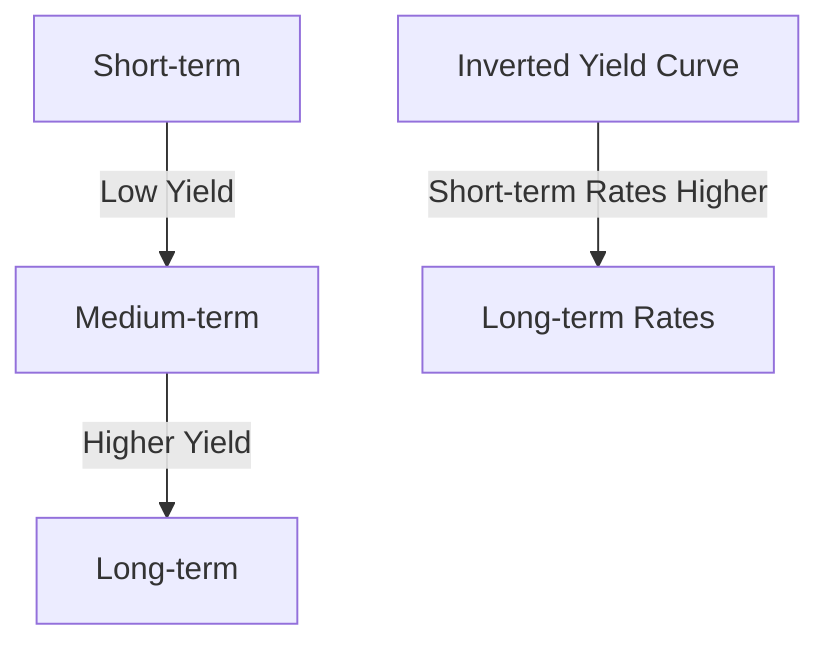

## 4.3 Bond Yields and Risks

In the realm of debt securities, understanding bond yields and associated risks is crucial for both investors and financial professionals. As you prepare for the Series 7 Exam, mastering these concepts will not only help you pass the exam but also equip you with the knowledge to make informed investment decisions and advise clients effectively.

### Understanding Bond Yields

Bond yields are a critical measure of the return an investor can expect from a bond. They provide insights into the bond's performance and the risks involved. Let's explore the different yield measures:

#### Nominal Yield

The **nominal yield**, also known as the coupon rate, is the annual interest payment made by the bond issuer relative to the bond's face value. It is expressed as a percentage and remains constant throughout the life of the bond.

- **Example:** If a bond has a face value of $1,000 and a coupon rate of 5%, the nominal yield is 5%. This means the bond pays $50 in interest annually.

#### Current Yield

The **current yield** represents the bond's annual interest payment divided by its current market price. It reflects the income component of the bond's return.

- **Formula:** Current Yield = (Annual Coupon Payment / Current Market Price) × 100
- **Example:** A bond with a $50 annual coupon payment and a current market price of $950 has a current yield of approximately 5.26%.

#### Yield to Maturity (YTM)

**Yield to Maturity (YTM)** is the total return an investor can expect if the bond is held until it matures, assuming all payments are made as scheduled. It considers the bond's current market price, coupon payments, and the time remaining until maturity.

- **Formula:** YTM is calculated using a complex formula that equates the present value of future cash flows to the bond's current price. Financial calculators or software are typically used for precise calculations.
- **Example:** A bond priced at $950 with a 5% coupon and 10 years to maturity might have a YTM of 5.5%, indicating a higher return due to the discount price.

#### Yield to Call (YTC)

**Yield to Call (YTC)** applies to callable bonds, which can be redeemed by the issuer before maturity. YTC estimates the yield assuming the bond is called at the earliest possible date.

- **Example:** If a callable bond is priced at $980 with a 5% coupon and can be called in 5 years at $1,000, the YTC might be 5.2%.

### Yield Curve and Its Interpretation

The yield curve is a graphical representation of interest rates across different maturities. It provides insights into market expectations and economic conditions.

- **Normal Yield Curve:** Indicates economic expansion, with long-term yields higher than short-term yields.
- **Inverted Yield Curve:** Suggests economic recession, with short-term yields exceeding long-term yields.
- **Flat Yield Curve:** Implies economic uncertainty, with little difference between short and long-term yields.

### Risks Associated with Bonds

Understanding the risks associated with bonds is essential for evaluating their suitability in a portfolio. Key risks include:

#### Credit Risk

**Credit Risk** is the risk that the bond issuer will default on interest payments or principal repayment. It is assessed by credit ratings provided by agencies like Moody's and Standard & Poor's.

- **Example:** A bond rated 'AAA' has low credit risk, while a 'BB' rated bond has higher risk.

#### Interest Rate Risk

**Interest Rate Risk** is the risk that changes in interest rates will affect bond prices. When interest rates rise, bond prices fall, and vice versa.

- **Example:** A bond with a long duration is more sensitive to interest rate changes than a short-duration bond.

#### Reinvestment Risk

**Reinvestment Risk** arises when bondholders must reinvest interest payments or principal at lower rates than the bond's original yield.

- **Example:** If a bond paying 5% matures and current rates are 3%, reinvestment risk materializes as returns decrease.

### Practical Examples and Case Studies

Consider a scenario where an investor holds a portfolio of bonds with varying maturities and credit ratings. By analyzing the yield curve, they can adjust their portfolio to mitigate risks. For instance, during an economic downturn, they might shift towards shorter-duration bonds to reduce interest rate risk.

### Real-World Applications and Regulatory Considerations

In practice, bond yields and risks are critical for portfolio management and regulatory compliance. Financial advisors must understand these concepts to provide accurate advice and adhere to regulations such as those set by the Securities and Exchange Commission (SEC) and Financial Industry Regulatory Authority (FINRA).

### Summary

Understanding bond yields and risks is vital for success in the Series 7 Exam and in the securities industry. By mastering these concepts, you can make informed decisions and provide valuable insights to clients.

## Series 7 Exam Practice Questions: Bond Yields and Risks



### What does the nominal yield of a bond represent?

- [x] The annual interest payment relative to the bond's face value
- [ ] The bond's total return if held to maturity
- [ ] The bond's yield assuming it is called at the earliest date
- [ ] The bond's annual interest payment divided by its current market price

> **Explanation:** The nominal yield is the bond's coupon rate, representing the annual interest payment based on the bond's face value.

### How is the current yield of a bond calculated?

- [ ] Annual coupon payment divided by face value
- [x] Annual coupon payment divided by current market price
- [ ] Total return if held to maturity
- [ ] Interest payment adjusted for inflation

> **Explanation:** Current yield is calculated by dividing the annual coupon payment by the bond's current market price.

### What does Yield to Maturity (YTM) indicate?

- [ ] The bond's interest payment as a percentage of face value
- [ ] The bond's price relative to its coupon rate
- [x] The total return anticipated on a bond if held until it matures
- [ ] The bond's yield if called before maturity

> **Explanation:** YTM is the total return expected if a bond is held to maturity, considering all payments and the bond's current price.

### Which risk is associated with the possibility of an issuer defaulting on payments?

- [x] Credit Risk
- [ ] Interest Rate Risk
- [ ] Reinvestment Risk
- [ ] Inflation Risk

> **Explanation:** Credit risk refers to the risk of the issuer defaulting on interest or principal payments.

### What does an inverted yield curve typically indicate?

- [ ] Economic expansion
- [x] Economic recession
- [ ] Stable economic conditions
- [ ] High inflation

> **Explanation:** An inverted yield curve suggests a potential economic recession, with short-term yields higher than long-term yields.

### How does interest rate risk affect bond prices?

- [ ] Bond prices increase when interest rates rise
- [x] Bond prices decrease when interest rates rise
- [ ] Bond prices remain unchanged regardless of interest rates
- [ ] Bond prices are unaffected by interest rate changes

> **Explanation:** Interest rate risk causes bond prices to decrease when interest rates rise and increase when rates fall.

### What is reinvestment risk?

- [ ] The risk of issuer default
- [ ] The risk of bond price volatility
- [x] The risk of reinvesting at lower rates
- [ ] The risk of inflation eroding returns

> **Explanation:** Reinvestment risk is the risk of having to reinvest bond proceeds at lower interest rates than the original bond.

### Which yield measure is most relevant for callable bonds?

- [ ] Nominal Yield
- [ ] Current Yield
- [ ] Yield to Maturity
- [x] Yield to Call

> **Explanation:** Yield to Call is relevant for callable bonds, estimating the yield if the bond is called at the earliest date.

### What does a flat yield curve suggest?

- [ ] Economic growth
- [ ] High inflation
- [x] Economic uncertainty
- [ ] Low credit risk

> **Explanation:** A flat yield curve suggests economic uncertainty, with little difference between short and long-term yields.

### Which factor primarily affects a bond's credit risk?

- [ ] Interest rates
- [x] Issuer's creditworthiness
- [ ] Inflation rates
- [ ] Bond's duration

> **Explanation:** Credit risk is primarily affected by the issuer's creditworthiness, as assessed by credit ratings.



By understanding these concepts and practicing with these questions, you will be well-prepared to tackle bond-related topics on the Series 7 Exam.
