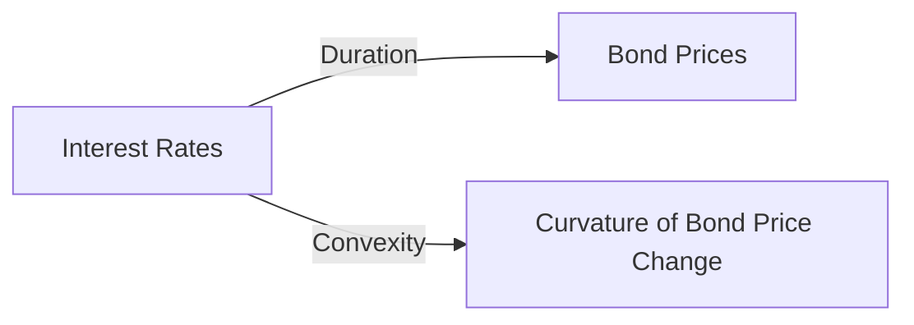
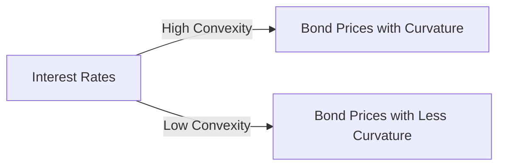

## 4.4.3 Duration and Convexity

Understanding the concepts of duration and convexity is crucial for evaluating bond investments, particularly in the context of interest rate fluctuations. These measures are fundamental tools for bond portfolio managers and analysts, providing insights into how bond prices are likely to respond to changes in interest rates. This section will delve into these concepts, offering practical examples, graphical illustrations, and actionable insights to help you prepare for the Series 7 Exam.

### Duration: Measuring Price Sensitivity

**Duration** is a measure of a bond's sensitivity to changes in interest rates, expressed in years. It estimates how much the price of a bond is expected to change for a 1% change in interest rates. Duration is an essential concept because it helps investors understand the risk associated with interest rate movements.

#### Types of Duration

1. **Macaulay Duration**: This is the weighted average time until a bond's cash flows are received. It is expressed in years and is used primarily to compare bonds with different cash flow patterns.

2. **Modified Duration**: This is a derivative of Macaulay Duration and provides a more direct measure of a bond's price sensitivity to interest rate changes. It is calculated by dividing the Macaulay Duration by one plus the bond's yield to maturity (YTM) divided by the number of compounding periods per year.

3. **Effective Duration**: This measure is used for bonds with embedded options, such as callable or putable bonds. It accounts for the fact that cash flows may change if the options are exercised.

#### Calculating Duration

To calculate the Macaulay Duration, you need to determine the present value of each cash flow, multiply each by the time period in which it is received, and then sum these values. Finally, divide by the total present value of the bond's cash flows.

**Formula:**
 
\text{Macaulay Duration} = \frac{\sum \left( \frac{C_t}{(1+y)^t} \times t \right)}{\sum \frac{C_t}{(1+y)^t}} 


Where:
- \\( C_t \\) = Cash flow at time \\( t \\)
- \\( y \\) = Yield to maturity
- \\( t \\) = Time period

**Example:**

Consider a bond with a face value of $1,000, a 5% coupon rate, and a maturity of 5 years. If the bond's YTM is 4%, the Macaulay Duration can be calculated by discounting each cash flow and weighing it by the time period.

### Graphical Representation of Duration

To visualize duration, consider a graph where the x-axis represents interest rates and the y-axis represents bond prices. The slope of the tangent line at any point on the bond price curve represents the bond's duration. A steeper slope indicates higher sensitivity to interest rate changes.

### Convexity: Refining Duration Estimates

While duration provides a linear approximation of a bond's price change for small interest rate movements, **convexity** measures the curvature of the price-yield relationship. Convexity accounts for the fact that the relationship between bond prices and interest rates is not linear, especially for large interest rate changes.

#### Importance of Convexity

1. **Improved Accuracy**: Convexity helps refine duration estimates, providing a more accurate prediction of price changes for larger interest rate movements.

2. **Risk Management**: Understanding convexity allows investors to better manage interest rate risk, particularly in volatile markets.

3. **Portfolio Strategy**: Bonds with higher convexity are more desirable in a declining interest rate environment, as they tend to increase in price more than bonds with lower convexity.

#### Calculating Convexity

Convexity is calculated as the second derivative of the bond's price with respect to interest rates, divided by the bond's price. The formula can be complex, but it essentially measures the rate of change of duration as interest rates change.

**Formula:**
 
\text{Convexity} = \frac{1}{P} \sum \left( \frac{C_t \times t \times (t+1)}{(1+y)^{t+2}} \right)


Where:
- \\( P \\) = Bond price
- \\( C_t \\) = Cash flow at time \\( t \\)
- \\( y \\) = Yield to maturity
- \\( t \\) = Time period

**Example:**

Using the same bond example, you can calculate convexity by considering the bond's cash flows and their timing, applying the formula to find how the bond's duration changes as interest rates change.

### Graphical Representation of Convexity

Convexity is represented by the curvature of the bond price curve. A bond with high convexity will have a more pronounced curve, indicating greater sensitivity to interest rate changes.

### Practical Examples and Scenarios

#### Scenario 1: Rising Interest Rates

Consider a scenario where interest rates are expected to rise. Bonds with lower duration and convexity will experience less price decline compared to those with higher duration and convexity. Investors might prefer bonds with shorter maturities or floating rates to mitigate interest rate risk.

#### Scenario 2: Falling Interest Rates

In a declining interest rate environment, bonds with higher duration and convexity will benefit more, as their prices will increase significantly. Investors might seek long-duration bonds to maximize capital gains.

### Real-World Applications

1. **Portfolio Management**: Duration and convexity are used to construct bond portfolios that align with an investor's interest rate outlook and risk tolerance.

2. **Risk Assessment**: These measures help identify potential risks in a bond portfolio, allowing for adjustments to mitigate adverse impacts from interest rate changes.

3. **Performance Evaluation**: By analyzing duration and convexity, investors can evaluate the performance of their bond investments relative to interest rate movements.

### Best Practices and Common Pitfalls

- **Regular Monitoring**: Continuously monitor the duration and convexity of your bond portfolio to ensure it aligns with your interest rate expectations and risk profile.

- **Diversification**: Diversify across different durations and convexities to reduce interest rate risk.

- **Avoid Overreliance**: Don't rely solely on duration and convexity. Consider other factors such as credit risk, liquidity, and macroeconomic conditions.

### Conclusion

Understanding duration and convexity is essential for anyone involved in bond investing. These concepts provide valuable insights into how bond prices react to interest rate changes, enabling investors to make informed decisions and manage risks effectively. As you prepare for the Series 7 Exam, mastering these topics will enhance your ability to analyze and evaluate bond investments, ultimately contributing to your success in the securities industry.

## Series 7 Exam Practice Questions: Duration and Convexity



### What does duration measure in bond valuation?

- [x] A bond's sensitivity to interest rate changes
- [ ] The credit risk of a bond
- [ ] The liquidity of a bond
- [ ] The tax implications of a bond

> **Explanation:** Duration measures how sensitive a bond's price is to changes in interest rates, indicating how much the price will change for a 1% change in rates.

### Which type of duration accounts for bonds with embedded options?

- [ ] Macaulay Duration
- [ ] Modified Duration
- [x] Effective Duration
- [ ] Yield Duration

> **Explanation:** Effective Duration is used for bonds with embedded options as it accounts for changes in cash flows if options are exercised.

### How does convexity refine the duration estimate?

- [ ] By measuring credit risk
- [x] By accounting for the curvature in the price-yield relationship
- [ ] By predicting future interest rates
- [ ] By assessing liquidity risk

> **Explanation:** Convexity measures the curvature in the bond's price-yield relationship, providing a more accurate estimate for large interest rate changes.

### What is the relationship between bond prices and interest rates?

- [ ] Direct relationship
- [x] Inverse relationship
- [ ] No relationship
- [ ] Linear relationship

> **Explanation:** Bond prices and interest rates have an inverse relationship; as interest rates rise, bond prices typically fall, and vice versa.

### Which bond is likely to have higher convexity?

- [ ] A short-term bond
- [ ] A zero-coupon bond
- [x] A long-term bond with a low coupon rate
- [ ] A bond with high credit risk

> **Explanation:** Long-term bonds with low coupon rates generally have higher convexity, indicating greater sensitivity to interest rate changes.

### What does a high convexity indicate about a bond?

- [ ] It has high credit risk
- [ ] It is less sensitive to interest rate changes
- [x] It is more sensitive to interest rate changes
- [ ] It has high liquidity

> **Explanation:** High convexity indicates that a bond is more sensitive to interest rate changes, particularly for large movements.

### Why is modified duration preferred over Macaulay duration for interest rate sensitivity?

- [ ] It is easier to calculate
- [x] It provides a direct measure of price sensitivity
- [ ] It accounts for credit risk
- [ ] It is used for bonds with embedded options

> **Explanation:** Modified Duration provides a direct measure of a bond's price sensitivity to interest rate changes, making it more practical for assessing interest rate risk.

### What happens to a bond's duration as interest rates increase?

- [ ] Duration increases
- [x] Duration decreases
- [ ] Duration remains constant
- [ ] Duration becomes negative

> **Explanation:** As interest rates increase, the duration of a bond typically decreases, reflecting reduced sensitivity to further rate changes.

### How can investors use convexity in portfolio management?

- [ ] To assess credit risk
- [ ] To predict economic cycles
- [x] To manage interest rate risk
- [ ] To evaluate tax efficiency

> **Explanation:** Investors use convexity to manage interest rate risk, as it provides insights into how bond prices will react to larger rate changes.

### In which scenario would high convexity be most beneficial?

- [x] Falling interest rates
- [ ] Rising interest rates
- [ ] Stable interest rates
- [ ] High inflation

> **Explanation:** High convexity is beneficial in a falling interest rate environment, as bonds with high convexity will see larger price increases.



---
