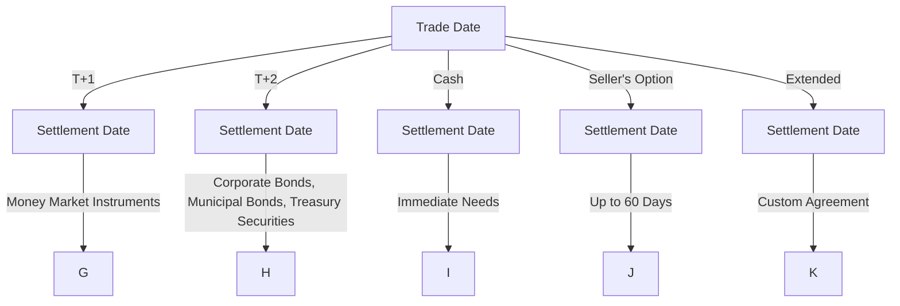

## 4.5.2 Settlement Dates and Conventions

In the world of bond trading, understanding settlement dates and conventions is crucial for ensuring smooth transactions and compliance with regulatory standards. This section delves into the standard settlement cycles for various bonds, the intricacies of "when-issued" trading, and special settlement cases. Mastery of these concepts is essential for anyone preparing for the Series 7 Exam and pursuing a career as a General Securities Representative.

### Standard Settlement Cycles

Settlement cycles refer to the time period between the trade date (the day the transaction is executed) and the settlement date (the day the transaction is finalized). Different types of securities have different standard settlement cycles, which are essential for managing liquidity and risk in financial markets.

#### T+2 Settlement

The most common settlement cycle for bonds is T+2, which stands for "Transaction plus two business days." This means that if a trade is executed on a Monday, the settlement will occur on Wednesday, assuming no holidays intervene. T+2 is the standard for most corporate bonds, municipal bonds, and U.S. Treasury securities. The shift from T+3 to T+2 in 2017 was implemented to reduce counterparty risk and improve market efficiency.

**Example:**

- **Trade Date:** Monday, November 20
- **Settlement Date:** Wednesday, November 22

#### T+1 Settlement

Some securities, particularly those with higher liquidity or specific market requirements, may settle on a T+1 basis. This means the transaction is settled one business day after the trade date. While less common in bond markets, T+1 is typical for certain money market instruments and some government securities.

**Example:**

- **Trade Date:** Monday, November 20
- **Settlement Date:** Tuesday, November 21

### "When-Issued" Trading

"When-issued" trading refers to the buying and selling of securities that have been announced but not yet issued. This is common in the bond market, particularly for new U.S. Treasury issues. When-issued trades allow investors to lock in prices before the actual issuance date, providing flexibility and hedging opportunities.

**Key Points:**

- **No Physical Delivery:** Since the securities are not yet issued, there is no physical delivery until the official issuance date.
- **Settlement Date:** The settlement date for when-issued trades is typically the same as the issue date of the securities.
- **Price Volatility:** Prices in when-issued trading can be volatile as they are influenced by market expectations and interest rate movements.

### Special Settlement Cases

In addition to standard settlement cycles, there are special settlement cases that traders must be aware of. These include cash settlement, seller's option, and extended settlement.

#### Cash Settlement

Cash settlement occurs on the same day as the trade date. This is rare in bond markets due to the logistical challenges but may be used in specific scenarios where immediate settlement is required.

**Example:**

- **Trade Date:** Monday, November 20
- **Settlement Date:** Monday, November 20

#### Seller's Option

Seller's option allows the seller to choose a settlement date beyond the standard cycle, typically up to 60 days. This provides flexibility for sellers who may need more time to deliver the securities.

**Example:**

- **Trade Date:** Monday, November 20
- **Settlement Date:** Any date up to 60 days later, as agreed upon.

#### Extended Settlement

Extended settlement is an agreement between buyer and seller to settle the trade on a date beyond the standard cycle. This is often used in complex transactions or when additional time is needed for due diligence.

### Settlement Cycle Comparison

To better understand the differences in settlement cycles, refer to the following chart, which outlines the standard cycles for various bond types:

### Practical Examples and Scenarios

Understanding settlement dates and conventions is not just about memorizing cycles; it's about applying this knowledge in real-world scenarios. Let's explore some practical examples:

#### Scenario 1: Managing Interest Rate Risk

An investor is concerned about potential interest rate hikes and decides to purchase a 10-year Treasury bond in the when-issued market. By locking in the price before the bond is issued, the investor hedges against future rate increases that could lower bond prices.

#### Scenario 2: Liquidity Management

A corporate treasurer needs to manage liquidity and decides to sell a portion of the company's bond holdings. By opting for a T+1 settlement, the treasurer ensures that the funds are available sooner, aiding in cash flow management.

#### Scenario 3: Complex Transactions

A large institutional investor is involved in a complex bond trade that requires additional due diligence. The parties agree to an extended settlement to allow time for thorough analysis and negotiation.

### Regulatory Considerations

Settlement cycles and conventions are subject to regulatory oversight to ensure market stability and protect investors. Key regulatory bodies include the Securities and Exchange Commission (SEC) and the Financial Industry Regulatory Authority (FINRA).

- **SEC Rule 15c6-1:** Mandates a T+2 settlement cycle for most securities transactions in the U.S.
- **FINRA Guidelines:** Provide additional rules and best practices for settlement processes and reporting.

### Best Practices and Common Pitfalls

To excel in the Series 7 Exam and in professional practice, consider the following best practices and be aware of common pitfalls:

**Best Practices:**

- **Stay Informed:** Keep up with regulatory changes and market trends that may impact settlement cycles.
- **Clear Communication:** Ensure clear communication with counterparties regarding settlement terms and expectations.
- **Risk Management:** Implement robust risk management strategies to handle potential settlement delays or failures.

**Common Pitfalls:**

- **Ignoring Holidays:** Failing to account for market holidays can lead to miscalculations in settlement dates.
- **Overlooking When-Issued Risks:** Not understanding the risks associated with when-issued trading can result in unexpected losses.
- **Inadequate Documentation:** Ensure all settlement agreements and terms are well-documented to avoid disputes.

### Conclusion

Understanding settlement dates and conventions is a fundamental aspect of bond trading and a critical component of the Series 7 Exam. By mastering these concepts, you will be well-equipped to navigate the complexities of the securities market and succeed in your role as a General Securities Representative.

---

## Series 7 Exam Practice Questions: Settlement Dates and Conventions



### What is the standard settlement cycle for most corporate bonds?

- [x] T+2
- [ ] T+1
- [ ] T+3
- [ ] Cash

> **Explanation:** The standard settlement cycle for most corporate bonds is T+2, meaning the transaction settles two business days after the trade date.

### What does "when-issued" trading refer to?

- [ ] Trading securities that have already been issued
- [x] Trading securities that have been announced but not yet issued
- [ ] Trading securities on the same day as issuance
- [ ] Trading securities with a T+1 settlement

> **Explanation:** "When-issued" trading involves buying and selling securities that have been announced but not yet issued, allowing investors to lock in prices before the actual issuance date.

### Which settlement cycle is typically used for money market instruments?

- [ ] T+2
- [x] T+1
- [ ] T+3
- [ ] Seller's Option

> **Explanation:** Money market instruments often settle on a T+1 basis, meaning the transaction is settled one business day after the trade date.

### What is a key characteristic of cash settlement?

- [ ] Settlement occurs two days after the trade date
- [ ] Settlement occurs one day after the trade date
- [x] Settlement occurs on the same day as the trade date
- [ ] Settlement occurs at the seller's discretion

> **Explanation:** Cash settlement occurs on the same day as the trade date, making it rare in bond markets due to logistical challenges.

### What is the maximum duration for a seller's option settlement?

- [ ] 30 days
- [x] 60 days
- [ ] 90 days
- [ ] 120 days

> **Explanation:** Seller's option allows the seller to choose a settlement date beyond the standard cycle, typically up to 60 days.

### Which regulatory body mandates the T+2 settlement cycle?

- [x] SEC
- [ ] FINRA
- [ ] MSRB
- [ ] Federal Reserve

> **Explanation:** The Securities and Exchange Commission (SEC) mandates a T+2 settlement cycle for most securities transactions in the U.S.

### What is a potential risk of when-issued trading?

- [ ] Immediate settlement
- [x] Price volatility
- [ ] Lack of liquidity
- [ ] Regulatory non-compliance

> **Explanation:** Prices in when-issued trading can be volatile as they are influenced by market expectations and interest rate movements.

### Why might an investor choose a T+1 settlement?

- [ ] To delay settlement
- [x] To manage liquidity
- [ ] To increase counterparty risk
- [ ] To comply with SEC regulations

> **Explanation:** An investor might choose a T+1 settlement to manage liquidity and ensure that funds are available sooner.

### What is the role of FINRA in settlement processes?

- [ ] Mandating settlement cycles
- [x] Providing guidelines and best practices
- [ ] Issuing securities
- [ ] Enforcing trade agreements

> **Explanation:** FINRA provides guidelines and best practices for settlement processes and reporting, ensuring market stability and investor protection.

### What is a common pitfall in calculating settlement dates?

- [ ] Overestimating settlement time
- [ ] Underestimating liquidity needs
- [x] Ignoring market holidays
- [ ] Misunderstanding regulatory guidelines

> **Explanation:** Ignoring market holidays can lead to miscalculations in settlement dates, resulting in potential delays or failures.



By mastering the content in this section and practicing with the questions provided, you will enhance your understanding of settlement dates and conventions, a crucial topic for the Series 7 Exam.
