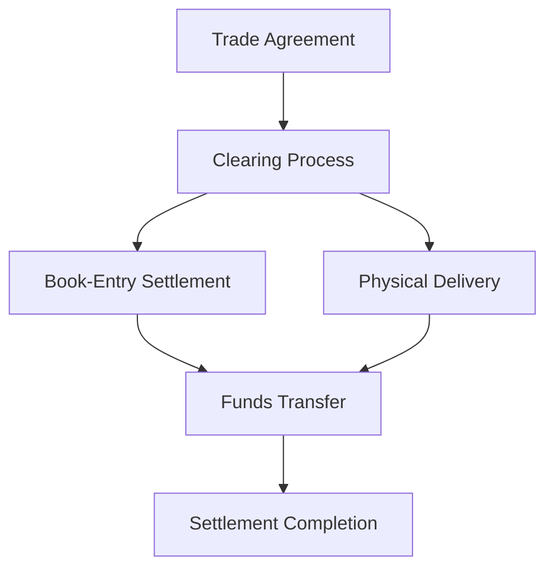

## 4.5 Trading and Settlement of Bonds

### Understanding Bond Trading Markets

Bond trading is a crucial component of the securities industry, involving the buying and selling of debt securities. Unlike equities, bonds are primarily traded over-the-counter (OTC), though some are listed on exchanges. This section will delve into the intricacies of bond trading markets, settlement procedures, and regulatory reporting requirements.

#### Bond Trading Markets: Exchanges and OTC

**Exchanges:**
- Bond exchanges, such as the New York Stock Exchange (NYSE) Bonds platform, provide a centralized venue for trading certain corporate bonds. These exchanges offer transparency and liquidity, with prices publicly available.

**Over-the-Counter (OTC) Market:**
- The OTC market is decentralized, where bonds are traded directly between parties. This market is more flexible, accommodating a wider range of bond types, including municipal bonds, corporate bonds, and government securities. The OTC market is crucial for less liquid bonds that may not meet exchange listing requirements.

**Key Participants:**
- **Dealers and Brokers:** Facilitate bond transactions, often acting as market makers in the OTC market.
- **Institutional Investors:** Such as mutual funds, pension funds, and insurance companies, are major players in bond markets due to the large volume of trades.
- **Retail Investors:** Participate in the bond market through brokers, although their influence is relatively smaller compared to institutional investors.

### Settlement Procedures for Bonds

Settlement is the process by which a bond transaction is finalized, involving the delivery of securities to the buyer and payment to the seller. The settlement process ensures that both parties fulfill their contractual obligations.

#### Settlement Cycles

- **Corporate and Municipal Bonds:** Typically settle on T+2, meaning two business days after the trade date. This allows time for the necessary paperwork and transfer of funds.
- **Government Bonds:** Such as U.S. Treasury securities, usually settle on T+1, reflecting their higher liquidity and standardized processes.
- **Same-Day Settlement:** Also known as cash settlement, is available for certain transactions, particularly in the case of urgent trades or specific market conditions.

#### Settlement Methods

- **Book-Entry System:** Most bonds are settled electronically through a book-entry system, such as the Depository Trust Company (DTC). This system reduces the risk of physical delivery and enhances efficiency.
- **Physical Delivery:** Though rare, some bonds still settle via physical delivery, requiring the actual transfer of bond certificates.

**Mermaid Diagram: Bond Settlement Process**

### Regulatory Reporting Requirements

Regulatory oversight is essential in maintaining the integrity and transparency of bond markets. Various reporting requirements ensure that trades are conducted fairly and that market participants adhere to established rules.

#### Key Regulatory Bodies

- **Financial Industry Regulatory Authority (FINRA):** Oversees broker-dealers and enforces rules related to bond trading, including trade reporting and transparency.
- **Securities and Exchange Commission (SEC):** Regulates the securities markets and enforces compliance with securities laws.
- **Municipal Securities Rulemaking Board (MSRB):** Establishes rules for municipal securities dealers and advisors.

#### Reporting Obligations

- **Trade Reporting and Compliance Engine (TRACE):** FINRA's TRACE system requires the reporting of all OTC bond transactions. This includes details such as price, volume, and time of trade, enhancing market transparency.
- **Municipal Securities Trade Reporting:** MSRB's Electronic Municipal Market Access (EMMA) system provides access to trade data and disclosures for municipal bonds.

### Executing Bond Trades

Executing bond trades involves several steps, from order placement to settlement. Understanding these steps is crucial for professionals in the securities industry.

#### Order Types

- **Market Orders:** Executed immediately at the best available price. Suitable for highly liquid bonds.
- **Limit Orders:** Specify a price at which the trader is willing to buy or sell. These orders are not executed unless the market reaches the specified price.
- **Stop Orders:** Trigger a market order once the bond reaches a specified price, often used to limit losses or protect profits.

#### Trade Execution Process

1. **Order Placement:** The investor places an order through a broker or trading platform.
2. **Order Routing:** The order is routed to the appropriate market or dealer.
3. **Execution:** The order is executed based on the specified conditions (market, limit, or stop).
4. **Confirmation:** The broker provides a trade confirmation, detailing the transaction's terms.
5. **Settlement:** The trade is settled according to the bond's settlement cycle.

### Practical Examples and Scenarios

**Example 1: Trading a Corporate Bond**

An institutional investor places a limit order to purchase $1 million of a corporate bond at a price of 98.5. The order is routed through the OTC market, where a dealer matches the order with a seller. The trade is executed, and the settlement occurs on T+2 via the DTC's book-entry system.

**Example 2: Municipal Bond Trade Reporting**

A municipal bond trade is executed between two parties in the OTC market. The dealer is required to report the trade details to the MSRB's EMMA system within 15 minutes of execution, ensuring compliance with regulatory requirements.

### Best Practices and Common Pitfalls

**Best Practices:**

- **Stay Informed:** Keep abreast of market conditions, interest rate changes, and economic indicators that may impact bond prices and yields.
- **Understand Regulations:** Familiarize yourself with FINRA, SEC, and MSRB rules to ensure compliance in bond trading activities.
- **Use Technology:** Leverage electronic trading platforms and reporting systems to enhance efficiency and accuracy.

**Common Pitfalls:**

- **Ignoring Settlement Dates:** Failing to account for settlement cycles can lead to cash flow mismatches and potential penalties.
- **Overlooking Regulatory Requirements:** Non-compliance with reporting obligations can result in fines and reputational damage.
- **Mispricing Bonds:** Incorrectly assessing bond prices can lead to unfavorable trades and financial losses.

### Summary

Understanding the trading and settlement of bonds is essential for success in the securities industry. By mastering the nuances of bond markets, settlement procedures, and regulatory requirements, you can ensure compliance and optimize trading strategies. This knowledge not only prepares you for the Series 7 Exam but also equips you with the skills necessary for a successful career in securities trading.

---

## Series 7 Exam Practice Questions: Trading and Settlement of Bonds



### What is the typical settlement period for corporate bonds?

- [x] T+2
- [ ] T+1
- [ ] T+3
- [ ] Same-day

> **Explanation:** Corporate bonds generally settle on T+2, meaning two business days after the trade date.

### Which system is primarily used for the electronic settlement of bonds?

- [ ] EMMA
- [x] DTC
- [ ] TRACE
- [ ] FINRA

> **Explanation:** The Depository Trust Company (DTC) is used for the electronic settlement of most bonds.

### What is the role of FINRA's TRACE system?

- [ ] To provide trading platforms
- [ ] To execute bond trades
- [x] To report OTC bond transactions
- [ ] To settle government bonds

> **Explanation:** TRACE is used to report OTC bond transactions, enhancing market transparency.

### Which type of bond typically settles on T+1?

- [ ] Corporate bonds
- [x] Government bonds
- [ ] Municipal bonds
- [ ] Zero-coupon bonds

> **Explanation:** Government bonds, such as U.S. Treasury securities, usually settle on T+1.

### What is a key characteristic of the OTC bond market?

- [x] It is decentralized
- [ ] It is centralized
- [ ] It only trades government bonds
- [ ] It is regulated by the NYSE

> **Explanation:** The OTC bond market is decentralized, allowing direct trades between parties.

### What does a limit order specify in bond trading?

- [ ] The exact time to execute the trade
- [x] The price at which the bond should be bought or sold
- [ ] The settlement date
- [ ] The quantity of bonds to trade

> **Explanation:** A limit order specifies the price at which a trader is willing to buy or sell a bond.

### How soon must a municipal bond trade be reported to the MSRB's EMMA system?

- [ ] Within 30 minutes
- [x] Within 15 minutes
- [ ] By the end of the day
- [ ] Within 24 hours

> **Explanation:** Municipal bond trades must be reported to EMMA within 15 minutes of execution.

### What is the primary risk of not adhering to bond settlement cycles?

- [ ] Increased bond yields
- [ ] Higher interest rates
- [x] Cash flow mismatches and penalties
- [ ] Lower bond prices

> **Explanation:** Ignoring settlement cycles can lead to cash flow mismatches and potential penalties.

### Which regulatory body oversees broker-dealers in bond trading?

- [ ] SEC
- [x] FINRA
- [ ] MSRB
- [ ] DTC

> **Explanation:** FINRA oversees broker-dealers and enforces rules related to bond trading.

### What is the primary purpose of the MSRB?

- [ ] To trade corporate bonds
- [ ] To regulate government bond markets
- [x] To establish rules for municipal securities dealers and advisors
- [ ] To execute bond trades

> **Explanation:** The MSRB establishes rules for municipal securities dealers and advisors.



---

By understanding the bond trading markets, settlement procedures, and regulatory reporting requirements, you are well-prepared to tackle the Series 7 Exam and advance your career in the securities industry.
