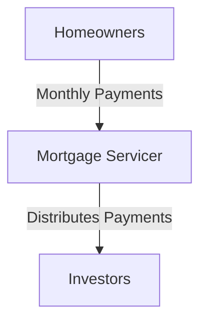

## 5.3.1 Pass-Through Securities

Pass-through securities are a fundamental component of mortgage-backed securities (MBS), playing a critical role in the financial markets by providing liquidity and investment opportunities. In this section, we will delve into the mechanics of pass-through securities, the flow of payments from homeowners to investors, and the effects of interest rate changes on prepayment speeds. Understanding these elements is crucial for anyone preparing for the Series 7 Exam and pursuing a career in the securities industry.

### Understanding Pass-Through Securities

Pass-through securities are a type of MBS where mortgage payments from homeowners are collected by a servicer and then "passed through" to investors. These securities are typically issued by government-sponsored enterprises (GSEs) such as Fannie Mae, Freddie Mac, and Ginnie Mae. The process involves pooling together a group of mortgages, which are then securitized, allowing investors to purchase shares in the pool.

#### Flow of Payments

The flow of payments in pass-through securities is a straightforward yet intricate process:

1. **Homeowners' Payments**: Homeowners make monthly mortgage payments, which include both principal and interest.
2. **Servicer's Role**: A mortgage servicer collects these payments on behalf of the investors. The servicer also manages the administrative aspects of the mortgage, such as handling defaults and foreclosures.
3. **Distribution to Investors**: The collected payments are then distributed to investors in the form of monthly cash flows. These payments are proportional to the investor's share in the MBS pool.

The diagram below illustrates the flow of payments in pass-through securities:

### Impact of Interest Rate Changes on Prepayment Speeds

Interest rate fluctuations have a significant impact on the prepayment speeds of mortgages within pass-through securities. Prepayment speed refers to the rate at which borrowers pay off their mortgages ahead of schedule, either through refinancing, selling their home, or making extra payments.

#### Interest Rate Decline

- **Refinancing Surge**: When interest rates fall, homeowners are incentivized to refinance their existing mortgages at lower rates. This leads to an increase in prepayment speeds as more borrowers pay off their original loans early.
- **Impact on Investors**: For investors, higher prepayment speeds can lead to a reduction in the expected yield of the pass-through securities. This is because the principal is returned sooner than expected, requiring reinvestment at potentially lower interest rates.

#### Interest Rate Increase

- **Reduced Prepayments**: Conversely, when interest rates rise, the incentive to refinance diminishes. Homeowners are less likely to pay off their mortgages early, resulting in slower prepayment speeds.
- **Investor Implications**: Slower prepayment speeds can benefit investors by extending the duration of the investment, allowing them to continue earning interest at the higher original rate.

### Cash Flow Patterns in Pass-Through Securities

The cash flow patterns in pass-through securities are influenced by the prepayment speeds and the structure of the underlying mortgages. Here are some typical cash flow scenarios:

#### Scenario 1: Stable Interest Rate Environment

In a stable interest rate environment, prepayment speeds are relatively predictable, and cash flows to investors remain consistent. Investors receive regular monthly payments that include both principal and interest, with minimal fluctuations.

#### Scenario 2: Declining Interest Rates

As interest rates decline, prepayment speeds increase due to refinancing activity. This results in a surge of principal repayments to investors, leading to higher-than-expected cash flows in the short term. However, the long-term yield may decrease as investors need to reinvest the returned principal at lower rates.

#### Scenario 3: Rising Interest Rates

In a rising interest rate environment, prepayment speeds slow down, and investors receive a steady stream of interest payments over a longer period. This can be advantageous for investors seeking stable, long-term returns.

### Practical Examples and Case Studies

To illustrate the dynamics of pass-through securities, let's consider a few practical examples and case studies:

#### Example 1: A Declining Rate Scenario

Imagine a pass-through security backed by 30-year fixed-rate mortgages. As interest rates fall, homeowners rush to refinance their loans. The prepayment speed increases from 10% to 20% annually. Investors receive a larger portion of their principal back sooner than anticipated, which they must reinvest at the new, lower rates.

#### Example 2: A Rising Rate Scenario

Conversely, in a rising rate environment, prepayment speeds drop to 5% annually. Investors benefit from the extended duration of their investment, continuing to earn interest at the higher original rate. This scenario highlights the importance of understanding interest rate risks when investing in pass-through securities.

### Regulatory Considerations and Compliance

Investors in pass-through securities must be aware of the regulatory framework governing these instruments. Key regulatory bodies include:

- **Securities and Exchange Commission (SEC)**: Oversees the registration and disclosure requirements for MBS.
- **Federal Housing Finance Agency (FHFA)**: Regulates GSEs like Fannie Mae and Freddie Mac.
- **Consumer Financial Protection Bureau (CFPB)**: Ensures consumer protection in mortgage lending.

Compliance with these regulations is essential to maintain the integrity of the MBS market and protect investors' interests.

### Best Practices and Common Pitfalls

When dealing with pass-through securities, investors should consider the following best practices and avoid common pitfalls:

#### Best Practices

- **Diversification**: Spread investments across different MBS pools to mitigate risk.
- **Interest Rate Monitoring**: Keep a close eye on interest rate trends to anticipate changes in prepayment speeds.
- **Credit Quality Assessment**: Evaluate the credit quality of the underlying mortgages to assess default risk.

#### Common Pitfalls

- **Ignoring Interest Rate Risk**: Failing to account for interest rate changes can lead to unexpected changes in cash flows and yields.
- **Overconcentration**: Investing too heavily in a single MBS pool can increase exposure to specific risks.

### Conclusion

Pass-through securities are a vital component of the MBS market, offering investors a way to participate in the mortgage industry while providing liquidity to the housing market. Understanding the flow of payments, the impact of interest rate changes on prepayment speeds, and the associated risks is crucial for anyone preparing for the Series 7 Exam. By mastering these concepts, you will be well-equipped to navigate the complexities of pass-through securities and succeed in your career as a General Securities Representative.

## Series 7 Exam Practice Questions: Pass-Through Securities



### What is the primary role of a mortgage servicer in pass-through securities?

- [x] Collecting mortgage payments and distributing them to investors
- [ ] Issuing new mortgage-backed securities
- [ ] Setting interest rates for the mortgages
- [ ] Providing insurance for the mortgage pool

> **Explanation:** The mortgage servicer collects payments from homeowners and distributes them to investors, managing the administrative aspects of the mortgage.

### How do declining interest rates affect prepayment speeds in pass-through securities?

- [x] They increase prepayment speeds as more homeowners refinance
- [ ] They decrease prepayment speeds as homeowners hold onto their loans
- [ ] They have no impact on prepayment speeds
- [ ] They cause prepayment speeds to fluctuate unpredictably

> **Explanation:** Declining interest rates incentivize homeowners to refinance, increasing prepayment speeds as loans are paid off early.

### Which of the following best describes a pass-through security?

- [x] A security where mortgage payments are passed from homeowners to investors
- [ ] A security that guarantees a fixed interest rate to investors
- [ ] A security backed by corporate bonds
- [ ] A security that offers tax-free interest payments

> **Explanation:** Pass-through securities involve the direct flow of mortgage payments from homeowners to investors, without a fixed interest rate guarantee.

### What happens to the yield of pass-through securities when prepayment speeds increase?

- [ ] The yield increases due to higher interest payments
- [x] The yield decreases as principal is returned sooner
- [ ] The yield remains unchanged
- [ ] The yield becomes unpredictable

> **Explanation:** Increased prepayment speeds return the principal to investors sooner, reducing the expected yield as reinvestment occurs at potentially lower rates.

### In a rising interest rate environment, what is the typical impact on prepayment speeds?

- [ ] Prepayment speeds increase significantly
- [ ] Prepayment speeds remain stable
- [x] Prepayment speeds decrease
- [ ] Prepayment speeds become erratic

> **Explanation:** Rising interest rates reduce the incentive to refinance, leading to decreased prepayment speeds.

### What is a common risk associated with pass-through securities?

- [ ] Guaranteed principal loss
- [ ] Fixed interest rate risk
- [x] Prepayment risk
- [ ] Taxation risk

> **Explanation:** Prepayment risk is a key concern for pass-through securities, as changes in prepayment speeds can affect cash flows and yields.

### Which regulatory body oversees the registration of mortgage-backed securities?

- [x] Securities and Exchange Commission (SEC)
- [ ] Federal Reserve Board (FRB)
- [ ] Consumer Financial Protection Bureau (CFPB)
- [ ] Financial Industry Regulatory Authority (FINRA)

> **Explanation:** The SEC oversees the registration and disclosure requirements for mortgage-backed securities.

### What is the impact of slower prepayment speeds on investors in pass-through securities?

- [ ] Investors receive their principal back faster
- [x] Investors earn interest over a longer period
- [ ] Investors face higher default risk
- [ ] Investors experience increased cash flow volatility

> **Explanation:** Slower prepayment speeds mean that investors continue to earn interest over a longer duration, potentially benefiting from higher original rates.

### Why is diversification important in investing in pass-through securities?

- [ ] To increase exposure to a single mortgage pool
- [x] To mitigate risk by spreading investments across different pools
- [ ] To maximize returns by focusing on one type of security
- [ ] To ensure compliance with regulatory requirements

> **Explanation:** Diversification helps mitigate risk by spreading investments across various MBS pools, reducing exposure to specific risks.

### What is the role of the Federal Housing Finance Agency (FHFA) concerning pass-through securities?

- [ ] It provides insurance for mortgage-backed securities
- [x] It regulates government-sponsored enterprises like Fannie Mae and Freddie Mac
- [ ] It sets interest rates for the mortgage market
- [ ] It manages the distribution of payments to investors

> **Explanation:** The FHFA regulates GSEs such as Fannie Mae and Freddie Mac, which are key issuers of pass-through securities.



---
