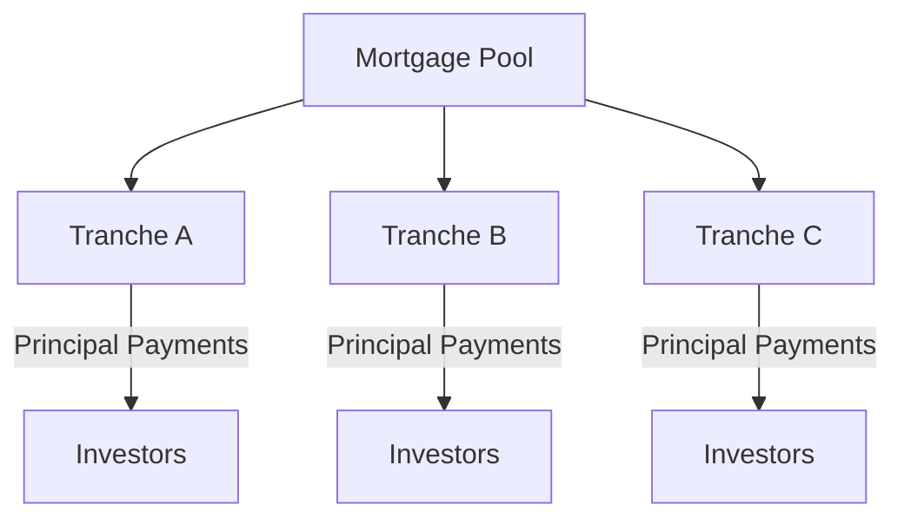

## 5.3 Mortgage-Backed Securities (MBS)

Mortgage-Backed Securities (MBS) are a crucial component of the fixed-income market, offering investors a way to gain exposure to the real estate market without directly owning property. This section provides an in-depth exploration of MBS, including their creation, types, and associated risks. Understanding these concepts is essential for anyone preparing for the Series 7 Exam and pursuing a career in the securities industry.

### Overview of Mortgage-Backed Securities

Mortgage-Backed Securities are created by pooling together a collection of mortgage loans and selling them as a single security to investors. The cash flows from the underlying mortgages, including principal and interest payments, are passed through to the MBS investors. This process allows lenders to free up capital to issue more mortgages, while investors receive a steady stream of income.

**Types of Mortgage-Backed Securities:**

1. **Pass-Through Securities:** These are the simplest form of MBS, where the principal and interest payments from the pool of mortgages are passed directly to the investors. They are typically issued by government-sponsored enterprises (GSEs) like Fannie Mae, Freddie Mac, and Ginnie Mae.

2. **Collateralized Mortgage Obligations (CMOs):** CMOs are more complex MBS that divide the mortgage pool into tranches, each with different levels of risk, return, and maturity. This structure allows investors to choose a tranche that matches their risk tolerance and investment goals.

### Creation of Mortgage-Backed Securities

The creation of MBS involves several steps, starting with the origination of mortgage loans by banks and other financial institutions. These loans are then sold to a government agency or a private entity, which pools them together to create an MBS. The MBS is then sold to investors, with the cash flows from the mortgage payments distributed according to the structure of the security.

#### Process of Securitization

1. **Origination:** Banks and financial institutions issue mortgage loans to borrowers. These loans are typically secured by residential or commercial properties.

2. **Pooling:** The loans are sold to a GSE or a private entity, which pools them together. This pool serves as the collateral for the MBS.

3. **Securitization:** The pool of mortgages is structured into an MBS, which is then divided into smaller units or tranches. Each tranche has different characteristics, such as interest rate, maturity, and risk level.

4. **Distribution:** The MBS is sold to investors, who receive payments based on the cash flows from the underlying mortgage pool.

### Types of Mortgage-Backed Securities

#### Pass-Through Securities

Pass-through securities are the most straightforward type of MBS. They are called "pass-through" because the principal and interest payments from the mortgage pool are passed directly to the investors. These securities are typically issued by GSEs and are considered to have a high level of credit quality due to government backing.

**Characteristics of Pass-Through Securities:**

- **Simplicity:** Pass-through securities have a straightforward structure, making them easy to understand and manage.
- **Regular Income:** Investors receive regular payments based on the cash flows from the underlying mortgages.
- **Credit Quality:** These securities often have high credit ratings due to the backing of GSEs.

#### Collateralized Mortgage Obligations (CMOs)

CMOs offer a more complex structure compared to pass-through securities. They divide the mortgage pool into tranches, each with different risk and return profiles. This allows investors to select a tranche that aligns with their investment strategy.

**Tranches in CMOs:**

- **Sequential Pay Tranches:** These tranches receive principal payments in a specified order. Once one tranche is paid off, the next begins receiving payments.
- **Planned Amortization Class (PAC) Tranches:** These tranches provide more predictable cash flows by using a schedule to allocate principal payments.
- **Support or Companion Tranches:** These absorb excess or shortfall payments to protect PAC tranches, making them riskier but with potentially higher returns.

### Risks Associated with Mortgage-Backed Securities

Investing in MBS involves several risks that investors must consider. Understanding these risks is crucial for making informed investment decisions and for passing the Series 7 Exam.

#### Prepayment Risk

Prepayment risk arises when borrowers pay off their mortgages earlier than expected, typically due to refinancing or selling the property. This can lead to a reduction in the expected cash flows for MBS investors, as the principal is returned sooner than anticipated.

**Impact of Prepayment Risk:**

- **Reduced Returns:** Early repayment of principal can lead to lower returns for investors, as they may need to reinvest the principal at lower interest rates.
- **Uncertainty:** Prepayment risk introduces uncertainty in the timing and amount of cash flows, making it harder to predict returns.

#### Extension Risk

Extension risk occurs when borrowers take longer to pay off their mortgages than expected, often due to rising interest rates. This can result in investors receiving their principal back later than anticipated, potentially at a time when interest rates are higher.

**Impact of Extension Risk:**

- **Interest Rate Sensitivity:** Investors may be exposed to interest rate risk if they are unable to reinvest the principal at higher rates.
- **Cash Flow Delays:** Delayed cash flows can disrupt an investor's financial planning and cash flow management.

### Regulatory Considerations

Mortgage-Backed Securities are subject to various regulations to ensure transparency and protect investors. Key regulatory bodies include the Securities and Exchange Commission (SEC) and the Financial Industry Regulatory Authority (FINRA).

- **Disclosure Requirements:** Issuers of MBS must provide detailed information about the underlying mortgage pool, including the credit quality of the loans and the structure of the security.
- **Investor Protections:** Regulations are in place to protect investors from fraud and misrepresentation, ensuring that they have access to accurate and timely information.

### Practical Examples and Case Studies

To illustrate the concepts discussed, let's consider a practical example of a pass-through security and a CMO.

**Example of a Pass-Through Security:**

Imagine a pool of 1,000 mortgages, each with a principal balance of $200,000 and an interest rate of 4%. The total value of the pool is $200 million. As borrowers make their monthly mortgage payments, the principal and interest are collected and passed through to investors in the MBS.

**Example of a CMO:**

Consider a CMO with three tranches: Tranche A, Tranche B, and Tranche C. Tranche A receives principal payments first, followed by Tranche B and then Tranche C. This structure allows Tranche A to have a shorter duration and lower risk, while Tranche C has a longer duration and higher risk.

### Diagrams

To enhance understanding, let's include a diagram illustrating the structure of a CMO.

### Conclusion

Mortgage-Backed Securities are a vital part of the fixed-income market, offering investors a way to gain exposure to the real estate market. By understanding the creation, types, and risks of MBS, you will be better prepared for the Series 7 Exam and equipped to make informed investment decisions.

### Glossary

- **Pass-Through Security:** An MBS where principal and interest payments are passed directly to investors.

## Series 7 Exam Practice Questions: Mortgage-Backed Securities (MBS)



### What is the primary function of a mortgage-backed security (MBS)?

- [x] To pool mortgage loans and sell them as a single security to investors
- [ ] To provide insurance for mortgage loans
- [ ] To directly lend money to homebuyers
- [ ] To offer tax benefits to mortgage lenders

> **Explanation:** MBS are created by pooling mortgage loans and selling them as securities to investors, allowing lenders to free up capital and providing investors with a stream of income.

### Which type of MBS passes principal and interest payments directly to investors?

- [x] Pass-Through Security
- [ ] Collateralized Mortgage Obligation (CMO)
- [ ] Asset-Backed Security (ABS)
- [ ] Treasury Bond

> **Explanation:** Pass-through securities are a type of MBS where the principal and interest payments from the mortgage pool are passed directly to investors.

### What is a key characteristic of a Collateralized Mortgage Obligation (CMO)?

- [ ] It offers a fixed interest rate to all investors
- [x] It divides the mortgage pool into tranches with varying risk levels
- [ ] It is only backed by commercial mortgages
- [ ] It provides government guarantees for all tranches

> **Explanation:** CMOs divide the mortgage pool into tranches, each with different risk and return profiles, allowing investors to choose based on their risk tolerance.

### What risk is associated with borrowers paying off their mortgages earlier than expected?

- [x] Prepayment Risk
- [ ] Extension Risk
- [ ] Credit Risk
- [ ] Inflation Risk

> **Explanation:** Prepayment risk arises when borrowers pay off their mortgages early, reducing the expected cash flows for MBS investors.

### Which regulatory body oversees the disclosure requirements for MBS?

- [ ] Federal Reserve
- [x] Securities and Exchange Commission (SEC)
- [ ] Department of Housing and Urban Development (HUD)
- [ ] Internal Revenue Service (IRS)

> **Explanation:** The SEC oversees disclosure requirements for MBS to ensure transparency and protect investors.

### What is the effect of extension risk on MBS investors?

- [ ] It increases the likelihood of receiving higher interest payments
- [ ] It reduces the credit quality of the underlying mortgages
- [x] It delays the return of principal to investors
- [ ] It guarantees a fixed rate of return

> **Explanation:** Extension risk occurs when borrowers take longer to pay off their mortgages, delaying the return of principal to investors.

### Which type of MBS is typically issued by government-sponsored enterprises (GSEs)?

- [x] Pass-Through Securities
- [ ] Collateralized Debt Obligations (CDOs)
- [ ] Commercial Mortgage-Backed Securities (CMBS)
- [ ] Convertible Bonds

> **Explanation:** Pass-through securities are often issued by GSEs like Fannie Mae and Freddie Mac, providing high credit quality due to government backing.

### How do CMOs manage prepayment risk?

- [ ] By offering a fixed interest rate to all tranches
- [x] By structuring tranches with different payment schedules
- [ ] By investing only in commercial mortgages
- [ ] By providing government guarantees for all tranches

> **Explanation:** CMOs manage prepayment risk by structuring tranches with different payment schedules, allowing some tranches to absorb prepayments.

### What is a potential disadvantage of investing in MBS?

- [ ] Lack of liquidity in the market
- [ ] High credit risk compared to corporate bonds
- [x] Exposure to prepayment and extension risks
- [ ] Limited availability of investment options

> **Explanation:** A potential disadvantage of MBS is exposure to prepayment and extension risks, which can affect the timing and amount of cash flows.

### In a CMO, which tranche typically has the lowest risk?

- [x] Tranche A
- [ ] Tranche B
- [ ] Tranche C
- [ ] Support Tranche

> **Explanation:** Tranche A in a CMO typically has the lowest risk as it receives principal payments first, reducing exposure to prepayment and extension risks.



By mastering the concepts and details of Mortgage-Backed Securities, you will be well-prepared to tackle related questions on the Series 7 Exam and succeed in your career as a General Securities Representative.
