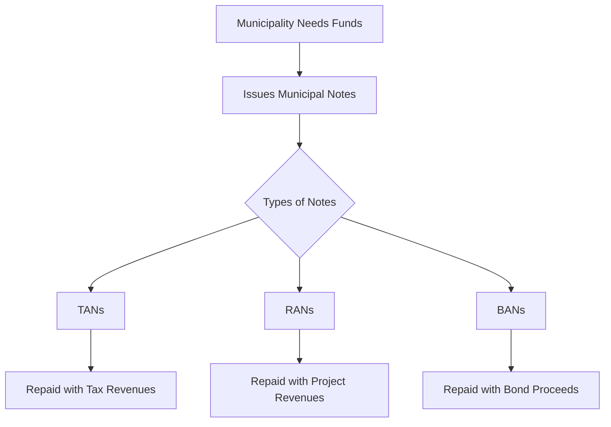

## 6.1.3 Municipal Notes

Municipal notes are an essential component of the municipal securities market, serving as short-term debt instruments issued by municipalities to address immediate funding needs. These notes are crucial for managing cash flow and bridging gaps between revenue collections and expenditures. As you prepare for the Series 7 Exam, understanding the intricacies of municipal notes will enhance your ability to advise clients and navigate the securities market effectively.

### Introduction to Municipal Notes

Municipal notes are short-term securities typically issued by state and local governments to finance temporary cash flow shortages. They are generally issued with maturities of one year or less, allowing municipalities to cover immediate expenses while waiting for anticipated revenues. These notes are a vital tool for municipal finance, providing flexibility and liquidity to governmental entities.

#### Purpose and Function

Municipal notes serve several purposes, including:

- **Cash Flow Management:** Municipalities often face timing mismatches between revenue inflows and expenditure outflows. Municipal notes help bridge these gaps, ensuring that municipalities can meet their financial obligations without disruption.
- **Interim Financing:** When a municipality plans to issue long-term bonds but requires immediate funding, municipal notes can provide interim financing. This is particularly useful in situations where project revenues or tax receipts are expected in the near future.
- **Lower Interest Costs:** By issuing short-term notes, municipalities can take advantage of lower interest rates compared to long-term bonds, reducing the overall cost of borrowing.

### Types of Municipal Notes

There are several types of municipal notes, each serving a specific purpose and backed by different revenue sources. The most common types include Tax Anticipation Notes (TANs), Revenue Anticipation Notes (RANs), and Bond Anticipation Notes (BANs).

#### Tax Anticipation Notes (TANs)

**Definition:** Tax Anticipation Notes are short-term debt instruments issued by municipalities and repaid from future tax receipts. They are typically used to finance current operations until tax revenues are collected.

**Characteristics:**

- **Maturity:** TANs usually have maturities ranging from a few months to one year.
- **Security:** TANs are backed by the anticipated tax revenues, providing a secure source of repayment.
- **Usage:** Commonly used to manage cash flow during periods when tax receipts are low, such as before property tax collections.

**Example Scenario:** A city anticipates receiving property tax revenues in six months but needs immediate funds to cover payroll and operational expenses. The city issues TANs to bridge this gap, repaying the notes once the tax revenues are collected.

#### Revenue Anticipation Notes (RANs)

**Definition:** Revenue Anticipation Notes are short-term securities issued by municipalities, repaid from expected revenues generated by specific projects or sources other than taxes.

**Characteristics:**

- **Maturity:** Similar to TANs, RANs typically have maturities of less than one year.
- **Security:** RANs are secured by anticipated revenues from sources such as federal or state aid, grants, or fees from municipal services.
- **Usage:** Used when a municipality expects to receive non-tax revenues in the near future but requires immediate funding.

**Example Scenario:** A county expects to receive federal grant money for a public works project in eight months. To fund the project in the meantime, the county issues RANs, which are repaid upon receipt of the grant.

#### Bond Anticipation Notes (BANs)

**Definition:** Bond Anticipation Notes are short-term notes issued by municipalities in anticipation of future bond issuance. They are repaid from the proceeds of the subsequent bond sale.

**Characteristics:**

- **Maturity:** BANs generally have maturities of one year or less, although they can be renewed or rolled over.
- **Security:** Secured by the anticipated proceeds from the future bond issuance.
- **Usage:** Used as interim financing when a municipality plans to issue long-term bonds but requires immediate funds.

**Example Scenario:** A city plans to issue bonds to fund a new school construction project. While the bond issuance process is underway, the city issues BANs to begin construction immediately, repaying the notes with the bond proceeds.

### Diagram: Bridging Financing Gaps with Municipal Notes

To visualize how municipal notes function as a bridge for financing gaps, consider the following diagram:

### Key Considerations for Municipal Notes

When dealing with municipal notes, several factors must be considered to ensure effective use and compliance with regulatory requirements:

- **Credit Quality:** The credit quality of municipal notes is influenced by the issuing municipality's financial health and the reliability of the anticipated revenue source. Higher credit quality typically results in lower borrowing costs.
- **Interest Rates:** The interest rate environment can impact the cost of issuing municipal notes. Lower interest rates make short-term borrowing more attractive.
- **Regulatory Compliance:** Issuers must comply with regulations set forth by the Municipal Securities Rulemaking Board (MSRB) and other regulatory bodies. This includes disclosure requirements and adherence to issuance procedures.
- **Market Conditions:** The demand for municipal notes can fluctuate based on market conditions, affecting the ease of issuance and interest rates.

### Practical Examples and Case Studies

**Case Study 1: City of Springfield's TANs Issuance**

The City of Springfield faced a budget shortfall due to delayed property tax collections. To manage cash flow and maintain essential services, the city issued $10 million in TANs with a six-month maturity. The notes were secured by the expected property tax revenues. Upon collection of the taxes, Springfield repaid the TANs, ensuring uninterrupted city operations.

**Case Study 2: County of Riverside's RANs for Federal Grant**

Riverside County anticipated receiving a $5 million federal grant for a transportation project. However, the funds were not expected for another nine months. To commence the project, the county issued RANs, secured by the grant. Once the grant was received, the county repaid the notes, successfully completing the project on schedule.

**Case Study 3: Town of Maplewood's BANs for School Construction**

Maplewood planned to build a new high school and intended to issue bonds to finance the project. To begin construction immediately, the town issued $15 million in BANs, anticipating the bond proceeds for repayment. After the bonds were issued, Maplewood used the proceeds to retire the BANs, facilitating timely project completion.

### Regulatory Framework and Compliance

Municipal notes are subject to regulatory oversight to ensure transparency and protect investors. Key regulatory considerations include:

- **Municipal Securities Rulemaking Board (MSRB):** The MSRB establishes rules for the issuance and trading of municipal securities, including notes. Compliance with MSRB rules is essential for issuers and underwriters.
- **Disclosure Requirements:** Issuers must provide adequate disclosure to investors, detailing the terms of the notes, the security backing them, and the financial condition of the issuer.
- **Continuing Disclosure Obligations:** Issuers may be required to provide ongoing financial information and updates to investors, ensuring transparency throughout the life of the notes.

### Exam Strategies and Tips

As you prepare for the Series 7 Exam, focus on the following strategies to master the topic of municipal notes:

- **Understand the Different Types:** Familiarize yourself with the characteristics and uses of TANs, RANs, and BANs. Pay attention to the sources of repayment and the typical scenarios in which each type is used.
- **Practice Calculations:** Be comfortable with calculating interest payments and understanding the impact of interest rates on municipal notes. Practice scenarios involving different maturities and interest rate environments.
- **Review Regulatory Requirements:** Study the MSRB rules and disclosure requirements related to municipal notes. Understand the importance of transparency and compliance in the issuance process.
- **Apply Real-World Examples:** Use case studies and practical examples to reinforce your understanding of how municipal notes are used in real-world situations. Consider the financial and strategic implications for municipalities.

### Summary

Municipal notes are a versatile and essential tool for managing short-term funding needs in the municipal securities market. By understanding the various types of notes, their purposes, and the regulatory framework governing them, you will be well-prepared to advise clients and succeed on the Series 7 Exam. Remember to focus on the practical applications and compliance considerations to enhance your knowledge and skills in this area.

## Series 7 Exam Practice Questions: Municipal Notes



### What is the primary purpose of municipal notes?

- [x] To manage short-term funding needs
- [ ] To finance long-term capital projects
- [ ] To provide permanent financing solutions
- [ ] To replace long-term bonds

> **Explanation:** Municipal notes are primarily used to manage short-term funding needs, providing liquidity until anticipated revenues are received.

### Which type of municipal note is repaid from future tax receipts?

- [x] Tax Anticipation Notes (TANs)
- [ ] Revenue Anticipation Notes (RANs)
- [ ] Bond Anticipation Notes (BANs)
- [ ] Project Anticipation Notes (PANs)

> **Explanation:** Tax Anticipation Notes (TANs) are repaid from future tax receipts, making them distinct from other types of municipal notes.

### Revenue Anticipation Notes (RANs) are typically secured by which of the following?

- [ ] Property tax revenues
- [x] Anticipated project revenues
- [ ] Bond proceeds
- [ ] Long-term investments

> **Explanation:** RANs are secured by anticipated project revenues, such as federal or state aid, grants, or fees from municipal services.

### What is a characteristic feature of Bond Anticipation Notes (BANs)?

- [ ] They are repaid from tax revenues
- [ ] They have maturities longer than two years
- [x] They are repaid from future bond proceeds
- [ ] They are used for permanent financing

> **Explanation:** BANs are repaid from future bond proceeds, serving as interim financing until the bonds are issued.

### Which regulatory body establishes rules for the issuance and trading of municipal notes?

- [ ] Securities and Exchange Commission (SEC)
- [ ] Financial Industry Regulatory Authority (FINRA)
- [x] Municipal Securities Rulemaking Board (MSRB)
- [ ] Federal Reserve Board (FRB)

> **Explanation:** The MSRB establishes rules for the issuance and trading of municipal securities, including notes.

### What is a common maturity period for municipal notes?

- [ ] 5 years
- [ ] 2 years
- [x] Less than 1 year
- [ ] 3 years

> **Explanation:** Municipal notes typically have maturities of less than one year, making them short-term instruments.

### In what scenario might a municipality issue Revenue Anticipation Notes (RANs)?

- [ ] To fund a long-term infrastructure project
- [x] To cover cash flow needs while awaiting grant money
- [ ] To refinance existing debt
- [ ] To invest in long-term securities

> **Explanation:** RANs are issued to cover cash flow needs while awaiting anticipated revenues, such as grant money.

### What is the main advantage of using municipal notes?

- [x] Lower interest costs compared to long-term bonds
- [ ] Permanent financing solution
- [ ] No need for regulatory compliance
- [ ] Higher interest rates than bonds

> **Explanation:** Municipal notes often have lower interest costs compared to long-term bonds, making them an attractive short-term financing option.

### Which of the following is NOT a type of municipal note?

- [ ] Tax Anticipation Notes (TANs)
- [ ] Revenue Anticipation Notes (RANs)
- [ ] Bond Anticipation Notes (BANs)
- [x] Equity Anticipation Notes (EANs)

> **Explanation:** Equity Anticipation Notes (EANs) do not exist; the other options are types of municipal notes.

### What is a critical factor influencing the credit quality of municipal notes?

- [ ] The municipality's population size
- [ ] The geographic location of the municipality
- [x] The reliability of the anticipated revenue source
- [ ] The political affiliation of the municipality's leaders

> **Explanation:** The credit quality of municipal notes is significantly influenced by the reliability of the anticipated revenue source, which affects the security of repayment.


