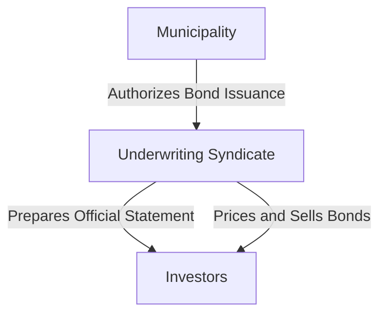

## 6.4 Municipal Bond Market and Trading

Municipal bonds, often referred to as "munis," are debt securities issued by states, municipalities, or counties to finance capital expenditures. These bonds are pivotal in funding public projects such as schools, highways, and hospitals. Understanding the municipal bond market and its trading mechanisms is crucial for any aspiring General Securities Representative. In this section, we will delve into the issuance and trading of municipal bonds, the roles of underwriters and syndicates, and the over-the-counter (OTC) nature of municipal bond trading.

### Municipal Bond Issuance

Municipal bonds are issued in the primary market, where the issuer sells the bonds directly to investors. This process involves several key steps and participants, including issuers, underwriters, and investors.

#### The Issuance Process

The issuance process begins with the municipality's decision to raise funds through bonds. This decision is often driven by the need to finance large infrastructure projects or to refinance existing debt. The process typically involves the following steps:

1. **Authorization**: The issuing municipality must authorize the bond issuance, often requiring voter approval or legislative action. This step ensures that the bond issuance aligns with legal and financial regulations.

2. **Preparation of Official Statement**: The municipality prepares an official statement, similar to a prospectus, detailing the bond's terms, including interest rates, maturity dates, and the purpose of the bond issuance. This document provides potential investors with essential information about the bond.

3. **Selection of Underwriters**: The municipality selects an underwriting syndicate, a group of investment banks that will purchase the entire bond issue and resell it to investors. The lead underwriter, known as the bookrunner, manages the syndicate and coordinates the issuance process.

4. **Pricing and Sale**: The underwriters determine the bond's price based on market conditions, credit ratings, and investor demand. Once priced, the bonds are sold to investors through the underwriting syndicate.

#### Role of Underwriters and Syndicates

Underwriters play a crucial role in the municipal bond issuance process. They assume the risk of buying the entire bond issue from the issuer and reselling it to investors. The underwriting syndicate, led by the bookrunner, collaborates to distribute the bonds effectively.

**Underwriting Syndicate**: An underwriting syndicate is a group of investment banks that work together to issue and market securities. In a municipal bond offering, the syndicate's responsibilities include:

- **Risk Assessment**: Evaluating the creditworthiness of the issuer and the bond's marketability.
- **Pricing**: Setting the bond's interest rate and offering price based on market conditions and investor demand.
- **Distribution**: Selling the bonds to institutional and retail investors through their distribution networks.

The syndicate's success in pricing and distributing the bonds significantly impacts the issuer's borrowing costs and the bond's initial market performance.

#### Diagram: Municipal Bond Issuance Process

### Trading in the Municipal Bond Market

After issuance, municipal bonds are traded in the secondary market. Unlike stocks, which are traded on exchanges, municipal bonds are primarily traded over-the-counter (OTC). This means that trades are conducted directly between parties rather than through a centralized exchange.

#### Over-the-Counter (OTC) Trading

The OTC nature of municipal bond trading presents unique characteristics and challenges:

- **Decentralized Market**: The municipal bond market is decentralized, with trades occurring through a network of dealers and brokers. This structure can lead to less transparency and liquidity compared to exchange-traded securities.

- **Negotiated Transactions**: Trades are often negotiated between buyers and sellers, with prices determined by factors such as credit quality, interest rates, and market demand.

- **Role of Dealers**: Dealers play a critical role in the OTC market, acting as intermediaries between buyers and sellers. They provide liquidity by maintaining inventories of bonds and facilitating trades.

#### Factors Influencing Municipal Bond Trading

Several factors influence the trading of municipal bonds in the secondary market:

- **Interest Rates**: Changes in interest rates can significantly impact bond prices. When interest rates rise, bond prices typically fall, and vice versa.

- **Credit Ratings**: The creditworthiness of the issuer, as assessed by rating agencies, affects the bond's market value. Higher-rated bonds generally trade at higher prices due to lower perceived risk.

- **Market Conditions**: Economic conditions, investor sentiment, and supply and demand dynamics also influence bond trading. For instance, during economic downturns, investors may seek the relative safety of municipal bonds, driving up demand and prices.

### Practical Example: Municipal Bond Trading

Consider a scenario where a city issues a series of general obligation bonds to finance a new public school. The bonds are initially sold to investors through an underwriting syndicate. Once issued, these bonds enter the secondary market, where they are traded OTC.

An investor looking to purchase these bonds would contact a dealer specializing in municipal securities. The dealer would provide a quote based on current market conditions, including interest rates and the city's credit rating. The investor and dealer would negotiate the trade, agreeing on a price and executing the transaction.

### Regulatory Considerations

Municipal bond trading is subject to regulation by the Municipal Securities Rulemaking Board (MSRB), which establishes rules for dealers and advisors in the municipal securities market. Key MSRB rules include:

- **Rule G-17**: Requires dealers to deal fairly with all persons and not engage in deceptive, dishonest, or unfair practices.
- **Rule G-30**: Governs pricing and commissions, ensuring that prices are fair and reasonable.
- **Rule G-37**: Addresses political contributions by dealers, prohibiting them from engaging in municipal securities business with issuers for two years after making certain political contributions.

### Best Practices and Common Pitfalls

To succeed in the municipal bond market, consider the following best practices and avoid common pitfalls:

- **Conduct Thorough Research**: Evaluate the issuer's financial health, credit rating, and the bond's terms before investing.
- **Monitor Interest Rate Trends**: Stay informed about interest rate movements, as they directly impact bond prices.
- **Diversify Holdings**: Diversify your municipal bond portfolio across different issuers and sectors to mitigate risk.
- **Understand Tax Implications**: Municipal bonds often offer tax advantages, such as federal tax-exempt interest, but be aware of state and local tax considerations.

### Summary

Municipal bonds are a vital component of the securities market, offering investors opportunities to support public projects while earning tax-advantaged returns. Understanding the issuance and trading processes, the roles of underwriters and syndicates, and the OTC nature of the market is essential for success in this field. By mastering these concepts, you'll be well-equipped to navigate the municipal bond market and excel in your Series 7 Exam.

## Series 7 Exam Practice Questions: Municipal Bond Market and Trading



### What is the primary role of an underwriting syndicate in the municipal bond market?

- [x] To purchase the entire bond issue and resell it to investors
- [ ] To set interest rates for municipal bonds
- [ ] To regulate municipal bond trading
- [ ] To provide tax advice to issuers

> **Explanation:** An underwriting syndicate buys the entire bond issue from the issuer and resells it to investors, assuming the risk of distribution.

### How are municipal bonds primarily traded in the secondary market?

- [ ] On centralized exchanges
- [x] Over-the-counter (OTC)
- [ ] Through auction markets
- [ ] Via electronic trading platforms

> **Explanation:** Municipal bonds are primarily traded over-the-counter (OTC), meaning trades occur directly between parties rather than on centralized exchanges.

### Which factor most directly influences the price of municipal bonds in the secondary market?

- [ ] The issuer's political stability
- [ ] The bond's maturity date
- [x] Interest rates
- [ ] The bond's coupon rate

> **Explanation:** Interest rates have a direct impact on bond prices. When interest rates rise, existing bond prices typically fall, and vice versa.

### What document provides potential investors with detailed information about a municipal bond offering?

- [ ] Municipal Bond Prospectus
- [x] Official Statement
- [ ] Offering Circular
- [ ] Bond Indenture

> **Explanation:** The Official Statement is similar to a prospectus and contains detailed information about the bond offering, including terms and conditions.

### What is the role of a dealer in the municipal bond market?

- [ ] To issue new bonds
- [ ] To regulate bond prices
- [x] To act as an intermediary between buyers and sellers
- [ ] To provide credit ratings

> **Explanation:** Dealers act as intermediaries in the OTC market, facilitating trades between buyers and sellers.

### Which MSRB rule requires dealers to deal fairly with all persons?

- [ ] Rule G-30
- [ ] Rule G-37
- [x] Rule G-17
- [ ] Rule G-15

> **Explanation:** Rule G-17 requires dealers to deal fairly and not engage in deceptive, dishonest, or unfair practices.

### What is a common pitfall when investing in municipal bonds?

- [ ] Over-diversification
- [x] Ignoring interest rate trends
- [ ] Focusing too much on credit ratings
- [ ] Investing in too many different sectors

> **Explanation:** Ignoring interest rate trends can lead to poor investment decisions, as interest rates directly affect bond prices.

### What is a key advantage of investing in municipal bonds?

- [ ] Guaranteed returns
- [ ] High liquidity
- [x] Tax-exempt interest
- [ ] Fixed interest rates

> **Explanation:** Municipal bonds often offer tax-exempt interest, providing a tax advantage to investors.

### How does a rise in interest rates generally affect municipal bond prices?

- [ ] Prices remain unchanged
- [x] Prices decrease
- [ ] Prices increase
- [ ] Prices become more volatile

> **Explanation:** A rise in interest rates typically causes existing bond prices to decrease due to the inverse relationship between interest rates and bond prices.

### What is the purpose of Rule G-37 in the municipal bond market?

- [ ] To regulate bond pricing
- [ ] To ensure fair dealing
- [ ] To govern political contributions by dealers
- [x] To address political contributions by dealers

> **Explanation:** Rule G-37 addresses political contributions by dealers, prohibiting them from engaging in municipal securities business with issuers after making certain contributions.



By mastering the concepts in this section and practicing with these questions, you'll be well-prepared to tackle the municipal bond market topics on the Series 7 Exam.
