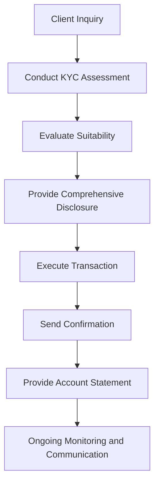

## 6.5.2 Customer Protection Rules

In the realm of municipal securities, the Municipal Securities Rulemaking Board (MSRB) plays a pivotal role in ensuring that transactions are conducted with the highest standards of integrity and transparency. The MSRB's customer protection rules are designed to safeguard investors by mandating fair dealing, suitability, and comprehensive disclosure in all municipal securities transactions. This section will delve into these critical aspects, offering detailed insights and practical examples to help you understand and apply these rules effectively.

### Understanding Fair Dealing in Municipal Securities

**Fair Dealing** is a cornerstone of ethical conduct in the securities industry. It requires brokers and dealers to act honestly and transparently with their clients, ensuring that all actions are in the customer's best interest. The MSRB enforces this principle through various rules that govern the conduct of municipal securities professionals.

#### Key Aspects of Fair Dealing

1. **Honesty and Integrity**: Professionals must provide accurate and truthful information to clients, avoiding any misleading statements or omissions.

2. **Disclosure of Material Information**: It is essential to disclose all material information that could affect an investor's decision-making process. This includes risks, potential conflicts of interest, and any other relevant details.

3. **Pricing and Execution**: Transactions must be executed at fair and reasonable prices, reflecting current market conditions.

4. **Conflicts of Interest**: Any potential conflicts must be disclosed to the client, and steps should be taken to mitigate their impact.

#### Example of Fair Dealing

**Proper Practice**: A broker provides a client with a comprehensive analysis of a municipal bond's credit rating, interest rate, and potential risks, ensuring the client understands the investment's implications.

**Improper Practice**: A broker fails to disclose a recent downgrade in the bond's credit rating, misleading the client about the investment's risk.

### Suitability Requirements in Municipal Securities

The MSRB mandates that brokers and dealers ensure that any recommended municipal security transaction is suitable for the customer, based on their financial situation, investment objectives, and risk tolerance.

#### Determining Suitability

1. **Know Your Customer (KYC)**: Gather detailed information about the client's financial status, investment experience, and goals.

2. **Risk Assessment**: Evaluate the risks associated with the municipal security and determine if they align with the client's risk tolerance.

3. **Investment Objectives**: Ensure the recommended security meets the client's investment objectives, whether it's income generation, capital preservation, or growth.

#### Example of Suitability

**Proper Practice**: A broker recommends a high-grade municipal bond to a conservative investor seeking stable income and low risk.

**Improper Practice**: A broker suggests a speculative municipal bond to the same conservative investor, disregarding their risk aversion.

### Disclosure Requirements in Municipal Securities

Disclosure is a critical component of the MSRB's customer protection framework. It ensures that investors have access to all necessary information to make informed decisions.

#### Essential Disclosures

1. **Material Information**: Provide all relevant information about the security, including financial statements, credit ratings, and any changes in the issuer's circumstances.

2. **Risks and Benefits**: Clearly outline the potential risks and benefits associated with the investment.

3. **Fees and Charges**: Disclose any fees, commissions, or other charges that may apply to the transaction.

#### Example of Disclosure

**Proper Practice**: A dealer provides a client with a detailed prospectus that includes the bond's credit rating, interest rate, maturity date, and potential risks.

**Improper Practice**: A dealer omits the bond's call provisions, which could significantly impact the investor's returns.

### Requirements for Confirmations and Account Statements

Accurate and timely confirmations and account statements are vital for maintaining transparency and trust in municipal securities transactions.

#### Confirmation Requirements

1. **Timeliness**: Confirmations must be sent to the client promptly after the transaction is executed.

2. **Content**: Include all relevant details such as the security's description, trade date, settlement date, price, and any applicable fees or charges.

3. **Accuracy**: Ensure that all information is accurate and reflects the actual terms of the transaction.

#### Account Statement Requirements

1. **Frequency**: Provide regular account statements, typically on a monthly or quarterly basis.

2. **Comprehensive Information**: Statements should include all holdings, transactions, and any changes in the account's value.

3. **Clarity**: Present information in a clear and understandable format, allowing clients to easily review their account activity.

### Practical Examples and Case Studies

**Case Study 1: Ensuring Fair Dealing**

A municipal securities dealer is approached by a client interested in purchasing a new issue of municipal bonds. The dealer provides the client with a detailed analysis of the bond's credit rating, interest rate, and potential risks. Additionally, the dealer discloses a recent downgrade in the issuer's credit rating, allowing the client to make an informed decision.

**Case Study 2: Assessing Suitability**

A broker is working with a retired client seeking a stable income stream. After conducting a thorough KYC assessment, the broker recommends a high-grade municipal bond with a strong credit rating and stable interest payments. The recommendation aligns with the client's risk tolerance and investment objectives, demonstrating the broker's commitment to suitability.

**Case Study 3: Comprehensive Disclosure**

A dealer is selling a municipal bond with a call provision. The dealer provides the client with a prospectus that includes all material information, including the bond's call provision, credit rating, and interest rate. This transparency ensures the client understands the potential impact of the call provision on their investment returns.

### Real-World Applications and Regulatory Scenarios

In practice, adhering to the MSRB's customer protection rules requires a combination of ethical conduct, thorough analysis, and clear communication. By understanding and applying these rules, municipal securities professionals can build trust with their clients and ensure compliance with regulatory standards.

#### Regulatory Scenario: Handling Customer Complaints

Imagine a scenario where a client files a complaint regarding a municipal bond transaction. The MSRB's customer protection rules require the dealer to investigate the complaint promptly and take appropriate action. This may involve reviewing the transaction details, assessing the suitability of the recommendation, and ensuring all disclosures were made accurately.

#### Best Practices for Compliance

1. **Regular Training**: Ensure all staff members are trained on the latest MSRB rules and customer protection standards.

2. **Robust Compliance Programs**: Implement comprehensive compliance programs that include regular audits, monitoring, and reporting.

3. **Open Communication**: Foster an environment of open communication with clients, encouraging them to ask questions and express concerns.

### Diagrams and Visual Aids

To enhance understanding, consider the following diagram illustrating the process of ensuring fair dealing, suitability, and disclosure in municipal securities transactions:

### Summary and Key Takeaways

The MSRB's customer protection rules are designed to ensure that municipal securities transactions are conducted with integrity, transparency, and fairness. By adhering to these rules, brokers and dealers can build trust with their clients, mitigate risks, and ensure compliance with regulatory standards. Key takeaways include:

- The importance of fair dealing, which requires honesty, integrity, and transparency in all client interactions.
- The necessity of ensuring suitability by understanding the client's financial situation, risk tolerance, and investment objectives.
- The critical role of disclosure in providing clients with all material information needed to make informed investment decisions.
- The requirements for accurate and timely confirmations and account statements to maintain transparency and trust.

### Encouragement and Motivation for Exam Preparation

As you prepare for the Series 7 Exam, remember that understanding and applying the MSRB's customer protection rules is crucial for success. By mastering these concepts, you'll be well-equipped to navigate the complexities of municipal securities transactions and build a successful career in the securities industry. Stay focused, practice regularly, and approach your studies with confidence.

## Series 7 Exam Practice Questions: Customer Protection Rules



### What is the primary purpose of the MSRB's customer protection rules?

- [x] To ensure fair dealing, suitability, and disclosure in municipal securities transactions.
- [ ] To regulate the issuance of new municipal bonds.
- [ ] To provide tax benefits to municipal bondholders.
- [ ] To oversee the financial stability of municipal issuers.

> **Explanation:** The MSRB's customer protection rules are designed to ensure that municipal securities transactions are conducted with fairness, suitability, and comprehensive disclosure.

### Which of the following is an example of fair dealing?

- [x] Providing accurate and truthful information about a municipal bond's credit rating.
- [ ] Recommending a high-risk bond to a conservative investor.
- [ ] Omitting the call provisions of a bond in the prospectus.
- [ ] Charging excessive fees without disclosure.

> **Explanation:** Fair dealing involves providing accurate and truthful information, ensuring that clients have all the necessary details to make informed decisions.

### What is a key component of determining suitability for a municipal security?

- [ ] The bond's maturity date.
- [x] The client's financial situation and investment objectives.
- [ ] The current market interest rates.
- [ ] The issuer's tax status.

> **Explanation:** Suitability requires understanding the client's financial situation, investment objectives, and risk tolerance to ensure the recommended security aligns with their needs.

### Which document is essential for providing comprehensive disclosure in a municipal bond transaction?

- [ ] A trade confirmation.
- [ ] An account statement.
- [x] A prospectus.
- [ ] A tax return.

> **Explanation:** A prospectus contains all material information about a municipal bond, including credit ratings, interest rates, and potential risks, ensuring comprehensive disclosure.

### How often should account statements be provided to clients?

- [ ] Annually
- [ ] Bi-annually
- [x] Monthly or quarterly
- [ ] On demand

> **Explanation:** Regular account statements, typically provided monthly or quarterly, ensure clients have up-to-date information about their holdings and account activity.

### What should a confirmation include after a municipal securities transaction?

- [x] Security description, trade date, settlement date, price, and fees.
- [ ] Only the security description and trade date.
- [ ] The issuer's financial statements.
- [ ] A summary of the client's investment objectives.

> **Explanation:** Confirmations must include detailed information about the transaction, such as the security description, trade date, settlement date, price, and any applicable fees.

### In the context of municipal securities, what does the term "fair dealing" imply?

- [ ] Maximizing profits for the broker.
- [x] Acting honestly and transparently with clients.
- [ ] Ensuring the lowest possible price for the client.
- [ ] Providing tax advice to clients.

> **Explanation:** Fair dealing implies acting honestly and transparently, ensuring that all actions are in the client's best interest and that they receive accurate information.

### What is a potential consequence of failing to disclose material information in a municipal bond transaction?

- [ ] Increased client trust.
- [x] Regulatory penalties and loss of client trust.
- [ ] Higher transaction fees.
- [ ] Improved bond ratings.

> **Explanation:** Failing to disclose material information can lead to regulatory penalties and a loss of client trust, as it violates the principles of transparency and fair dealing.

### Why is it important to conduct a Know Your Customer (KYC) assessment?

- [ ] To determine the client's tax bracket.
- [x] To gather information about the client's financial status and investment goals.
- [ ] To assess the market value of the securities.
- [ ] To calculate the client's potential tax benefits.

> **Explanation:** Conducting a KYC assessment is crucial for understanding the client's financial status, investment experience, and goals, which are essential for ensuring suitability.

### What is the role of the MSRB in the municipal securities market?

- [ ] To issue municipal bonds.
- [ ] To provide tax exemptions for municipal securities.
- [x] To establish rules and regulations for fair dealing and customer protection.
- [ ] To manage municipal bond funds.

> **Explanation:** The MSRB establishes rules and regulations to ensure fair dealing, suitability, and customer protection in the municipal securities market.



By mastering the concepts in this section and practicing with these questions, you'll be well-prepared to tackle the customer protection rules on the Series 7 Exam. Good luck!
