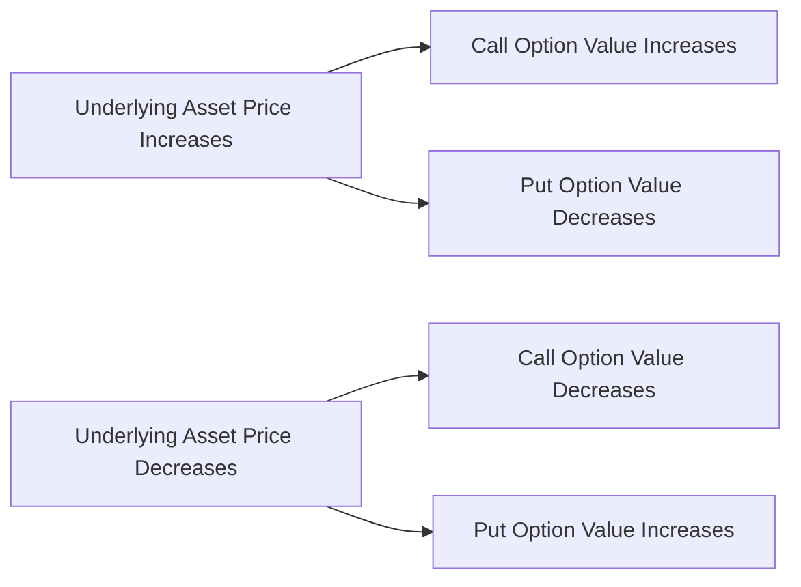

## 7.1.1.1 Underlying Asset

In the realm of options trading, understanding the concept of the underlying asset is crucial. The underlying asset is the financial instrument upon which an option's value is based. This could be a stock, an index, or an exchange-traded fund (ETF), among other financial products. The performance of these underlying assets directly influences the value of the options derived from them.

### What is an Underlying Asset?

An underlying asset is the primary security or financial instrument that an option contract is based upon. It serves as the benchmark for the option's price and determines the option's intrinsic value. The underlying asset can be:

- **Stocks:** These are shares of individual companies. Options on stocks give the holder the right, but not the obligation, to buy or sell a specific number of shares at a predetermined price before the option expires.
  
- **Indexes:** These are statistical measures of changes in a portfolio of stocks representing a portion of the overall market. Options on indexes allow traders to speculate on the movement of the entire stock market or specific sectors within it.

- **Exchange-Traded Funds (ETFs):** These are investment funds traded on stock exchanges, much like stocks. They hold assets such as stocks, commodities, or bonds and generally operate with an arbitrage mechanism designed to keep trading close to its net asset value.

### The Role of Underlying Assets in Options Trading

The underlying asset plays a pivotal role in determining the value and behavior of an option. Here are some key aspects:

#### 1. **Intrinsic Value**

The intrinsic value of an option is the difference between the market price of the underlying asset and the option's strike price. For a call option, intrinsic value is calculated as the current price of the underlying asset minus the strike price. For a put option, it is the strike price minus the current price of the underlying asset. If the result is negative, the intrinsic value is considered zero.

#### 2. **Time Value**

The time value of an option is the additional amount that traders are willing to pay over the intrinsic value, based on the time remaining until expiration. The time value is influenced by the volatility of the underlying asset, the time to expiration, and the risk-free interest rate.

#### 3. **Volatility**

Volatility is a measure of the price fluctuations of the underlying asset. Higher volatility increases the potential for an option to become profitable, thus increasing its premium. Traders often use implied volatility as an indicator to assess the expected future volatility of the underlying asset.

#### 4. **Interest Rates**

Interest rates can also affect the price of options. An increase in interest rates can lead to a rise in call option prices and a fall in put option prices. This is because higher interest rates increase the cost of carrying the underlying asset.

### Types of Underlying Assets

#### Stocks

Options on individual stocks are the most common type of options traded. Each option contract typically represents 100 shares of the underlying stock. Stock options are used for various strategies, including hedging, speculation, and income generation.

**Example:** Consider a call option on Company XYZ with a strike price of $50. If the current market price of XYZ is $55, the intrinsic value of the option is $5 per share, or $500 per contract (since each contract typically covers 100 shares).

#### Indexes

Index options are based on a stock index, such as the S&P 500 or the Dow Jones Industrial Average. These options are cash-settled, meaning they are settled in cash rather than the physical delivery of the underlying asset.

**Example:** An S&P 500 index option might have a strike price of 3000. If the index is currently at 3050, the intrinsic value of a call option is 50 points.

#### Exchange-Traded Funds (ETFs)

ETF options provide exposure to a basket of securities, offering diversification benefits. They are popular among traders looking to hedge or speculate on broader market movements.

**Example:** An option on the SPDR S&P 500 ETF (SPY), which tracks the S&P 500 index, allows traders to gain exposure to the entire index through a single security.

### How Underlying Asset Performance Influences Option Value

The performance of the underlying asset is the primary driver of an option's value. Here’s how it works:

- **Price Movements:** The price of the underlying asset directly affects the intrinsic value of the option. For call options, an increase in the underlying asset's price increases the option's value. Conversely, for put options, a decrease in the underlying asset's price increases the option's value.

- **Volatility:** Higher volatility in the underlying asset increases the potential for significant price movements, which can make options more attractive and increase their premiums.

- **Dividends:** For options on stocks, expected dividends can impact option pricing. Dividends reduce the price of the underlying stock, which can affect the value of call and put options differently.

- **Interest Rates:** Changes in interest rates can alter the cost of carrying the underlying asset, influencing option prices.

### Practical Examples and Scenarios

Let's explore some practical scenarios that illustrate the relationship between underlying assets and options:

1. **Hedging with Stock Options:**
   - An investor holds 100 shares of ABC Corp, currently trading at $100. To protect against a decline in ABC's stock price, the investor buys a put option with a strike price of $95. If the stock falls to $90, the put option can be exercised to sell the shares at $95, minimizing the loss.

2. **Speculating with Index Options:**
   - A trader believes the S&P 500 will rise in the next month. They purchase a call option on the S&P 500 index with a strike price of 4000. If the index rises to 4100, the option becomes profitable.

3. **Income Generation with ETF Options:**
   - An investor owns shares of the SPY ETF and wants to generate additional income. They sell call options on SPY with a strike price above the current market price. If SPY remains below the strike price, the options expire worthless, and the investor keeps the premium.

### Charts and Diagrams

To better understand the relationship between underlying assets and options, consider the following diagram illustrating the impact of underlying asset price movements on option value:

This diagram shows how changes in the underlying asset's price affect the value of call and put options. Understanding this relationship is key to making informed trading decisions.

### Best Practices and Common Pitfalls

#### Best Practices:

1. **Understand the Asset:** Before trading options, thoroughly research the underlying asset, including its historical volatility, price trends, and market conditions.

2. **Monitor Market Conditions:** Keep an eye on economic indicators, interest rates, and company-specific news that could impact the underlying asset's price.

3. **Use Options Strategically:** Employ options as part of a broader investment strategy, whether for hedging, speculation, or income generation.

#### Common Pitfalls:

1. **Ignoring Volatility:** Failing to consider the volatility of the underlying asset can lead to mispricing options and unexpected losses.

2. **Overleveraging:** Using options to take on excessive risk can lead to significant losses, especially in volatile markets.

3. **Neglecting Expiration Dates:** Options have expiration dates, and holding them too long can result in losing the premium if the underlying asset does not move as expected.

### Conclusion

Understanding the concept of underlying assets is fundamental to options trading. The performance of these assets directly impacts the value of options, influencing trading strategies and outcomes. By mastering the relationship between underlying assets and options, you can make more informed decisions and enhance your trading success.

---

## Series 7 Exam Practice Questions: Underlying Asset



### What is an underlying asset in options trading?

- [x] The financial instrument on which an option's value is based
- [ ] The premium paid for an option
- [ ] The strike price of an option
- [ ] The expiration date of an option

> **Explanation:** An underlying asset is the financial instrument upon which an option's value is based, such as a stock, index, or ETF.

### How does an increase in the underlying asset's price affect a call option?

- [x] It increases the value of the call option
- [ ] It decreases the value of the call option
- [ ] It has no effect on the call option
- [ ] It only affects put options

> **Explanation:** An increase in the underlying asset's price increases the intrinsic value of a call option, making it more valuable.

### What is the intrinsic value of a call option if the underlying stock is priced at $60 and the strike price is $55?

- [x] $5
- [ ] $0
- [ ] $55
- [ ] $60

> **Explanation:** The intrinsic value of a call option is the difference between the stock price and the strike price, which is $60 - $55 = $5.

### Which type of option is settled in cash rather than the physical delivery of the underlying asset?

- [x] Index options
- [ ] Stock options
- [ ] ETF options
- [ ] Commodity options

> **Explanation:** Index options are typically cash-settled, meaning they are settled in cash rather than the physical delivery of the underlying asset.

### What effect does high volatility have on an option's premium?

- [x] It increases the option's premium
- [ ] It decreases the option's premium
- [ ] It has no effect on the option's premium
- [ ] It only affects call options

> **Explanation:** High volatility increases the potential for significant price movements, making options more attractive and increasing their premiums.

### Which of the following is NOT considered an underlying asset for options?

- [ ] Stocks
- [ ] Indexes
- [ ] ETFs
- [x] Bonds

> **Explanation:** Bonds are not typically considered underlying assets for options, which are usually based on stocks, indexes, or ETFs.

### How do dividends affect the pricing of stock options?

- [x] Dividends reduce the price of the underlying stock, affecting option values
- [ ] Dividends increase the price of the underlying stock, affecting option values
- [ ] Dividends have no effect on option pricing
- [ ] Dividends only affect put options

> **Explanation:** Expected dividends reduce the price of the underlying stock, which can impact the value of both call and put options.

### What is the primary role of the underlying asset in options trading?

- [x] To determine the option's intrinsic value
- [ ] To set the option's expiration date
- [ ] To calculate the option's premium
- [ ] To establish the option's time value

> **Explanation:** The underlying asset determines the option's intrinsic value, which is the difference between the asset's price and the option's strike price.

### Which of the following best describes the relationship between interest rates and option pricing?

- [x] Higher interest rates increase call option prices and decrease put option prices
- [ ] Higher interest rates decrease call option prices and increase put option prices
- [ ] Interest rates have no effect on option pricing
- [ ] Interest rates only affect index options

> **Explanation:** Higher interest rates increase the cost of carrying the underlying asset, leading to higher call option prices and lower put option prices.

### What is a common pitfall when trading options based on underlying assets?

- [x] Ignoring the volatility of the underlying asset
- [ ] Overestimating the time value of options
- [ ] Underestimating the intrinsic value of options
- [ ] Relying solely on interest rates for pricing

> **Explanation:** Ignoring the volatility of the underlying asset can lead to mispricing options and unexpected losses, as volatility significantly impacts option premiums.



---
