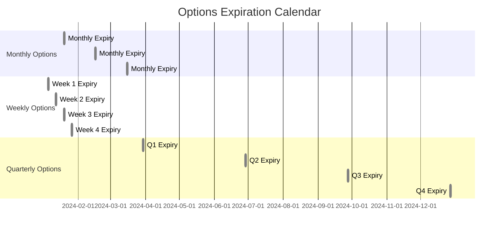

## 7.1.1.3 Expiration Date

The expiration date is a fundamental concept in options trading, playing a crucial role in determining the value and potential outcomes of an option contract. Whether you are preparing for the Series 7 Exam or looking to deepen your understanding of options, grasping the nuances of expiration dates is essential. This section will explore the significance of expiration dates, the differences between option exercise and expiration, and standard expiration cycles, complete with practical examples and scenarios.

### Understanding the Expiration Date

**Expiration Date**: The expiration date is the last date on which an option can be exercised. After this date, the option becomes void and ceases to exist. It is a critical factor in options trading, influencing both the pricing and strategy decisions of traders.

#### Significance of the Expiration Date

1. **Time Decay**: The expiration date impacts the time value of an option. As the expiration date approaches, the time value of an option decreases, a phenomenon known as time decay or theta decay. This is particularly important for options sellers, who may benefit from time decay as the option loses value.

2. **Volatility Impact**: The expiration date also affects how volatility impacts an option's price. Options with longer expiration dates are generally more sensitive to changes in volatility than those with shorter expiration dates.

3. **Strategic Decisions**: Traders must consider the expiration date when formulating their strategies. It dictates the timeframe within which the underlying asset must move favorably for the option to be profitable.

4. **Liquidity Considerations**: Options closer to expiration may experience increased liquidity as traders adjust their positions, leading to tighter bid-ask spreads.

### Option Exercise vs. Expiration

Understanding the distinction between exercising an option and letting it expire is crucial for options traders.

#### Option Exercise

Exercising an option means the holder chooses to buy (in the case of a call option) or sell (in the case of a put option) the underlying asset at the strike price. This decision is typically made when the option is in-the-money (ITM), meaning the market price of the underlying asset is favorable compared to the strike price.

- **Call Option Exercise**: If a call option is exercised, the holder buys the underlying asset at the strike price.
- **Put Option Exercise**: If a put option is exercised, the holder sells the underlying asset at the strike price.

#### Option Expiration

If an option is not exercised by the expiration date, it expires worthless. This occurs when the option is out-of-the-money (OTM), meaning the market price of the underlying asset is not favorable compared to the strike price.

- **In-the-Money (ITM)**: An option is ITM if exercising it would result in a profit. For a call option, this means the market price is above the strike price; for a put option, it means the market price is below the strike price.
- **Out-of-the-Money (OTM)**: An option is OTM if exercising it would not result in a profit. For a call option, this means the market price is below the strike price; for a put option, it means the market price is above the strike price.

### Standard Expiration Cycles

Options have standard expiration cycles, which are important for traders to understand when planning their strategies. The expiration cycle determines the specific dates on which options expire.

#### Monthly Expiration

Most options expire on the third Friday of the expiration month. If this day is a holiday, the expiration date is moved to the preceding Thursday. Monthly options are the most common and are available for a wide range of underlying assets.

#### Weekly Expiration

Weekly options, also known as weeklies, expire every Friday except the third Friday of the month. These options provide traders with more flexibility and opportunities to capitalize on short-term market movements.

#### Quarterly Expiration

Quarterly options expire on the last trading day of the quarter. They are often used by institutions and traders looking to hedge or speculate on quarterly financial results or economic data releases.

#### LEAPS (Long-term Equity Anticipation Securities)

LEAPS are long-term options with expiration dates up to three years in the future. They allow traders to take a long-term view on an underlying asset, providing more time for their investment thesis to play out.

### Practical Examples and Scenarios

#### Example 1: Call Option Exercise

Imagine you hold a call option with a strike price of $50, and the underlying stock is trading at $60 on the expiration date. Since the option is in-the-money, you can exercise the option to buy the stock at $50, realizing an instant profit of $10 per share.

#### Example 2: Put Option Expiration

Suppose you have a put option with a strike price of $40, but the underlying stock is trading at $45 on the expiration date. Since the option is out-of-the-money, it expires worthless, and you do not exercise it.

#### Example 3: Using Weekly Options

A trader expects a significant market movement due to an upcoming earnings report. They purchase a weekly option to capitalize on this short-term volatility. The option expires the following Friday, allowing the trader to benefit from the expected price movement.

### Calendars and Expiration Cycles

Understanding the standard expiration cycles is critical for effective options trading. Below is a visual representation of a typical expiration calendar:

### Best Practices and Strategies

1. **Monitor Time Decay**: Be aware of how time decay affects your options positions, especially as the expiration date approaches.

2. **Plan for Volatility**: Consider the impact of volatility on your options, particularly for those with longer expiration dates.

3. **Use Weekly Options for Short-Term Strategies**: Weekly options can be an effective tool for traders looking to capitalize on short-term market events.

4. **Consider LEAPS for Long-Term Views**: If you have a long-term investment thesis, LEAPS can provide the necessary time horizon for your strategy to unfold.

5. **Stay Informed of Expiration Cycles**: Keep track of expiration cycles to ensure your trading strategies align with the available options.

### Common Pitfalls and Challenges

- **Ignoring Time Decay**: Failing to account for time decay can lead to unexpected losses, especially for long option positions.
- **Overlooking Expiration Cycles**: Not understanding expiration cycles can result in missed opportunities or unintended positions.
- **Misjudging Volatility Impact**: Underestimating the effect of volatility on options pricing can lead to poor trading decisions.

### Regulatory Considerations

Options trading is subject to various regulatory requirements, including those set by the Securities and Exchange Commission (SEC) and the Financial Industry Regulatory Authority (FINRA). It is important to understand these regulations to ensure compliance and avoid potential penalties.

### Conclusion

The expiration date is a critical element in options trading, influencing pricing, strategy, and risk management. By understanding the significance of expiration dates, the differences between option exercise and expiration, and the standard expiration cycles, traders can make informed decisions and optimize their trading strategies.

---

## Series 7 Exam Practice Questions: Expiration Date



### What is the expiration date in options trading?

- [x] The last date on which the option can be exercised
- [ ] The date when the option is purchased
- [ ] The date when the option is sold
- [ ] The date when the option was written

> **Explanation:** The expiration date is the last date on which the option can be exercised. After this date, the option becomes void.

### How does time decay affect options as they approach expiration?

- [x] It decreases the time value of the option
- [ ] It increases the intrinsic value of the option
- [ ] It has no effect on the option's value
- [ ] It increases the time value of the option

> **Explanation:** Time decay decreases the time value of an option as it approaches expiration, impacting the overall value of the option.

### What happens to an out-of-the-money option at expiration?

- [x] It expires worthless
- [ ] It is automatically exercised
- [ ] It gains intrinsic value
- [ ] It is converted into a stock position

> **Explanation:** An out-of-the-money option expires worthless because exercising it would not be profitable.

### Which options typically expire on the third Friday of the month?

- [x] Monthly options
- [ ] Weekly options
- [ ] Quarterly options
- [ ] LEAPS

> **Explanation:** Monthly options typically expire on the third Friday of the month, unless it is a holiday.

### What is a key characteristic of LEAPS options?

- [x] They have long-term expiration dates up to three years
- [ ] They expire every week
- [ ] They are only available for index options
- [ ] They are only available for commodities

> **Explanation:** LEAPS options have long-term expiration dates, often up to three years, allowing for long-term investment strategies.

### What is the primary benefit of weekly options?

- [x] They allow for short-term trading strategies
- [ ] They have lower premiums than monthly options
- [ ] They are less risky than monthly options
- [ ] They are automatically exercised

> **Explanation:** Weekly options allow traders to capitalize on short-term market movements and events.

### How does volatility impact options with longer expiration dates?

- [x] They are more sensitive to changes in volatility
- [ ] They are less sensitive to changes in volatility
- [ ] They are not affected by volatility
- [ ] They have a fixed sensitivity to volatility

> **Explanation:** Options with longer expiration dates are generally more sensitive to changes in volatility, affecting their pricing.

### What is the significance of the expiration date for an options trader?

- [x] It dictates the timeframe for the underlying asset to move favorably
- [ ] It determines the initial premium of the option
- [ ] It has no impact on trading strategies
- [ ] It is only relevant for put options

> **Explanation:** The expiration date dictates the timeframe within which the underlying asset must move favorably for the option to be profitable.

### What happens if an in-the-money option is not exercised by expiration?

- [x] It may be automatically exercised by the brokerage
- [ ] It is converted into a futures contract
- [ ] It expires worthless
- [ ] It is rolled over to the next expiration cycle

> **Explanation:** Many brokerages automatically exercise in-the-money options at expiration to capture the intrinsic value.

### Which regulatory bodies oversee options trading in the U.S.?

- [x] SEC and FINRA
- [ ] CFTC and NFA
- [ ] FDIC and OCC
- [ ] IRS and Treasury Department

> **Explanation:** The Securities and Exchange Commission (SEC) and the Financial Industry Regulatory Authority (FINRA) oversee options trading in the U.S.


