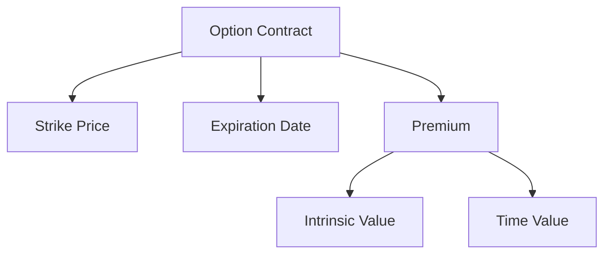

## 7.1.1 Key Terminology

Understanding the key terminology in options trading is crucial for anyone preparing for the Series 7 Exam. This section will provide you with a detailed understanding of the essential terms and concepts that form the foundation of options trading. By mastering these terms, you will be better equipped to tackle related questions on the exam and apply this knowledge in your career as a General Securities Representative.

### Key Terms in Options Trading

#### Strike Price

The **strike price** is a fundamental concept in options trading. It is the price at which the holder of the option can buy (in the case of a call option) or sell (in the case of a put option) the underlying asset. The strike price is predetermined and specified in the option contract.

- **Call Option Example:** If you hold a call option with a strike price of $50, you have the right to purchase the underlying asset at $50, regardless of its current market price.
- **Put Option Example:** Conversely, if you hold a put option with a strike price of $50, you have the right to sell the underlying asset at $50.

The strike price is crucial because it determines the intrinsic value of an option, which we will explore later.

#### Expiration Date

The **expiration date** is the date on which the option contract becomes void. After this date, the option holder can no longer exercise the option. The expiration date is critical because it affects the time value of the option and, consequently, its pricing.

- **Example:** An option with an expiration date of December 31, 2024, must be exercised by that date. After December 31, the option expires worthless if not exercised.

Options can have different expiration cycles, such as weekly, monthly, or quarterly, and the choice of expiration date can significantly impact an option's strategy and pricing.

#### Premium

The **premium** is the price paid by the buyer to the seller for the option contract. It represents the cost of acquiring the rights conveyed by the option.

- **Components of the Premium:** The premium consists of two main components: intrinsic value and time value.
- **Example:** If an option has a premium of $5, the buyer pays $5 per share for the option contract.

The premium is influenced by several factors, including the current price of the underlying asset, the strike price, time until expiration, volatility, and interest rates.

#### Intrinsic Value

**Intrinsic value** is the difference between the current price of the underlying asset and the strike price of the option. It represents the real, tangible value of the option if it were exercised immediately.

- **Call Option Intrinsic Value:** For a call option, intrinsic value is calculated as the current market price of the underlying asset minus the strike price. If the result is negative, the intrinsic value is zero.
  
  
  \text{Intrinsic Value (Call)} = \max(0, \text{Market Price} - \text{Strike Price})
  

- **Put Option Intrinsic Value:** For a put option, intrinsic value is the strike price minus the current market price of the underlying asset. Again, if the result is negative, the intrinsic value is zero.
  
  
  \text{Intrinsic Value (Put)} = \max(0, \text{Strike Price} - \text{Market Price})
  

- **Example:** If a call option has a strike price of $50 and the underlying asset is trading at $55, the intrinsic value is $5.

Intrinsic value is a key component of an option's premium and indicates whether an option is "in-the-money" (ITM), "at-the-money" (ATM), or "out-of-the-money" (OTM).

#### Time Value

**Time value** is the portion of the option's premium that exceeds its intrinsic value. It reflects the probability of the option increasing in value before expiration due to favorable movements in the price of the underlying asset.

- **Calculation:** Time value is calculated as the option premium minus the intrinsic value.
  
  
  \text{Time Value} = \text{Option Premium} - \text{Intrinsic Value}
  

- **Factors Affecting Time Value:** Time value is influenced by the time remaining until expiration, volatility of the underlying asset, and prevailing interest rates.

- **Example:** If an option has a premium of $7 and an intrinsic value of $5, the time value is $2.

Time value diminishes as the expiration date approaches, a phenomenon known as "time decay."

### Anatomy of an Option Contract

To visualize the components of an option contract, consider the following diagram:

This diagram illustrates how the strike price, expiration date, and premium are integral parts of an option contract. The premium is further divided into intrinsic value and time value, both of which are critical in determining the option's overall pricing.

### How These Components Affect Option Pricing

Understanding how each component affects option pricing is essential for evaluating options and making informed trading decisions.

- **Strike Price:** The relationship between the strike price and the current market price determines the intrinsic value. Options with strike prices closer to the current market price tend to have higher premiums due to higher intrinsic value or potential for becoming in-the-money.

- **Expiration Date:** Options with longer expiration dates generally have higher premiums because they offer more time for the underlying asset to move favorably. However, time decay accelerates as the expiration date approaches, reducing the time value.

- **Premium:** The premium is the market price of the option and reflects both intrinsic value and time value. Traders must consider whether the premium justifies the potential gains from the option.

- **Intrinsic Value:** An option with intrinsic value is considered in-the-money and is more likely to be exercised. Options with high intrinsic value have higher premiums.

- **Time Value:** Time value represents the potential for future gains. Options with high volatility or longer expiration dates typically have higher time values.

### Practical Examples and Scenarios

Consider the following scenarios to illustrate how these components interact in real-world options trading:

1. **Scenario 1: Call Option with Intrinsic Value**

   - **Underlying Asset Price:** $60
   - **Strike Price:** $50
   - **Option Premium:** $12
   
   In this scenario, the call option is in-the-money with an intrinsic value of $10 ($60 - $50). The time value is $2 ($12 - $10).

2. **Scenario 2: Put Option with No Intrinsic Value**

   - **Underlying Asset Price:** $40
   - **Strike Price:** $50
   - **Option Premium:** $3
   
   Here, the put option is out-of-the-money with no intrinsic value. The entire premium of $3 is attributed to time value.

3. **Scenario 3: Impact of Expiration Date**

   - **Option A Expiration:** 1 month
   - **Option B Expiration:** 6 months
   - **Underlying Asset Price:** $55
   - **Strike Price:** $50
   
   Option B, with a longer expiration, will have a higher premium due to greater time value compared to Option A, assuming all other factors remain constant.

### Real-World Applications

In professional practice, understanding these key terms is vital for evaluating options strategies and making informed trading decisions. For instance, a trader might use call options with a low strike price to capitalize on expected upward movements in the underlying asset. Conversely, put options with a high strike price might be used to hedge against potential declines.

### Compliance Considerations

When dealing with options, compliance with regulatory requirements is crucial. The Financial Industry Regulatory Authority (FINRA) and the Securities and Exchange Commission (SEC) have specific rules governing options trading, including disclosure requirements and suitability standards. Understanding these regulations is essential for ensuring compliance and protecting client interests.

### Summary

Mastering the key terminology in options trading is an essential step in preparing for the Series 7 Exam and advancing your career in the securities industry. By understanding the strike price, expiration date, premium, intrinsic value, and time value, you will be equipped to evaluate options contracts effectively and make informed trading decisions.

---

## Series 7 Exam Practice Questions: Key Terminology



### What is the strike price in an options contract?

- [x] The price at which the underlying asset can be bought or sold
- [ ] The price paid for the option contract
- [ ] The current market price of the underlying asset
- [ ] The total value of the option premium

> **Explanation:** The strike price is the predetermined price at which the underlying asset can be bought or sold, as specified in the option contract.

### Which component of an option's premium reflects its real, tangible value?

- [ ] Time value
- [ ] Expiration date
- [x] Intrinsic value
- [ ] Volatility

> **Explanation:** Intrinsic value represents the real, tangible value of an option if it were exercised immediately, based on the difference between the market price and the strike price.

### What happens to the time value of an option as the expiration date approaches?

- [ ] It increases
- [x] It decreases
- [ ] It remains constant
- [ ] It becomes negative

> **Explanation:** The time value of an option decreases as the expiration date approaches, a phenomenon known as time decay.

### How is the premium of an option calculated?

- [x] Intrinsic value plus time value
- [ ] Strike price minus market price
- [ ] Market price minus strike price
- [ ] Expiration date plus volatility

> **Explanation:** The premium of an option is calculated by adding the intrinsic value and the time value.

### What is the intrinsic value of a call option with a strike price of $50 and a market price of $55?

- [ ] $0
- [ ] $5
- [x] $5
- [ ] $10

> **Explanation:** The intrinsic value of the call option is $5, calculated as the market price ($55) minus the strike price ($50).

### Which factor is NOT a component of an option's premium?

- [ ] Intrinsic value
- [ ] Time value
- [x] Strike price
- [ ] Expiration date

> **Explanation:** The strike price is not a component of the premium; rather, it is a separate term that affects the intrinsic value.

### What is the time value of an option with a premium of $8 and an intrinsic value of $5?

- [ ] $3
- [ ] $5
- [x] $3
- [ ] $8

> **Explanation:** The time value is $3, calculated as the premium ($8) minus the intrinsic value ($5).

### Which term describes the date when an option contract becomes void?

- [ ] Strike price
- [ ] Premium
- [x] Expiration date
- [ ] Intrinsic value

> **Explanation:** The expiration date is the date on which the option contract becomes void and can no longer be exercised.

### What is the primary reason for the time value in an option?

- [ ] Intrinsic value
- [x] Probability of future price movements
- [ ] Current market price
- [ ] Strike price

> **Explanation:** The time value reflects the probability of the option increasing in value before expiration due to favorable movements in the underlying asset's price.

### How does volatility affect an option's premium?

- [x] Increases time value
- [ ] Decreases intrinsic value
- [ ] Has no effect
- [ ] Reduces expiration date

> **Explanation:** Higher volatility increases the time value of an option, leading to a higher premium.


