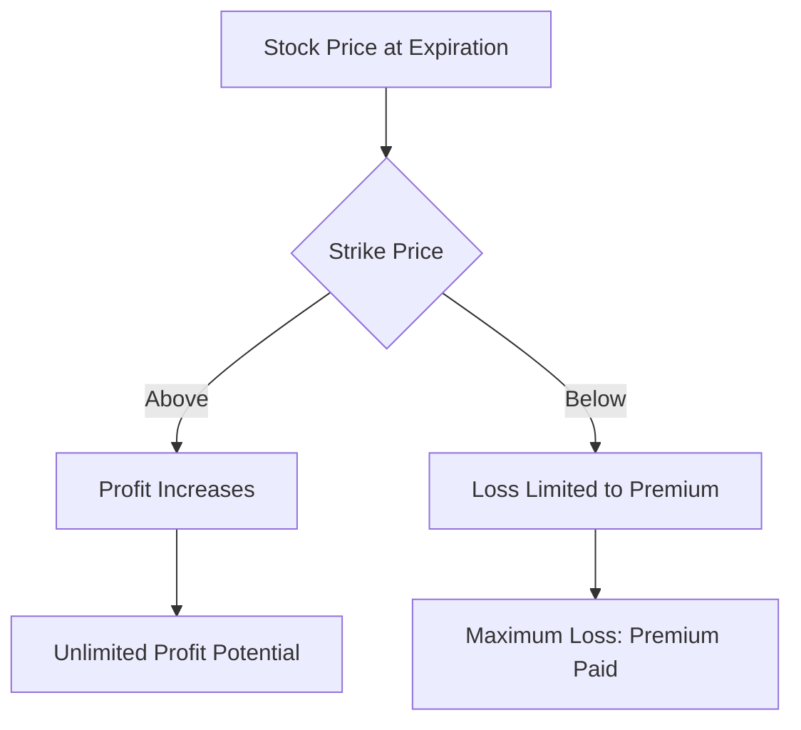
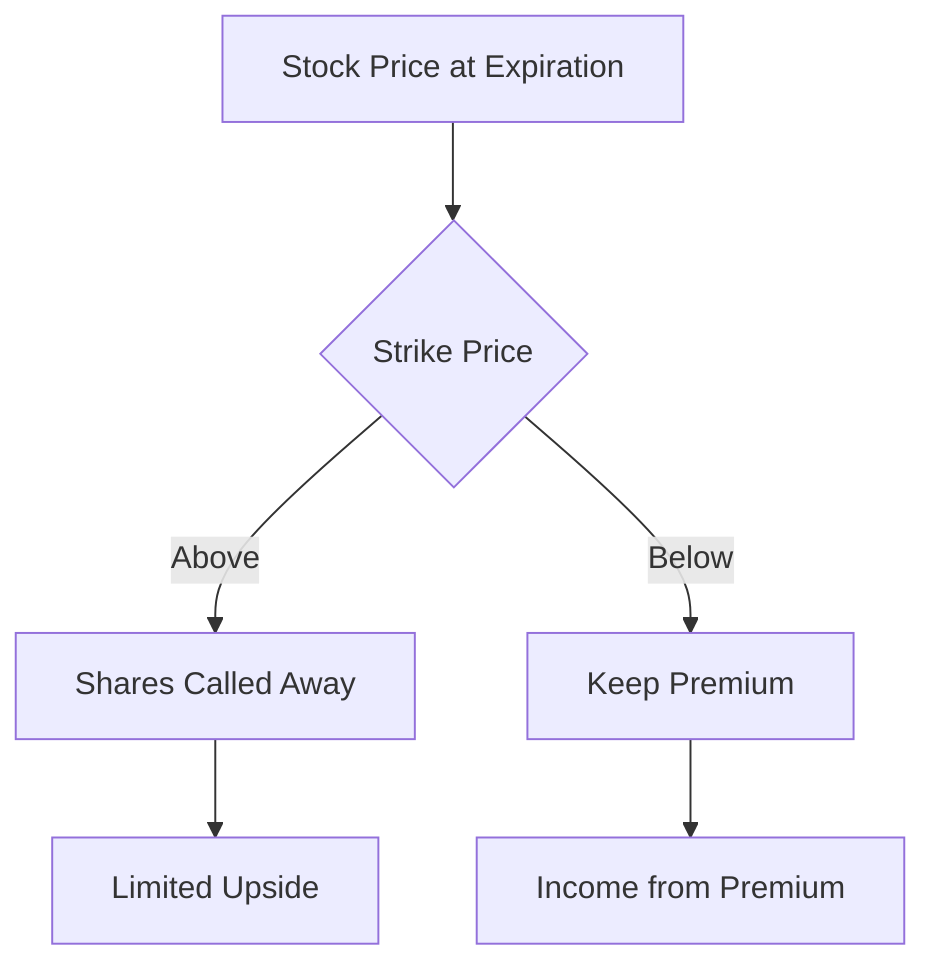
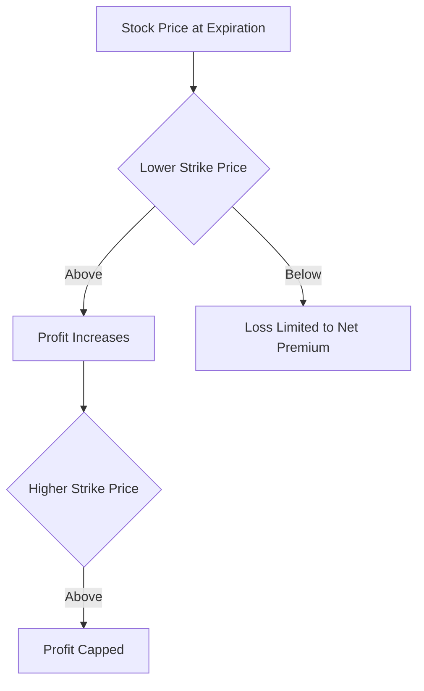

## 7.1.2.1 Call Options

Call options are a fundamental component of options trading and a critical topic for the Series 7 Exam. Understanding how call options work, their strategic applications, and their profit and loss profiles will not only help you excel on the exam but also prepare you for real-world trading scenarios. This section provides an in-depth exploration of call options, including motivations for buying or selling them, and discusses various bullish strategies.

### Understanding Call Options

A call option is a financial contract that gives the buyer the right, but not the obligation, to purchase a specified quantity of an underlying asset at a predetermined price (known as the strike price) within a specified time period. The seller, or writer, of the call option is obligated to sell the asset if the buyer chooses to exercise the option.

**Key Characteristics of Call Options:**

- **Underlying Asset:** This could be stocks, indices, commodities, or other financial instruments.
- **Strike Price:** The price at which the buyer can purchase the underlying asset.
- **Expiration Date:** The date by which the option must be exercised or it becomes worthless.
- **Premium:** The price paid by the buyer to the seller for the option.

### Motivations for Buying Call Options

Investors buy call options for several reasons:

1. **Leverage:** Call options allow investors to control a larger amount of shares with a smaller initial investment compared to buying the shares outright.
2. **Speculation:** Traders may speculate on the upward movement of a stock's price, potentially achieving significant returns.
3. **Limited Risk:** The maximum loss for a call option buyer is the premium paid, unlike owning the underlying stock, which can decline significantly.
4. **Flexibility:** Options provide strategic flexibility, allowing investors to tailor their positions to their market outlook.

### Motivations for Selling Call Options

Selling call options can also be a strategic move:

1. **Income Generation:** By writing call options, investors can earn premiums, providing additional income.
2. **Hedging:** Investors holding the underlying asset can write covered calls to hedge against potential price declines.
3. **Market Neutrality:** Some traders sell calls to express a neutral or bearish view on the underlying asset.

### Bullish Strategies Using Call Options

Call options are primarily used in bullish strategies, where the investor expects the underlying asset's price to rise. Here are some common strategies:

#### Long Call

A long call involves purchasing a call option with the expectation that the underlying asset's price will rise above the strike price before expiration. This strategy offers unlimited profit potential and limited risk, as the maximum loss is the premium paid.

**Example:**

Suppose you buy a call option for Company XYZ with a strike price of $50, expiring in one month, and pay a premium of $2 per share. If XYZ's stock price rises to $60, you can exercise the option to buy the shares at $50, realizing a profit of $8 per share ($10 gain minus $2 premium).

#### Covered Call

A covered call strategy involves owning the underlying asset and selling a call option against it. This strategy generates income from the premium and provides a limited hedge against price declines, though it caps the upside potential.

**Example:**

You own 100 shares of Company XYZ, currently trading at $50, and sell a call option with a strike price of $55 for a premium of $3 per share. If the stock price remains below $55, you keep the premium. If it rises above $55, your shares may be called away, but you've effectively sold them at $58 ($55 strike price + $3 premium).

#### Bull Call Spread

A bull call spread involves buying a call option at a lower strike price and selling another call option at a higher strike price. This strategy reduces the net premium paid and limits both potential gains and losses.

**Example:**

You buy a call option on Company XYZ with a strike price of $50 for a $4 premium and sell a call option with a strike price of $60 for a $2 premium. The net cost is $2 per share. If the stock rises to $60 or above, your profit is capped at $8 per share ($10 gain minus $2 net premium).

### Profit and Loss Profiles for Call Options

Understanding the profit and loss (P&L) profiles of call options is crucial for evaluating potential outcomes and risks. Below are graphical representations of P&L profiles for the strategies discussed.

**Long Call P&L Profile:**

**Covered Call P&L Profile:**

**Bull Call Spread P&L Profile:**

### Real-World Applications and Considerations

In practice, call options are used by a variety of market participants, including individual investors, institutional traders, and corporations. Here are some real-world applications:

- **Portfolio Management:** Portfolio managers may use call options to enhance returns or protect against downside risks.
- **Corporate Finance:** Companies might issue call options as part of employee compensation packages or to raise capital.
- **Speculative Trading:** Traders use call options to capitalize on short-term price movements without committing significant capital.

### Regulatory Considerations

When trading call options, it's essential to comply with regulatory requirements. The Financial Industry Regulatory Authority (FINRA) and the Securities and Exchange Commission (SEC) oversee options trading to protect investors and ensure market integrity. Key regulations include:

- **Options Disclosure Document (ODD):** Investors must receive this document, which explains the risks and characteristics of options trading.
- **Suitability Requirements:** Brokers must ensure that options trading is suitable for the investor's financial situation and investment objectives.
- **Margin Requirements:** Understanding margin requirements is crucial, as options trading can involve significant leverage.

### Best Practices and Common Pitfalls

To succeed in trading call options, consider these best practices and avoid common pitfalls:

- **Conduct Thorough Research:** Analyze the underlying asset's fundamentals and technical indicators before entering a trade.
- **Manage Risk:** Use stop-loss orders and position sizing to manage risk effectively.
- **Stay Informed:** Keep up with market news and economic indicators that may impact the underlying asset's price.
- **Avoid Overleveraging:** While options offer leverage, excessive use can lead to significant losses.

### Summary

Call options are versatile financial instruments that offer a range of strategic opportunities for investors and traders. By understanding how they work, the motivations for buying or selling them, and their profit and loss profiles, you can effectively incorporate call options into your investment strategy. Remember to adhere to regulatory requirements and employ best practices to maximize your success in options trading.

## Series 7 Exam Practice Questions: Call Options



### What is the primary motivation for buying a call option?

- [x] To speculate on the upward movement of the underlying asset's price.
- [ ] To generate income through premiums.
- [ ] To hedge against a decline in the underlying asset's price.
- [ ] To lock in a purchase price for the underlying asset.

> **Explanation:** Buying a call option allows the investor to speculate on the potential rise in the underlying asset's price, offering unlimited profit potential with limited risk.

### What is the maximum loss for a buyer of a call option?

- [x] The premium paid for the option.
- [ ] The difference between the strike price and the market price.
- [ ] The entire value of the underlying asset.
- [ ] There is no maximum loss.

> **Explanation:** The maximum loss for a call option buyer is limited to the premium paid, as they are not obligated to exercise the option.

### In a covered call strategy, what is the primary risk for the investor?

- [ ] Unlimited loss potential.
- [x] The underlying asset being called away at the strike price.
- [ ] The premium received being lost.
- [ ] The inability to sell the underlying asset.

> **Explanation:** In a covered call strategy, the primary risk is that the underlying asset may be called away if the market price exceeds the strike price, capping the investor's upside potential.

### What is a bull call spread?

- [ ] Buying a call option and selling a put option.
- [x] Buying a call option at a lower strike price and selling a call option at a higher strike price.
- [ ] Selling a call option and buying a put option.
- [ ] Buying two call options with different expiration dates.

> **Explanation:** A bull call spread involves buying a call option at a lower strike price and selling another call option at a higher strike price, limiting both potential gains and losses.

### Which of the following is a characteristic of a long call strategy?

- [x] Unlimited profit potential.
- [ ] Limited profit potential.
- [ ] Income generation through premiums.
- [ ] Hedging against price declines.

> **Explanation:** A long call strategy offers unlimited profit potential, as the investor benefits from any rise in the underlying asset's price above the strike price.

### What document must investors receive before trading options?

- [ ] The Securities Exchange Act of 1934.
- [x] The Options Disclosure Document (ODD).
- [ ] The Investment Company Act of 1940.
- [ ] The Sarbanes-Oxley Act.

> **Explanation:** Investors must receive the Options Disclosure Document (ODD), which outlines the risks and characteristics of options trading.

### What is the primary benefit of a covered call strategy?

- [ ] Unlimited upside potential.
- [ ] Protection against all market declines.
- [x] Income generation through premiums.
- [ ] No risk of losing the underlying asset.

> **Explanation:** The primary benefit of a covered call strategy is generating income through premiums while holding the underlying asset.

### How does a bull call spread limit potential losses?

- [ ] By buying a call option with a higher strike price.
- [x] By selling a call option with a higher strike price to offset the cost of buying a lower strike price call.
- [ ] By using stop-loss orders.
- [ ] By diversifying the underlying assets.

> **Explanation:** A bull call spread limits potential losses by selling a call option with a higher strike price, which offsets part of the cost of buying a call option with a lower strike price.

### What is the role of the seller in a call option contract?

- [ ] To buy the underlying asset at the strike price.
- [x] To sell the underlying asset if the buyer exercises the option.
- [ ] To guarantee a profit for the buyer.
- [ ] To determine the expiration date of the option.

> **Explanation:** The seller of a call option is obligated to sell the underlying asset at the strike price if the buyer chooses to exercise the option.

### Which strategy involves owning the underlying asset and selling a call option against it?

- [ ] Long call.
- [ ] Bull call spread.
- [x] Covered call.
- [ ] Naked call.

> **Explanation:** A covered call strategy involves owning the underlying asset and selling a call option against it to generate income from the premium.



By mastering the concepts and strategies associated with call options, you will be well-prepared for the Series 7 Exam and equipped to apply these principles in your securities career. Remember to review these key points regularly and practice with real-world scenarios to deepen your understanding.
