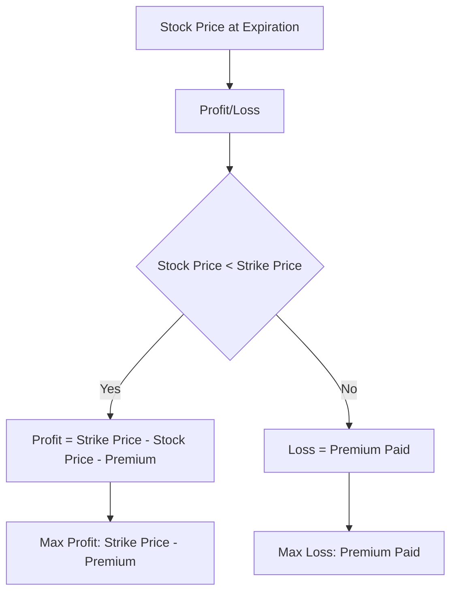

## 7.1.2.2 Put Options

Put options are a fundamental component of options trading, offering investors the ability to capitalize on declining asset prices or to hedge against potential losses in their portfolios. Understanding put options is crucial for anyone preparing for the Series 7 Exam, as they play a significant role in both speculative and risk management strategies.

### What is a Put Option?

A put option is a financial contract that gives the holder the right, but not the obligation, to sell a specified amount of an underlying asset at a predetermined price (known as the strike price) within a specified time period. The seller (or writer) of the put option is obligated to buy the underlying asset at the strike price if the option is exercised by the holder.

#### Key Characteristics of Put Options

- **Underlying Asset**: The asset that the put option is based on, which can be stocks, indices, commodities, or currencies.
- **Strike Price**: The price at which the holder can sell the underlying asset.
- **Expiration Date**: The date by which the option must be exercised or it becomes worthless.
- **Premium**: The price paid by the buyer to the seller for the option contract.

### Mechanics of Put Options

When you purchase a put option, you are essentially buying insurance against a decline in the price of the underlying asset. If the asset's price falls below the strike price, the put option can be exercised, allowing you to sell the asset at the higher strike price, thus securing a profit or minimizing a loss.

#### Example Scenario

Consider a stock currently trading at $50. You purchase a put option with a strike price of $45, expiring in three months, for a premium of $2 per share. If the stock price falls to $40, you can exercise your option to sell the stock at $45, despite the market price being lower. Your profit would be the difference between the strike price and the market price, minus the premium paid.

### Reasons Investors Use Put Options

Put options are versatile tools used by investors for various purposes:

- **Speculation**: Traders may buy puts if they believe the price of the underlying asset will decline. This bearish strategy allows them to profit from downward price movements.
- **Hedging**: Investors holding a long position in an asset can purchase puts to protect against potential losses. This is akin to buying insurance on the asset.
- **Income Generation**: Writing (selling) put options can generate income through the premiums received, although this strategy involves the risk of having to purchase the underlying asset if the option is exercised.

### Bearish Strategies with Put Options

Put options are inherently bearish, meaning they are used when an investor expects the price of the underlying asset to decline. Here are some common bearish strategies involving puts:

#### Long Put

A long put involves buying a put option with the expectation that the underlying asset's price will fall. This strategy is straightforward and provides the potential for significant profits if the asset's price drops substantially below the strike price.

- **Profit Potential**: The profit is maximized when the underlying asset's price falls to zero. The maximum profit is the strike price minus the premium paid.
- **Risk**: The maximum loss is limited to the premium paid for the option.

#### Protective Put

A protective put is used by investors who already own the underlying asset and wish to protect against a decline in its price. By purchasing a put option, the investor can ensure a minimum selling price for the asset.

- **Profit Potential**: The potential profit is unlimited if the asset's price rises, while the put provides a safety net against losses.
- **Risk**: The cost of the put premium is the primary risk, as it reduces overall returns.

### Hedging with Put Options

Hedging is a risk management strategy used to offset potential losses in an investment. Put options are effective hedging tools because they provide a guaranteed selling price for the underlying asset, thus limiting downside risk.

#### Example of Hedging with Puts

Suppose you own 100 shares of a company currently trading at $100 per share. To protect against a potential decline, you purchase a put option with a strike price of $95, expiring in six months, for a premium of $3 per share. If the stock price falls to $85, you can exercise the put and sell the shares at $95, limiting your loss to $5 per share plus the premium.

### Profit and Loss Diagrams for Put Options

Visualizing the potential outcomes of a put option strategy can aid in understanding its risk and reward profile. Below is a profit and loss diagram for a long put option:

### Real-World Applications and Regulatory Considerations

In the real world, put options are used by individual investors, institutional traders, and corporations to manage risk and speculate on market movements. Understanding the regulatory framework surrounding options trading is essential for compliance and effective risk management.

#### Regulatory Framework

- **FINRA and SEC**: The Financial Industry Regulatory Authority (FINRA) and the Securities and Exchange Commission (SEC) regulate options trading in the U.S. They ensure transparency, fairness, and investor protection.
- **Options Disclosure Document (ODD)**: Before trading options, investors must receive the ODD, which outlines the risks and characteristics of options trading.

### Best Practices and Common Pitfalls

- **Understand the Risks**: Options trading involves significant risk, and it's crucial to understand the potential losses and how they can impact your portfolio.
- **Use Puts for Hedging**: While speculative strategies can be profitable, using puts for hedging can provide peace of mind and protect against adverse market movements.
- **Avoid Overleveraging**: Options can be highly leveraged instruments. Ensure that your use of options aligns with your risk tolerance and investment objectives.

### Summary

Put options are powerful tools in the arsenal of any securities professional. By understanding their mechanics, strategic uses, and regulatory considerations, you can effectively incorporate them into your investment strategies. Whether you're looking to profit from a bearish market outlook or hedge against potential losses, put options offer flexibility and protection.

## Series 7 Exam Practice Questions: Put Options



### What is the primary purpose of purchasing a put option?

- [x] To profit from a decline in the price of the underlying asset
- [ ] To profit from an increase in the price of the underlying asset
- [ ] To generate income from option premiums
- [ ] To hedge against an increase in interest rates

> **Explanation:** Purchasing a put option allows the holder to profit from a decline in the price of the underlying asset by selling it at the strike price, which is higher than the market price if the asset's value falls.

### In a long put strategy, what is the maximum loss an investor can incur?

- [ ] The difference between the strike price and the market price
- [ ] The entire value of the underlying asset
- [x] The premium paid for the option
- [ ] There is no maximum loss

> **Explanation:** The maximum loss in a long put strategy is limited to the premium paid for the option, as the investor is not obligated to exercise the option if it is not profitable.

### How does a protective put strategy benefit an investor?

- [x] It provides downside protection while allowing for upside potential
- [ ] It guarantees a profit regardless of market conditions
- [ ] It eliminates the need for diversification
- [ ] It reduces the cost of purchasing the underlying asset

> **Explanation:** A protective put strategy allows an investor to hedge against downside risk while still benefiting from any upside in the underlying asset's price.

### What is the role of the Options Disclosure Document (ODD)?

- [ ] To provide detailed financial analysis of the underlying asset
- [x] To inform investors about the risks and characteristics of options trading
- [ ] To guarantee the performance of the options market
- [ ] To set the prices of options contracts

> **Explanation:** The ODD is a document that informs investors about the risks and characteristics of options trading, ensuring they understand the potential outcomes before engaging in options transactions.

### Which regulatory body oversees options trading in the United States?

- [ ] Federal Trade Commission (FTC)
- [ ] Commodity Futures Trading Commission (CFTC)
- [x] Securities and Exchange Commission (SEC)
- [ ] Internal Revenue Service (IRS)

> **Explanation:** The Securities and Exchange Commission (SEC) oversees options trading in the United States, ensuring transparency and investor protection.

### What happens to a put option if the underlying asset's price is above the strike price at expiration?

- [ ] The option is automatically exercised
- [ ] The option holder receives a profit
- [x] The option expires worthless
- [ ] The option is converted into a call option

> **Explanation:** If the underlying asset's price is above the strike price at expiration, the put option expires worthless because it is not profitable to sell the asset at the strike price.

### Why might an investor write (sell) a put option?

- [ ] To hedge against a decline in the underlying asset's price
- [ ] To speculate on a decrease in the underlying asset's price
- [x] To generate income from the option premium
- [ ] To avoid paying taxes on capital gains

> **Explanation:** An investor might write a put option to generate income from the option premium, with the risk of having to purchase the underlying asset if the option is exercised.

### In options trading, what does the term "in the money" mean for a put option?

- [ ] The underlying asset's price is above the strike price
- [x] The underlying asset's price is below the strike price
- [ ] The option has expired
- [ ] The option has been exercised

> **Explanation:** A put option is "in the money" when the underlying asset's price is below the strike price, making it profitable to exercise the option.

### What is a common pitfall when using put options for speculation?

- [ ] Underestimating the potential for profit
- [ ] Overestimating the time to expiration
- [x] Overleveraging and risking excessive capital
- [ ] Ignoring the potential for market volatility

> **Explanation:** A common pitfall when speculating with put options is overleveraging, which can lead to significant losses if the market moves against the investor's position.

### How can put options be used in a diversified portfolio?

- [x] As a hedge to protect against downside risk
- [ ] As a replacement for all equity holdings
- [ ] To eliminate the need for fixed income securities
- [ ] To increase exposure to market volatility

> **Explanation:** Put options can be used in a diversified portfolio as a hedge to protect against downside risk, providing a safety net while maintaining exposure to potential gains.



By mastering the concepts and strategies associated with put options, you will be well-prepared to tackle related questions on the Series 7 Exam and apply these insights in your professional practice.
