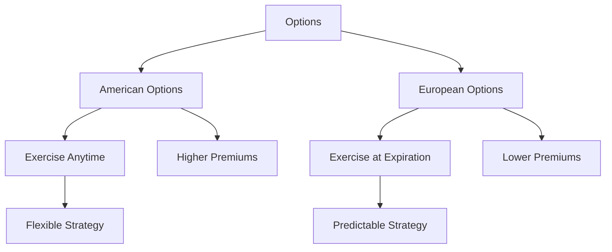

## 7.1.3 American vs. European Options

Options are versatile financial instruments that provide the right, but not the obligation, to buy or sell an underlying asset at a specified price before a certain date. Understanding the differences between American and European options is crucial for anyone preparing for the Series 7 exam and for professionals in the securities industry. This section will delve into the characteristics, pricing implications, and strategic considerations of American and European options.

### Understanding the Basics

#### American Options

**Definition:** American options are financial derivatives that can be exercised at any time up to and including the expiration date. This flexibility allows the option holder to take advantage of favorable market conditions at any point during the option's life.

**Common Assets:** American options are typically associated with stocks and exchange-traded funds (ETFs) in the U.S. markets. The ability to exercise these options at any time makes them particularly appealing in volatile markets where prices can swing significantly.

**Impact on Pricing and Strategy:**
- **Pricing:** The flexibility of American options often results in higher premiums compared to European options. This is because the option writer (seller) assumes more risk due to the possibility of early exercise.
- **Strategy:** Investors might choose American options when they anticipate significant price movements before expiration. The ability to exercise early can be advantageous if the underlying asset pays dividends or if the investor wants to capture profits or limit losses promptly.

#### European Options

**Definition:** European options can only be exercised at expiration. This characteristic makes them more predictable in terms of exercise timing, which can simplify certain pricing models and risk management strategies.

**Common Assets:** European options are commonly associated with indices and foreign exchange markets. For example, options on the S&P 500 index are typically European-style.

**Impact on Pricing and Strategy:**
- **Pricing:** European options generally have lower premiums than American options due to the reduced flexibility in exercise. The option writer faces less risk since the exercise can only occur at a predetermined time.
- **Strategy:** European options are suitable for investors who are confident in their market predictions at expiration. They are often used in strategies where the timing of exercise is less critical, such as hedging against long-term market movements.

### Detailed Comparison

#### Exercise Flexibility

- **American Options:** The holder can exercise the option at any point before expiration, providing flexibility to react to market changes or corporate actions like dividends.
- **European Options:** Exercise is restricted to the expiration date, which can limit the holder's ability to respond to market events but simplifies the decision-making process.

#### Pricing Models

The pricing of options involves complex mathematical models, with the Black-Scholes model being one of the most widely used for European options. For American options, models like the Binomial Option Pricing Model are often employed due to their ability to handle the complexity of early exercise.

- **American Options:** The possibility of early exercise requires models that can accommodate multiple exercise points. This complexity can result in higher premiums.
- **European Options:** The Black-Scholes model provides a straightforward approach to pricing, as it assumes exercise only at expiration. This simplicity often translates into lower premiums.

#### Strategic Applications

- **American Options:** Ideal for scenarios where early exercise might be beneficial, such as capturing dividends or reacting to market volatility.
- **European Options:** Suitable for strategies focusing on long-term market trends or when the timing of exercise is not a primary concern.

### Practical Examples

#### American Options in Action

Consider a scenario where an investor holds an American call option on a stock that is expected to pay a significant dividend. The investor might choose to exercise the option early to capture the dividend, a strategy not possible with European options.

#### European Options in Action

An investor holding a European put option on a stock index might use it to hedge against a potential market downturn. Since the option can only be exercised at expiration, the investor benefits from any decline in the index value at that time, without the need to monitor short-term fluctuations.

### Real-World Applications and Regulatory Considerations

Understanding the differences between American and European options is not only crucial for passing the Series 7 exam but also for navigating the complexities of the securities industry. Regulatory bodies such as the Securities and Exchange Commission (SEC) and the Financial Industry Regulatory Authority (FINRA) provide guidelines and rules that govern options trading, ensuring transparency and fairness in the markets.

- **Compliance:** Professionals must adhere to these regulations, ensuring that options are marketed and sold appropriately, with full disclosure of risks and characteristics.
- **Best Practices:** Traders should consider factors such as market conditions, asset volatility, and their own risk tolerance when selecting between American and European options.

### Diagrams and Visuals

To further illustrate the differences and strategic applications of American and European options, consider the following diagram:

### Conclusion

Understanding the nuances between American and European options is essential for anyone involved in options trading or preparing for the Series 7 exam. By grasping the differences in exercise flexibility, pricing, and strategic applications, you can make informed decisions that align with your investment goals and market outlook.

### Additional Resources

For further study, consider exploring the following resources:
- The Options Industry Council (OIC) offers educational materials and webinars on options trading.
- FINRA provides guidelines and resources on compliance and best practices in the securities industry.

### Summary

In summary, American and European options offer distinct advantages and challenges. American options provide flexibility with the potential for early exercise, while European options offer predictability with exercise only at expiration. Understanding these differences is crucial for effective options trading and for success in the Series 7 exam.

---

## Series 7 Exam Practice Questions: American vs. European Options



### What is a primary characteristic of American options?

- [x] They can be exercised at any time before expiration.
- [ ] They can only be exercised at expiration.
- [ ] They are only available for stocks.
- [ ] They have lower premiums than European options.

> **Explanation:** American options can be exercised at any time before expiration, providing flexibility to the holder.

### Which type of option is typically associated with stock indices?

- [ ] American options
- [x] European options
- [ ] Both American and European options
- [ ] Neither American nor European options

> **Explanation:** European options are commonly associated with stock indices, such as options on the S&P 500.

### How does the flexibility of American options impact their pricing?

- [x] It generally results in higher premiums.
- [ ] It generally results in lower premiums.
- [ ] It has no impact on pricing.
- [ ] It makes them cheaper than European options.

> **Explanation:** The flexibility to exercise at any time increases the risk for the option writer, leading to higher premiums for American options.

### What is a common strategy for using European options?

- [ ] Capturing dividends through early exercise
- [ ] Reacting to short-term market volatility
- [x] Hedging against long-term market trends
- [ ] Day trading in volatile markets

> **Explanation:** European options are often used for hedging against long-term market trends due to their exercise restriction to expiration.

### Which pricing model is typically used for European options?

- [ ] Binomial Option Pricing Model
- [x] Black-Scholes Model
- [ ] Monte Carlo Simulation
- [ ] Arbitrage Pricing Theory

> **Explanation:** The Black-Scholes Model is commonly used for pricing European options due to its assumption of exercise only at expiration.

### What is a key advantage of American options over European options?

- [x] Ability to exercise at any time before expiration
- [ ] Lower premiums
- [ ] Simpler pricing models
- [ ] Less risk for the option writer

> **Explanation:** The key advantage of American options is the ability to exercise at any time before expiration, offering greater flexibility.

### Why might an investor choose a European option?

- [ ] To capture dividends
- [ ] To react to short-term price changes
- [x] To benefit from lower premiums
- [ ] To exercise early

> **Explanation:** Investors might choose European options for their lower premiums, as they can only be exercised at expiration.

### In which market are American options most commonly traded?

- [x] U.S. stock markets
- [ ] European stock markets
- [ ] Foreign exchange markets
- [ ] Commodities markets

> **Explanation:** American options are most commonly traded in U.S. stock markets, where the flexibility to exercise early is valued.

### What is the impact of dividends on American options?

- [x] They may influence early exercise decisions.
- [ ] They have no impact on option strategies.
- [ ] They result in lower premiums.
- [ ] They are irrelevant to options trading.

> **Explanation:** Dividends may influence the decision to exercise American options early to capture the dividend payout.

### How do European options simplify risk management?

- [x] By allowing exercise only at expiration
- [ ] By offering lower premiums
- [ ] By being less volatile
- [ ] By being limited to stock indices

> **Explanation:** European options simplify risk management by allowing exercise only at expiration, reducing the complexity of timing decisions.



---
