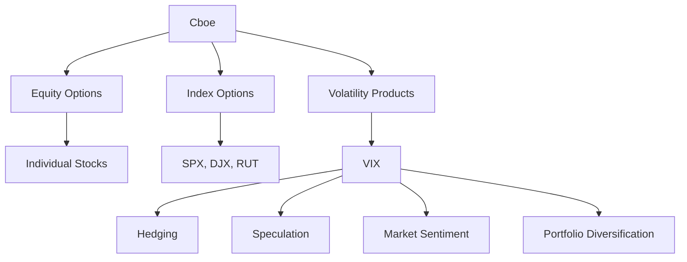

## 7.2.1.1 Chicago Board Options Exchange (Cboe)

The Chicago Board Options Exchange (Cboe), established in 1973, is a cornerstone of the global financial markets, renowned for its pioneering role in options trading. As the largest options exchange in the United States, Cboe has been instrumental in the development and expansion of the options market, offering a wide array of products that cater to diverse trading strategies and risk management needs.

### History and Significance of the Cboe

The Cboe was founded in response to the growing demand for a formalized market for options trading. Prior to its establishment, options were traded over-the-counter (OTC), which often resulted in a lack of transparency and standardization. The introduction of the Cboe brought about a significant transformation by providing a regulated and centralized marketplace for options trading, enhancing liquidity, and fostering investor confidence.

The Cboe's opening in April 1973 marked the beginning of standardized options contracts, complete with fixed expiration dates and strike prices. This innovation was further bolstered by the introduction of the Black-Scholes model, a groundbreaking method for pricing options, which provided a theoretical framework that facilitated the growth of the options market.

Over the years, the Cboe has continued to innovate, introducing a variety of products and services that have expanded the scope of options trading. Its influence extends beyond the United States, with a global presence that underscores its role as a leader in the financial markets.

### Products and Indices Associated with the Cboe

The Cboe offers a comprehensive range of products, including equity options, index options, and volatility products. These offerings cater to a wide spectrum of investors, from individual traders to institutional investors, providing tools for hedging, speculation, and income generation.

#### Equity Options

Equity options are contracts that give the holder the right, but not the obligation, to buy or sell a specific stock at a predetermined price within a specified period. The Cboe lists options on thousands of individual stocks, making it a vital platform for investors seeking to manage risk or capitalize on market opportunities.

#### Index Options

Index options are options on stock indices, allowing investors to gain exposure to the broader market or specific sectors without the need to trade individual stocks. The Cboe offers options on several major indices, including the S&P 500 (SPX), Dow Jones Industrial Average (DJX), and Russell 2000 (RUT). These products are popular among investors looking to hedge against market volatility or speculate on market trends.

#### Volatility Products

One of the most notable innovations from the Cboe is the introduction of volatility products, particularly the Cboe Volatility Index (VIX). Known as the "fear gauge," the VIX measures the market's expectation of future volatility based on S&P 500 index options. It is widely used by traders and investors to gauge market sentiment and manage risk.

##### Understanding the VIX

The VIX is a real-time market index that represents the market's expectations for volatility over the coming 30 days. It is calculated using the prices of S&P 500 index options and is expressed as an annualized percentage. A higher VIX value indicates greater expected volatility, while a lower value suggests more stable market conditions.

**Glossary:**

- **VIX (Cboe Volatility Index):** A measure of the stock market's expectation of volatility, often referred to as the "fear gauge."

**How Traders Use the VIX**

Traders use the VIX in various ways to inform their trading strategies:

1. **Hedging:** Investors may use VIX futures and options to hedge against potential market downturns. By taking positions in these volatility products, traders can offset losses in their equity portfolios during periods of heightened volatility.

2. **Speculation:** Some traders speculate on the direction of market volatility by trading VIX futures and options. This strategy involves predicting whether volatility will increase or decrease and taking positions accordingly.

3. **Market Sentiment Analysis:** The VIX is often used as a barometer of market sentiment. A rising VIX may indicate increasing fear among investors, while a declining VIX suggests a more complacent market outlook.

4. **Portfolio Diversification:** Incorporating VIX-related products into a portfolio can provide diversification benefits, as volatility often moves inversely to equity markets.

### Practical Examples and Scenarios

To illustrate the application of Cboe products, consider the following scenarios:

- **Hedging with Index Options:** An institutional investor with a large equity portfolio may purchase S&P 500 index put options to protect against a potential market downturn. This strategy allows the investor to lock in a selling price for the index, mitigating losses if the market declines.

- **Speculating with VIX Futures:** A trader anticipates increased market volatility due to an upcoming economic announcement. They decide to buy VIX futures, expecting the VIX to rise. If their prediction is correct, the trader can profit from the increase in volatility.

- **Income Generation with Covered Calls:** An individual investor holds a substantial position in a blue-chip stock. To generate additional income, they sell call options on the stock, collecting premiums while potentially capping their upside if the stock price exceeds the strike price.

### Real-World Applications and Regulatory Scenarios

The Cboe operates under the regulatory oversight of the Securities and Exchange Commission (SEC) and the Financial Industry Regulatory Authority (FINRA). These bodies ensure that trading activities on the exchange adhere to established rules and standards, promoting market integrity and protecting investors.

**Regulatory Compliance Considerations:**

- **Disclosure Requirements:** Traders and investors must comply with disclosure requirements when trading options, ensuring transparency and informed decision-making.

- **Suitability Standards:** Financial professionals must adhere to suitability standards when recommending options strategies to clients, ensuring that the strategies align with the client's financial goals and risk tolerance.

- **Margin Requirements:** Options trading often involves margin accounts, which are subject to specific regulatory requirements. Traders must understand these requirements to manage their positions effectively and avoid margin calls.

### Diagrams and Visual Aids

To enhance understanding, consider the following diagram illustrating the relationship between the Cboe, its products, and market participants:

### Best Practices and Common Pitfalls

**Best Practices:**

- **Diversification:** Use a mix of options strategies and products to diversify risk and enhance portfolio performance.
- **Education:** Continuously educate yourself on options trading strategies and market conditions to make informed decisions.
- **Risk Management:** Implement robust risk management practices to protect against adverse market movements.

**Common Pitfalls:**

- **Over-Leverage:** Avoid excessive use of leverage, which can amplify losses and lead to significant financial distress.
- **Ignoring Market Conditions:** Stay informed about market conditions and economic indicators that can impact options pricing and volatility.
- **Neglecting Regulatory Compliance:** Ensure compliance with all regulatory requirements to avoid penalties and legal issues.

### Summary and Key Takeaways

The Chicago Board Options Exchange (Cboe) plays a pivotal role in the global financial markets, offering a wide range of products that cater to diverse trading needs. Understanding the Cboe's offerings, particularly the VIX, is essential for traders and investors seeking to navigate the complexities of options trading.

Key takeaways include:

- The Cboe's history and significance in standardizing options trading.
- A comprehensive overview of the products and indices offered by the Cboe.
- Practical applications of Cboe products in hedging, speculation, and income generation.
- Regulatory considerations and best practices for trading on the Cboe.

By mastering these concepts, you will be well-prepared to tackle the Series 7 Exam and excel in your career as a General Securities Representative.

## Series 7 Exam Practice Questions: Chicago Board Options Exchange (Cboe)



### What year was the Chicago Board Options Exchange (Cboe) established?

- [x] 1973
- [ ] 1980
- [ ] 1965
- [ ] 1990

> **Explanation:** The Cboe was established in 1973, marking the beginning of standardized options trading.

### What is the primary purpose of the Cboe Volatility Index (VIX)?

- [ ] To measure stock price movements
- [x] To measure the market's expectation of future volatility
- [ ] To track individual stock performance
- [ ] To calculate average trading volume

> **Explanation:** The VIX measures the market's expectation of future volatility, often referred to as the "fear gauge."

### Which of the following is NOT a product offered by the Cboe?

- [ ] Equity Options
- [ ] Index Options
- [ ] Volatility Products
- [x] Mutual Funds

> **Explanation:** The Cboe offers equity options, index options, and volatility products, but not mutual funds.

### How do traders typically use the VIX?

- [ ] To predict individual stock prices
- [ ] To calculate dividend yields
- [x] To gauge market sentiment and manage risk
- [ ] To determine interest rates

> **Explanation:** Traders use the VIX to gauge market sentiment and manage risk, as it reflects expectations of future volatility.

### What is a key characteristic of index options?

- [ ] They are based on individual stocks
- [x] They allow exposure to broader market indices
- [ ] They have no expiration date
- [ ] They are only traded OTC

> **Explanation:** Index options allow exposure to broader market indices, such as the S&P 500, without trading individual stocks.

### Which regulatory body oversees the Cboe?

- [ ] Federal Reserve
- [x] Securities and Exchange Commission (SEC)
- [ ] Commodity Futures Trading Commission (CFTC)
- [ ] Department of Treasury

> **Explanation:** The SEC oversees the Cboe, ensuring compliance with securities laws and regulations.

### What is the significance of the Black-Scholes model in options trading?

- [ ] It tracks stock dividends
- [x] It provides a theoretical framework for pricing options
- [ ] It predicts market crashes
- [ ] It calculates interest rates

> **Explanation:** The Black-Scholes model provides a theoretical framework for pricing options, facilitating the growth of the options market.

### Which of the following is a common strategy using index options?

- [x] Hedging against market downturns
- [ ] Short selling individual stocks
- [ ] Speculating on currency exchange rates
- [ ] Investing in real estate

> **Explanation:** Index options are commonly used for hedging against market downturns by providing protection against declines in broader market indices.

### What does a rising VIX typically indicate?

- [ ] Increasing market stability
- [ ] Decreasing interest rates
- [x] Increasing fear among investors
- [ ] Declining stock prices

> **Explanation:** A rising VIX typically indicates increasing fear among investors, reflecting expectations of higher future volatility.

### What is a potential pitfall of options trading?

- [ ] Lack of leverage
- [x] Over-leverage
- [ ] Guaranteed profits
- [ ] Fixed returns

> **Explanation:** Over-leverage is a common pitfall in options trading, as it can amplify losses and lead to financial distress.



---

By understanding the intricacies of the Chicago Board Options Exchange and its products, you will be well-equipped to navigate the complexities of options trading and succeed in the Series 7 Exam.
