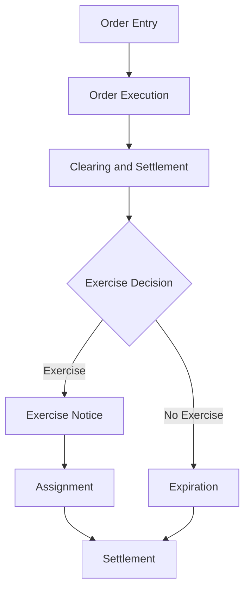

## 7.2.3 Options Transactions and Settlements

Understanding the intricacies of options transactions and settlements is crucial for any aspiring General Securities Representative. This section will guide you through the life cycle of an options trade, from order entry to settlement, and explain the exercise, assignment, and expiration procedures. We will also discuss the T+1 settlement cycle for options, providing you with the knowledge and strategies needed to navigate these processes effectively.

### Life Cycle of an Options Trade

The life cycle of an options trade involves several key stages, each of which is critical to the successful execution and settlement of the trade. Below, we break down each stage, providing detailed insights into the processes involved.

#### 1. Order Entry

The journey of an options trade begins with the order entry. This is the process where an investor decides to buy or sell an options contract. Orders can be placed through a brokerage platform, where the investor specifies the type of option (call or put), the underlying asset, the strike price, the expiration date, and the number of contracts.

**Key Considerations:**
- **Order Types:** Market orders, limit orders, stop orders, and stop-limit orders.
- **Brokerage Platforms:** Ensure the platform provides real-time data and efficient execution capabilities.

#### 2. Order Execution

Once the order is entered, it is sent to an options exchange for execution. The execution involves matching the buy and sell orders based on the specified criteria. Major options exchanges include the Chicago Board Options Exchange (CBOE) and the International Securities Exchange (ISE).

**Execution Process:**
- **Matching Orders:** Orders are matched based on price and time priority.
- **Confirmation:** Once executed, a confirmation is sent to the investor detailing the trade specifics.

#### 3. Clearing and Settlement

After execution, the trade enters the clearing and settlement phase, managed by the Options Clearing Corporation (OCC). The OCC acts as an intermediary to ensure the integrity of the options market, guaranteeing that both parties fulfill their contractual obligations.

**Clearing Process:**
- **Novation:** The OCC becomes the counterparty to both sides of the trade, reducing counterparty risk.
- **Margin Requirements:** Ensures that both buyers and sellers have sufficient funds or securities to cover potential losses.

#### 4. Exercise and Assignment

Options can be exercised before expiration if the holder chooses to invoke their right to buy (call) or sell (put) the underlying asset. Upon exercise, the OCC assigns the obligation to an option writer (seller).

**Exercise Process:**
- **Exercise Notice:** The holder submits an exercise notice to their broker, who forwards it to the OCC.
- **Assignment:** The OCC randomly assigns the exercise to a writer, who must fulfill the contract terms.

#### 5. Expiration

Options have a finite life and will expire if not exercised. The expiration date is the last day the option can be exercised. After expiration, the option becomes worthless if not exercised.

**Expiration Details:**
- **Automatic Exercise:** In-the-money options are automatically exercised unless the holder instructs otherwise.
- **Settlement:** Cash-settled options are settled in cash, while physically settled options involve the delivery of the underlying asset.

### T+1 Settlement Cycle

Options trades follow a T+1 settlement cycle, meaning the settlement occurs one business day after the trade date. This is in contrast to equities, which typically settle on a T+2 basis.

**T+1 Settlement Process:**
- **Trade Date (T):** The day the trade is executed.
- **Settlement Date (T+1):** The next business day when the transaction is finalized, and funds or securities are exchanged.

### Exercise, Assignment, and Expiration Procedures

#### Exercise Procedures

The exercise of an option involves the holder choosing to utilize their right to buy or sell the underlying asset. This process requires notifying the broker, who then communicates with the OCC.

**Steps to Exercise:**
1. **Decision to Exercise:** The holder decides based on market conditions and the option's intrinsic value.
2. **Notification:** The holder informs their broker of the intention to exercise.
3. **Broker Action:** The broker submits an exercise notice to the OCC.

#### Assignment Procedures

When an option is exercised, the OCC assigns the obligation to an option writer. This process is random and ensures that the market remains fair and orderly.

**Assignment Steps:**
1. **Exercise Notice:** Received by the OCC from the exercising broker.
2. **Random Assignment:** The OCC randomly selects a writer to fulfill the contract.
3. **Notification to Writer:** The writer is informed and must comply with the contract terms.

#### Expiration Procedures

Options that are not exercised by expiration become void. The expiration process involves automatic exercise for in-the-money options unless the holder opts out.

**Expiration Process:**
- **In-the-Money Options:** Automatically exercised by the OCC.
- **Out-of-the-Money Options:** Expire worthless, with no action required.

### Timelines and Flowcharts

To better understand the settlement process, consider the following flowchart illustrating the key stages of an options trade from order entry to settlement:

### Practical Examples and Scenarios

#### Example 1: Call Option Exercise

Imagine an investor holds a call option on XYZ stock with a strike price of $50. As the stock price rises to $60, the investor decides to exercise the option. The broker submits the exercise notice to the OCC, which assigns the obligation to a writer. The writer must then deliver 100 shares of XYZ stock at $50 per share to the investor.

#### Example 2: Put Option Expiration

An investor holds a put option on ABC stock with a strike price of $30. As the expiration date approaches, the stock is trading at $35. The investor allows the option to expire, as exercising it would not be profitable. The option expires worthless, and no further action is needed.

### Real-World Applications and Compliance

Understanding the options settlement process is vital for compliance and risk management. Brokers must ensure that they adhere to the T+1 settlement cycle and maintain accurate records of all transactions. Compliance with regulatory requirements, such as those set by the SEC and FINRA, is essential to avoid penalties and maintain market integrity.

### Best Practices and Common Pitfalls

#### Best Practices

- **Timely Communication:** Ensure all exercise and assignment notices are communicated promptly to avoid delays.
- **Margin Management:** Monitor margin requirements to prevent margin calls and potential liquidation.
- **Record Keeping:** Maintain detailed records of all options transactions for compliance and auditing purposes.

#### Common Pitfalls

- **Missed Expiration:** Failing to exercise in-the-money options before expiration can lead to missed opportunities.
- **Insufficient Funds:** Not maintaining adequate funds to cover margin requirements can result in forced liquidation.
- **Poor Timing:** Exercising options too early or too late can impact profitability.

### Summary

In this section, we explored the comprehensive process of options transactions and settlements, including the life cycle of a trade, exercise and assignment procedures, and the T+1 settlement cycle. Understanding these processes is crucial for success on the Series 7 Exam and in your future career as a General Securities Representative.

---

## Series 7 Exam Practice Questions: Options Transactions and Settlements



### What is the settlement cycle for options trades?

- [x] T+1
- [ ] T+2
- [ ] T+3
- [ ] T+0

> **Explanation:** Options trades settle on a T+1 basis, meaning they settle one business day after the trade date.

### Which organization acts as the clearinghouse for options trades?

- [ ] SEC
- [x] OCC
- [ ] FINRA
- [ ] CBOE

> **Explanation:** The Options Clearing Corporation (OCC) acts as the clearinghouse for options trades, ensuring the integrity of the market.

### What happens to an in-the-money option at expiration if no action is taken?

- [x] It is automatically exercised.
- [ ] It expires worthless.
- [ ] It is randomly assigned.
- [ ] It is settled in cash.

> **Explanation:** In-the-money options are automatically exercised at expiration unless the holder instructs otherwise.

### What is the process called when an options writer is required to fulfill the terms of the contract?

- [ ] Exercise
- [x] Assignment
- [ ] Expiration
- [ ] Clearing

> **Explanation:** Assignment is the process where an options writer is obligated to fulfill the terms of the contract upon exercise by the holder.

### Which of the following is a key consideration when entering an options order?

- [ ] Expiration date only
- [ ] Strike price only
- [x] Type of option, underlying asset, strike price, expiration date, and number of contracts
- [ ] Number of contracts only

> **Explanation:** When entering an options order, it is important to specify the type of option, underlying asset, strike price, expiration date, and number of contracts.

### What does T+1 mean in the context of options settlement?

- [ ] Trade date plus two business days
- [x] Trade date plus one business day
- [ ] Trade date plus three business days
- [ ] Trade date plus zero business days

> **Explanation:** T+1 means that the settlement occurs one business day after the trade date.

### Who receives the exercise notice from the holder's broker?

- [ ] The SEC
- [ ] The CBOE
- [x] The OCC
- [ ] FINRA

> **Explanation:** The Options Clearing Corporation (OCC) receives the exercise notice from the holder's broker.

### What is a potential consequence of not maintaining adequate funds in a margin account?

- [ ] Automatic exercise of options
- [ ] Expiration of options
- [x] Forced liquidation
- [ ] Assignment of options

> **Explanation:** Not maintaining adequate funds in a margin account can lead to forced liquidation of positions.

### In the options market, what is the role of the OCC?

- [ ] To regulate the stock exchanges
- [x] To act as a clearinghouse and ensure market integrity
- [ ] To set margin requirements
- [ ] To provide investment advice

> **Explanation:** The OCC acts as a clearinghouse, ensuring the integrity of the options market by becoming the counterparty to both sides of a trade.

### How are options trades typically executed on exchanges like the CBOE?

- [ ] By direct negotiation between buyers and sellers
- [x] By matching buy and sell orders based on price and time priority
- [ ] By random selection
- [ ] By auction

> **Explanation:** Options trades are executed by matching buy and sell orders based on price and time priority on exchanges like the CBOE.



---

This comprehensive guide to options transactions and settlements provides the foundational knowledge required for the Series 7 Exam, equipping you with the skills necessary to excel in your future career in the securities industry.
