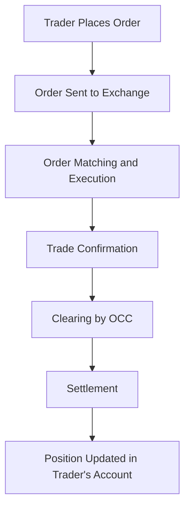

## 7.2 Options Markets and Trading

Options trading is a dynamic and integral part of the financial markets, offering investors the ability to hedge risk, speculate on market movements, and enhance portfolio returns. This section provides a detailed exploration of the options markets, highlighting major exchanges, the role of the Options Clearing Corporation (OCC), and the mechanics of options trading.

### Major Options Exchanges

Options exchanges are specialized marketplaces where options contracts are bought and sold. They play a crucial role in providing liquidity, transparency, and a regulated environment for trading. Here are some of the most prominent options exchanges:

1. **Chicago Board Options Exchange (Cboe):** Established in 1973, the Cboe is the largest options exchange in the United States. It offers a wide range of options products, including equity options, index options, and options on exchange-traded products (ETPs). The Cboe is known for its innovation in options trading, having introduced the first standardized options contracts.

2. **Nasdaq Options Market (NOM):** Part of the Nasdaq Stock Market, NOM provides a competitive platform for trading options on a variety of securities. It emphasizes speed and efficiency, utilizing advanced technology to facilitate rapid order execution.

3. **NYSE Arca Options:** As part of the New York Stock Exchange, NYSE Arca Options offers trading in equity and ETF options. It is recognized for its electronic trading capabilities and comprehensive market data services.

4. **MIAX Options Exchange:** Known for its low latency and high-performance trading platform, MIAX offers a wide array of options products. It caters to both retail and institutional investors, providing a robust trading environment.

5. **International Securities Exchange (ISE):** Acquired by Nasdaq in 2016, ISE offers options trading on a diverse range of underlying assets. It is known for its innovative market structure and competitive pricing.

These exchanges are regulated by the Securities and Exchange Commission (SEC) and adhere to strict rules to ensure fair and orderly markets.

### The Role of the Options Clearing Corporation (OCC)

The Options Clearing Corporation (OCC) is a vital entity in the options markets, serving as the central clearinghouse for all listed options contracts in the United States. Its primary functions include:

- **Guaranteeing the Performance of Options Contracts:** The OCC acts as a guarantor, ensuring that the obligations of both buyers and sellers of options are fulfilled. This reduces counterparty risk and enhances market confidence.

- **Clearing and Settlement:** The OCC facilitates the clearing and settlement of options trades, ensuring that transactions are accurately recorded and settled in a timely manner.

- **Risk Management:** The OCC employs sophisticated risk management techniques to monitor and mitigate potential risks in the options markets. This includes margin requirements and daily mark-to-market calculations.

- **Providing Market Stability:** By acting as a central counterparty, the OCC helps maintain market stability and integrity, even during periods of market volatility.

The OCC is regulated by both the SEC and the Commodity Futures Trading Commission (CFTC), reflecting its critical role in the financial system.

### Mechanics of Options Trading

Understanding the mechanics of options trading is essential for anyone looking to participate in these markets. This involves knowing the types of orders, execution processes, and how options are priced and valued.

#### Order Types and Execution

Options trading involves various order types, each serving different strategic purposes. Here are some common order types:

- **Market Order:** An order to buy or sell an option immediately at the best available price. Market orders prioritize execution speed over price.

- **Limit Order:** An order to buy or sell an option at a specific price or better. Limit orders provide price control but do not guarantee execution.

- **Stop Order:** An order that becomes a market order once a specified price is reached. Stop orders are used to limit losses or protect profits.

- **Stop-Limit Order:** Combines features of stop and limit orders. Once the stop price is reached, the order becomes a limit order.

- **Good-Till-Canceled (GTC) Order:** Remains active until executed or canceled by the trader. GTC orders provide flexibility in managing positions over time.

- **Day Order:** Valid only for the trading day on which it is placed. If not executed, it is automatically canceled at the end of the day.

Execution of options orders occurs through electronic trading platforms provided by exchanges. These platforms match buy and sell orders, ensuring efficient and transparent transactions.

#### Options Pricing and Valuation

Options pricing is influenced by several factors, including the underlying asset price, strike price, time to expiration, volatility, interest rates, and dividends. The most widely used model for options pricing is the Black-Scholes model, which calculates the theoretical value of options based on these inputs.

Key components of options pricing include:

- **Intrinsic Value:** The difference between the underlying asset's price and the option's strike price. For call options, intrinsic value is the asset price minus the strike price, while for put options, it is the strike price minus the asset price.

- **Time Value:** The additional value of an option beyond its intrinsic value, reflecting the potential for the option to gain value before expiration. Time value decreases as the expiration date approaches, a phenomenon known as time decay.

- **Volatility:** A measure of the underlying asset's price fluctuations. Higher volatility increases the potential for the option to become profitable, thus raising its premium.

- **Interest Rates and Dividends:** Changes in interest rates and expected dividends can impact options pricing, particularly for options on dividend-paying stocks.

Options traders use these factors to assess the potential profitability of options positions and to develop trading strategies.

### Flowchart of the Options Trading Process

Below is a flowchart illustrating the typical process of trading options, from placing an order to settlement:

### Practical Examples and Scenarios

To illustrate the concepts discussed, consider the following scenarios:

#### Example 1: Hedging with Options

A portfolio manager holds a significant position in a technology stock and is concerned about potential short-term volatility. To hedge this risk, the manager buys put options on the stock. If the stock price declines, the put options will increase in value, offsetting the losses in the stock position.

#### Example 2: Speculating with Call Options

An investor believes that a pharmaceutical company will announce positive clinical trial results, leading to a stock price increase. The investor buys call options on the stock, allowing them to profit from the anticipated price rise while limiting their risk to the premium paid for the options.

### Real-World Applications and Compliance Considerations

Options trading is subject to regulatory oversight to ensure market integrity and protect investors. Key compliance considerations include:

- **Options Disclosure Document (ODD):** Investors must receive the ODD, which outlines the risks and characteristics of options trading, before engaging in options transactions.

- **Customer Suitability and Approval:** Firms must assess the suitability of options trading for each customer, considering their financial situation, investment objectives, and experience level.

- **Supervision and Compliance:** Firms are required to establish supervisory procedures to monitor options trading activities and ensure compliance with regulatory requirements.

### Conclusion

Options markets and trading offer a wealth of opportunities for investors to manage risk, speculate, and enhance returns. By understanding the roles of major exchanges, the function of the OCC, and the mechanics of trading, you can navigate these markets with confidence. As you prepare for the Series 7 Exam, focus on mastering these concepts, as they are integral to the exam and your future career in the securities industry.

## Series 7 Exam Practice Questions: Options Markets and Trading



### Which of the following is the primary role of the Options Clearing Corporation (OCC)?

- [x] Guaranteeing the performance of options contracts
- [ ] Setting options prices
- [ ] Regulating options exchanges
- [ ] Providing trading platforms for options

> **Explanation:** The OCC acts as a guarantor for options contracts, ensuring that the obligations of both buyers and sellers are fulfilled, thereby reducing counterparty risk.

### What is a key characteristic of a limit order in options trading?

- [ ] It guarantees execution at the market price.
- [x] It specifies a price at which the trader is willing to buy or sell.
- [ ] It becomes a market order once a certain price is reached.
- [ ] It is valid only for the trading day on which it is placed.

> **Explanation:** A limit order specifies the price at which a trader is willing to buy or sell an option, providing price control but not guaranteeing execution.

### Which options exchange is known for its electronic trading capabilities and comprehensive market data services?

- [ ] Chicago Board Options Exchange (Cboe)
- [ ] Nasdaq Options Market (NOM)
- [x] NYSE Arca Options
- [ ] International Securities Exchange (ISE)

> **Explanation:** NYSE Arca Options is recognized for its electronic trading capabilities and comprehensive market data services.

### What is the intrinsic value of a call option with a strike price of $50 when the underlying stock is trading at $55?

- [ ] $0
- [x] $5
- [ ] $50
- [ ] $55

> **Explanation:** The intrinsic value of a call option is the underlying stock price minus the strike price. In this case, $55 - $50 = $5.

### Which factor is NOT typically considered in the Black-Scholes model for options pricing?

- [ ] Underlying asset price
- [ ] Time to expiration
- [ ] Volatility
- [x] Market sentiment

> **Explanation:** The Black-Scholes model considers factors like the underlying asset price, time to expiration, and volatility, but not market sentiment.

### What type of order becomes a market order once a specified price is reached?

- [ ] Market order
- [ ] Limit order
- [x] Stop order
- [ ] Good-Till-Canceled (GTC) order

> **Explanation:** A stop order becomes a market order once a specified price is reached, often used to limit losses or protect profits.

### Which of the following is a benefit of trading options on the Cboe?

- [ ] Lack of regulatory oversight
- [x] Access to a wide range of options products
- [ ] Guaranteed profits
- [ ] No transaction fees

> **Explanation:** The Cboe provides access to a wide range of options products, enhancing trading opportunities for investors.

### What is the time value of an option?

- [ ] The difference between the option's strike price and the underlying asset's price
- [x] The additional value of an option beyond its intrinsic value
- [ ] The interest rate used in options pricing
- [ ] The dividend yield of the underlying asset

> **Explanation:** The time value of an option reflects the potential for the option to gain value before expiration, beyond its intrinsic value.

### Which organization regulates options exchanges in the United States?

- [x] Securities and Exchange Commission (SEC)
- [ ] Options Clearing Corporation (OCC)
- [ ] Federal Reserve Board (FRB)
- [ ] Financial Industry Regulatory Authority (FINRA)

> **Explanation:** The SEC regulates options exchanges in the United States, ensuring compliance with securities laws.

### What is the purpose of the Options Disclosure Document (ODD)?

- [ ] To provide trading platforms for options
- [ ] To set options prices
- [x] To outline the risks and characteristics of options trading
- [ ] To guarantee the performance of options contracts

> **Explanation:** The ODD outlines the risks and characteristics of options trading, ensuring that investors are informed before engaging in options transactions.



By mastering the content in this section, you will be well-prepared to tackle questions on options markets and trading in the Series 7 Exam. Remember to review these concepts regularly and practice with real-world scenarios to reinforce your understanding.
