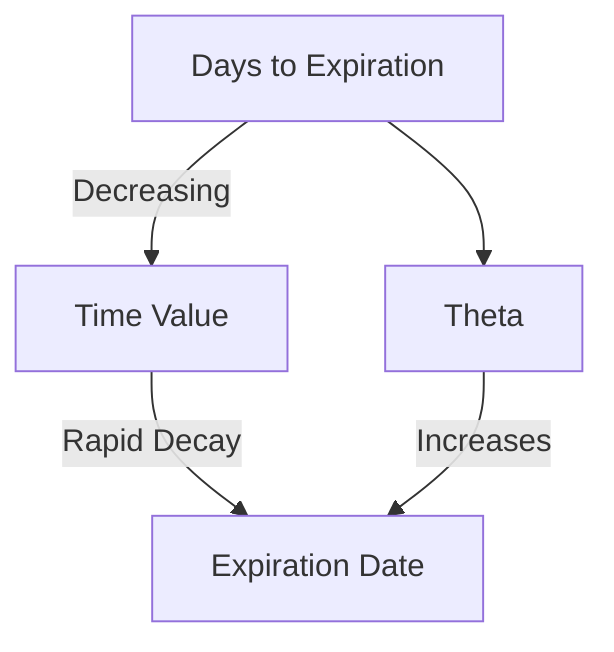

## 7.3.1 Intrinsic Value and Time Value

Understanding the intrinsic value and time value of options is essential for anyone preparing for the Series 7 Exam. These two components are fundamental to options pricing and play a crucial role in determining the profitability of options trading strategies. In this section, we will delve into the definitions, calculations, and implications of intrinsic and time value, providing you with the knowledge necessary to excel on the exam and in your securities career.

### What is Intrinsic Value?

Intrinsic value represents the inherent worth of an option based on the current price of the underlying asset. It is the amount by which an option is in-the-money (ITM). For call options, intrinsic value is the difference between the underlying asset's current price and the option's strike price, provided this difference is positive. For put options, it is the difference between the strike price and the underlying asset's current price, again provided this difference is positive.

#### Calculating Intrinsic Value

1. **Call Options:**
   - **Formula:** Intrinsic Value = Current Price of Underlying Asset - Strike Price
   - **Example:** If a call option has a strike price of $50 and the underlying stock is trading at $55, the intrinsic value is $5 ($55 - $50).

2. **Put Options:**
   - **Formula:** Intrinsic Value = Strike Price - Current Price of Underlying Asset
   - **Example:** If a put option has a strike price of $60 and the underlying stock is trading at $55, the intrinsic value is $5 ($60 - $55).

**Note:** If the calculated intrinsic value is negative, the intrinsic value is considered to be zero because options cannot have negative intrinsic value.

### What is Time Value?

Time value is the portion of an option's price that exceeds its intrinsic value. It reflects the potential for an option to gain intrinsic value before expiration due to changes in the price of the underlying asset. Time value is influenced by several factors, including the time remaining until expiration, volatility of the underlying asset, interest rates, and dividends.

#### Time Decay (Theta)

Time decay, also known as Theta, is the rate at which an option's time value decreases as the expiration date approaches. This decay accelerates as the option nears expiration, which is why options are often referred to as "wasting assets." Understanding time decay is crucial for options traders, as it affects the profitability of holding options over time.

- **Graphical Representation of Time Decay:**

This graph illustrates how time value decreases more rapidly as the expiration date approaches. The curve becomes steeper closer to expiration, indicating accelerated time decay.

### Factors Affecting Time Value

1. **Time to Expiration:**
   - Longer expiration times generally result in higher time value, as there is more opportunity for the underlying asset's price to move favorably.

2. **Volatility:**
   - Higher volatility increases the time value, as there is a greater chance for significant price movements in the underlying asset.

3. **Interest Rates:**
   - Rising interest rates can increase the time value of call options and decrease the time value of put options.

4. **Dividends:**
   - Expected dividends can affect the time value, particularly for call options, as dividends reduce the price of the underlying asset.

### Practical Examples and Scenarios

#### Example 1: Call Option with Intrinsic and Time Value

- **Scenario:** A call option with a strike price of $100 on a stock currently trading at $110.
- **Intrinsic Value Calculation:** $110 - $100 = $10
- **Option Price:** $15
- **Time Value Calculation:** $15 (Option Price) - $10 (Intrinsic Value) = $5

In this example, the option has both intrinsic and time value. The intrinsic value is $10, and the time value is $5.

#### Example 2: Put Option with Only Time Value

- **Scenario:** A put option with a strike price of $100 on a stock currently trading at $95.
- **Intrinsic Value Calculation:** $100 - $95 = $5
- **Option Price:** $7
- **Time Value Calculation:** $7 (Option Price) - $5 (Intrinsic Value) = $2

Here, the put option has an intrinsic value of $5 and a time value of $2. The time value reflects the potential for further price decreases in the underlying asset.

### Strategies for Managing Intrinsic and Time Value

1. **Buying Options:**
   - Consider purchasing options with high time value if you anticipate significant price movements in the underlying asset.

2. **Selling Options:**
   - Selling options with high time value can be profitable if you expect the underlying asset's price to remain stable or if time decay will erode the option's value.

3. **Hedging:**
   - Use options with intrinsic value to hedge against adverse price movements in the underlying asset.

4. **Speculation:**
   - Engage in speculative strategies by buying options with significant time value, betting on volatility or price movements.

### Common Pitfalls and Challenges

- **Ignoring Time Decay:** Traders often overlook the impact of time decay, leading to losses if the underlying asset's price does not move as expected.
- **Overvaluing Intrinsic Value:** Focusing solely on intrinsic value can result in missed opportunities to profit from time value.
- **Misjudging Volatility:** Incorrect assumptions about volatility can lead to overpaying for options with high time value.

### Exam Tips and Mnemonics

- **Mnemonic for Intrinsic Value Calculation:**
  - **Call Options:** "Call Up" - Current Price Above Strike Price
  - **Put Options:** "Put Down" - Strike Price Above Current Price

- **Remembering Time Decay:**
  - **"Time Ticks Away"** - As time passes, time value decreases.

### Summary

Understanding intrinsic value and time value is crucial for options pricing and trading strategies. By mastering these concepts, you will be better equipped to evaluate options, manage risk, and make informed trading decisions. Remember to consider both intrinsic and time value when analyzing options, and be mindful of time decay's impact on your positions.

## Series 7 Exam Practice Questions: Intrinsic Value and Time Value



### What is the intrinsic value of a call option with a strike price of $50 when the underlying stock is trading at $55?

- [x] $5
- [ ] $0
- [ ] $10
- [ ] $15

> **Explanation:** The intrinsic value of a call option is the current price of the underlying asset minus the strike price. Here, it is $55 - $50 = $5.

### How does time decay affect an option's price as expiration approaches?

- [x] Time decay causes the option's price to decrease.
- [ ] Time decay causes the option's price to increase.
- [ ] Time decay has no effect on the option's price.
- [ ] Time decay only affects the intrinsic value.

> **Explanation:** Time decay, or Theta, reduces the time value of an option, causing its price to decrease as expiration nears.

### Which factor does NOT affect the time value of an option?

- [ ] Time to expiration
- [ ] Volatility
- [ ] Interest rates
- [x] The option's intrinsic value

> **Explanation:** The intrinsic value does not affect the time value; time value is influenced by time to expiration, volatility, and interest rates.

### What is the intrinsic value of a put option with a strike price of $60 when the underlying stock is trading at $55?

- [x] $5
- [ ] $0
- [ ] $10
- [ ] $15

> **Explanation:** The intrinsic value of a put option is the strike price minus the current price of the underlying asset. Here, it is $60 - $55 = $5.

### If a call option has an intrinsic value of $10 and a time value of $5, what is the option's total price?

- [ ] $10
- [x] $15
- [ ] $5
- [ ] $20

> **Explanation:** The total price of an option is the sum of its intrinsic value and time value. Here, it is $10 + $5 = $15.

### What happens to the time value of an option if volatility increases?

- [x] Time value increases
- [ ] Time value decreases
- [ ] Time value remains unchanged
- [ ] Time value becomes zero

> **Explanation:** Increased volatility raises the time value of an option, as there is a greater chance for significant price movements.

### Which of the following best describes Theta in options trading?

- [x] The rate of time decay in an option's price
- [ ] The difference between an option's strike price and the current price
- [ ] The measure of an option's sensitivity to interest rates
- [ ] The amount by which an option is in-the-money

> **Explanation:** Theta represents the rate at which an option's time value decreases over time.

### A call option is considered "in-the-money" when:

- [x] The current price of the underlying asset is above the strike price
- [ ] The current price of the underlying asset is below the strike price
- [ ] The option's time value is greater than its intrinsic value
- [ ] The option is close to expiration

> **Explanation:** A call option is in-the-money when the underlying asset's price exceeds the strike price.

### An option's time value is highest when:

- [x] There is a long time until expiration and high volatility
- [ ] There is a short time until expiration and low volatility
- [ ] The option is deep in-the-money
- [ ] The option is out-of-the-money

> **Explanation:** Time value is highest when there is a long time until expiration and high volatility, providing more opportunity for favorable price movements.

### What is the intrinsic value of a call option with a strike price of $70 when the underlying stock is trading at $65?

- [ ] $5
- [ ] $10
- [ ] $0
- [x] $0

> **Explanation:** The intrinsic value of a call option is zero when the current price of the underlying asset is below the strike price.



By mastering the concepts of intrinsic value and time value, you will enhance your ability to analyze options, make informed trading decisions, and succeed in the Series 7 Exam. Remember to consider the impact of time decay and other factors on options pricing as you prepare for your exam and future career in the securities industry.
