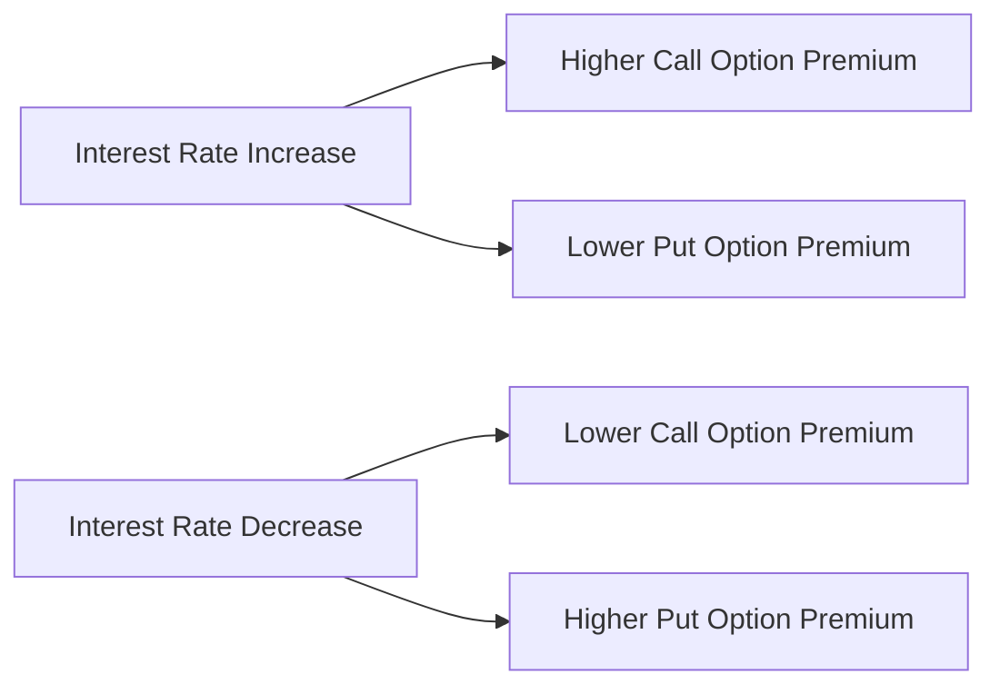

## 7.3.2.2 Interest Rates

Interest rates play a significant role in the financial markets, influencing everything from bond prices to mortgage rates. In the context of options, interest rates, specifically the risk-free rate, can also affect the pricing of options premiums. This section will delve into how changes in interest rates impact options premiums, focusing on long-dated options, and discuss the limited effect of interest rates on most options.

### Understanding the Risk-Free Rate

The **risk-free rate** is a critical concept in finance, representing the theoretical return on an investment with no risk of financial loss. It is commonly associated with the yield on U.S. Treasury bills, as these are considered one of the safest investments due to the backing of the U.S. government. The risk-free rate serves as a benchmark for evaluating investment returns and is a fundamental component in options pricing models, such as the Black-Scholes model.

### Impact of Interest Rates on Options Premiums

Interest rates can influence options premiums through their effect on the cost of carry, which is the cost associated with holding a position in an asset. The cost of carry includes the interest expense of financing the purchase of an asset, and in the case of options, it affects the pricing of the option premium.

#### Long-Dated Options

For long-dated options, changes in interest rates can have a more pronounced impact on the option premium. This is because the time value component of the option premium is more sensitive to changes in the risk-free rate over a longer period. When interest rates rise, the cost of carry increases, which can lead to a higher premium for call options and a lower premium for put options. Conversely, when interest rates fall, the cost of carry decreases, leading to a lower premium for call options and a higher premium for put options.

##### Example: Call Option Premium

Consider a long-dated call option on a stock with a strike price of $100, expiring in two years. If the risk-free rate increases from 2% to 3%, the present value of the strike price decreases, making the call option more valuable. As a result, the premium for the call option would increase.

##### Example: Put Option Premium

Conversely, for a long-dated put option on the same stock with a strike price of $100, an increase in the risk-free rate would decrease the present value of the strike price, making the put option less valuable. Consequently, the premium for the put option would decrease.

### Limited Impact on Most Options

While interest rates can influence the premiums of long-dated options, their impact on most options is relatively limited. For short-dated options, the time value component is less sensitive to changes in the risk-free rate, as the holding period is shorter. Additionally, other factors, such as the underlying asset's volatility and market conditions, often have a more significant impact on the option premium than interest rates.

#### Factors Mitigating Interest Rate Impact

1. **Short Time Horizon**: For options with shorter expiration periods, the effect of interest rate changes is minimal due to the limited time value component.

2. **Volatility Dominance**: The volatility of the underlying asset often plays a more crucial role in determining the option premium than interest rates, especially for options with high implied volatility.

3. **Market Conditions**: Prevailing market conditions, such as supply and demand dynamics, can overshadow the impact of interest rates on options pricing.

### Real-World Applications and Regulatory Scenarios

In practice, options traders and financial professionals must consider interest rate changes when pricing options, particularly for long-dated contracts. Understanding the relationship between interest rates and options premiums can help traders make informed decisions and manage risk effectively.

#### Case Study: Interest Rate Hike Scenario

Imagine a scenario where the Federal Reserve announces an interest rate hike. Options traders holding long-dated call options might anticipate an increase in premiums due to the higher cost of carry. Conversely, those holding long-dated put options might expect a decrease in premiums. Traders can use this information to adjust their portfolios and hedge against potential losses.

### Step-by-Step Guidance for Calculating Interest Rate Impact

To calculate the impact of interest rate changes on options premiums, traders can use the Black-Scholes model or other options pricing models that incorporate the risk-free rate. Here is a step-by-step guide:

1. **Identify the Current Risk-Free Rate**: Determine the current yield on a U.S. Treasury bill or another benchmark considered risk-free.

2. **Estimate Future Rate Changes**: Consider potential changes in interest rates based on economic forecasts or central bank announcements.

3. **Use an Options Pricing Model**: Input the current risk-free rate and the estimated future rate changes into an options pricing model to calculate the option premium.

4. **Analyze the Results**: Compare the calculated premiums under different interest rate scenarios to understand the potential impact on your options positions.

### Diagrams and Visuals

To enhance understanding, consider the following diagram illustrating the relationship between interest rates and options premiums for call and put options:

This diagram shows how an increase in interest rates can lead to higher call option premiums and lower put option premiums, while a decrease in interest rates has the opposite effect.

### Best Practices and Common Pitfalls

- **Monitor Economic Indicators**: Keep an eye on economic indicators and central bank announcements that could signal changes in interest rates.

- **Diversify Options Portfolio**: Diversify your options portfolio to mitigate the impact of interest rate changes on individual positions.

- **Avoid Overemphasizing Interest Rates**: While important, interest rates are just one factor affecting options premiums. Consider other factors, such as volatility and market conditions, when making trading decisions.

### References and Additional Resources

For further exploration of interest rates and their impact on options pricing, consider the following resources:

- "Options, Futures, and Other Derivatives" by John C. Hull
- The Black-Scholes Model: Understanding its Assumptions and Applications
- Federal Reserve Economic Data (FRED) for current and historical interest rate data

### Summary and Key Points

- Interest rates, specifically the risk-free rate, can impact options premiums, particularly for long-dated options.
- Changes in interest rates affect the cost of carry, influencing call and put option premiums differently.
- The impact of interest rates on most options is limited, with other factors like volatility often playing a more significant role.
- Understanding the relationship between interest rates and options premiums can help traders make informed decisions and manage risk effectively.

### Practice Questions

To reinforce your understanding, complete the following practice questions related to interest rates and options premiums.

## Series 7 Exam Practice Questions: Interest Rates



### How does an increase in the risk-free rate affect the premium of a long-dated call option?

- [x] It increases the premium.
- [ ] It decreases the premium.
- [ ] It has no effect on the premium.
- [ ] It makes the premium unpredictable.

> **Explanation:** An increase in the risk-free rate decreases the present value of the strike price, making the call option more valuable and increasing its premium.

### What is the primary reason interest rates have a limited impact on short-dated options?

- [ ] They are more sensitive to changes in the underlying asset's price.
- [ ] They are less affected by market conditions.
- [x] The time value component is less sensitive to interest rate changes.
- [ ] They are not traded frequently.

> **Explanation:** Short-dated options have a shorter time horizon, making the time value component less sensitive to interest rate changes.

### Which of the following is considered the risk-free rate in the United States?

- [ ] Corporate bond yield
- [x] U.S. Treasury bill yield
- [ ] Municipal bond yield
- [ ] LIBOR rate

> **Explanation:** The yield on U.S. Treasury bills is commonly used as the risk-free rate in the United States due to their low risk.

### How does a decrease in interest rates affect the premium of a long-dated put option?

- [ ] It increases the premium.
- [x] It decreases the premium.
- [ ] It has no effect on the premium.
- [ ] It makes the premium unpredictable.

> **Explanation:** A decrease in interest rates increases the present value of the strike price, making the put option more valuable and increasing its premium.

### What model is commonly used to calculate the impact of interest rates on options premiums?

- [ ] CAPM
- [x] Black-Scholes model
- [ ] Binomial model
- [ ] Discounted cash flow model

> **Explanation:** The Black-Scholes model is widely used for options pricing and incorporates the risk-free rate as a key input.

### In an interest rate hike scenario, which type of option is likely to see an increase in premium?

- [x] Long-dated call option
- [ ] Long-dated put option
- [ ] Short-dated call option
- [ ] Short-dated put option

> **Explanation:** Long-dated call options are likely to see an increase in premium due to the higher cost of carry associated with an interest rate hike.

### What is the cost of carry in options pricing?

- [ ] The cost of executing a trade
- [x] The cost associated with holding a position in an asset
- [ ] The cost of borrowing funds to purchase an option
- [ ] The cost of closing a position

> **Explanation:** The cost of carry includes the interest expense of financing the purchase of an asset, affecting the pricing of the option premium.

### Which factor often plays a more significant role than interest rates in determining options premiums?

- [ ] Strike price
- [x] Volatility of the underlying asset
- [ ] Expiration date
- [ ] Dividend yield

> **Explanation:** The volatility of the underlying asset often has a more significant impact on the option premium than interest rates.

### What is the effect of a decrease in the risk-free rate on a long-dated call option's premium?

- [ ] It increases the premium.
- [ ] It has no effect on the premium.
- [x] It decreases the premium.
- [ ] It makes the premium unpredictable.

> **Explanation:** A decrease in the risk-free rate increases the present value of the strike price, making the call option less valuable and decreasing its premium.

### Why is it important for options traders to monitor interest rate changes?

- [ ] Interest rates determine the intrinsic value of options.
- [x] Interest rates affect the cost of carry and options premiums.
- [ ] Interest rates have no impact on options trading.
- [ ] Interest rates dictate the expiration date of options.

> **Explanation:** Interest rates affect the cost of carry, influencing options premiums, especially for long-dated options, making it important for traders to monitor changes.



By understanding the relationship between interest rates and options premiums, you can better anticipate market movements and make informed trading decisions. Keep practicing with these questions to solidify your knowledge and prepare for the Series 7 Exam.

---
