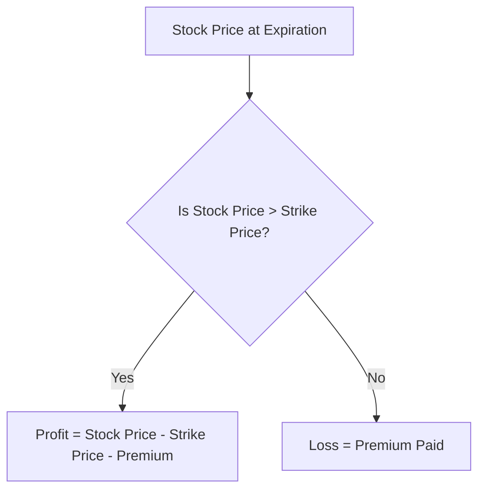

## 7.4.1 Long Calls and Puts

In the world of options trading, understanding the fundamental strategies of long calls and puts is crucial for anyone preparing for the Series 7 Exam. These strategies offer traders the ability to profit from market movements while managing risk effectively. This section will delve into the mechanics, benefits, and risks of long calls and puts, providing you with the knowledge to excel in both the exam and your future career in securities.

### Understanding Long Calls

#### What is a Long Call?

A long call is an options strategy where the investor purchases a call option, giving them the right, but not the obligation, to buy a specific quantity of an underlying asset at a predetermined price (strike price) within a specified time frame. This strategy is inherently bullish, meaning the investor anticipates that the price of the underlying asset will rise above the strike price before the option's expiration date.

#### Characteristics of Long Calls

- **Bullish Strategy**: Long calls are used when an investor expects a significant increase in the price of the underlying asset.
- **Limited Risk**: The maximum loss is limited to the premium paid for the option.
- **Unlimited Profit Potential**: As the price of the underlying asset rises, the potential profit is theoretically unlimited.

#### Example of a Long Call

Imagine you purchase a call option for Company XYZ with a strike price of $50, expiring in three months, at a premium of $2 per share. If the stock price rises to $60, you can exercise your option to buy the shares at $50, resulting in a profit of $8 per share ($60 market price - $50 strike price - $2 premium).

#### Payoff Diagram for Long Calls

Below is a payoff diagram illustrating the potential outcomes of a long call position:

### Understanding Long Puts

#### What is a Long Put?

A long put is an options strategy where the investor purchases a put option, granting them the right, but not the obligation, to sell a specific quantity of an underlying asset at a predetermined price within a specified time frame. This strategy is bearish, meaning the investor expects the price of the underlying asset to fall below the strike price before the option's expiration date.

#### Characteristics of Long Puts

- **Bearish Strategy**: Long puts are used when an investor expects a significant decrease in the price of the underlying asset.
- **Limited Risk**: The maximum loss is limited to the premium paid for the option.
- **Significant Profit Potential**: Profit potential increases as the price of the underlying asset decreases.

#### Example of a Long Put

Suppose you purchase a put option for Company ABC with a strike price of $40, expiring in three months, at a premium of $3 per share. If the stock price falls to $30, you can exercise your option to sell the shares at $40, resulting in a profit of $7 per share ($40 strike price - $30 market price - $3 premium).

#### Payoff Diagram for Long Puts

Below is a payoff diagram illustrating the potential outcomes of a long put position:

### Key Considerations for Long Calls and Puts

#### Market Conditions

- **Long Calls**: Ideal in a bullish market where prices are expected to rise.
- **Long Puts**: Suitable in a bearish market where prices are expected to fall.

#### Volatility Impact

- Options tend to increase in value with higher market volatility, benefiting both long calls and puts.

#### Time Decay

- Options lose value as they approach expiration, a phenomenon known as time decay. This affects both long calls and puts, emphasizing the importance of timing in options trading.

### Practical Examples and Scenarios

#### Case Study: Long Call Strategy

Consider an investor, Alex, who anticipates that the stock of TechCorp will rise due to an upcoming product launch. Alex buys a call option with a strike price of $100, paying a premium of $5 per share. If TechCorp's stock rises to $120, Alex can exercise the option, buying the stock at $100 and selling at the market price, netting a profit of $15 per share ($120 - $100 - $5).

#### Case Study: Long Put Strategy

Another investor, Jamie, predicts a downturn in the retail sector and purchases a put option on RetailCo with a strike price of $80, paying a premium of $4 per share. If RetailCo's stock falls to $65, Jamie exercises the option, selling the stock at $80, resulting in a profit of $11 per share ($80 - $65 - $4).

### Regulatory Considerations

#### Compliance with FINRA and SEC

- Ensure all options transactions comply with FINRA and SEC regulations.
- Understand the Options Disclosure Document (ODD) requirements and customer suitability rules.

### Summary and Key Points

- **Long Calls**: Bullish strategy with limited risk and unlimited profit potential.
- **Long Puts**: Bearish strategy with limited risk and significant profit potential.
- **Risk Management**: Maximum loss is limited to the premium paid.
- **Market Timing**: Crucial for maximizing profits and minimizing losses.

### Additional Resources

- **FINRA Options Disclosure Document**: Essential reading for understanding the risks and characteristics of options.
- **SEC Guidelines on Options Trading**: Provides regulatory insights and compliance requirements.

### Conclusion

Mastering the strategies of long calls and puts is essential for success in the Series 7 Exam and a career in securities trading. These strategies offer powerful tools for leveraging market movements while managing risk effectively. By understanding the mechanics, risks, and regulatory considerations, you'll be well-equipped to navigate the options market confidently.

## Series 7 Exam Practice Questions: Long Calls and Puts



### Which of the following best describes a long call option?

- [x] A bullish strategy with limited risk and unlimited profit potential
- [ ] A bearish strategy with limited risk and unlimited profit potential
- [ ] A bullish strategy with unlimited risk and limited profit potential
- [ ] A bearish strategy with unlimited risk and limited profit potential

> **Explanation:** A long call option is a bullish strategy where the investor anticipates the price of the underlying asset will rise. The risk is limited to the premium paid, while the profit potential is unlimited.

### What is the maximum loss an investor can incur when purchasing a long put option?

- [ ] Unlimited
- [ ] The difference between the strike price and the market price
- [x] The premium paid for the option
- [ ] The strike price

> **Explanation:** The maximum loss for a long put option is limited to the premium paid for the option, as the investor is not obligated to sell the underlying asset.

### In which market condition is a long call option most appropriate?

- [ ] A stable market
- [x] A bullish market
- [ ] A bearish market
- [ ] A volatile market

> **Explanation:** A long call option is most appropriate in a bullish market where the investor expects the price of the underlying asset to rise.

### What happens to the value of a long call option as the expiration date approaches, assuming no change in the underlying asset's price?

- [ ] It increases
- [ ] It remains the same
- [x] It decreases
- [ ] It becomes negative

> **Explanation:** The value of a long call option generally decreases as the expiration date approaches due to time decay, assuming no change in the underlying asset's price.

### How does increased market volatility affect the value of a long put option?

- [x] It increases the value
- [ ] It decreases the value
- [ ] It has no effect
- [ ] It makes the value negative

> **Explanation:** Increased market volatility typically increases the value of a long put option, as the likelihood of the underlying asset's price moving below the strike price increases.

### What is the breakeven point for a long call option with a strike price of $50 and a premium of $3?

- [ ] $47
- [x] $53
- [ ] $50
- [ ] $3

> **Explanation:** The breakeven point for a long call option is calculated as the strike price plus the premium paid. In this case, $50 + $3 = $53.

### Which of the following scenarios would benefit a long put option holder?

- [ ] The underlying asset's price increases
- [ ] The underlying asset's price remains stable
- [x] The underlying asset's price decreases
- [ ] The underlying asset's price becomes volatile

> **Explanation:** A long put option holder benefits when the underlying asset's price decreases, as they have the right to sell at the higher strike price.

### What is a key advantage of using long calls over buying the underlying asset directly?

- [ ] Unlimited risk
- [ ] Higher transaction costs
- [x] Limited risk with leverage
- [ ] No profit potential

> **Explanation:** A key advantage of using long calls is the limited risk with leverage, allowing investors to control a larger position with a smaller investment compared to buying the underlying asset directly.

### If an investor expects a stock to decline in value, which options strategy should they consider?

- [ ] Long call
- [x] Long put
- [ ] Short call
- [ ] Short put

> **Explanation:** If an investor expects a stock to decline in value, they should consider a long put strategy, which profits from a decrease in the underlying asset's price.

### What is the primary regulatory document that outlines the risks and characteristics of options?

- [ ] FINRA Rulebook
- [ ] SEC Prospectus
- [x] Options Disclosure Document (ODD)
- [ ] Investment Company Act of 1940

> **Explanation:** The Options Disclosure Document (ODD) is the primary regulatory document that outlines the risks and characteristics of options, providing essential information for investors.


