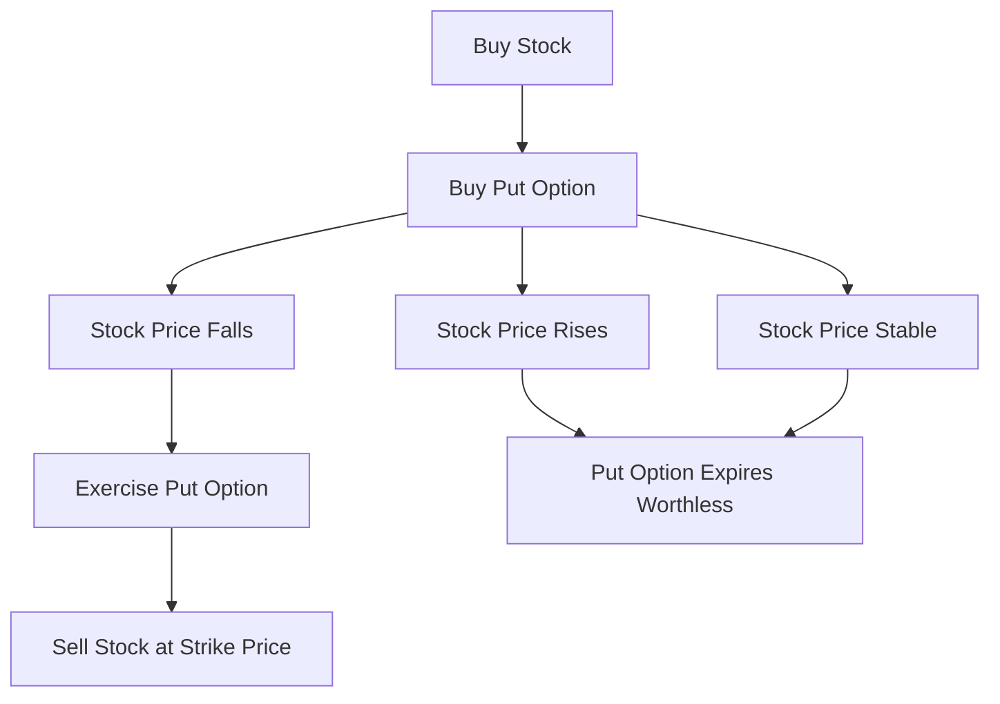

## 7.4.4 Protective Puts

In the realm of options trading, protective puts are a fundamental strategy that investors use to shield their portfolios from potential losses. As you prepare for the Series 7 Exam, understanding the intricacies of protective puts will not only enhance your knowledge of options but also equip you with essential risk management skills that are crucial in the securities industry.

### Understanding Protective Puts

A protective put is an options strategy that involves purchasing a put option on a stock that you already own. This strategy acts as a form of insurance against a decline in the stock’s price. By owning a put option, you gain the right, but not the obligation, to sell the underlying stock at the option's strike price before the expiration date. This can effectively limit potential losses if the stock price falls below the strike price.

#### Key Components of Protective Puts

- **Long Stock Position:** The investor holds shares of a stock that they wish to protect.
- **Put Option:** A contract that gives the holder the right to sell the stock at a predetermined price (strike price) within a specific time frame.
- **Strike Price:** The price at which the stock can be sold if the put option is exercised.
- **Expiration Date:** The date by which the option must be exercised.

### How Protective Puts Work

The protective put strategy is akin to purchasing insurance for your stock holdings. Let’s illustrate this with an example:

**Example:**

Imagine you own 100 shares of XYZ Corporation, currently trading at $50 per share. To protect your investment, you purchase a put option with a strike price of $48, expiring in three months, at a premium of $2 per share.

- **Initial Investment:** $50 x 100 shares = $5,000
- **Put Option Cost:** $2 x 100 shares = $200

By buying the put option, you ensure that you can sell your shares for at least $48 each, regardless of how much the stock price declines. If XYZ Corporation’s stock falls to $40, you can exercise the put option and sell your shares for $48, limiting your loss.

#### Scenario Analysis

1. **Stock Price Declines to $40:**
   - Without the put: Loss = ($50 - $40) x 100 = $1,000
   - With the put: Loss = ($50 - $48) x 100 + $200 (premium) = $400

2. **Stock Price Remains at $50:**
   - The put option expires worthless, and you lose the premium paid ($200).

3. **Stock Price Rises to $60:**
   - The put option expires worthless, and you gain from the stock appreciation, offset by the premium paid.

### Benefits of Protective Puts

- **Risk Mitigation:** Protects against significant losses in a declining market.
- **Flexibility:** Allows investors to retain upside potential while minimizing downside risk.
- **Peace of Mind:** Provides security and confidence in maintaining long positions during volatile market conditions.

### Costs and Considerations

While protective puts offer substantial benefits, they also come with costs and considerations:

- **Premium Cost:** The price paid for the put option, which can reduce overall returns if the stock price does not decline.
- **Expiration Risk:** If the stock price does not fall before the option's expiration, the premium paid is lost.
- **Opportunity Cost:** The capital used to purchase the put could have been invested elsewhere.

### Real-World Applications

Protective puts are widely used by individual investors and institutional portfolio managers. For instance, during periods of economic uncertainty or market volatility, investors may employ protective puts to safeguard their portfolios against sudden downturns.

#### Case Study: Tech Sector Volatility

Consider an investor holding a significant position in a tech stock during a period of regulatory scrutiny. By purchasing protective puts, the investor can mitigate potential losses from adverse regulatory outcomes while maintaining exposure to potential gains if the company successfully navigates the challenges.

### Regulatory and Compliance Considerations

When dealing with protective puts, it is essential to adhere to regulatory requirements and ensure compliance with securities laws. This includes understanding the rules set forth by the Financial Industry Regulatory Authority (FINRA) and the Securities and Exchange Commission (SEC) regarding options trading.

### Practical Example and Calculation

Let's delve into a practical example to reinforce your understanding of protective puts:

**Scenario:**

You own 200 shares of ABC Inc., trading at $75 per share. Concerned about potential market volatility, you decide to purchase two put options with a strike price of $70, expiring in six months, at a premium of $3 per share.

- **Stock Investment:** $75 x 200 = $15,000
- **Put Option Cost:** $3 x 200 = $600

**Outcome Analysis:**

- **Stock Price Drops to $65:**
  - Without the put: Loss = ($75 - $65) x 200 = $2,000
  - With the put: Loss = ($75 - $70) x 200 + $600 = $1,600

- **Stock Price Remains at $75:**
  - The put option expires worthless, and you lose the premium paid ($600).

- **Stock Price Increases to $85:**
  - The put option expires worthless, and you gain from the stock appreciation, offset by the premium paid.

### Visualizing Protective Puts

To further illustrate the concept of protective puts, consider the following diagram:

### Strategies for Maximizing the Benefits of Protective Puts

- **Timing:** Purchase puts during periods of low volatility to minimize premium costs.
- **Strike Price Selection:** Choose a strike price that balances protection with cost-effectiveness.
- **Expiration Date:** Align the expiration date with your investment horizon and market outlook.

### Common Pitfalls and How to Avoid Them

- **Overpaying for Premiums:** Monitor market conditions and volatility levels to avoid overpaying for put options.
- **Misjudging Market Trends:** Stay informed about market trends and economic indicators to make informed decisions.
- **Neglecting Portfolio Diversification:** Use protective puts as part of a broader risk management strategy, not as a standalone solution.

### Exam Tips and Strategies

As you prepare for the Series 7 Exam, focus on the following key points related to protective puts:

- **Understand the Mechanics:** Be able to explain how protective puts work and their role in risk management.
- **Calculate Outcomes:** Practice calculating potential gains and losses with and without protective puts.
- **Regulatory Knowledge:** Familiarize yourself with FINRA and SEC regulations regarding options trading.

### Conclusion

Protective puts are a powerful tool for managing risk in a long stock position. By understanding how to effectively implement this strategy, you can enhance your portfolio management skills and provide valuable insights to clients. As you study for the Series 7 Exam, remember that mastering protective puts will not only help you succeed on the exam but also in your career as a securities professional.

## Series 7 Exam Practice Questions: Protective Puts



### What is the primary purpose of a protective put?

- [x] To limit potential losses on a long stock position
- [ ] To increase potential gains on a long stock position
- [ ] To reduce the cost of purchasing stock
- [ ] To eliminate the need for diversification

> **Explanation:** A protective put is primarily used to limit potential losses on a long stock position by providing the right to sell the stock at a predetermined price.

### When is a protective put most beneficial?

- [ ] When the stock price is expected to rise significantly
- [x] When the stock price is expected to decline
- [ ] When the stock price is stable
- [ ] When interest rates are high

> **Explanation:** A protective put is most beneficial when the stock price is expected to decline, as it provides downside protection.

### What happens to the put option if the stock price rises above the strike price?

- [ ] The put option increases in value
- [ ] The put option must be exercised
- [x] The put option expires worthless
- [ ] The put option is automatically sold

> **Explanation:** If the stock price rises above the strike price, the put option expires worthless, as there is no benefit in exercising the option.

### How does a protective put affect the potential upside of a stock position?

- [ ] It eliminates the potential upside
- [ ] It doubles the potential upside
- [x] It reduces the potential upside by the cost of the premium
- [ ] It has no effect on the potential upside

> **Explanation:** A protective put reduces the potential upside by the cost of the premium, as this is an additional cost that must be covered before realizing gains.

### What is a potential downside of using protective puts?

- [x] The premium cost can reduce overall returns
- [ ] It increases the risk of loss
- [ ] It limits the ability to sell the stock
- [ ] It requires additional margin

> **Explanation:** The premium cost of the put option can reduce overall returns, especially if the stock price does not decline.

### In which scenario would a protective put be considered ineffective?

- [ ] When the stock price falls significantly
- [ ] When the stock price remains stable
- [x] When the stock price rises significantly
- [ ] When the stock price is highly volatile

> **Explanation:** A protective put would be considered ineffective if the stock price rises significantly, as the put option would expire worthless, and the premium paid would represent a loss.

### What is the relationship between the strike price and the level of protection offered by a protective put?

- [x] A lower strike price offers less protection
- [ ] A higher strike price offers less protection
- [ ] The strike price does not affect protection
- [ ] A lower strike price offers more protection

> **Explanation:** A lower strike price offers less protection because it sets a lower floor for the minimum sell price of the stock.

### How can an investor reduce the cost of purchasing protective puts?

- [ ] By choosing a higher strike price
- [x] By selecting a longer expiration date
- [ ] By buying puts during periods of high volatility
- [ ] By writing covered calls

> **Explanation:** Selecting a longer expiration date can reduce the cost of purchasing protective puts, as options with longer durations tend to have lower premiums.

### Which of the following is true about protective puts and portfolio diversification?

- [ ] Protective puts eliminate the need for diversification
- [x] Protective puts should be used in conjunction with diversification
- [ ] Protective puts are a substitute for diversification
- [ ] Protective puts increase portfolio diversification

> **Explanation:** Protective puts should be used in conjunction with diversification as part of a comprehensive risk management strategy.

### What is the impact of volatility on the cost of protective puts?

- [x] Higher volatility increases the cost
- [ ] Higher volatility decreases the cost
- [ ] Volatility has no impact on cost
- [ ] Lower volatility increases the cost

> **Explanation:** Higher volatility increases the cost of protective puts, as it raises the likelihood of significant price movements, making the option more valuable.



By mastering the concept of protective puts, you are better equipped to manage risk effectively and make informed decisions in the securities industry. Continue to practice and review these concepts to ensure success on your Series 7 Exam and in your future career.
