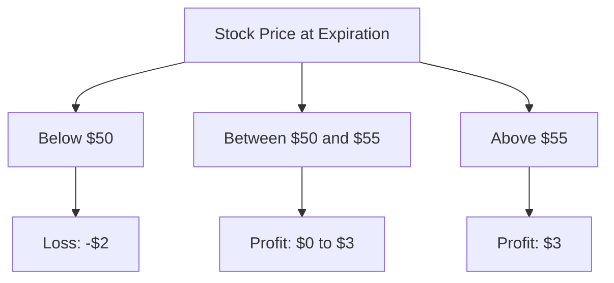
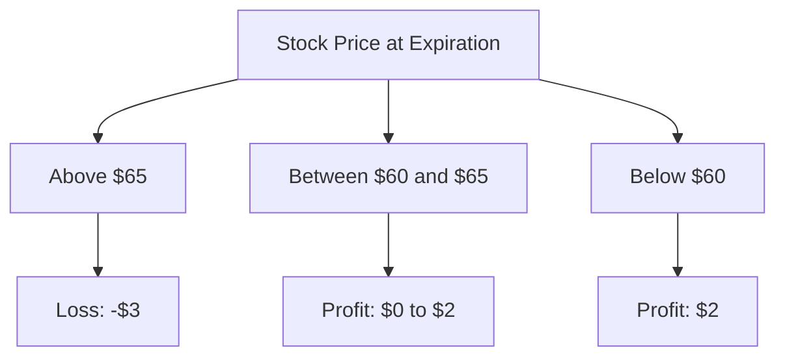

## 7.5.1.1 Vertical Spreads

Vertical spreads are a fundamental options strategy that involves buying and selling options of the same class (calls or puts), with the same expiration date, but at different strike prices. These spreads are popular among traders for their ability to limit risk while offering potential profit opportunities. This section will delve into the intricacies of vertical spreads, focusing on bull spreads and bear spreads, and will provide you with the knowledge necessary to tackle questions related to these strategies on the Series 7 Exam.

### Understanding Vertical Spreads

Vertical spreads are categorized into two primary types: bull spreads and bear spreads. These can be constructed using either call options or put options. The choice between calls and puts, as well as the direction of the spread (bullish or bearish), depends on the trader's market outlook.

#### Bull Spreads

Bull spreads are designed to profit from a moderate rise in the price of the underlying asset. They can be constructed using either call options (bull call spread) or put options (bull put spread).

**Bull Call Spread:**

- **Construction:** A bull call spread involves buying a call option with a lower strike price and selling another call option with a higher strike price, both with the same expiration date.
- **Objective:** The goal is to capitalize on a rise in the underlying asset's price up to the higher strike price.
- **Risk and Reward:** The maximum loss is limited to the net premium paid, while the maximum profit is capped at the difference between the strike prices minus the net premium.

**Example:**

Suppose you are bullish on XYZ stock, currently trading at $50. You could construct a bull call spread by buying a call option with a $50 strike price for $3 and selling a call option with a $55 strike price for $1. The net premium paid is $2 ($3 - $1).

- **Maximum Profit:** $5 (difference between strike prices) - $2 (net premium) = $3 per share.
- **Maximum Loss:** $2 per share (net premium paid).

**Payoff Diagram:**

#### Bear Spreads

Bear spreads are intended to profit from a moderate decline in the price of the underlying asset. They can be constructed using either put options (bear put spread) or call options (bear call spread).

**Bear Put Spread:**

- **Construction:** A bear put spread involves buying a put option with a higher strike price and selling another put option with a lower strike price, both with the same expiration date.
- **Objective:** The aim is to benefit from a decline in the underlying asset's price down to the lower strike price.
- **Risk and Reward:** The maximum loss is limited to the net premium paid, while the maximum profit is capped at the difference between the strike prices minus the net premium.

**Example:**

Suppose you are bearish on ABC stock, currently trading at $60. You could construct a bear put spread by buying a put option with a $65 strike price for $4 and selling a put option with a $60 strike price for $1. The net premium paid is $3 ($4 - $1).

- **Maximum Profit:** $5 (difference between strike prices) - $3 (net premium) = $2 per share.
- **Maximum Loss:** $3 per share (net premium paid).

**Payoff Diagram:**

### Key Concepts and Strategies

#### 1. **Breakeven Points**

For both bull call spreads and bear put spreads, the breakeven point is critical for understanding at what price level the trader will neither gain nor lose money.

- **Bull Call Spread Breakeven:** Lower strike price + net premium paid.
- **Bear Put Spread Breakeven:** Higher strike price - net premium paid.

#### 2. **Market Outlook**

- **Bull Call Spread:** Suitable when expecting a moderate increase in the underlying asset's price.
- **Bear Put Spread:** Suitable when anticipating a moderate decrease in the underlying asset's price.

#### 3. **Risk Management**

Vertical spreads inherently limit risk due to the offsetting nature of the options involved. The maximum potential loss is known upfront, which makes these strategies appealing to risk-averse traders.

#### 4. **Profit Potential**

While vertical spreads limit risk, they also cap potential profits. Traders must weigh the trade-off between reduced risk and limited reward when choosing to implement these strategies.

### Practical Examples and Scenarios

#### Scenario 1: Bull Call Spread in Action

Imagine you are bullish on DEF Corporation, currently trading at $100. You decide to implement a bull call spread by purchasing a call option with a $100 strike price for $5 and selling a call option with a $110 strike price for $2. The net premium paid is $3.

- **Breakeven Point:** $100 + $3 = $103.
- **Maximum Profit:** $10 (difference between strike prices) - $3 (net premium) = $7 per share.
- **Maximum Loss:** $3 per share (net premium paid).

If DEF Corporation's stock price rises to $108 at expiration, the spread would result in a profit of $5 per share ($108 - $103 breakeven).

#### Scenario 2: Bear Put Spread in Action

Consider you are bearish on GHI Industries, currently trading at $80. You opt for a bear put spread by buying a put option with an $85 strike price for $6 and selling a put option with a $75 strike price for $2. The net premium paid is $4.

- **Breakeven Point:** $85 - $4 = $81.
- **Maximum Profit:** $10 (difference between strike prices) - $4 (net premium) = $6 per share.
- **Maximum Loss:** $4 per share (net premium paid).

If GHI Industries' stock price falls to $78 at expiration, the spread would yield a profit of $3 per share ($81 breakeven - $78).

### Exam Tips and Strategies

- **Understand the Construction:** Be clear on how to construct both bull call and bear put spreads. Knowing the mechanics will help in identifying the strategy based on given scenarios.
- **Focus on Breakeven Calculations:** Practice calculating breakeven points, as these are often tested in exam questions.
- **Payoff Diagrams:** Familiarize yourself with drawing and interpreting payoff diagrams to visualize potential outcomes.
- **Risk and Reward Analysis:** Be prepared to analyze the risk and reward profiles of vertical spreads, as this is crucial for both the exam and real-world trading.

### Common Pitfalls and Challenges

- **Confusing Call and Put Spreads:** Ensure you understand the difference between using calls and puts for constructing bull and bear spreads.
- **Overlooking Transaction Costs:** Remember that transaction costs can impact the net premium and overall profitability of the spread.
- **Ignoring Market Conditions:** Vertical spreads are sensitive to market conditions; ensure your market outlook aligns with the chosen strategy.

### Real-World Applications

Vertical spreads are widely used in various market conditions, offering traders a versatile tool for managing risk and capitalizing on market movements. They are particularly useful in scenarios where a trader expects moderate price changes rather than extreme volatility.

### Regulatory Considerations

When trading vertical spreads, it's essential to adhere to regulatory requirements, such as those set by the Financial Industry Regulatory Authority (FINRA) and the Securities and Exchange Commission (SEC). Ensure compliance with margin requirements and suitability standards when recommending these strategies to clients.

### Conclusion

Mastering vertical spreads is a crucial step in your journey to becoming a proficient options trader and passing the Series 7 Exam. By understanding the construction, outcomes, and strategic applications of bull and bear spreads, you'll be well-equipped to tackle related questions on the exam and apply these strategies in your professional practice.

---

## Series 7 Exam Practice Questions: Vertical Spreads



### What is the primary objective of a bull call spread?

- [x] To profit from a moderate rise in the underlying asset's price.
- [ ] To profit from a significant rise in the underlying asset's price.
- [ ] To profit from a moderate decline in the underlying asset's price.
- [ ] To profit from a significant decline in the underlying asset's price.

> **Explanation:** A bull call spread is designed to profit from a moderate rise in the underlying asset's price, with limited risk and capped profit potential.

### In a bear put spread, what is the maximum potential loss?

- [ ] The difference between the strike prices.
- [x] The net premium paid.
- [ ] The premium received from selling the put.
- [ ] Unlimited.

> **Explanation:** The maximum potential loss in a bear put spread is limited to the net premium paid when establishing the spread.

### How is the breakeven point for a bull call spread calculated?

- [ ] Higher strike price minus net premium paid.
- [x] Lower strike price plus net premium paid.
- [ ] Higher strike price plus net premium paid.
- [ ] Lower strike price minus net premium paid.

> **Explanation:** The breakeven point for a bull call spread is calculated as the lower strike price plus the net premium paid.

### What type of market outlook is suitable for a bear put spread?

- [ ] Bullish.
- [ ] Neutral.
- [x] Bearish.
- [ ] Highly volatile.

> **Explanation:** A bear put spread is suitable for a bearish market outlook, where the trader expects a moderate decline in the underlying asset's price.

### Which of the following best describes a vertical spread?

- [ ] Buying and selling options with different expiration dates.
- [x] Buying and selling options with different strike prices.
- [ ] Buying and selling options with different underlying assets.
- [ ] Buying and selling options with different premiums.

> **Explanation:** A vertical spread involves buying and selling options of the same class and expiration date but with different strike prices.

### What is the maximum profit potential of a bull call spread?

- [ ] Unlimited.
- [ ] Equal to the net premium paid.
- [x] The difference between the strike prices minus the net premium paid.
- [ ] Equal to the premium received.

> **Explanation:** The maximum profit potential of a bull call spread is the difference between the strike prices minus the net premium paid.

### In a bear put spread, which option is typically bought?

- [ ] The option with the lower strike price.
- [x] The option with the higher strike price.
- [ ] The option with the longer expiration date.
- [ ] The option with the higher premium.

> **Explanation:** In a bear put spread, the put option with the higher strike price is typically bought.

### What is the primary risk associated with vertical spreads?

- [ ] Unlimited loss.
- [ ] Unlimited gain.
- [x] Limited profit potential.
- [ ] Market volatility.

> **Explanation:** The primary risk associated with vertical spreads is the limited profit potential due to the capped nature of the strategy.

### How does a bull call spread limit risk?

- [ ] By using options with different expiration dates.
- [x] By offsetting the cost of the long call with the premium received from the short call.
- [ ] By using options with different underlying assets.
- [ ] By using options with the same strike price.

> **Explanation:** A bull call spread limits risk by offsetting the cost of the long call with the premium received from the short call, thereby capping the maximum loss.

### Which of the following is a common mistake when implementing vertical spreads?

- [ ] Calculating breakeven points.
- [x] Confusing call and put spreads.
- [ ] Understanding market outlook.
- [ ] Knowing the maximum profit potential.

> **Explanation:** A common mistake when implementing vertical spreads is confusing the construction and purpose of call and put spreads.


